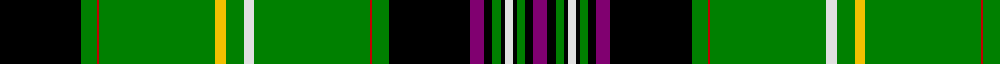

In pattern [BKGKWKGKBKGRGWGYGRGK](/patterns/bkgkwkgkbkgrgwgygrgk/).

This was sourced from weddslist.  It is a [20 stripes tartan](/stripes/stripes20/).

Original link http://www.weddslist.com/cgi-bin/tartans/pg.pl?source=sts

## Thread count
K/80 G16 R2 G114 Y10 G18 LN10 G114 R2 G16 K80 P14 K8 G8 K4 LN8 K4 G8 K8 P/14

## Palette
Each colour and its ΔE from the base-6 reference it is a variant of.

| Colour | Shade | Base | ΔE (OKLab) |
|---|---|---|---|
| G | <code style="background-color:#008000;">#008000</code> `#008000` | G <code style="background-color:#006100;">#006100</code> | 0.10 |
| K | <code style="background-color:#000000;">#000000</code> `#000000` | K <code style="background-color:#000000;">#000000</code> | 0.00 |
| LN | <code style="background-color:#E0E0E0;">#E0E0E0</code> `#E0E0E0` | W <code style="background-color:#F7F7F7;">#F7F7F7</code> | 0.07 |
| P | <code style="background-color:#800070;">#800070</code> `#800070` | B <code style="background-color:#2A418A;">#2A418A</code> | 0.18 |
| R | <code style="background-color:#C00000;">#C00000</code> `#C00000` | R <code style="background-color:#CC0000;">#CC0000</code> | 0.03 |
| Y | <code style="background-color:#F0C000;">#F0C000</code> `#F0C000` | Y <code style="background-color:#F2BF00;">#F2BF00</code> | 0.00 |

## Nearest tartans

The nearest existing variants by ΔTartan distance.

1. [Kinnear, Pilette of](/setts/s21/k2r1k6g2k6g24k4g2ra3y1ra2ya1ra3g2k4g24k6g2k6r1k2~g008000-k000000-rc00000-ra800000-yb0b0b0-yaf0c000~x2/) — ΔT 1.16
1. [Unnamed 8](/setts/s20/g82k2g2k2g2k8b28k1w6k1b28k1y6k1g32k2r5k2g15w6~b304080-g008000-k000000-rc00000-we0e0e0-yf0c000~x2/) — ΔT 1.43
1. [Kennedy](/setts/s17/k2g2y1g3r1g2r1g12b4k3b3k3b3k3b4g24ra2~b304080-g008000-k000000-r900030-rac00020-yf0c000~x2/) — ΔT 1.52
1. [Reilly fae the Mearns (Personal)](/setts/s14/g2w5ga1k7w1ga2k6ga6g9r1g30y2g3w2~g006818-ga003820-k101010-ra00000-wfcfcfc-ydc943c~x2/) — ΔT 1.57
1. [Unidentified Cant #10](/setts/s20/g9y5g57r1g8k40ra7k4g4k2w4k2g4k4ra7k40g8r1g57y5~g285800-k101010-rc80000-ra9c68a4-we0e0e0-ye8c000~x2/) — ΔT 1.57
1. [Cockburn](/setts/s17/g36k1g1k1g1k1b12k1w1k1b12k1y1k1g12k2r2~b304080-g008000-k000000-rc00000-we0e0e0-yf0c000~x2/) — ΔT 1.58
1. [Cockburn, Old pattern](/setts/s25/r6k1g34k2y4k5b5k1w5k1b34k5g2k2g2k2g86k2g2k2g2k5b34k1w5~b304080-g008000-k000000-rc00000-we0e0e0-yf0c000~x2/) — ΔT 1.64
1. [Duffy](/setts/s13/g25w1k23ga7y2ga2y2ga7k23w1g39ga4g14~g008000-ga30a010-k000000-we0e0e0-yf0c000~x2/) — ΔT 1.71
1. [Tarassow Russian Scout (Corporate)](/setts/s14/k8y8k8y2g100k42r8b8w8k21y2k8y8k8~b1870a4-g288028-k101010-rc80000-we0e0e0-yf0b440/) — ΔT 1.72
1. [Tarassow Russian Scouts Corporate Tartan Tartan Number: 7614. Earliest known date: 2008 In Germany our scout association stands under the patronage of the Russian orthodox parish in Frankfurt, which has the status of charitable organisation. We also have in France the status of Association Loi de 1901 - which is a non profit association based on benevolate : Sergei Tarassow is the elected president of this association, named Scouts Russes Saint Georges 1909. In USA they have the same status under the name of Saint George Pathfinders of America. The yellow stripes in the design represent the ribbon of the Order of St George See products available Copyright © Blair Urquhart, Comrie, 2015](/setts/s14/k8y8k8y2g100k42r8b8w8k21y2k8y8k8~b1870a4-g288028-k101010-rc80000-we0e0e0-yf09400/) — ΔT 1.75

## Neighbour map

Every grey dot is one of 15726 variants placed by the first two principal components of the ΔTartan feature space (44% of its variance). Red is this tartan; blue dots are its nearest — click one to open its page.

<svg viewBox="0 0 640 380" role="img" style="max-width:100%;height:auto;border:1px solid #e0e0e0;border-radius:4px;display:block" xmlns="http://www.w3.org/2000/svg"><image href="/nn/cloud.v1.png" width="640" height="380"/><a href="/setts/s21/k2r1k6g2k6g24k4g2ra3y1ra2ya1ra3g2k4g24k6g2k6r1k2~g008000-k000000-rc00000-ra800000-yb0b0b0-yaf0c000~x2/"><circle cx="262.2" cy="66.2" r="4" fill="#3465a4"><title>Kinnear, Pilette of</title></circle></a><a href="/setts/s20/g82k2g2k2g2k8b28k1w6k1b28k1y6k1g32k2r5k2g15w6~b304080-g008000-k000000-rc00000-we0e0e0-yf0c000~x2/"><circle cx="317.7" cy="27.2" r="4" fill="#3465a4"><title>Unnamed 8</title></circle></a><a href="/setts/s17/k2g2y1g3r1g2r1g12b4k3b3k3b3k3b4g24ra2~b304080-g008000-k000000-r900030-rac00020-yf0c000~x2/"><circle cx="289.1" cy="78.9" r="4" fill="#3465a4"><title>Kennedy</title></circle></a><a href="/setts/s14/g2w5ga1k7w1ga2k6ga6g9r1g30y2g3w2~g006818-ga003820-k101010-ra00000-wfcfcfc-ydc943c~x2/"><circle cx="286.2" cy="74.3" r="4" fill="#3465a4"><title>Reilly fae the Mearns (Personal)</title></circle></a><a href="/setts/s20/g9y5g57r1g8k40ra7k4g4k2w4k2g4k4ra7k40g8r1g57y5~g285800-k101010-rc80000-ra9c68a4-we0e0e0-ye8c000~x2/"><circle cx="336.5" cy="52.3" r="4" fill="#3465a4"><title>Unidentified Cant #10</title></circle></a><a href="/setts/s17/g36k1g1k1g1k1b12k1w1k1b12k1y1k1g12k2r2~b304080-g008000-k000000-rc00000-we0e0e0-yf0c000~x2/"><circle cx="327.6" cy="47.5" r="4" fill="#3465a4"><title>Cockburn</title></circle></a><a href="/setts/s25/r6k1g34k2y4k5b5k1w5k1b34k5g2k2g2k2g86k2g2k2g2k5b34k1w5~b304080-g008000-k000000-rc00000-we0e0e0-yf0c000~x2/"><circle cx="288.4" cy="14.0" r="4" fill="#3465a4"><title>Cockburn, Old pattern</title></circle></a><a href="/setts/s13/g25w1k23ga7y2ga2y2ga7k23w1g39ga4g14~g008000-ga30a010-k000000-we0e0e0-yf0c000~x2/"><circle cx="264.3" cy="100.3" r="4" fill="#3465a4"><title>Duffy</title></circle></a><a href="/setts/s14/k8y8k8y2g100k42r8b8w8k21y2k8y8k8~b1870a4-g288028-k101010-rc80000-we0e0e0-yf0b440/"><circle cx="247.8" cy="42.8" r="4" fill="#3465a4"><title>Tarassow Russian Scout (Corporate)</title></circle></a><a href="/setts/s14/k8y8k8y2g100k42r8b8w8k21y2k8y8k8~b1870a4-g288028-k101010-rc80000-we0e0e0-yf09400/"><circle cx="250.8" cy="43.6" r="4" fill="#3465a4"><title>Tarassow Russian Scouts Corporate Tartan Tartan Number: 7614. Earliest known date: 2008 In Germany our scout association stands under the patronage of the Russian orthodox parish in Frankfurt, which has the status of charitable organisation. We also have in France the status of Association Loi de 1901 - which is a non profit association based on benevolate : Sergei Tarassow is the elected president of this association, named Scouts Russes Saint Georges 1909. In USA they have the same status under the name of Saint George Pathfinders of America. The yellow stripes in the design represent the ribbon of the Order of St George See products available Copyright © Blair Urquhart, Comrie, 2015</title></circle></a><circle cx="290.3" cy="38.1" r="5" fill="#c00000"/></svg>

ID: /setts/s20/k40g8r1g57y5g9w5g57r1g8k40b7k4g4k2w4k2g4k4b7~b800070-g008000-k000000-rc00000-we0e0e0-yf0c000~x2/
