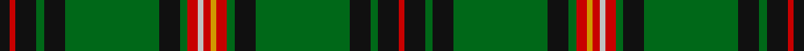

This page is one **sett** — a single exact thread-count. It belongs to the [tartan](/tartans/k4r2k8g3k8g36k8g3r4lb2r3lo2r4g3k8g36k8g3k8r2/)
(the same proportion at any scale), whose colour order is pattern [KRKGKGKGRWRYRGKGKGKR](/stripes/krkgkgkgrwryrgkgkgkr/).

Sourced from register-of-tartans.  It is a [20 stripe tartan](/stripes/stripes20/).

Original link https://www.tartanregister.gov.uk/tartanDetails.aspx?ref=1993

## Register references

External register numbers recorded for this tartan.

- Scottish Register of Tartans: [1993](https://www.tartanregister.gov.uk/tartanDetails.aspx?ref=1993)
- Scottish Tartans Authority (ITI): 2139
- Scottish Tartans World Register: 2139

## Thread count
K/8 R4 K16 G6 K16 G72 K16 G6 R8 N4 R6 DY4 R8 G6 K16 G72 K16 G6 K16 R/4

## Palette

Palette: <strong>Tartan Register</strong> <small style="color:#888">(5 of 6 colours)</small>
<table><thead><tr><th>Colour</th><th>Threads</th><th>Shade</th><th>Base</th><th>OKLCh</th></tr></thead><tbody><tr><td>K/</td><td style="text-align:right;font-variant-numeric:tabular-nums">8</td><td><code style="background-color:#101010;">#101010</code> <small style="color:#888">#101010</small></td><td>K <code style="background-color:#000000;">#000000</code></td><td><small style="color:#888">oklch(17.3% 0.000 89.9)</small></td></tr><tr><td>R</td><td style="text-align:right;font-variant-numeric:tabular-nums">4</td><td><code style="background-color:#C80000;">#C80000</code> <small style="color:#888">#C80000</small></td><td>R <code style="background-color:#CC0000;">#CC0000</code></td><td><small style="color:#888">oklch(52.3% 0.215 29.2)</small></td></tr><tr><td>K</td><td style="text-align:right;font-variant-numeric:tabular-nums">16</td><td><code style="background-color:#101010;">#101010</code> <small style="color:#888">#101010</small></td><td>K <code style="background-color:#000000;">#000000</code></td><td><small style="color:#888">oklch(17.3% 0.000 89.9)</small></td></tr><tr><td>G</td><td style="text-align:right;font-variant-numeric:tabular-nums">6</td><td><code style="background-color:#006818;">#006818</code> <small style="color:#888">#006818</small></td><td>G <code style="background-color:#006100;">#006100</code></td><td><small style="color:#888">oklch(45.0% 0.142 145.0)</small></td></tr><tr><td>K</td><td style="text-align:right;font-variant-numeric:tabular-nums">16</td><td><code style="background-color:#101010;">#101010</code> <small style="color:#888">#101010</small></td><td>K <code style="background-color:#000000;">#000000</code></td><td><small style="color:#888">oklch(17.3% 0.000 89.9)</small></td></tr><tr><td>G</td><td style="text-align:right;font-variant-numeric:tabular-nums">72</td><td><code style="background-color:#006818;">#006818</code> <small style="color:#888">#006818</small></td><td>G <code style="background-color:#006100;">#006100</code></td><td><small style="color:#888">oklch(45.0% 0.142 145.0)</small></td></tr><tr><td>K</td><td style="text-align:right;font-variant-numeric:tabular-nums">16</td><td><code style="background-color:#101010;">#101010</code> <small style="color:#888">#101010</small></td><td>K <code style="background-color:#000000;">#000000</code></td><td><small style="color:#888">oklch(17.3% 0.000 89.9)</small></td></tr><tr><td>G</td><td style="text-align:right;font-variant-numeric:tabular-nums">6</td><td><code style="background-color:#006818;">#006818</code> <small style="color:#888">#006818</small></td><td>G <code style="background-color:#006100;">#006100</code></td><td><small style="color:#888">oklch(45.0% 0.142 145.0)</small></td></tr><tr><td>R</td><td style="text-align:right;font-variant-numeric:tabular-nums">8</td><td><code style="background-color:#C80000;">#C80000</code> <small style="color:#888">#C80000</small></td><td>R <code style="background-color:#CC0000;">#CC0000</code></td><td><small style="color:#888">oklch(52.3% 0.215 29.2)</small></td></tr><tr><td>N</td><td style="text-align:right;font-variant-numeric:tabular-nums">4</td><td><code style="background-color:#C0C0C0;">#C0C0C0</code> <small style="color:#888">#C0C0C0</small></td><td>W <code style="background-color:#F7F7F7;">#F7F7F7</code></td><td><small style="color:#888">oklch(80.8% 0.000 89.9)</small></td></tr><tr><td>R</td><td style="text-align:right;font-variant-numeric:tabular-nums">6</td><td><code style="background-color:#C80000;">#C80000</code> <small style="color:#888">#C80000</small></td><td>R <code style="background-color:#CC0000;">#CC0000</code></td><td><small style="color:#888">oklch(52.3% 0.215 29.2)</small></td></tr><tr><td>DY</td><td style="text-align:right;font-variant-numeric:tabular-nums">4</td><td><code style="background-color:#D09800;">#D09800</code> <small style="color:#888">#D09800</small></td><td>Y <code style="background-color:#F2BF00;">#F2BF00</code></td><td><small style="color:#888">oklch(71.4% 0.147 82.1)</small></td></tr><tr><td>R</td><td style="text-align:right;font-variant-numeric:tabular-nums">8</td><td><code style="background-color:#C80000;">#C80000</code> <small style="color:#888">#C80000</small></td><td>R <code style="background-color:#CC0000;">#CC0000</code></td><td><small style="color:#888">oklch(52.3% 0.215 29.2)</small></td></tr><tr><td>G</td><td style="text-align:right;font-variant-numeric:tabular-nums">6</td><td><code style="background-color:#006818;">#006818</code> <small style="color:#888">#006818</small></td><td>G <code style="background-color:#006100;">#006100</code></td><td><small style="color:#888">oklch(45.0% 0.142 145.0)</small></td></tr><tr><td>K</td><td style="text-align:right;font-variant-numeric:tabular-nums">16</td><td><code style="background-color:#101010;">#101010</code> <small style="color:#888">#101010</small></td><td>K <code style="background-color:#000000;">#000000</code></td><td><small style="color:#888">oklch(17.3% 0.000 89.9)</small></td></tr><tr><td>G</td><td style="text-align:right;font-variant-numeric:tabular-nums">72</td><td><code style="background-color:#006818;">#006818</code> <small style="color:#888">#006818</small></td><td>G <code style="background-color:#006100;">#006100</code></td><td><small style="color:#888">oklch(45.0% 0.142 145.0)</small></td></tr><tr><td>K</td><td style="text-align:right;font-variant-numeric:tabular-nums">16</td><td><code style="background-color:#101010;">#101010</code> <small style="color:#888">#101010</small></td><td>K <code style="background-color:#000000;">#000000</code></td><td><small style="color:#888">oklch(17.3% 0.000 89.9)</small></td></tr><tr><td>G</td><td style="text-align:right;font-variant-numeric:tabular-nums">6</td><td><code style="background-color:#006818;">#006818</code> <small style="color:#888">#006818</small></td><td>G <code style="background-color:#006100;">#006100</code></td><td><small style="color:#888">oklch(45.0% 0.142 145.0)</small></td></tr><tr><td>K</td><td style="text-align:right;font-variant-numeric:tabular-nums">16</td><td><code style="background-color:#101010;">#101010</code> <small style="color:#888">#101010</small></td><td>K <code style="background-color:#000000;">#000000</code></td><td><small style="color:#888">oklch(17.3% 0.000 89.9)</small></td></tr><tr><td>R/</td><td style="text-align:right;font-variant-numeric:tabular-nums">4</td><td><code style="background-color:#C80000;">#C80000</code> <small style="color:#888">#C80000</small></td><td>R <code style="background-color:#CC0000;">#CC0000</code></td><td><small style="color:#888">oklch(52.3% 0.215 29.2)</small></td></tr></tbody></table>

## Nearest tartans

The nearest existing variants by ΔTartan distance, with this tartan at the top so the swatches line up against it.

ΔTartan

Tartan

Sett

—

<a href="/ttd/edit/#slug=k4r2k8g3k8g36k8g3r4lb2r3lo2r4g3k8g36k8g3k8r2~x2">Kinnear, Barony of (Personal)</a> <a class="nn-out" href="/setts/s20/k4r2k8g3k8g36k8g3r4lb2r3lo2r4g3k8g36k8g3k8r2~x2/" title="open its dictionary page">↗</a>

0.90

<a href="/ttd/edit/#slug=g4r2g24k2g2k6g2k6g2k2g3lo1db3k2db1k2db3g2~x2">Hyslop Hunting (Name)</a> <a class="nn-out" href="/setts/s18/g4r2g24k2g2k6g2k6g2k2g3lo1db3k2db1k2db3g2~x2/" title="open its dictionary page">↗</a>

0.93

<a href="/ttd/edit/#slug=k4r2k10g3k10g30k8g3r4lo2r4lb2r4g3k8g30k10g3k10r2k4~x2">Pilette of Kinnear (Personal)</a> <a class="nn-out" href="/setts/s21/k4r2k10g3k10g30k8g3r4lo2r4lb2r4g3k8g30k10g3k10r2k4~x2/" title="open its dictionary page">↗</a>

0.96

<a href="/ttd/edit/#slug=db15k18g3k2g2k2g44ly4g44k2g2k2g3k18db15r4~x2">Sarafilovic</a> <a class="nn-out" href="/setts/s16/db15k18g3k2g2k2g44ly4g44k2g2k2g3k18db15r4~x2/" title="open its dictionary page">↗</a>

1.13

<a href="/ttd/edit/#slug=g44r4g2r2g2r4g12k12r2db10r4db4ly3~x2">Cochrane of Dundonald</a> <a class="nn-out" href="/setts/s13/g44r4g2r2g2r4g12k12r2db10r4db4ly3~x2/" title="open its dictionary page">↗</a>

1.13

<a href="/ttd/edit/#slug=db2dg2ly1dg3r1dg2r1dg13db4k3db3k3db3k3db4dg23r2~x2">Kennedy</a> <a class="nn-out" href="/setts/s17/db2dg2ly1dg3r1dg2r1dg13db4k3db3k3db3k3db4dg23r2~x2/" title="open its dictionary page">↗</a>

1.20

<a href="/ttd/edit/#slug=g34r4g3r2g4r2g3r4g17k17r2db17r4db4ly3~x2">Cochrane</a> <a class="nn-out" href="/setts/s15/g34r4g3r2g4r2g3r4g17k17r2db17r4db4ly3~x2/" title="open its dictionary page">↗</a>

1.23

<a href="/ttd/edit/#slug=g34r4g4r2g4r2g3r4g17k17r2db17r4db4ly3~x2">Cochrane (1984) Clan Tartan Tartan Number: 978. Earliest known date: 1984 Lord Dundonald originally registered a version missing a red and a green stripe in 1974. There is a story that a fragment of this design was discovered in the foundations of a Perthshire house in 1934. Around that time, a count was recorded from the sample books of Messrs William Anderson. The red and green have been restored in this version, which is now the 'approved' tartan, and appears in the 'Appendix' of the Lyon Court Books dated 12th November 1984. See products available Copyright © Blair Urquhart, Comrie, 2015</a> <a class="nn-out" href="/setts/s15/g34r4g4r2g4r2g3r4g17k17r2db17r4db4ly3~x2/" title="open its dictionary page">↗</a>

1.26

<a href="/ttd/edit/#slug=k10ly1y2k1dt2k1y2ly1k1dt2k3dt1k17y18ly1y2k1dg2~x2">Raznotravie</a> <a class="nn-out" href="/setts/s18/k10ly1y2k1dt2k1y2ly1k1dt2k3dt1k17y18ly1y2k1dg2~x2/" title="open its dictionary page">↗</a>

1.28

<a href="/ttd/edit/#slug=g18k6g1k1db1k6db1k2db1k6db1k1g1k6g21ly1~x2">Grand Lodge of Scotland</a> <a class="nn-out" href="/setts/s16/g18k6g1k1db1k6db1k2db1k6db1k1g1k6g21ly1~x2/" title="open its dictionary page">↗</a>

1.29

<a href="/ttd/edit/#slug=k6g4k22g3k3g32r3g3w3g3ly3g32k3g3k22g4k6dp6">Campbell, Marquis of Lorne</a> <a class="nn-out" href="/setts/s18/k6g4k22g3k3g32r3g3w3g3ly3g32k3g3k22g4k6dp6/" title="open its dictionary page">↗</a>

## Neighbour map

Every grey dot is one of 14359 variants placed by the first two principal components of the ΔTartan feature space (44% of its variance). Red is this tartan; blue dots are its nearest — click one to open its page.

<svg viewBox="0 0 640 380" role="img" style="max-width:100%;height:auto;border:1px solid #e0e0e0;border-radius:4px;display:block" xmlns="http://www.w3.org/2000/svg"><image href="/nn/cloud.v1.png" width="640" height="380"/><a href="/setts/s18/g4r2g24k2g2k6g2k6g2k2g3lo1db3k2db1k2db3g2~x2/"><circle cx="344.4" cy="111.7" r="4" fill="#3465a4"><title>Hyslop Hunting (Name)</title></circle></a><a href="/setts/s21/k4r2k10g3k10g30k8g3r4lo2r4lb2r4g3k8g30k10g3k10r2k4~x2/"><circle cx="255.6" cy="125.3" r="4" fill="#3465a4"><title>Pilette of Kinnear (Personal)</title></circle></a><a href="/setts/s16/db15k18g3k2g2k2g44ly4g44k2g2k2g3k18db15r4~x2/"><circle cx="316.0" cy="121.3" r="4" fill="#3465a4"><title>Sarafilovic</title></circle></a><a href="/setts/s13/g44r4g2r2g2r4g12k12r2db10r4db4ly3~x2/"><circle cx="331.4" cy="113.8" r="4" fill="#3465a4"><title>Cochrane of Dundonald</title></circle></a><a href="/setts/s17/db2dg2ly1dg3r1dg2r1dg13db4k3db3k3db3k3db4dg23r2~x2/"><circle cx="335.0" cy="114.9" r="4" fill="#3465a4"><title>Kennedy</title></circle></a><a href="/setts/s15/g34r4g3r2g4r2g3r4g17k17r2db17r4db4ly3~x2/"><circle cx="265.5" cy="128.7" r="4" fill="#3465a4"><title>Cochrane</title></circle></a><a href="/setts/s15/g34r4g4r2g4r2g3r4g17k17r2db17r4db4ly3~x2/"><circle cx="265.2" cy="128.4" r="4" fill="#3465a4"><title>Cochrane (1984) Clan Tartan Tartan Number: 978. Earliest known date: 1984 Lord Dundonald originally registered a version missing a red and a green stripe in 1974. There is a story that a fragment of this design was discovered in the foundations of a Perthshire house in 1934. Around that time, a count was recorded from the sample books of Messrs William Anderson. The red and green have been restored in this version, which is now the 'approved' tartan, and appears in the 'Appendix' of the Lyon Court Books dated 12th November 1984. See products available Copyright © Blair Urquhart, Comrie, 2015</title></circle></a><a href="/setts/s18/k10ly1y2k1dt2k1y2ly1k1dt2k3dt1k17y18ly1y2k1dg2~x2/"><circle cx="297.6" cy="104.4" r="4" fill="#3465a4"><title>Raznotravie</title></circle></a><a href="/setts/s16/g18k6g1k1db1k6db1k2db1k6db1k1g1k6g21ly1~x2/"><circle cx="369.1" cy="140.1" r="4" fill="#3465a4"><title>Grand Lodge of Scotland</title></circle></a><a href="/setts/s18/k6g4k22g3k3g32r3g3w3g3ly3g32k3g3k22g4k6dp6/"><circle cx="256.5" cy="125.5" r="4" fill="#3465a4"><title>Campbell, Marquis of Lorne</title></circle></a><circle cx="310.4" cy="111.2" r="5" fill="#c00000"/></svg>

ID: /setts/s20/k4r2k8g3k8g36k8g3r4lb2r3lo2r4g3k8g36k8g3k8r2~x2/
