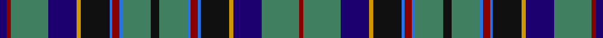

In pattern [BRGBYKBRBGKGBRBKYBGR](/stripes/brgbykbrbgkgbrbkybgr/).

This was sourced from register-of-tartans.  It is a [20 stripe tartan](/stripes/stripes20/).

Original link https://www.tartanregister.gov.uk/tartanDetails.aspx?ref=3917

## Register references

External register numbers recorded for this tartan.

- Scottish Register of Tartans: [3917](https://www.tartanregister.gov.uk/tartanDetails.aspx?ref=3917)
- Scottish Tartans Authority (ITI): 517
- Scottish Tartans World Register: 517

## Thread count
DB/10 DR6 Ga52 DB40 DY6 K40 B4 DR10 B4 Ga40 K12 Ga40 B4 DR10 B4 K40 DY6 DB40 Ga52 DR/6

## Palette
Each colour and the base-6 reference it is a variant of.

| Colour | Shade | Base |
|---|---|---|
| B | <code style="background-color:#2474E8;">#2474E8</code> `oklch(57.8% 0.192 258.7)` <small>#2474E8</small> | B <code style="background-color:#2A418A;">#2A418A</code> |
| DB | <code style="background-color:#1C0070;">#1C0070</code> `oklch(26.3% 0.162 277.1)` <small>#1C0070</small> | B <code style="background-color:#2A418A;">#2A418A</code> |
| DR | <code style="background-color:#880000;">#880000</code> `oklch(39.4% 0.162 29.2)` <small>#880000</small> | R <code style="background-color:#CC0000;">#CC0000</code> |
| DY | <code style="background-color:#D09800;">#D09800</code> `oklch(71.4% 0.147 82.1)` <small>#D09800</small> | Y <code style="background-color:#F2BF00;">#F2BF00</code> |
| G | <code style="background-color:#006818;">#006818</code> `oklch(45.0% 0.142 145.0)` <small>#006818</small> | G <code style="background-color:#006100;">#006100</code> |
| Ga | <code style="background-color:#408060;">#408060</code> `oklch(54.8% 0.084 160.1)` <small>#408060</small> | G <code style="background-color:#006100;">#006100</code> |
| K | <code style="background-color:#101010;">#101010</code> `oklch(17.3% 0.000 89.9)` <small>#101010</small> | K <code style="background-color:#000000;">#000000</code> |
| R | <code style="background-color:#C80000;">#C80000</code> `oklch(52.3% 0.215 29.2)` <small>#C80000</small> | R <code style="background-color:#CC0000;">#CC0000</code> |

## Nearest tartans

The nearest existing variants by ΔTartan distance.

1. [Stinson](/setts/s20/k7b20t2r6t2k20ly3g20b27r3g6~x2/) — ΔT 0.54
1. [Hart of Scotland (Corporate)](/setts/s19/r5db3r3r2db2ly2db2ly1db14g2db7g4db4g7db2g9ly1o2g5~x2/) — ΔT 0.74
1. [Sacramento City Fire Department](/setts/s24/db2w1db15k5g11k1r3k1g11k5db17w1db17k5g11k1r3k1g11k5db15w1db2ly2~x2/) — ΔT 0.88
1. [Annandale (Personal)](/setts/s16/db3r2t2db16k2g2k2g2k2db16g2k10g4r4g12w3~x2/) — ΔT 1.00
1. [Waipu](/setts/s22/g8db16k5ly2dp1ly2k5db7r2db7g16db7r2db7k5ly2dp1ly2k5db16g8w1~x2/) — ΔT 1.07
1. [Stewart/Stuart Blue](/setts/s22/db33r8k12ly2k4w4k4g12db8k4db4w2~x2/) — ΔT 1.09
1. [Sacramento City Fire Department (P&D](/setts/s13/ly2db2w1db15k5g11k1r3k1g11k5db17w1~x2/) — ΔT 1.11
1. [Service of Drymen Corporate Tartan Tartan Number: 1380. Earliest known date: pre 2003 The design is based on the Sillers connection with the Isle of Arran and the Clan Stewart. See products available Copyright © Blair Urquhart, Comrie, 2015](/setts/s17/r2db14k2o5g3w1g3w1g3k1g3k1g3o5k2db14ly2~x2/) — ΔT 1.14
1. [Shandon (Personal)](/setts/s14/k20g18k2w2k5ly2k2g18k20db18b4db4b4db18~x2/) — ΔT 1.14
1. [Moran Blue Family Tartan Tartan Number: 3901. Earliest known date: 2001 Designed by Mark Moran after finding that the existing green Moran tartan was restricted (by copyright). Mark decided that he too, wished to reserve the design for his own famillies use. See products available Copyright © Blair Urquhart, Comrie, 2015](/setts/s16/b26db13k13w2g8k5k3b3k3k5g8w2k13db13b26w3~x2/) — ΔT 1.15

## Neighbour map

Every grey dot is one of 14299 variants placed by the first two principal components of the ΔTartan feature space (44% of its variance). Red is this tartan; blue dots are its nearest — click one to open its page.

<svg viewBox="0 0 640 380" role="img" style="max-width:100%;height:auto;border:1px solid #e0e0e0;border-radius:4px;display:block" xmlns="http://www.w3.org/2000/svg"><image href="/nn/cloud.v1.png" width="640" height="380"/><a href="/setts/s20/k7b20t2r6t2k20ly3g20b27r3g6~x2/"><circle cx="158.4" cy="123.3" r="4" fill="#3465a4"><title>Stinson</title></circle></a><a href="/setts/s19/r5db3r3r2db2ly2db2ly1db14g2db7g4db4g7db2g9ly1o2g5~x2/"><circle cx="195.0" cy="134.8" r="4" fill="#3465a4"><title>Hart of Scotland (Corporate)</title></circle></a><a href="/setts/s24/db2w1db15k5g11k1r3k1g11k5db17w1db17k5g11k1r3k1g11k5db15w1db2ly2~x2/"><circle cx="209.9" cy="110.0" r="4" fill="#3465a4"><title>Sacramento City Fire Department</title></circle></a><a href="/setts/s16/db3r2t2db16k2g2k2g2k2db16g2k10g4r4g12w3~x2/"><circle cx="158.0" cy="145.6" r="4" fill="#3465a4"><title>Annandale (Personal)</title></circle></a><a href="/setts/s22/g8db16k5ly2dp1ly2k5db7r2db7g16db7r2db7k5ly2dp1ly2k5db16g8w1~x2/"><circle cx="175.4" cy="103.0" r="4" fill="#3465a4"><title>Waipu</title></circle></a><a href="/setts/s22/db33r8k12ly2k4w4k4g12db8k4db4w2~x2/"><circle cx="131.0" cy="98.0" r="4" fill="#3465a4"><title>Stewart/Stuart Blue</title></circle></a><a href="/setts/s13/ly2db2w1db15k5g11k1r3k1g11k5db17w1~x2/"><circle cx="210.0" cy="127.2" r="4" fill="#3465a4"><title>Sacramento City Fire Department (P&amp;D</title></circle></a><a href="/setts/s17/r2db14k2o5g3w1g3w1g3k1g3k1g3o5k2db14ly2~x2/"><circle cx="158.9" cy="97.6" r="4" fill="#3465a4"><title>Service of Drymen Corporate Tartan Tartan Number: 1380. Earliest known date: pre 2003 The design is based on the Sillers connection with the Isle of Arran and the Clan Stewart. See products available Copyright © Blair Urquhart, Comrie, 2015</title></circle></a><a href="/setts/s14/k20g18k2w2k5ly2k2g18k20db18b4db4b4db18~x2/"><circle cx="135.9" cy="157.3" r="4" fill="#3465a4"><title>Shandon (Personal)</title></circle></a><a href="/setts/s16/b26db13k13w2g8k5k3b3k3k5g8w2k13db13b26w3~x2/"><circle cx="125.4" cy="133.2" r="4" fill="#3465a4"><title>Moran Blue Family Tartan Tartan Number: 3901. Earliest known date: 2001 Designed by Mark Moran after finding that the existing green Moran tartan was restricted (by copyright). Mark decided that he too, wished to reserve the design for his own famillies use. See products available Copyright © Blair Urquhart, Comrie, 2015</title></circle></a><circle cx="162.8" cy="123.7" r="5" fill="#c00000"/></svg>

ID: /setts/s20/k6g20b2r5b2k20lo3db20g26r3db5~x2/
