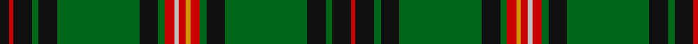

In pattern [KRKGKGKGRWRYRGKGKGKR](/patterns/krkgkgkgrwryrgkgkgkr/).

This was sourced from register-of-tartans.  It is a [20 stripes tartan](/stripes/stripes20/).

Original link https://www.tartanregister.gov.uk/tartanDetails.aspx?ref=1993

## Thread count
K/8 R4 K16 G6 K16 G72 K16 G6 R8 N4 R6 DY4 R8 G6 K16 G72 K16 G6 K16 R/4

## Palette
Each colour and its ΔE from the base-6 reference it is a variant of.

| Colour | Shade | Base | ΔE (OKLab) |
|---|---|---|---|
| DR | <code style="background-color:#880000;">#880000</code> `#880000` | R <code style="background-color:#C80000;">#C80000</code> | 0.14 |
| DY | <code style="background-color:#D09800;">#D09800</code> `#D09800` | Y <code style="background-color:#E8C000;">#E8C000</code> | 0.11 |
| G | <code style="background-color:#006818;">#006818</code> `#006818` | G <code style="background-color:#006400;">#006400</code> | 0.02 |
| K | <code style="background-color:#101010;">#101010</code> `#101010` | K <code style="background-color:#000000;">#000000</code> | 0.17 |
| N | <code style="background-color:#C0C0C0;">#C0C0C0</code> `#C0C0C0` | W <code style="background-color:#F4F4F0;">#F4F4F0</code> | 0.16 |
| R | <code style="background-color:#C80000;">#C80000</code> `#C80000` | R <code style="background-color:#C80000;">#C80000</code> | 0.00 |

## Nearest tartans

The nearest existing variants by ΔTartan distance.

1. [Hyslop Hunting (Name)](/setts/s18/g8r4g48k4g4k12g4k12g4k4g6y2b6k4b2k4b6g4-b1c0070-g006818-k101010-r880000-yd09800/) — ΔT 0.89
1. [Pilette of Kinnear (Personal)](/setts/s21/k8r4k20g6k20g60k16g6r8w4r8y4r8g6k16g60k20g6k20r4k8-g006818-k101010-rc80000-wc0c0c0-yd09800/) — ΔT 0.93
1. [Sarafilovic](/setts/s16/b30k36g6k4g4k4g88y8g88k4g4k4g6k36b30r8-b2c2c80-g006818-k101010-rc80000-ye8c000/) — ΔT 0.96
1. [Kinnear Barony of.. Family Tartan Tartan Number: 2136. Earliest known date: 13/10/92 Michael Jean George Pilette (Vlug) of Kinnear, Baron of Kinnear, commissioned the design of this new tartan. Based on the 'Duke of Fife' or Fife district tartan with an overcheck in the colours of the Kinnear Arms. The tartan was designed by Blair Urquhart for the Scottish Tartans Society and is intended for association with the bearer of the Kinnear Arms. See products available Copyright © Blair Urquhart, Comrie, 2015](/setts/s21/k4r2k12g4k12g48k8g4ra6y2ra4ya2ra6g4k8g48k12g4k12r2k4-g006818-k101010-rc80000-ra880000-yb8b8b8-yae8c000/) — ΔT 1.00
1. [Cochrane of Dundonald](/setts/s13/g88r8g4r4g4r8g24k24r4b20r8b8y6-b202060-g006818-k101010-rc80000-yd8b000/) — ΔT 1.13
1. [Kennedy](/setts/s17/b4g4y2g6r2g4r2g26b8k6b6k6b6k6b8g46r4-b00004c-g004c00-k000000-rc80000-yffc800/) — ΔT 1.13
1. [King Edward VII Royal Family Tartan Tartan Number: 1559. Earliest known date: pre 1992 Reputed to be a tartan specifically woven for King Edward VII. In the possession of Miss K Roberts of Torquay. See Kennedy See products available Copyright © Blair Urquhart, Comrie, 2015](/setts/s17/y16g168b42k20b20k20b20k20b42g124r6g12r6g20y6g10r12-b2c2c80-g006818-k101010-rc80000-ye8c000/) — ΔT 1.15
1. [Cochrane](/setts/s15/g68r8g6r4g8r4g6r8g34k34r4b34r8b8y6-b202060-g006818-k101010-rc80000-yd8b000/) — ΔT 1.20
1. [Cochrane (1984) Clan Tartan Tartan Number: 978. Earliest known date: 1984 Lord Dundonald originally registered a version missing a red and a green stripe in 1974. There is a story that a fragment of this design was discovered in the foundations of a Perthshire house in 1934. Around that time, a count was recorded from the sample books of Messrs William Anderson. The red and green have been restored in this version, which is now the 'approved' tartan, and appears in the 'Appendix' of the Lyon Court Books dated 12th November 1984. See products available Copyright © Blair Urquhart, Comrie, 2015](/setts/s15/g68r8g8r4g8r4g6r8g34k34r4b34r8b8y6-b2c2c80-g006818-k101010-rc80000-ye8c000/) — ΔT 1.23
1. [Raznotravie](/setts/s18/k20y2g4k2b4k2g4y2k2b4k6b2k34g36y2g4k2ga4-b1e2025-g70714d-ga23321b-k1c1714-yf5d38b/) — ΔT 1.25

## Neighbour map

Every grey dot is one of 15726 variants placed by the first two principal components of the ΔTartan feature space (44% of its variance). Red is this tartan; blue dots are its nearest — click one to open its page.

<svg viewBox="0 0 640 380" role="img" style="max-width:100%;height:auto;border:1px solid #e0e0e0;border-radius:4px;display:block" xmlns="http://www.w3.org/2000/svg"><image href="/nn/cloud.v1.png" width="640" height="380"/><a href="/setts/s18/g8r4g48k4g4k12g4k12g4k4g6y2b6k4b2k4b6g4-b1c0070-g006818-k101010-r880000-yd09800/"><circle cx="339.2" cy="106.2" r="4" fill="#3465a4"><title>Hyslop Hunting (Name)</title></circle></a><a href="/setts/s21/k8r4k20g6k20g60k16g6r8w4r8y4r8g6k16g60k20g6k20r4k8-g006818-k101010-rc80000-wc0c0c0-yd09800/"><circle cx="251.0" cy="121.4" r="4" fill="#3465a4"><title>Pilette of Kinnear (Personal)</title></circle></a><a href="/setts/s16/b30k36g6k4g4k4g88y8g88k4g4k4g6k36b30r8-b2c2c80-g006818-k101010-rc80000-ye8c000/"><circle cx="310.9" cy="116.1" r="4" fill="#3465a4"><title>Sarafilovic</title></circle></a><a href="/setts/s21/k4r2k12g4k12g48k8g4ra6y2ra4ya2ra6g4k8g48k12g4k12r2k4-g006818-k101010-rc80000-ra880000-yb8b8b8-yae8c000/"><circle cx="307.1" cy="82.4" r="4" fill="#3465a4"><title>Kinnear Barony of.. Family Tartan Tartan Number: 2136. Earliest known date: 13/10/92 Michael Jean George Pilette (Vlug) of Kinnear, Baron of Kinnear, commissioned the design of this new tartan. Based on the 'Duke of Fife' or Fife district tartan with an overcheck in the colours of the Kinnear Arms. The tartan was designed by Blair Urquhart for the Scottish Tartans Society and is intended for association with the bearer of the Kinnear Arms. See products available Copyright © Blair Urquhart, Comrie, 2015</title></circle></a><a href="/setts/s13/g88r8g4r4g4r8g24k24r4b20r8b8y6-b202060-g006818-k101010-rc80000-yd8b000/"><circle cx="327.6" cy="110.0" r="4" fill="#3465a4"><title>Cochrane of Dundonald</title></circle></a><a href="/setts/s17/b4g4y2g6r2g4r2g26b8k6b6k6b6k6b8g46r4-b00004c-g004c00-k000000-rc80000-yffc800/"><circle cx="330.0" cy="110.2" r="4" fill="#3465a4"><title>Kennedy</title></circle></a><a href="/setts/s17/y16g168b42k20b20k20b20k20b42g124r6g12r6g20y6g10r12-b2c2c80-g006818-k101010-rc80000-ye8c000/"><circle cx="346.5" cy="99.2" r="4" fill="#3465a4"><title>King Edward VII Royal Family Tartan Tartan Number: 1559. Earliest known date: pre 1992 Reputed to be a tartan specifically woven for King Edward VII. In the possession of Miss K Roberts of Torquay. See Kennedy See products available Copyright © Blair Urquhart, Comrie, 2015</title></circle></a><a href="/setts/s15/g68r8g6r4g8r4g6r8g34k34r4b34r8b8y6-b202060-g006818-k101010-rc80000-yd8b000/"><circle cx="261.2" cy="124.7" r="4" fill="#3465a4"><title>Cochrane</title></circle></a><a href="/setts/s15/g68r8g8r4g8r4g6r8g34k34r4b34r8b8y6-b2c2c80-g006818-k101010-rc80000-ye8c000/"><circle cx="261.0" cy="124.6" r="4" fill="#3465a4"><title>Cochrane (1984) Clan Tartan Tartan Number: 978. Earliest known date: 1984 Lord Dundonald originally registered a version missing a red and a green stripe in 1974. There is a story that a fragment of this design was discovered in the foundations of a Perthshire house in 1934. Around that time, a count was recorded from the sample books of Messrs William Anderson. The red and green have been restored in this version, which is now the 'approved' tartan, and appears in the 'Appendix' of the Lyon Court Books dated 12th November 1984. See products available Copyright © Blair Urquhart, Comrie, 2015</title></circle></a><a href="/setts/s18/k20y2g4k2b4k2g4y2k2b4k6b2k34g36y2g4k2ga4-b1e2025-g70714d-ga23321b-k1c1714-yf5d38b/"><circle cx="293.0" cy="100.6" r="4" fill="#3465a4"><title>Raznotravie</title></circle></a><circle cx="306.1" cy="107.3" r="5" fill="#c00000"/></svg>

ID: /setts/s20/k8r4k16g6k16g72k16g6r8w4r6y4r8g6k16g72k16g6k16r4-g006818-k101010-rc80000-wc0c0c0-yd09800/
