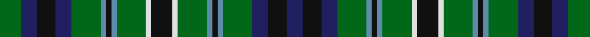

This page is one **sett** — a single exact thread-count. It belongs to the [tartan](/tartans/k8ln2g11b2k2b2g11db6k7db6g8/)
(the same proportion at any scale), whose colour order is pattern [BKBGBKBGWKWGBKBGBKBG](/stripes/bkbgbkbgwkwgbkbgbkbg/).

Sourced from register-of-tartans.  It is a [20 stripe tartan](/stripes/stripes20/).

Original link https://www.tartanregister.gov.uk/tartanDetails.aspx?ref=4696

## Register references

External register numbers recorded for this tartan.

- Scottish Register of Tartans: [4696](https://www.tartanregister.gov.uk/tartanDetails.aspx?ref=4696)
- Scottish Tartans Authority (ITI): 730
- Scottish Tartans World Register: 730

## Thread count
G/16 DB12 K14 DB12 G22 B4 K4 B4 G22 LN4 K16 LN4 G22 B4 K4 B4 G22 DB12 K14 DB/12

## Palette
Each colour and the base-6 reference it is a variant of.

| Colour | Shade | Base |
|---|---|---|
| B | <code style="background-color:#5C8CA8;">#5C8CA8</code> `oklch(61.7% 0.067 235.0)` <small>#5C8CA8</small> | B <code style="background-color:#2A418A;">#2A418A</code> |
| DB | <code style="background-color:#202060;">#202060</code> `oklch(28.9% 0.111 276.9)` <small>#202060</small> | B <code style="background-color:#2A418A;">#2A418A</code> |
| DG | <code style="background-color:#003820;">#003820</code> `oklch(30.0% 0.070 158.3)` <small>#003820</small> | G <code style="background-color:#006100;">#006100</code> |
| G | <code style="background-color:#006818;">#006818</code> `oklch(45.0% 0.142 145.0)` <small>#006818</small> | G <code style="background-color:#006100;">#006100</code> |
| K | <code style="background-color:#101010;">#101010</code> `oklch(17.3% 0.000 89.9)` <small>#101010</small> | K <code style="background-color:#000000;">#000000</code> |
| LN | <code style="background-color:#E0E0E0;">#E0E0E0</code> `oklch(90.7% 0.000 89.9)` <small>#E0E0E0</small> | W <code style="background-color:#F7F7F7;">#F7F7F7</code> |

## Nearest tartans

The nearest existing variants by ΔTartan distance, with this tartan at the top so the swatches line up against it.

ΔTartan

Tartan

Sett

—

<a href="/ttd/edit/#slug=k8w2g11t2k2t2g11db6k7db6g8~x2">Wilson's No.149</a> <a class="nn-out" href="/setts/s20/k8w2g11t2k2t2g11db6k7db6g8~x2/" title="open its dictionary page">↗</a>

1.02

<a href="/ttd/edit/#slug=db4g1db1g6k1g6db1g1db4w1k4g1k4ly1~x4">MacAlpine (1906)</a> <a class="nn-out" href="/setts/s14/db4g1db1g6k1g6db1g1db4w1k4g1k4ly1~x4/" title="open its dictionary page">↗</a>

1.02

<a href="/ttd/edit/#slug=k2b1g6b2g2k4g5lo1g5k4db4k2db2~x4">Gordon Dress (US Fashion)</a> <a class="nn-out" href="/setts/s13/k2b1g6b2g2k4g5lo1g5k4db4k2db2~x4/" title="open its dictionary page">↗</a>

1.03

<a href="/setts/s22/k10g4w1g4k1g4r1g4k5db5k1db5~x4/">Lloyd of Dolobran (Personal)</a>

1.04

<a href="/ttd/edit/#slug=k2g4k1g1k2db3k1w1k1db3k2g1k1g4k2r1~x6">MacKean dress Family/Clan Tartan Tartan Number: 2339. Earliest known date: 1995 This was designed as a special design for silk squares woven by D C Dalgliesh. Assumption is that all these New Zealand MacKeans are Personal tartans rather than Clan/Family. See products available Copyright © Blair Urquhart, Comrie, 2015</a> <a class="nn-out" href="/setts/s16/k2g4k1g1k2db3k1w1k1db3k2g1k1g4k2r1~x6/" title="open its dictionary page">↗</a>

1.14

<a href="/ttd/edit/#slug=db9dg3db9k4dg10r4dg10k6dg2k7dg2k7dg2k6dg10ly4dg10k8~x2">Stuart/Stewart Hunting Plaid</a> <a class="nn-out" href="/setts/s18/db9dg3db9k4dg10r4dg10k6dg2k7dg2k7dg2k6dg10ly4dg10k8~x2/" title="open its dictionary page">↗</a>

1.14

<a href="/setts/s14/g5r4g19k10g8w4db18r4~x2/">CSCA</a>

1.15

<a href="/ttd/edit/#slug=g2r2g12k4n11r2n11k4n2k9n2k9n2k4n11ly2n11k4g12r2g2~x2">Allen (1998)</a> <a class="nn-out" href="/setts/s21/g2r2g12k4n11r2n11k4n2k9n2k9n2k4n11ly2n11k4g12r2g2~x2/" title="open its dictionary page">↗</a>

1.16

<a href="/ttd/edit/#slug=g5k24g12k16g26w4g24w4g26k16dt4k4dt4k4db28g3">O'Conner Irish Family Tartan Tartan Number: 2217. Earliest known date: 1985 Designed by Jerry O'Connor of Keltic Klassics, Hillsdale, New Jersey who names it &quot;Royal na Connaught&quot; .Woven by House of Edgar who said they would call it O'Connor. Ref made to Lawrence &amp; Gerald O'Connor - possibly customers of Macnaughtons of Pitlochry (part of same group as House of Edgar) See products available Copyright © Blair Urquhart, Comrie, 2015</a> <a class="nn-out" href="/setts/s16/g5k24g12k16g26w4g24w4g26k16dt4k4dt4k4db28g3/" title="open its dictionary page">↗</a>

1.19

<a href="/ttd/edit/#slug=ly3g15k15db15k2db15k15g15m3g15k15g15ly3~x2">MacBride Family Tartan Tartan Number: 2153. Earliest known date: 1992 The family of MacBride, (from SaintBride or Brigid) are known to have been a sept of the MacDonalds. Head of the family, Mr Stuart C. MacBride, commissioned Mr Harry Lindley to create a MacBride tartan from the Ensigns Armorial recently granted by Lord Lyon. Mr MacBride is a member of the Weaver Incorporation of Aberdeen. Traditionally members of the family, as a courtesy, ask permission of the chief or head of the family before wearing his tartan. See products available Copyright © Blair Urquhart, Comrie, 2015</a> <a class="nn-out" href="/setts/s13/ly3g15k15db15k2db15k15g15m3g15k15g15ly3~x2/" title="open its dictionary page">↗</a>

1.23

<a href="/ttd/edit/#slug=g14t2r3t2k16ly2t16g16r3g16t16ly2k16t2r3t2g14k6~x2">Norwich No.038</a> <a class="nn-out" href="/setts/s18/g14t2r3t2k16ly2t16g16r3g16t16ly2k16t2r3t2g14k6~x2/" title="open its dictionary page">↗</a>

## Neighbour map

Every grey dot is one of 14299 variants placed by the first two principal components of the ΔTartan feature space (44% of its variance). Red is this tartan; blue dots are its nearest — click one to open its page.

<svg viewBox="0 0 640 380" role="img" style="max-width:100%;height:auto;border:1px solid #e0e0e0;border-radius:4px;display:block" xmlns="http://www.w3.org/2000/svg"><image href="/nn/cloud.v1.png" width="640" height="380"/><a href="/setts/s14/db4g1db1g6k1g6db1g1db4w1k4g1k4ly1~x4/"><circle cx="159.6" cy="198.7" r="4" fill="#3465a4"><title>MacAlpine (1906)</title></circle></a><a href="/setts/s13/k2b1g6b2g2k4g5lo1g5k4db4k2db2~x4/"><circle cx="152.7" cy="228.7" r="4" fill="#3465a4"><title>Gordon Dress (US Fashion)</title></circle></a><a href="/setts/s22/k10g4w1g4k1g4r1g4k5db5k1db5~x4/"><circle cx="166.8" cy="171.8" r="4" fill="#3465a4"><title>Lloyd of Dolobran (Personal)</title></circle></a><a href="/setts/s16/k2g4k1g1k2db3k1w1k1db3k2g1k1g4k2r1~x6/"><circle cx="119.5" cy="225.1" r="4" fill="#3465a4"><title>MacKean dress Family/Clan Tartan Tartan Number: 2339. Earliest known date: 1995 This was designed as a special design for silk squares woven by D C Dalgliesh. Assumption is that all these New Zealand MacKeans are Personal tartans rather than Clan/Family. See products available Copyright © Blair Urquhart, Comrie, 2015</title></circle></a><a href="/setts/s18/db9dg3db9k4dg10r4dg10k6dg2k7dg2k7dg2k6dg10ly4dg10k8~x2/"><circle cx="151.0" cy="235.9" r="4" fill="#3465a4"><title>Stuart/Stewart Hunting Plaid</title></circle></a><a href="/setts/s14/g5r4g19k10g8w4db18r4~x2/"><circle cx="123.4" cy="205.2" r="4" fill="#3465a4"><title>CSCA</title></circle></a><a href="/setts/s21/g2r2g12k4n11r2n11k4n2k9n2k9n2k4n11ly2n11k4g12r2g2~x2/"><circle cx="170.7" cy="193.5" r="4" fill="#3465a4"><title>Allen (1998)</title></circle></a><a href="/setts/s16/g5k24g12k16g26w4g24w4g26k16dt4k4dt4k4db28g3/"><circle cx="202.9" cy="179.8" r="4" fill="#3465a4"><title>O'Conner Irish Family Tartan Tartan Number: 2217. Earliest known date: 1985 Designed by Jerry O'Connor of Keltic Klassics, Hillsdale, New Jersey who names it &quot;Royal na Connaught&quot; .Woven by House of Edgar who said they would call it O'Connor. Ref made to Lawrence &amp; Gerald O'Connor - possibly customers of Macnaughtons of Pitlochry (part of same group as House of Edgar) See products available Copyright © Blair Urquhart, Comrie, 2015</title></circle></a><a href="/setts/s13/ly3g15k15db15k2db15k15g15m3g15k15g15ly3~x2/"><circle cx="144.8" cy="220.0" r="4" fill="#3465a4"><title>MacBride Family Tartan Tartan Number: 2153. Earliest known date: 1992 The family of MacBride, (from SaintBride or Brigid) are known to have been a sept of the MacDonalds. Head of the family, Mr Stuart C. MacBride, commissioned Mr Harry Lindley to create a MacBride tartan from the Ensigns Armorial recently granted by Lord Lyon. Mr MacBride is a member of the Weaver Incorporation of Aberdeen. Traditionally members of the family, as a courtesy, ask permission of the chief or head of the family before wearing his tartan. See products available Copyright © Blair Urquhart, Comrie, 2015</title></circle></a><a href="/setts/s18/g14t2r3t2k16ly2t16g16r3g16t16ly2k16t2r3t2g14k6~x2/"><circle cx="146.2" cy="166.8" r="4" fill="#3465a4"><title>Norwich No.038</title></circle></a><circle cx="146.2" cy="201.5" r="5" fill="#c00000"/></svg>

ID: /setts/s20/k8w2g11t2k2t2g11db6k7db6g8~x2/
