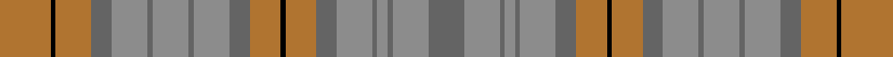

This page is one **sett** — a single exact thread-count. It belongs to the [tartan](/tartans/o10k1o7n4oi7n1oi7n1oi7n4o6k1o6n4oi7n1oi2n1oi7n7/)
(the same proportion at any scale), whose colour order is pattern [BRBRBRBRKRBRBRBRBRKR](/stripes/brbrbrbrkrbrbrbrbrkr/).

Sourced from register-of-tartans.  It is a [20 stripe tartan](/stripes/stripes20/).

Original link https://www.tartanregister.gov.uk/tartanDetails.aspx?ref=1367

## Register references

External register numbers recorded for this tartan.

- Scottish Register of Tartans: [1367](https://www.tartanregister.gov.uk/tartanDetails.aspx?ref=1367)
- Scottish Tartans Authority (ITI): 5001

## Thread count
LT/40 K4 LT28 Na16 N28 Na4 N28 Na4 N28 Na16 LT24 K4 LT24 Na16 N28 Na4 N8 Na4 N28 Na/28

## Palette

Palette: <strong>Tartan Register</strong> <small style="color:#888">(3 of 4 colours)</small>
<table><thead><tr><th>Colour</th><th>Threads</th><th>Shade</th><th>Base</th><th>OKLCh</th></tr></thead><tbody><tr><td>LT/</td><td style="text-align:right;font-variant-numeric:tabular-nums">40</td><td><code style="background-color:#B07430;">#B07430</code> <small style="color:#888">#B07430</small></td><td>R <code style="background-color:#CC0000;">#CC0000</code></td><td><small style="color:#888">oklch(61.0% 0.112 66.0)</small></td></tr><tr><td>K</td><td style="text-align:right;font-variant-numeric:tabular-nums">4</td><td><code style="background-color:#000000;">#000000</code> <small style="color:#888">#000000</small></td><td>K <code style="background-color:#000000;">#000000</code></td><td><small style="color:#888">oklch(0.0% 0.000 0.0)</small></td></tr><tr><td>LT</td><td style="text-align:right;font-variant-numeric:tabular-nums">28</td><td><code style="background-color:#B07430;">#B07430</code> <small style="color:#888">#B07430</small></td><td>R <code style="background-color:#CC0000;">#CC0000</code></td><td><small style="color:#888">oklch(61.0% 0.112 66.0)</small></td></tr><tr><td>Na</td><td style="text-align:right;font-variant-numeric:tabular-nums">16</td><td><code style="background-color:#646464;">#646464</code> <small style="color:#888">#646464</small></td><td>B <code style="background-color:#2A418A;">#2A418A</code></td><td><small style="color:#888">oklch(50.3% 0.000 89.9)</small></td></tr><tr><td>N</td><td style="text-align:right;font-variant-numeric:tabular-nums">28</td><td><code style="background-color:#8C8C8C;">#8C8C8C</code> <small style="color:#888">#8C8C8C</small></td><td>R <code style="background-color:#CC0000;">#CC0000</code></td><td><small style="color:#888">oklch(64.0% 0.000 89.9)</small></td></tr><tr><td>Na</td><td style="text-align:right;font-variant-numeric:tabular-nums">4</td><td><code style="background-color:#646464;">#646464</code> <small style="color:#888">#646464</small></td><td>B <code style="background-color:#2A418A;">#2A418A</code></td><td><small style="color:#888">oklch(50.3% 0.000 89.9)</small></td></tr><tr><td>N</td><td style="text-align:right;font-variant-numeric:tabular-nums">28</td><td><code style="background-color:#8C8C8C;">#8C8C8C</code> <small style="color:#888">#8C8C8C</small></td><td>R <code style="background-color:#CC0000;">#CC0000</code></td><td><small style="color:#888">oklch(64.0% 0.000 89.9)</small></td></tr><tr><td>Na</td><td style="text-align:right;font-variant-numeric:tabular-nums">4</td><td><code style="background-color:#646464;">#646464</code> <small style="color:#888">#646464</small></td><td>B <code style="background-color:#2A418A;">#2A418A</code></td><td><small style="color:#888">oklch(50.3% 0.000 89.9)</small></td></tr><tr><td>N</td><td style="text-align:right;font-variant-numeric:tabular-nums">28</td><td><code style="background-color:#8C8C8C;">#8C8C8C</code> <small style="color:#888">#8C8C8C</small></td><td>R <code style="background-color:#CC0000;">#CC0000</code></td><td><small style="color:#888">oklch(64.0% 0.000 89.9)</small></td></tr><tr><td>Na</td><td style="text-align:right;font-variant-numeric:tabular-nums">16</td><td><code style="background-color:#646464;">#646464</code> <small style="color:#888">#646464</small></td><td>B <code style="background-color:#2A418A;">#2A418A</code></td><td><small style="color:#888">oklch(50.3% 0.000 89.9)</small></td></tr><tr><td>LT</td><td style="text-align:right;font-variant-numeric:tabular-nums">24</td><td><code style="background-color:#B07430;">#B07430</code> <small style="color:#888">#B07430</small></td><td>R <code style="background-color:#CC0000;">#CC0000</code></td><td><small style="color:#888">oklch(61.0% 0.112 66.0)</small></td></tr><tr><td>K</td><td style="text-align:right;font-variant-numeric:tabular-nums">4</td><td><code style="background-color:#000000;">#000000</code> <small style="color:#888">#000000</small></td><td>K <code style="background-color:#000000;">#000000</code></td><td><small style="color:#888">oklch(0.0% 0.000 0.0)</small></td></tr><tr><td>LT</td><td style="text-align:right;font-variant-numeric:tabular-nums">24</td><td><code style="background-color:#B07430;">#B07430</code> <small style="color:#888">#B07430</small></td><td>R <code style="background-color:#CC0000;">#CC0000</code></td><td><small style="color:#888">oklch(61.0% 0.112 66.0)</small></td></tr><tr><td>Na</td><td style="text-align:right;font-variant-numeric:tabular-nums">16</td><td><code style="background-color:#646464;">#646464</code> <small style="color:#888">#646464</small></td><td>B <code style="background-color:#2A418A;">#2A418A</code></td><td><small style="color:#888">oklch(50.3% 0.000 89.9)</small></td></tr><tr><td>N</td><td style="text-align:right;font-variant-numeric:tabular-nums">28</td><td><code style="background-color:#8C8C8C;">#8C8C8C</code> <small style="color:#888">#8C8C8C</small></td><td>R <code style="background-color:#CC0000;">#CC0000</code></td><td><small style="color:#888">oklch(64.0% 0.000 89.9)</small></td></tr><tr><td>Na</td><td style="text-align:right;font-variant-numeric:tabular-nums">4</td><td><code style="background-color:#646464;">#646464</code> <small style="color:#888">#646464</small></td><td>B <code style="background-color:#2A418A;">#2A418A</code></td><td><small style="color:#888">oklch(50.3% 0.000 89.9)</small></td></tr><tr><td>N</td><td style="text-align:right;font-variant-numeric:tabular-nums">8</td><td><code style="background-color:#8C8C8C;">#8C8C8C</code> <small style="color:#888">#8C8C8C</small></td><td>R <code style="background-color:#CC0000;">#CC0000</code></td><td><small style="color:#888">oklch(64.0% 0.000 89.9)</small></td></tr><tr><td>Na</td><td style="text-align:right;font-variant-numeric:tabular-nums">4</td><td><code style="background-color:#646464;">#646464</code> <small style="color:#888">#646464</small></td><td>B <code style="background-color:#2A418A;">#2A418A</code></td><td><small style="color:#888">oklch(50.3% 0.000 89.9)</small></td></tr><tr><td>N</td><td style="text-align:right;font-variant-numeric:tabular-nums">28</td><td><code style="background-color:#8C8C8C;">#8C8C8C</code> <small style="color:#888">#8C8C8C</small></td><td>R <code style="background-color:#CC0000;">#CC0000</code></td><td><small style="color:#888">oklch(64.0% 0.000 89.9)</small></td></tr><tr><td>Na/</td><td style="text-align:right;font-variant-numeric:tabular-nums">28</td><td><code style="background-color:#646464;">#646464</code> <small style="color:#888">#646464</small></td><td>B <code style="background-color:#2A418A;">#2A418A</code></td><td><small style="color:#888">oklch(50.3% 0.000 89.9)</small></td></tr></tbody></table>

## Nearest tartans

The nearest existing variants by ΔTartan distance, with this tartan at the top so the swatches line up against it.

ΔTartan

Tartan

Sett

—

<a href="/ttd/edit/#slug=o10k1o7n4oi7n1oi7n1oi7n4o6k1o6n4oi7n1oi2n1oi7n7~x4">Glen Burns (WCWM - 1)</a> <a class="nn-out" href="/setts/s20/o10k1o7n4oi7n1oi7n1oi7n4o6k1o6n4oi7n1oi2n1oi7n7~x4/" title="open its dictionary page">↗</a>

2.08

<a href="/setts/s10/o5n3o22r3n6ni17r2ni4r2ni4~x2/">Clyde</a>

2.13

<a href="/ttd/edit/#slug=r3o23y8g6y8t6y10t12y3~x2">Lawrence's Seven Pillars of Khaki</a> <a class="nn-out" href="/setts/s9/r3o23y8g6y8t6y10t12y3~x2/" title="open its dictionary page">↗</a>

2.15

<a href="/ttd/edit/#slug=g3yi16o11yi2y11yi2y11yi2o11yi16w3~x2">Harmony 14</a> <a class="nn-out" href="/setts/s11/g3yi16o11yi2y11yi2y11yi2o11yi16w3~x2/" title="open its dictionary page">↗</a>

2.16

<a href="/ttd/edit/#slug=o7n6lb1lo6n1lo6n6lb1o6~x8">Outlander #2</a> <a class="nn-out" href="/setts/s9/o7n6lb1lo6n1lo6n6lb1o6~x8/" title="open its dictionary page">↗</a>

2.17

<a href="/ttd/edit/#slug=o6r4o24dg14lo9o3lo3o3lo9dg24o9lo6~x2">Pierce</a> <a class="nn-out" href="/setts/s12/o6r4o24dg14lo9o3lo3o3lo9dg24o9lo6~x2/" title="open its dictionary page">↗</a>

2.17

<a href="/ttd/edit/#slug=y7n6lt1lo6n1lo6n6lt1y6~x8">Outlander #2</a> <a class="nn-out" href="/setts/s9/y7n6lt1lo6n1lo6n6lt1y6~x8/" title="open its dictionary page">↗</a>

2.22

<a href="/ttd/edit/#slug=n12dy2ly2dy2n2dy10y12dy3y12dy10n11r2ly2~x2">MacVicar, McVicar, McVicker</a> <a class="nn-out" href="/setts/s13/n12dy2ly2dy2n2dy10y12dy3y12dy10n11r2ly2~x2/" title="open its dictionary page">↗</a>

2.26

<a href="/ttd/edit/#slug=dy8dg20db15dy6dg4dy8db4dy6dg20dy8db6dy4b2dy4db6">Unidentified Fragment #2</a> <a class="nn-out" href="/setts/s15/dy8dg20db15dy6dg4dy8db4dy6dg20dy8db6dy4b2dy4db6/" title="open its dictionary page">↗</a>

2.34

<a href="/ttd/edit/#slug=lr6n3o7n2o5n8o5n15o18r2o2ly2b3~x2">Sandbaggers (Corporate)</a> <a class="nn-out" href="/setts/s13/lr6n3o7n2o5n8o5n15o18r2o2ly2b3~x2/" title="open its dictionary page">↗</a>

2.37

<a href="/ttd/edit/#slug=lo2dt3dy3dt4y16dt3dy3dt4y3dt3dy16dt4y3dt3lo2~x2">Kerry, County</a> <a class="nn-out" href="/setts/s15/lo2dt3dy3dt4y16dt3dy3dt4y3dt3dy16dt4y3dt3lo2~x2/" title="open its dictionary page">↗</a>

## Neighbour map

Every grey dot is one of 14359 variants placed by the first two principal components of the ΔTartan feature space (44% of its variance). Red is this tartan; blue dots are its nearest — click one to open its page.

<svg viewBox="0 0 640 380" role="img" style="max-width:100%;height:auto;border:1px solid #e0e0e0;border-radius:4px;display:block" xmlns="http://www.w3.org/2000/svg"><image href="/nn/cloud.v1.png" width="640" height="380"/><a href="/setts/s10/o5n3o22r3n6ni17r2ni4r2ni4~x2/"><circle cx="338.3" cy="236.9" r="4" fill="#3465a4"><title>Clyde</title></circle></a><a href="/setts/s9/r3o23y8g6y8t6y10t12y3~x2/"><circle cx="256.8" cy="261.8" r="4" fill="#3465a4"><title>Lawrence's Seven Pillars of Khaki</title></circle></a><a href="/setts/s11/g3yi16o11yi2y11yi2y11yi2o11yi16w3~x2/"><circle cx="310.1" cy="263.9" r="4" fill="#3465a4"><title>Harmony 14</title></circle></a><a href="/setts/s9/o7n6lb1lo6n1lo6n6lb1o6~x8/"><circle cx="264.4" cy="299.3" r="4" fill="#3465a4"><title>Outlander #2</title></circle></a><a href="/setts/s12/o6r4o24dg14lo9o3lo3o3lo9dg24o9lo6~x2/"><circle cx="274.3" cy="236.3" r="4" fill="#3465a4"><title>Pierce</title></circle></a><a href="/setts/s9/y7n6lt1lo6n1lo6n6lt1y6~x8/"><circle cx="264.9" cy="300.5" r="4" fill="#3465a4"><title>Outlander #2</title></circle></a><a href="/setts/s13/n12dy2ly2dy2n2dy10y12dy3y12dy10n11r2ly2~x2/"><circle cx="200.9" cy="232.5" r="4" fill="#3465a4"><title>MacVicar, McVicar, McVicker</title></circle></a><a href="/setts/s15/dy8dg20db15dy6dg4dy8db4dy6dg20dy8db6dy4b2dy4db6/"><circle cx="299.4" cy="264.8" r="4" fill="#3465a4"><title>Unidentified Fragment #2</title></circle></a><a href="/setts/s13/lr6n3o7n2o5n8o5n15o18r2o2ly2b3~x2/"><circle cx="310.3" cy="209.6" r="4" fill="#3465a4"><title>Sandbaggers (Corporate)</title></circle></a><a href="/setts/s15/lo2dt3dy3dt4y16dt3dy3dt4y3dt3dy16dt4y3dt3lo2~x2/"><circle cx="249.7" cy="221.8" r="4" fill="#3465a4"><title>Kerry, County</title></circle></a><circle cx="278.5" cy="230.4" r="5" fill="#c00000"/></svg>

ID: /setts/s20/o10k1o7n4oi7n1oi7n1oi7n4o6k1o6n4oi7n1oi2n1oi7n7~x4/
