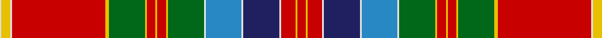

In pattern [RYRWBWBWGYRYRYGYRWYW](/patterns/ryrwbwbwgyryrygyrwyw/).

This was sourced from house-of-tartan.  It is a [20 stripes tartan](/stripes/stripes20/).

Original link http://www.house-of-tartan.scotland.net/house/TartanViewjs.asp?colr=Def&tnam=1724

## Thread count
LN/2 Y10 LN2 R104 Y4 G40 Y2 R10 Y2 R10 Y2 G40 LN2 B40 LN2 DB40 LN2 R16 Y2 R/10

## Palette
Each colour and its ΔE from the base-6 reference it is a variant of.

| Colour | Shade | Base | ΔE (OKLab) |
|---|---|---|---|
| B | <code style="background-color:#2888C4;">#2888C4</code> `#2888C4` | B <code style="background-color:#2A418A;">#2A418A</code> | 0.21 |
| DB | <code style="background-color:#202060;">#202060</code> `#202060` | B <code style="background-color:#2A418A;">#2A418A</code> | 0.11 |
| G | <code style="background-color:#006818;">#006818</code> `#006818` | G <code style="background-color:#006100;">#006100</code> | 0.02 |
| LN | <code style="background-color:#E0E0E0;">#E0E0E0</code> `#E0E0E0` | W <code style="background-color:#F7F7F7;">#F7F7F7</code> | 0.07 |
| R | <code style="background-color:#C80000;">#C80000</code> `#C80000` | R <code style="background-color:#CC0000;">#CC0000</code> | 0.01 |
| Y | <code style="background-color:#E8C000;">#E8C000</code> `#E8C000` | Y <code style="background-color:#F2BF00;">#F2BF00</code> | 0.02 |

## Nearest tartans

The nearest existing variants by ΔTartan distance.

1. [Whitworth](/setts/s20/r10y2r16w2b40w2ba40w2g40y2r10y2r10y2g40y4r104w2y10w2-b000050-ba8080d0-g008000-rc00000-we0e0e0-yf0c000/) — ΔT 0.31
1. [Mehrtens (Personal)](/setts/s16/w8b8r36ra8r2ra72k2ra8k12r4k12r12k4r12y8r4-b003c64-k101010-rc80000-ra848488-wf8f8f8-yfccc00/) — ΔT 0.91
1. [Mehrtens (Personal)](/setts/s16/w8b8r36ra8r2ra72k2ra8k12r4k12r12k4r12ka8r4-b003c64-k101010-ka000000-rc80000-ra848488-wf8f8f8/) — ΔT 0.99
1. [Mehrtens variant (Personal)](/setts/s14/w8b8r36ra8r2ra72k2ra8k12r4k12r12y8r4-b003c64-k101010-rc80000-ra848488-wf8f8f8-yfccc00/) — ΔT 1.08
1. [MacDougall of MacDougall](/setts/s24/b4ba20r6ra8g144ra14g8ra20bb48ba12r10ra8r10ba14g48ra48g48ra6bb6ra148ba14r10ra12b4-b3c82af-ba5a008c-bb2c4084-g005020-rc82828-radc0000/) — ΔT 1.10
1. [Chattan Clan Tartan Tartan Number: 1620. Earliest known date: pre 2003 This sett includes a brown stripe next to the yellow which does not appear in the records of Lord Lyon. The sett is similar in other respects. See products available Copyright © Blair Urquhart, Comrie, 2015](/setts/s19/r72k4w2g36w2ga4y4r6k2r6y4ga4w2b36k10r8y10ga4w4-b5c8ca8-g006818-ga604000-k101010-rc80000-we0e0e0-ye8c000/) — ΔT 1.12
1. [MacDougall, of MacDougall](/setts/s24/b4ba20r6ra8g144ra14g8ra20bb48ba12r10ra8r10ba14g48ra48g48ra6bb6ra148ba14r10ra12b4-b5480b0-ba800080-bb304080-g008000-rd03030-rac00000/) — ΔT 1.13
1. [Mehrtens variant (Personal)](/setts/s14/w8b8r36ra8r2ra72k2ra8k12r4k12r12ka8r4-b003c64-k101010-ka000000-rc80000-ra848488-wf8f8f8/) — ΔT 1.15
1. [Chattan (brown stripe variation)](/setts/s19/r72k4w2g36w2ra4y4r6k2r6y4ra4w2b36k10r8y10ra4w4-b3c82af-g005020-k101010-rdc0000-rabe7832-we0e0e0-ye8c000/) — ΔT 1.16
1. [Chattan](/setts/s19/r72k4w2g36w2ra4y4r6k2r6y4ra4w2b36k10r8y10ra4w4-b5480b0-g008000-k000000-rc00000-ra906030-we0e0e0-yf0c000/) — ΔT 1.16

## Neighbour map

Every grey dot is one of 15726 variants placed by the first two principal components of the ΔTartan feature space (44% of its variance). Red is this tartan; blue dots are its nearest — click one to open its page.

<svg viewBox="0 0 640 380" role="img" style="max-width:100%;height:auto;border:1px solid #e0e0e0;border-radius:4px;display:block" xmlns="http://www.w3.org/2000/svg"><image href="/nn/cloud.v1.png" width="640" height="380"/><a href="/setts/s20/r10y2r16w2b40w2ba40w2g40y2r10y2r10y2g40y4r104w2y10w2-b000050-ba8080d0-g008000-rc00000-we0e0e0-yf0c000/"><circle cx="234.6" cy="14.0" r="4" fill="#3465a4"><title>Whitworth</title></circle></a><a href="/setts/s16/w8b8r36ra8r2ra72k2ra8k12r4k12r12k4r12y8r4-b003c64-k101010-rc80000-ra848488-wf8f8f8-yfccc00/"><circle cx="230.3" cy="44.7" r="4" fill="#3465a4"><title>Mehrtens (Personal)</title></circle></a><a href="/setts/s16/w8b8r36ra8r2ra72k2ra8k12r4k12r12k4r12ka8r4-b003c64-k101010-ka000000-rc80000-ra848488-wf8f8f8/"><circle cx="226.1" cy="44.5" r="4" fill="#3465a4"><title>Mehrtens (Personal)</title></circle></a><a href="/setts/s14/w8b8r36ra8r2ra72k2ra8k12r4k12r12y8r4-b003c64-k101010-rc80000-ra848488-wf8f8f8-yfccc00/"><circle cx="245.4" cy="51.0" r="4" fill="#3465a4"><title>Mehrtens variant (Personal)</title></circle></a><a href="/setts/s24/b4ba20r6ra8g144ra14g8ra20bb48ba12r10ra8r10ba14g48ra48g48ra6bb6ra148ba14r10ra12b4-b3c82af-ba5a008c-bb2c4084-g005020-rc82828-radc0000/"><circle cx="244.4" cy="33.8" r="4" fill="#3465a4"><title>MacDougall of MacDougall</title></circle></a><a href="/setts/s19/r72k4w2g36w2ga4y4r6k2r6y4ga4w2b36k10r8y10ga4w4-b5c8ca8-g006818-ga604000-k101010-rc80000-we0e0e0-ye8c000/"><circle cx="199.1" cy="14.0" r="4" fill="#3465a4"><title>Chattan Clan Tartan Tartan Number: 1620. Earliest known date: pre 2003 This sett includes a brown stripe next to the yellow which does not appear in the records of Lord Lyon. The sett is similar in other respects. See products available Copyright © Blair Urquhart, Comrie, 2015</title></circle></a><a href="/setts/s24/b4ba20r6ra8g144ra14g8ra20bb48ba12r10ra8r10ba14g48ra48g48ra6bb6ra148ba14r10ra12b4-b5480b0-ba800080-bb304080-g008000-rd03030-rac00000/"><circle cx="246.3" cy="35.8" r="4" fill="#3465a4"><title>MacDougall, of MacDougall</title></circle></a><a href="/setts/s14/w8b8r36ra8r2ra72k2ra8k12r4k12r12ka8r4-b003c64-k101010-ka000000-rc80000-ra848488-wf8f8f8/"><circle cx="240.4" cy="50.5" r="4" fill="#3465a4"><title>Mehrtens variant (Personal)</title></circle></a><a href="/setts/s19/r72k4w2g36w2ra4y4r6k2r6y4ra4w2b36k10r8y10ra4w4-b3c82af-g005020-k101010-rdc0000-rabe7832-we0e0e0-ye8c000/"><circle cx="195.2" cy="14.0" r="4" fill="#3465a4"><title>Chattan (brown stripe variation)</title></circle></a><a href="/setts/s19/r72k4w2g36w2ra4y4r6k2r6y4ra4w2b36k10r8y10ra4w4-b5480b0-g008000-k000000-rc00000-ra906030-we0e0e0-yf0c000/"><circle cx="187.9" cy="14.0" r="4" fill="#3465a4"><title>Chattan</title></circle></a><circle cx="243.9" cy="17.5" r="5" fill="#c00000"/></svg>

ID: /setts/s20/r10y2r16w2b40w2ba40w2g40y2r10y2r10y2g40y4r104w2y10w2-b202060-ba2888c4-g006818-rc80000-we0e0e0-ye8c000/
