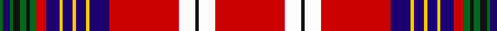

In pattern [GBGKGKGRBYBYBYBRWKWR](/patterns/gbgkgkgrbybybybrwkwr/).

This was sourced from tartans-authority.  It is a [20 stripes tartan](/stripes/stripes20/).

Original link http://www.tartansauthority.com/tartan-ferret/display/11057/

## Thread count
G/2 DB4 G2 K4 G4 K2 G4 R6 DB8 Y2 DB6 Y2 DB6 Y2 DB12 R42 W10 K2 W10 R/42

## Palette
Each colour and its ΔE from the base-6 reference it is a variant of.

| Colour | Shade | Base | ΔE (OKLab) |
|---|---|---|---|
| DB | <code style="background-color:#1C0070;">#1C0070</code> `#1C0070` | B <code style="background-color:#2A418A;">#2A418A</code> | 0.14 |
| G | <code style="background-color:#006818;">#006818</code> `#006818` | G <code style="background-color:#006100;">#006100</code> | 0.02 |
| K | <code style="background-color:#101010;">#101010</code> `#101010` | K <code style="background-color:#000000;">#000000</code> | 0.17 |
| R | <code style="background-color:#C80000;">#C80000</code> `#C80000` | R <code style="background-color:#CC0000;">#CC0000</code> | 0.01 |
| W | <code style="background-color:#FCFCFC;">#FCFCFC</code> `#FCFCFC` | W <code style="background-color:#F7F7F7;">#F7F7F7</code> | 0.01 |
| Y | <code style="background-color:#FCCC00;">#FCCC00</code> `#FCCC00` | Y <code style="background-color:#F2BF00;">#F2BF00</code> | 0.04 |

## Nearest tartans

The nearest existing variants by ΔTartan distance.

1. [McKee (Lone Star) (Personal), Dot](/setts/s20/r21w5k1w5r21b6y1b3y1b3y1b4r3g2k1g2k2g1b2g1x2~b1c0070-g006400-k101010-rdc0000-wfcfcfc-yfccc00/) — ΔT 0.25
1. [Strathclyde Fire Services (Corporate](/setts/s12/r37k3r7w3g3y3g2b10k6b3g3w4x2~b1c0070-g003820-k101010-rc80000-we0e0e0-yfccc00/) — ΔT 1.16
1. [Wood Dress](/setts/s23/k1w1k2g1k1g10b8r10g2r10g2r30g2r10g2r10b8g10k1g1k2y1k1x2~b0000cd-g008b00-k101010-rff0000-wffffff-yffe600/) — ΔT 1.17
1. [Stuart/Stewart of Appin #4](/setts/s15/r3g1r2g1r18k4y1k2w1b4g6r3k1r2w1x2~b2c4084-g005020-k101010-rdc0000-we0e0e0-ye8c000/) — ΔT 1.21
1. [Hawick (Trade Sett)](/setts/s20/w2k2w3g4r2k2y2k3b2r32b2k3y2k2r2g4w3k2w2r1x2~b3850c8-g006818-k101010-rc80000-wfcfcfc-ye8c000/) — ΔT 1.21
1. [Unidentified Lindley #4](/setts/s14/w3r30k4g2b17y3b2y3b17g2k4r30w3r2x2~b2c2c80-g006818-k101010-re86000-wfcfcfc-ye8c000/) — ΔT 1.22
1. [Stewart of Appin 5](/setts/s15/r3g1r2g1r18k4y1k2w1b4g6r3k1r2w1x2~b304080-g008000-k000000-rc00000-we0e0e0-yf0c000/) — ΔT 1.24
1. [MacKintosh #8](/setts/s19/r24k1w1g6w1g1y2r2k1r2y2g1w1b6k2r3y3g2w1x2~b3c82af-g005020-k101010-rdc0000-we0e0e0-ye8c000/) — ΔT 1.29
1. [Hebridean, North Uist](/setts/s24/b5r3w2b1w2r3g9y2w1y2g9r1g1r27b1r1b1r27b1r1b9w1b1w4x2~b000050-g008000-rc00000-we0e0e0-yf0c000/) — ΔT 1.30
1. [Unidentified Bedspread](/setts/s14/r20w6r100b15k10b15k40y5g54r15k5r15k6w8~b2c4084-g005020-k101010-rdc0000-we0e0e0-ye8c000/) — ΔT 1.30

## Neighbour map

Every grey dot is one of 15726 variants placed by the first two principal components of the ΔTartan feature space (44% of its variance). Red is this tartan; blue dots are its nearest — click one to open its page.

<svg viewBox="0 0 640 380" role="img" style="max-width:100%;height:auto;border:1px solid #e0e0e0;border-radius:4px;display:block" xmlns="http://www.w3.org/2000/svg"><image href="/nn/cloud.v1.png" width="640" height="380"/><a href="/setts/s20/r21w5k1w5r21b6y1b3y1b3y1b4r3g2k1g2k2g1b2g1x2~b1c0070-g006400-k101010-rdc0000-wfcfcfc-yfccc00/"><circle cx="241.8" cy="39.5" r="4" fill="#3465a4"><title>McKee (Lone Star) (Personal), Dot</title></circle></a><a href="/setts/s12/r37k3r7w3g3y3g2b10k6b3g3w4x2~b1c0070-g003820-k101010-rc80000-we0e0e0-yfccc00/"><circle cx="252.7" cy="73.6" r="4" fill="#3465a4"><title>Strathclyde Fire Services (Corporate</title></circle></a><a href="/setts/s23/k1w1k2g1k1g10b8r10g2r10g2r30g2r10g2r10b8g10k1g1k2y1k1x2~b0000cd-g008b00-k101010-rff0000-wffffff-yffe600/"><circle cx="276.4" cy="33.9" r="4" fill="#3465a4"><title>Wood Dress</title></circle></a><a href="/setts/s15/r3g1r2g1r18k4y1k2w1b4g6r3k1r2w1x2~b2c4084-g005020-k101010-rdc0000-we0e0e0-ye8c000/"><circle cx="281.3" cy="73.3" r="4" fill="#3465a4"><title>Stuart/Stewart of Appin #4</title></circle></a><a href="/setts/s20/w2k2w3g4r2k2y2k3b2r32b2k3y2k2r2g4w3k2w2r1x2~b3850c8-g006818-k101010-rc80000-wfcfcfc-ye8c000/"><circle cx="240.9" cy="14.0" r="4" fill="#3465a4"><title>Hawick (Trade Sett)</title></circle></a><a href="/setts/s14/w3r30k4g2b17y3b2y3b17g2k4r30w3r2x2~b2c2c80-g006818-k101010-re86000-wfcfcfc-ye8c000/"><circle cx="230.9" cy="83.9" r="4" fill="#3465a4"><title>Unidentified Lindley #4</title></circle></a><a href="/setts/s15/r3g1r2g1r18k4y1k2w1b4g6r3k1r2w1x2~b304080-g008000-k000000-rc00000-we0e0e0-yf0c000/"><circle cx="268.0" cy="72.4" r="4" fill="#3465a4"><title>Stewart of Appin 5</title></circle></a><a href="/setts/s19/r24k1w1g6w1g1y2r2k1r2y2g1w1b6k2r3y3g2w1x2~b3c82af-g005020-k101010-rdc0000-we0e0e0-ye8c000/"><circle cx="252.3" cy="31.0" r="4" fill="#3465a4"><title>MacKintosh #8</title></circle></a><a href="/setts/s24/b5r3w2b1w2r3g9y2w1y2g9r1g1r27b1r1b1r27b1r1b9w1b1w4x2~b000050-g008000-rc00000-we0e0e0-yf0c000/"><circle cx="296.5" cy="40.1" r="4" fill="#3465a4"><title>Hebridean, North Uist</title></circle></a><a href="/setts/s14/r20w6r100b15k10b15k40y5g54r15k5r15k6w8~b2c4084-g005020-k101010-rdc0000-we0e0e0-ye8c000/"><circle cx="224.6" cy="78.5" r="4" fill="#3465a4"><title>Unidentified Bedspread</title></circle></a><circle cx="242.9" cy="42.1" r="5" fill="#c00000"/></svg>

ID: /setts/s20/r21w5k1w5r21b6y1b3y1b3y1b4r3g2k1g2k2g1b2g1x2~b1c0070-g006818-k101010-rc80000-wfcfcfc-yfccc00/
