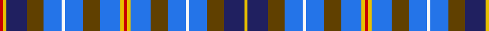

In pattern [RYBGBWBGBYRYBGBWBGBY](/patterns/rybgbwbgbyrybgbwbgby/).

This was sourced from register-of-tartans.  It is a [20 stripes tartan](/stripes/stripes20/).

Original link https://www.tartanregister.gov.uk/tartanDetails.aspx?ref=4898

## Thread count
R/6 Y6 DBa36 T30 B32 W6 B32 T30 B36 Y6 R6 Y6 B36 T30 B32 W6 B32 T30 DBa36 Y/6

## Palette
Each colour and its ΔE from the base-6 reference it is a variant of.

| Colour | Shade | Base | ΔE (OKLab) |
|---|---|---|---|
| B | <code style="background-color:#2474E8;">#2474E8</code> `#2474E8` | B <code style="background-color:#2A418A;">#2A418A</code> | 0.19 |
| DB | <code style="background-color:#2C2C80;">#2C2C80</code> `#2C2C80` | B <code style="background-color:#2A418A;">#2A418A</code> | 0.06 |
| DBa | <code style="background-color:#202060;">#202060</code> `#202060` | B <code style="background-color:#2A418A;">#2A418A</code> | 0.11 |
| DR | <code style="background-color:#441800;">#441800</code> `#441800` | B <code style="background-color:#2A418A;">#2A418A</code> | 0.23 |
| LN | <code style="background-color:#E0E0E0;">#E0E0E0</code> `#E0E0E0` | W <code style="background-color:#F7F7F7;">#F7F7F7</code> | 0.07 |
| LT | <code style="background-color:#A08858;">#A08858</code> `#A08858` | Y <code style="background-color:#F2BF00;">#F2BF00</code> | 0.21 |
| R | <code style="background-color:#C80000;">#C80000</code> `#C80000` | R <code style="background-color:#CC0000;">#CC0000</code> | 0.01 |
| T | <code style="background-color:#604000;">#604000</code> `#604000` | G <code style="background-color:#006100;">#006100</code> | 0.14 |
| W | <code style="background-color:#F8F8F8;">#F8F8F8</code> `#F8F8F8` | W <code style="background-color:#F7F7F7;">#F7F7F7</code> | 0.00 |
| Y | <code style="background-color:#E8C000;">#E8C000</code> `#E8C000` | Y <code style="background-color:#F2BF00;">#F2BF00</code> | 0.02 |

## Nearest tartans

The nearest existing variants by ΔTartan distance.

1. [Hirter Karo (Corporate)](/setts/s16/r3y3b18g15ba16w3ba16g15ba18y3r3y3ba18g15ba16w3~b202060-ba2474e8-g604000-rc80000-wf8f8f8-ye8c000~x2/) — ΔT 0.67
1. [MacLellan Blue McLellan Clan Tartan Tartan Number: 1224. Earliest known date: 1981 Dgn. J.R. McLellan, Edinburgh See products available Copyright © Blair Urquhart, Comrie, 2015](/setts/s16/k2w1b7k4r1b4r2b4w2b4r2b4r1g7w1y2~b2c2c80-g006818-k101010-rc80000-we0e0e0-ye8c000~x2/) — ΔT 1.27
1. [MacLellan/McLellan (Personal)](/setts/s16/k2w1b7k4r1b4r2b4w2b4r2b4r1g7w1y2~b2c2c80-g285800-k101010-rc80000-we0e0e0-ye8c000~x4/) — ΔT 1.32
1. [Healy (Suspect)](/setts/s20/b2w2ba7r4y8b4ba10w2b2ba9b2w2ba10b4y8r4ba7w2b2y2~b2c2c80-ba1870a4-rc80000-w98c8e8-ye8c000~x4/) — ΔT 1.33
1. [de Baseggio (Golden Bones)](/setts/s16/b4ba6g1w1r1ba6b4ba2y1ba1y1ba1y1ba2y3ba3~b5f749c-ba041b67-g649848-rca2625-wf9f5ef-ye0a126~x4/) — ΔT 1.40
1. [Weait (2016)](/setts/s24/b6w6ba7w2ba2w2ba7w6b6r2b6w6ba2w2ba2w2ba8w2ba2w2ba2w6b6wa2~b3c82af-ba1c1c50-rdc0000-w98c8e8-waffffff~x2/) — ΔT 1.53
1. [Encyclopaedia Britannica (Corporate)](/setts/s14/g12k5b18k5w5k5b18k3b6k3b6k5g12r5~b2c2c80-g408060-k101010-rc80000-wf8f8f8~x2/) — ΔT 1.55
1. [MacLellan, Blue McLellan](/setts/s16/k2w1b7k4r1b4r2b4w2b4r2b4r1g7w1y2~b304080-g008000-k000000-rc00000-we0e0e0-yf0c000~x2/) — ΔT 1.55
1. [De Baseggio (Personal)](/setts/s16/b4ba6g1w1r1ba6b4ba2y1ba1y1ba1y1ba2y3ba3~b1474b4-ba003c64-g006818-rc80000-wfcfcfc-ybc8c00~x4/) — ΔT 1.55
1. [Walker, Michael (Personal)](/setts/s22/b14ba6y2ba6b14ba14w2r3w2b14ba14b14ba14b14w2r3w2ba14b14ba6y2ba6~b2888c4-ba2c2c80-rb84c00-wfcfcfc-ye8c000~x2/) — ΔT 1.58

## Neighbour map

Every grey dot is one of 15726 variants placed by the first two principal components of the ΔTartan feature space (44% of its variance). Red is this tartan; blue dots are its nearest — click one to open its page.

<svg viewBox="0 0 640 380" role="img" style="max-width:100%;height:auto;border:1px solid #e0e0e0;border-radius:4px;display:block" xmlns="http://www.w3.org/2000/svg"><image href="/nn/cloud.v1.png" width="640" height="380"/><a href="/setts/s16/r3y3b18g15ba16w3ba16g15ba18y3r3y3ba18g15ba16w3~b202060-ba2474e8-g604000-rc80000-wf8f8f8-ye8c000~x2/"><circle cx="147.6" cy="168.7" r="4" fill="#3465a4"><title>Hirter Karo (Corporate)</title></circle></a><a href="/setts/s16/k2w1b7k4r1b4r2b4w2b4r2b4r1g7w1y2~b2c2c80-g006818-k101010-rc80000-we0e0e0-ye8c000~x2/"><circle cx="124.9" cy="159.4" r="4" fill="#3465a4"><title>MacLellan Blue McLellan Clan Tartan Tartan Number: 1224. Earliest known date: 1981 Dgn. J.R. McLellan, Edinburgh See products available Copyright © Blair Urquhart, Comrie, 2015</title></circle></a><a href="/setts/s16/k2w1b7k4r1b4r2b4w2b4r2b4r1g7w1y2~b2c2c80-g285800-k101010-rc80000-we0e0e0-ye8c000~x4/"><circle cx="126.9" cy="159.7" r="4" fill="#3465a4"><title>MacLellan/McLellan (Personal)</title></circle></a><a href="/setts/s20/b2w2ba7r4y8b4ba10w2b2ba9b2w2ba10b4y8r4ba7w2b2y2~b2c2c80-ba1870a4-rc80000-w98c8e8-ye8c000~x4/"><circle cx="123.5" cy="176.0" r="4" fill="#3465a4"><title>Healy (Suspect)</title></circle></a><a href="/setts/s16/b4ba6g1w1r1ba6b4ba2y1ba1y1ba1y1ba2y3ba3~b5f749c-ba041b67-g649848-rca2625-wf9f5ef-ye0a126~x4/"><circle cx="179.8" cy="160.9" r="4" fill="#3465a4"><title>de Baseggio (Golden Bones)</title></circle></a><a href="/setts/s24/b6w6ba7w2ba2w2ba7w6b6r2b6w6ba2w2ba2w2ba8w2ba2w2ba2w6b6wa2~b3c82af-ba1c1c50-rdc0000-w98c8e8-waffffff~x2/"><circle cx="64.6" cy="181.1" r="4" fill="#3465a4"><title>Weait (2016)</title></circle></a><a href="/setts/s14/g12k5b18k5w5k5b18k3b6k3b6k5g12r5~b2c2c80-g408060-k101010-rc80000-wf8f8f8~x2/"><circle cx="146.9" cy="195.9" r="4" fill="#3465a4"><title>Encyclopaedia Britannica (Corporate)</title></circle></a><a href="/setts/s16/k2w1b7k4r1b4r2b4w2b4r2b4r1g7w1y2~b304080-g008000-k000000-rc00000-we0e0e0-yf0c000~x2/"><circle cx="114.1" cy="155.8" r="4" fill="#3465a4"><title>MacLellan, Blue McLellan</title></circle></a><a href="/setts/s16/b4ba6g1w1r1ba6b4ba2y1ba1y1ba1y1ba2y3ba3~b1474b4-ba003c64-g006818-rc80000-wfcfcfc-ybc8c00~x4/"><circle cx="205.9" cy="174.0" r="4" fill="#3465a4"><title>De Baseggio (Personal)</title></circle></a><a href="/setts/s22/b14ba6y2ba6b14ba14w2r3w2b14ba14b14ba14b14w2r3w2ba14b14ba6y2ba6~b2888c4-ba2c2c80-rb84c00-wfcfcfc-ye8c000~x2/"><circle cx="193.7" cy="175.9" r="4" fill="#3465a4"><title>Walker, Michael (Personal)</title></circle></a><circle cx="116.5" cy="162.9" r="5" fill="#c00000"/></svg>

ID: /setts/s20/r3y3b18g15ba16w3ba16g15ba18y3r3y3ba18g15ba16w3ba16g15b18y3~b202060-ba2474e8-g604000-rc80000-wf8f8f8-ye8c000~x2/
