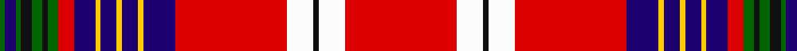

In pattern [GBGKGKGRBYBYBYBRWKWR](/patterns/gbgkgkgrbybybybrwkwr/).

This was sourced from register-of-tartans.  It is a [20 stripes tartan](/stripes/stripes20/).

Original link https://www.tartanregister.gov.uk/tartanDetails.aspx?ref=11057

## Thread count
G/2 DB4 G2 K4 G4 K2 G4 R6 DB8 Y2 DB6 Y2 DB6 Y2 DB12 R42 W10 K2 W10 R/42

## Palette
Each colour and its ΔE from the base-6 reference it is a variant of.

| Colour | Shade | Base | ΔE (OKLab) |
|---|---|---|---|
| DB | <code style="background-color:#1C0070;">#1C0070</code> `#1C0070` | B <code style="background-color:#2C4084;">#2C4084</code> | 0.14 |
| G | <code style="background-color:#006400;">#006400</code> `#006400` | G <code style="background-color:#006400;">#006400</code> | 0.00 |
| K | <code style="background-color:#101010;">#101010</code> `#101010` | K <code style="background-color:#000000;">#000000</code> | 0.17 |
| R | <code style="background-color:#DC0000;">#DC0000</code> `#DC0000` | R <code style="background-color:#C80000;">#C80000</code> | 0.04 |
| W | <code style="background-color:#FCFCFC;">#FCFCFC</code> `#FCFCFC` | W <code style="background-color:#F4F4F0;">#F4F4F0</code> | 0.03 |
| Y | <code style="background-color:#FCCC00;">#FCCC00</code> `#FCCC00` | Y <code style="background-color:#E8C000;">#E8C000</code> | 0.04 |

ID: /setts/s20/r42w10k2w10r42b12y2b6y2b6y2b8r6g4k2g4k4g2b4g2-b1c0070-g006400-k101010-rdc0000-wfcfcfc-yfccc00/
