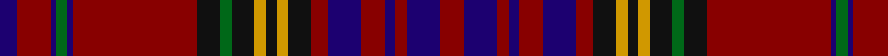

In pattern [BRBGBRKGKYKYKRBRBRBR](/patterns/brbgbrkgkykykrbrbrbr/).

This was sourced from register-of-tartans.  It is a [20 stripes tartan](/stripes/stripes20/).

Original link https://www.tartanregister.gov.uk/tartanDetails.aspx?ref=5189

## Attestations

This cloth appears in 2 source records; the oldest owns this page.

- 01/01/1993 — Anderson of Kinnedear Red (register-of-tartans, [record](https://www.tartanregister.gov.uk/tartanDetails.aspx?ref=5189))
- 1993 — Anderson of Kinnedear Red (Clan) (tartans-authority, [record](http://www.tartansauthority.com/tartan-ferret/display/3015/))

## Thread count
DB/6 DR12 DB2 G4 DB2 DR44 K8 G4 K8 DY4 K4 DY4 K8 DR6 DB12 DR8 DB4 DR4 DB12 DR/8

## Palette
Each colour and its ΔE from the base-6 reference it is a variant of.

| Colour | Shade | Base | ΔE (OKLab) |
|---|---|---|---|
| DB | <code style="background-color:#1C0070;">#1C0070</code> `#1C0070` | B <code style="background-color:#2A418A;">#2A418A</code> | 0.14 |
| DR | <code style="background-color:#880000;">#880000</code> `#880000` | R <code style="background-color:#CC0000;">#CC0000</code> | 0.15 |
| DY | <code style="background-color:#D09800;">#D09800</code> `#D09800` | Y <code style="background-color:#F2BF00;">#F2BF00</code> | 0.12 |
| G | <code style="background-color:#006818;">#006818</code> `#006818` | G <code style="background-color:#006100;">#006100</code> | 0.02 |
| K | <code style="background-color:#101010;">#101010</code> `#101010` | K <code style="background-color:#000000;">#000000</code> | 0.17 |

## Nearest tartans

The nearest existing variants by ΔTartan distance.

1. [Kormylo (Personal)](/setts/s22/r9b3g12r2b40r2g20b2r18b2w2b2r18b2g20r2b40r2g12b3r9y2x2~b202060-g003820-rc80000-wfcfcfc-ye8c000/) — ΔT 1.09
1. [Royal Bahrain (Royal)](/setts/s18/b16r1b2r3b1r9b1r3b2r1b6g3w3g5r28wa3r3wa3x2~b003c64-g005430-r880000-w98c8e8-wae0e0e0/) — ΔT 1.11
1. [Gwyn of Wales](/setts/s20/k3r30k2r4k2r30k3b30k35w2k35b30k3r30k2r4k2r30k3w2~b202060-k101010-r901c38-we0e0e0/) — ΔT 1.24
1. [Westmeath County Crest (Fashion)](/setts/s16/r4k1b8k1y3k2b4y6b4w3k2b20k4r21k1y3x2~b1c1c50-k101010-r880000-we0e0e0-ybc8c00/) — ΔT 1.26
1. [Murray of Tullibardine - 1820 (Clan)](/setts/s21/b7r2b2r5b24r6b2r2k8r2b2r50b50r10g10r50g50r30b22r24k3~b202060-g006438-k101010-rc80000/) — ΔT 1.26
1. [Strathdon](/setts/s15/w3y8b2y8ba11b2y4r4b27ba1b2ba2b2ba13b2x2~b4d1a3a-ba401a4f-r7c0000-wd8e9ff-yda8d24/) — ΔT 1.35
1. [Murray of Tullibardine](/setts/s21/b2r1b1r2b4r2b1r1k2r1b1r24b12r2g2r8g12r4b2r2k1x2~b000052-g11450d-k000000-raa0000/) — ΔT 1.35
1. [Murray of Tullibardine](/setts/s21/b2r1b1r2b4r2b1r1k2r1b1r24b12r2g2r8g12r4b2r2k1~b000052-g11450d-k000000-raa0000/) — ΔT 1.35
1. [Heirloom Red Alba](/setts/s16/r4y2r34b10g4b4ba4b23w3b23ba4b4g4b10r34y2x2~b202060-ba2888c4-g5c6428-ra00000-we0e0e0-ye8c000/) — ΔT 1.40
1. [Hunter of Bute (Personal)](/setts/s16/r12g6k6g2k1g1k6r24w2r24k6g1k1g2k6g6x2~g006818-k101010-r901c38-wf8f8f8/) — ΔT 1.40

## Neighbour map

Every grey dot is one of 15726 variants placed by the first two principal components of the ΔTartan feature space (44% of its variance). Red is this tartan; blue dots are its nearest — click one to open its page.

<svg viewBox="0 0 640 380" role="img" style="max-width:100%;height:auto;border:1px solid #e0e0e0;border-radius:4px;display:block" xmlns="http://www.w3.org/2000/svg"><image href="/nn/cloud.v1.png" width="640" height="380"/><a href="/setts/s22/r9b3g12r2b40r2g20b2r18b2w2b2r18b2g20r2b40r2g12b3r9y2x2~b202060-g003820-rc80000-wfcfcfc-ye8c000/"><circle cx="246.8" cy="99.2" r="4" fill="#3465a4"><title>Kormylo (Personal)</title></circle></a><a href="/setts/s18/b16r1b2r3b1r9b1r3b2r1b6g3w3g5r28wa3r3wa3x2~b003c64-g005430-r880000-w98c8e8-wae0e0e0/"><circle cx="312.2" cy="82.1" r="4" fill="#3465a4"><title>Royal Bahrain (Royal)</title></circle></a><a href="/setts/s20/k3r30k2r4k2r30k3b30k35w2k35b30k3r30k2r4k2r30k3w2~b202060-k101010-r901c38-we0e0e0/"><circle cx="296.3" cy="140.3" r="4" fill="#3465a4"><title>Gwyn of Wales</title></circle></a><a href="/setts/s16/r4k1b8k1y3k2b4y6b4w3k2b20k4r21k1y3x2~b1c1c50-k101010-r880000-we0e0e0-ybc8c00/"><circle cx="221.8" cy="103.8" r="4" fill="#3465a4"><title>Westmeath County Crest (Fashion)</title></circle></a><a href="/setts/s21/b7r2b2r5b24r6b2r2k8r2b2r50b50r10g10r50g50r30b22r24k3~b202060-g006438-k101010-rc80000/"><circle cx="309.5" cy="105.8" r="4" fill="#3465a4"><title>Murray of Tullibardine - 1820 (Clan)</title></circle></a><a href="/setts/s15/w3y8b2y8ba11b2y4r4b27ba1b2ba2b2ba13b2x2~b4d1a3a-ba401a4f-r7c0000-wd8e9ff-yda8d24/"><circle cx="243.4" cy="96.5" r="4" fill="#3465a4"><title>Strathdon</title></circle></a><a href="/setts/s21/b2r1b1r2b4r2b1r1k2r1b1r24b12r2g2r8g12r4b2r2k1x2~b000052-g11450d-k000000-raa0000/"><circle cx="338.4" cy="93.5" r="4" fill="#3465a4"><title>Murray of Tullibardine</title></circle></a><a href="/setts/s21/b2r1b1r2b4r2b1r1k2r1b1r24b12r2g2r8g12r4b2r2k1~b000052-g11450d-k000000-raa0000/"><circle cx="338.4" cy="93.5" r="4" fill="#3465a4"><title>Murray of Tullibardine</title></circle></a><a href="/setts/s16/r4y2r34b10g4b4ba4b23w3b23ba4b4g4b10r34y2x2~b202060-ba2888c4-g5c6428-ra00000-we0e0e0-ye8c000/"><circle cx="248.2" cy="104.2" r="4" fill="#3465a4"><title>Heirloom Red Alba</title></circle></a><a href="/setts/s16/r12g6k6g2k1g1k6r24w2r24k6g1k1g2k6g6x2~g006818-k101010-r901c38-wf8f8f8/"><circle cx="357.1" cy="125.1" r="4" fill="#3465a4"><title>Hunter of Bute (Personal)</title></circle></a><circle cx="286.2" cy="103.0" r="5" fill="#c00000"/></svg>

ID: /setts/s20/r4b6r2b2r4b6r3k4y2k2y2k4g2k4r22b1g2b1r6b3x2~b1c0070-g006818-k101010-r880000-yd09800/
