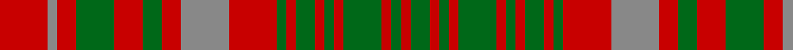

In pattern [GRGRGRGRGRGRRRGRGRRR](/stripes/grgrgrgrgrgrrrgrgrrr/).

This was sourced from house-of-tartan.  It is a [20 stripe tartan](/stripes/stripes20/).

Original link http://www.house-of-tartan.scotland.net/house/TartanViewjs.asp?colr=Def&tnam=966

## Also known as

This cloth is also recorded under:

- MacIntosh Old Ancient Artifact
- MacIntosh, Ancient

## Thread count
R/10 N2 R4 G8 R6 G4 R4 N10 R10 G2 R2 G4 R2 G2 R2 G8 R2 G2 R2 G/4

## Palette
Each colour and the base-6 reference it is a variant of.

| Colour | Shade | Base |
|---|---|---|
| G | <code style="background-color:#006818;">#006818</code> `oklch(45.0% 0.142 145.0)` <small>#006818</small> | G <code style="background-color:#006100;">#006100</code> |
| N | <code style="background-color:#888888;">#888888</code> `oklch(62.7% 0.000 89.9)` <small>#888888</small> | R <code style="background-color:#CC0000;">#CC0000</code> |
| R | <code style="background-color:#C80000;">#C80000</code> `oklch(52.3% 0.215 29.2)` <small>#C80000</small> | R <code style="background-color:#CC0000;">#CC0000</code> |

## Nearest tartans

The nearest existing variants by ΔTartan distance, with this tartan at the top so the swatches line up against it.

ΔTartan

Tartan

Sett

—

<a href="/ttd/edit/#slug=r5o1r2g4r3g2r2o5r5g1r1g2r1g1r1g4r1g1r1g2~x2">MacIntosh Old Ancient Artifact Tartan Tartan Number: 966. Earliest known date: pre 2003 The name 'MacKintosh' is usually spelled with a 'K'. In this instance the tartan sample is labelled MacIntosh. See products available Copyright © Blair Urquhart, Comrie, 2015</a> <a class="nn-out" href="/setts/s20/r5o1r2g4r3g2r2o5r5g1r1g2r1g1r1g4r1g1r1g2~x2/" title="open its dictionary page">↗</a>

0.30

<a href="/ttd/edit/#slug=r5o1r2dg4r3dg2r2o5r5dg1r1dg2r1dg1r1dg4r1dg1r1dg2~x2">MacIntosh Ancient</a> <a class="nn-out" href="/setts/s20/r5o1r2dg4r3dg2r2o5r5dg1r1dg2r1dg1r1dg4r1dg1r1dg2~x2/" title="open its dictionary page">↗</a>

0.34

<a href="/ttd/edit/#slug=r5y1r2g4r3g2r2y5r5g1r1g2r1g1r1g4r1g1r1g2~x2">MacIntosh, Ancient</a> <a class="nn-out" href="/setts/s20/r5y1r2g4r3g2r2y5r5g1r1g2r1g1r1g4r1g1r1g2~x2/" title="open its dictionary page">↗</a>

1.36

<a href="/ttd/edit/#slug=r8g10r2g10r9g3r4g4r10ly3r3g10r3~x2">MacRurie/MacRory</a> <a class="nn-out" href="/setts/s13/r8g10r2g10r9g3r4g4r10ly3r3g10r3~x2/" title="open its dictionary page">↗</a>

1.40

<a href="/ttd/edit/#slug=r12g14r4g14r4g14r4db8r5db8r12g3r12~x2">Grant of Monymusk</a> <a class="nn-out" href="/setts/s13/r12g14r4g14r4g14r4db8r5db8r12g3r12~x2/" title="open its dictionary page">↗</a>

1.57

<a href="/ttd/edit/#slug=r8g2r2g6r1g6r2g2r8ly1r8g2r2g6r1g6r2g2r8w1~x4">Bruce (VS) Clan Tartan Tartan Number: 1848. Earliest known date: 1842 The design comes from the Vestiarium Scoticum, and is approved by Lord Bruce, Earl of Elgin. Much doubt has been cast on the authority of the Vestiarium, but in this case Lord Bruce believes he has independant evidence of the tartan dating back to 1571. The original document was a chart of the weavers threadcount which is now lost. The chart included black 'guards' on the yellow and white stripes and Lord Bruce has adopted this variation as his personal tartan. Writing in 1967, Lord Bruce also states that the Elgin family also wear the Bruce of Kinnaird for 'undress' or day wear, a wholly different tartan similar to the Prince Charles Edward. See products available Copyright © Blair Urquhart, Comrie, 2015</a> <a class="nn-out" href="/setts/s20/r8g2r2g6r1g6r2g2r8ly1r8g2r2g6r1g6r2g2r8w1~x4/" title="open its dictionary page">↗</a>

1.58

<a href="/ttd/edit/#slug=r2g2r12db10t3g10r2g2r2g10r12g2r2~x2">Matheson</a> <a class="nn-out" href="/setts/s13/r2g2r12db10t3g10r2g2r2g10r12g2r2~x2/" title="open its dictionary page">↗</a>

1.62

<a href="/ttd/edit/#slug=r5db3r3g16r3g3r3db5r3y5r12db5r3db3r5~x4">Grant of Ballindalloch (Personal)</a> <a class="nn-out" href="/setts/s15/r5db3r3g16r3g3r3db5r3y5r12db5r3db3r5~x4/" title="open its dictionary page">↗</a>

1.64

<a href="/ttd/edit/#slug=r10g12r3g12r12g4r5g5r12ly4r5g12r4~x2">MacRurie, MacRory</a> <a class="nn-out" href="/setts/s13/r10g12r3g12r12g4r5g5r12ly4r5g12r4~x2/" title="open its dictionary page">↗</a>

1.65

<a href="/ttd/edit/#slug=r1t1r6db3r1g6r1g6r6db1r1t1~x2">MacQuarrie 4</a> <a class="nn-out" href="/setts/s12/r1t1r6db3r1g6r1g6r6db1r1t1~x2/" title="open its dictionary page">↗</a>

1.68

<a href="/ttd/edit/#slug=lr1r4dg1r1dg3r1dg3r1dg1r4ly1~x2">Bruce</a> <a class="nn-out" href="/setts/s11/lr1r4dg1r1dg3r1dg3r1dg1r4ly1~x2/" title="open its dictionary page">↗</a>

## Neighbour map

Every grey dot is one of 14299 variants placed by the first two principal components of the ΔTartan feature space (44% of its variance). Red is this tartan; blue dots are its nearest — click one to open its page.

<svg viewBox="0 0 640 380" role="img" style="max-width:100%;height:auto;border:1px solid #e0e0e0;border-radius:4px;display:block" xmlns="http://www.w3.org/2000/svg"><image href="/nn/cloud.v1.png" width="640" height="380"/><a href="/setts/s20/r5o1r2dg4r3dg2r2o5r5dg1r1dg2r1dg1r1dg4r1dg1r1dg2~x2/"><circle cx="266.0" cy="222.5" r="4" fill="#3465a4"><title>MacIntosh Ancient</title></circle></a><a href="/setts/s20/r5y1r2g4r3g2r2y5r5g1r1g2r1g1r1g4r1g1r1g2~x2/"><circle cx="258.2" cy="221.3" r="4" fill="#3465a4"><title>MacIntosh, Ancient</title></circle></a><a href="/setts/s13/r8g10r2g10r9g3r4g4r10ly3r3g10r3~x2/"><circle cx="268.8" cy="249.3" r="4" fill="#3465a4"><title>MacRurie/MacRory</title></circle></a><a href="/setts/s13/r12g14r4g14r4g14r4db8r5db8r12g3r12~x2/"><circle cx="219.4" cy="257.2" r="4" fill="#3465a4"><title>Grant of Monymusk</title></circle></a><a href="/setts/s20/r8g2r2g6r1g6r2g2r8ly1r8g2r2g6r1g6r2g2r8w1~x4/"><circle cx="308.2" cy="179.5" r="4" fill="#3465a4"><title>Bruce (VS) Clan Tartan Tartan Number: 1848. Earliest known date: 1842 The design comes from the Vestiarium Scoticum, and is approved by Lord Bruce, Earl of Elgin. Much doubt has been cast on the authority of the Vestiarium, but in this case Lord Bruce believes he has independant evidence of the tartan dating back to 1571. The original document was a chart of the weavers threadcount which is now lost. The chart included black 'guards' on the yellow and white stripes and Lord Bruce has adopted this variation as his personal tartan. Writing in 1967, Lord Bruce also states that the Elgin family also wear the Bruce of Kinnaird for 'undress' or day wear, a wholly different tartan similar to the Prince Charles Edward. See products available Copyright © Blair Urquhart, Comrie, 2015</title></circle></a><a href="/setts/s13/r2g2r12db10t3g10r2g2r2g10r12g2r2~x2/"><circle cx="226.4" cy="200.3" r="4" fill="#3465a4"><title>Matheson</title></circle></a><a href="/setts/s15/r5db3r3g16r3g3r3db5r3y5r12db5r3db3r5~x4/"><circle cx="216.3" cy="200.4" r="4" fill="#3465a4"><title>Grant of Ballindalloch (Personal)</title></circle></a><a href="/setts/s13/r10g12r3g12r12g4r5g5r12ly4r5g12r4~x2/"><circle cx="255.6" cy="260.4" r="4" fill="#3465a4"><title>MacRurie, MacRory</title></circle></a><a href="/setts/s12/r1t1r6db3r1g6r1g6r6db1r1t1~x2/"><circle cx="240.1" cy="200.6" r="4" fill="#3465a4"><title>MacQuarrie 4</title></circle></a><a href="/setts/s11/lr1r4dg1r1dg3r1dg3r1dg1r4ly1~x2/"><circle cx="263.4" cy="239.9" r="4" fill="#3465a4"><title>Bruce</title></circle></a><circle cx="260.1" cy="221.0" r="5" fill="#c00000"/></svg>

ID: /setts/s20/r5o1r2g4r3g2r2o5r5g1r1g2r1g1r1g4r1g1r1g2~x2/
