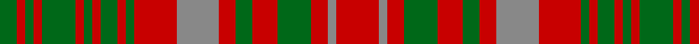

In pattern [GRGRGRGRGRGRRRGRGRRR](/patterns/grgrgrgrgrgrrrgrgrrr/).

This was sourced from house-of-tartan.  It is a [20 stripes tartan](/stripes/stripes20/).

Original link http://www.house-of-tartan.scotland.net/house/TartanViewjs.asp?colr=Def&tnam=966

## Thread count
G/4 R2 G2 R2 G8 R2 G2 R2 G4 R2 G2 R10 N10 R4 G4 R6 G8 R4 N2 R/10

## Palette
Each colour and its ΔE from the base-6 reference it is a variant of.

| Colour | Shade | Base | ΔE (OKLab) |
|---|---|---|---|
| G | <code style="background-color:#006818;">#006818</code> `#006818` | G <code style="background-color:#006100;">#006100</code> | 0.02 |
| N | <code style="background-color:#888888;">#888888</code> `#888888` | R <code style="background-color:#CC0000;">#CC0000</code> | 0.24 |
| R | <code style="background-color:#C80000;">#C80000</code> `#C80000` | R <code style="background-color:#CC0000;">#CC0000</code> | 0.01 |

## Nearest tartans

The nearest existing variants by ΔTartan distance.

1. [MacIntosh Ancient](/setts/s20/r5ra1r2g4r3g2r2ra5r5g1r1g2r1g1r1g4r1g1r1g2x2~g285800-rc80000-ra888888/) — ΔT 0.30
1. [MacIntosh, Ancient](/setts/s20/r5g1r2ga4r3ga2r2g5r5ga1r1ga2r1ga1r1ga4r1ga1r1ga2x2~g808080-ga008000-rc00000/) — ΔT 0.34
1. [MacRurie/MacRory](/setts/s13/r8g10r2g10r9g3r4g4r10y3r3g10r3x2~g006818-rc80000-ye8c000/) — ΔT 1.36
1. [Grant of Monymusk](/setts/s13/r12g14r4g14r4g14r4b8r5b8r12g3r12x2~b304080-g008000-rc00000/) — ΔT 1.40
1. [MacRurie MacRory Tartan Tartan Number: 1498. Earliest known date: pre 2003 This sample comes from the MacGregor-Hastie collection which forms the basis of the cloth archive of the Scottish Tartans Society. Some of the samples, including this one, were unmarked. One can assume that the sample dates between 1930 and 1950. See products available Copyright © Blair Urquhart, Comrie, 2015](/setts/s13/r10g12r3g12r12g4r5g5r12y4r5g12r4x2~g006818-rc80000-ye8c000/) — ΔT 1.51
1. [Bruce (VS) Clan Tartan Tartan Number: 1848. Earliest known date: 1842 The design comes from the Vestiarium Scoticum, and is approved by Lord Bruce, Earl of Elgin. Much doubt has been cast on the authority of the Vestiarium, but in this case Lord Bruce believes he has independant evidence of the tartan dating back to 1571. The original document was a chart of the weavers threadcount which is now lost. The chart included black 'guards' on the yellow and white stripes and Lord Bruce has adopted this variation as his personal tartan. Writing in 1967, Lord Bruce also states that the Elgin family also wear the Bruce of Kinnaird for 'undress' or day wear, a wholly different tartan similar to the Prince Charles Edward. See products available Copyright © Blair Urquhart, Comrie, 2015](/setts/s20/r8g2r2g6r1g6r2g2r8y1r8g2r2g6r1g6r2g2r8w1x4~g006818-rc80000-we0e0e0-ye8c000/) — ΔT 1.57
1. [Matheson](/setts/s13/r2g2r12b10ba3g10r2g2r2g10r12g2r2x2~b304080-ba5480b0-g008000-rc00000/) — ΔT 1.58
1. [Grant of Ballindalloch (Personal)](/setts/s15/r5b3r3g16r3g3r3b5r3ga5r12b5r3b3r5x4~b2c2c80-g006818-ga789484-rc80000/) — ΔT 1.61
1. [MacRurie, MacRory](/setts/s13/r10g12r3g12r12g4r5g5r12y4r5g12r4x2~g008000-rc00000-yf0c000/) — ΔT 1.64
1. [MacQuarrie 4](/setts/s12/b1r1ba1r6g6r1g6r1ba3r6b1r1x2~b5480b0-ba304080-g008000-rc00000/) — ΔT 1.65

## Neighbour map

Every grey dot is one of 15726 variants placed by the first two principal components of the ΔTartan feature space (44% of its variance). Red is this tartan; blue dots are its nearest — click one to open its page.

<svg viewBox="0 0 640 380" role="img" style="max-width:100%;height:auto;border:1px solid #e0e0e0;border-radius:4px;display:block" xmlns="http://www.w3.org/2000/svg"><image href="/nn/cloud.v1.png" width="640" height="380"/><a href="/setts/s20/r5ra1r2g4r3g2r2ra5r5g1r1g2r1g1r1g4r1g1r1g2x2~g285800-rc80000-ra888888/"><circle cx="265.9" cy="220.7" r="4" fill="#3465a4"><title>MacIntosh Ancient</title></circle></a><a href="/setts/s20/r5g1r2ga4r3ga2r2g5r5ga1r1ga2r1ga1r1ga4r1ga1r1ga2x2~g808080-ga008000-rc00000/"><circle cx="257.9" cy="219.6" r="4" fill="#3465a4"><title>MacIntosh, Ancient</title></circle></a><a href="/setts/s13/r8g10r2g10r9g3r4g4r10y3r3g10r3x2~g006818-rc80000-ye8c000/"><circle cx="268.5" cy="250.5" r="4" fill="#3465a4"><title>MacRurie/MacRory</title></circle></a><a href="/setts/s13/r12g14r4g14r4g14r4b8r5b8r12g3r12x2~b304080-g008000-rc00000/"><circle cx="218.5" cy="257.2" r="4" fill="#3465a4"><title>Grant of Monymusk</title></circle></a><a href="/setts/s13/r10g12r3g12r12g4r5g5r12y4r5g12r4x2~g006818-rc80000-ye8c000/"><circle cx="260.3" cy="263.4" r="4" fill="#3465a4"><title>MacRurie MacRory Tartan Tartan Number: 1498. Earliest known date: pre 2003 This sample comes from the MacGregor-Hastie collection which forms the basis of the cloth archive of the Scottish Tartans Society. Some of the samples, including this one, were unmarked. One can assume that the sample dates between 1930 and 1950. See products available Copyright © Blair Urquhart, Comrie, 2015</title></circle></a><a href="/setts/s20/r8g2r2g6r1g6r2g2r8y1r8g2r2g6r1g6r2g2r8w1x4~g006818-rc80000-we0e0e0-ye8c000/"><circle cx="308.2" cy="180.2" r="4" fill="#3465a4"><title>Bruce (VS) Clan Tartan Tartan Number: 1848. Earliest known date: 1842 The design comes from the Vestiarium Scoticum, and is approved by Lord Bruce, Earl of Elgin. Much doubt has been cast on the authority of the Vestiarium, but in this case Lord Bruce believes he has independant evidence of the tartan dating back to 1571. The original document was a chart of the weavers threadcount which is now lost. The chart included black 'guards' on the yellow and white stripes and Lord Bruce has adopted this variation as his personal tartan. Writing in 1967, Lord Bruce also states that the Elgin family also wear the Bruce of Kinnaird for 'undress' or day wear, a wholly different tartan similar to the Prince Charles Edward. See products available Copyright © Blair Urquhart, Comrie, 2015</title></circle></a><a href="/setts/s13/r2g2r12b10ba3g10r2g2r2g10r12g2r2x2~b304080-ba5480b0-g008000-rc00000/"><circle cx="225.3" cy="199.0" r="4" fill="#3465a4"><title>Matheson</title></circle></a><a href="/setts/s15/r5b3r3g16r3g3r3b5r3ga5r12b5r3b3r5x4~b2c2c80-g006818-ga789484-rc80000/"><circle cx="215.4" cy="199.7" r="4" fill="#3465a4"><title>Grant of Ballindalloch (Personal)</title></circle></a><a href="/setts/s13/r10g12r3g12r12g4r5g5r12y4r5g12r4x2~g008000-rc00000-yf0c000/"><circle cx="255.4" cy="262.1" r="4" fill="#3465a4"><title>MacRurie, MacRory</title></circle></a><a href="/setts/s12/b1r1ba1r6g6r1g6r1ba3r6b1r1x2~b5480b0-ba304080-g008000-rc00000/"><circle cx="239.1" cy="199.6" r="4" fill="#3465a4"><title>MacQuarrie 4</title></circle></a><circle cx="259.8" cy="219.4" r="5" fill="#c00000"/></svg>

ID: /setts/s20/r5ra1r2g4r3g2r2ra5r5g1r1g2r1g1r1g4r1g1r1g2x2~g006818-rc80000-ra888888/
