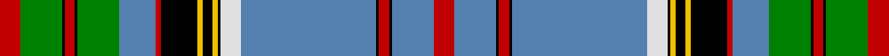

In pattern [RBKRKBWKYKYKRBGKRKGR](/stripes/rbkrkbwkykykrbgkrkgr/).

This was sourced from weddslist.  It is a [20 stripe tartan](/stripes/stripes20/).

Original link http://www.weddslist.com/cgi-bin/tartans/pg.pl?source=sts

## Also known as

This cloth is also recorded under:

- Anderson, Old

## Attestations

This cloth appears in 2 source records; the oldest owns this page.

- undated — Anderson, Old (weddslist, [record](http://www.weddslist.com/cgi-bin/tartans/pg.pl?source=sts))
- undated — Anderson Old Tartan Tartan Number: 1347. Earliest known date: pre 2003 Nothing See products available Copyright © Blair Urquhart, Comrie, 2015 (house-of-tartan, [record](http://www.house-of-tartan.scotland.net/house/TartanViewjs.asp?colr=Def&tnam=1347))

## Thread count
R/16 G32 K2 R8 K2 G32 B28 R4 K28 Y4 K8 Y4 K2 LN16 B104 K2 R8 K2 B32 R/16

## Palette
Each colour and the base-6 reference it is a variant of.

| Colour | Shade | Base |
|---|---|---|
| B | <code style="background-color:#5480B0;">#5480B0</code> `oklch(58.8% 0.089 251.5)` <small>#5480B0</small> | B <code style="background-color:#2A418A;">#2A418A</code> |
| G | <code style="background-color:#008000;">#008000</code> `oklch(52.0% 0.177 142.5)` <small>#008000</small> | G <code style="background-color:#006100;">#006100</code> |
| K | <code style="background-color:#000000;">#000000</code> `oklch(0.0% 0.000 0.0)` <small>#000000</small> | K <code style="background-color:#000000;">#000000</code> |
| LN | <code style="background-color:#E0E0E0;">#E0E0E0</code> `oklch(90.7% 0.000 89.9)` <small>#E0E0E0</small> | W <code style="background-color:#F7F7F7;">#F7F7F7</code> |
| R | <code style="background-color:#C00000;">#C00000</code> `oklch(50.7% 0.208 29.2)` <small>#C00000</small> | R <code style="background-color:#CC0000;">#CC0000</code> |
| Y | <code style="background-color:#F0C000;">#F0C000</code> `oklch(82.7% 0.169 90.5)` <small>#F0C000</small> | Y <code style="background-color:#F2BF00;">#F2BF00</code> |

## Nearest tartans

The nearest existing variants by ΔTartan distance.

1. [Anderson Old (Makinlay)](/setts/s20/r8dg16k1r4k1dg16t14r2k14ly2k4ly2k1w8t52k1r4k1t16r8~x2/) — ΔT 0.57
1. [Bog Myrtle Corner](/setts/s17/db28ly6k2ly1k2ly6w6dg2w1dg2w6db28n4k5dg8k5n4~x2/) — ΔT 1.25
1. [O'Mahony, The](/setts/s18/g2r2g18o6db40lo1db1lo4w2lo4db1lo1db40o6g18r2g2w1~x2/) — ΔT 1.35
1. [Cornish Pascoe (Name)](/setts/s17/w2k32o5n3o2n3o2n3o1n6ly3k2ly1w3ly2k2w1~x2/) — ΔT 1.37
1. [Prestoungrange/Dolphinstoun/Wills dress](/setts/s15/w3b2w3r4w16k2w2k2w3k10dg35k2dg2k1dg2~x2/) — ΔT 1.47
1. [Anderson 9](/setts/s21/r4t10k1r2k1t32db4w5k4ly2k2ly2k8r2db8g9k1r2k1g8r4~x2/) — ΔT 1.52
1. [Stewart Victoria](/setts/s26/lb24b3lb3k6lo1k1lb1k1g8r4k1r2lb1r2k1r4g8k1lb1k1lo1k6lb3b3lb24r2~x4/) — ΔT 1.53
1. [Seller (Personal)](/setts/s22/g46k3db6ly2db3ly2db3g7r6db2r3w4~x2/) — ΔT 1.59
1. [Colours of Hope](/setts/s11/dt3db28w2ly2db1dg4dt8w3r4ly10dt2~x2/) — ΔT 1.60
1. [Anderson (MacGregor-Hastie #2)](/setts/s21/r4t10k1r2k1t32db4w5k4ly2k2ly2k8r2db8dg9k1r2k1dg8r4~x2/) — ΔT 1.61

## Neighbour map

Every grey dot is one of 14299 variants placed by the first two principal components of the ΔTartan feature space (44% of its variance). Red is this tartan; blue dots are its nearest — click one to open its page.

<svg viewBox="0 0 640 380" role="img" style="max-width:100%;height:auto;border:1px solid #e0e0e0;border-radius:4px;display:block" xmlns="http://www.w3.org/2000/svg"><image href="/nn/cloud.v1.png" width="640" height="380"/><a href="/setts/s20/r8dg16k1r4k1dg16t14r2k14ly2k4ly2k1w8t52k1r4k1t16r8~x2/"><circle cx="246.7" cy="35.4" r="4" fill="#3465a4"><title>Anderson Old (Makinlay)</title></circle></a><a href="/setts/s17/db28ly6k2ly1k2ly6w6dg2w1dg2w6db28n4k5dg8k5n4~x2/"><circle cx="204.0" cy="62.4" r="4" fill="#3465a4"><title>Bog Myrtle Corner</title></circle></a><a href="/setts/s18/g2r2g18o6db40lo1db1lo4w2lo4db1lo1db40o6g18r2g2w1~x2/"><circle cx="298.4" cy="45.9" r="4" fill="#3465a4"><title>O'Mahony, The</title></circle></a><a href="/setts/s17/w2k32o5n3o2n3o2n3o1n6ly3k2ly1w3ly2k2w1~x2/"><circle cx="249.1" cy="36.1" r="4" fill="#3465a4"><title>Cornish Pascoe (Name)</title></circle></a><a href="/setts/s15/w3b2w3r4w16k2w2k2w3k10dg35k2dg2k1dg2~x2/"><circle cx="236.1" cy="56.4" r="4" fill="#3465a4"><title>Prestoungrange/Dolphinstoun/Wills dress</title></circle></a><a href="/setts/s21/r4t10k1r2k1t32db4w5k4ly2k2ly2k8r2db8g9k1r2k1g8r4~x2/"><circle cx="133.3" cy="26.8" r="4" fill="#3465a4"><title>Anderson 9</title></circle></a><a href="/setts/s26/lb24b3lb3k6lo1k1lb1k1g8r4k1r2lb1r2k1r4g8k1lb1k1lo1k6lb3b3lb24r2~x4/"><circle cx="217.9" cy="28.7" r="4" fill="#3465a4"><title>Stewart Victoria</title></circle></a><a href="/setts/s22/g46k3db6ly2db3ly2db3g7r6db2r3w4~x2/"><circle cx="234.7" cy="45.3" r="4" fill="#3465a4"><title>Seller (Personal)</title></circle></a><a href="/setts/s11/dt3db28w2ly2db1dg4dt8w3r4ly10dt2~x2/"><circle cx="198.6" cy="77.0" r="4" fill="#3465a4"><title>Colours of Hope</title></circle></a><a href="/setts/s21/r4t10k1r2k1t32db4w5k4ly2k2ly2k8r2db8dg9k1r2k1dg8r4~x2/"><circle cx="150.1" cy="35.3" r="4" fill="#3465a4"><title>Anderson (MacGregor-Hastie #2)</title></circle></a><circle cx="231.2" cy="27.5" r="5" fill="#c00000"/></svg>

ID: /setts/s20/r8g16k1r4k1g16t14r2k14ly2k4ly2k1w8t52k1r4k1t16r8~x2/
