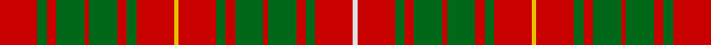

**Bands:** [RGRGRGRGRYRGRGRGRGRW](/stripes/rgrgrgrgryrgrgrgrgrw/) · **Stripes:** [R G R G R G R G R LY R G R G R G R G R W](/stripes/stripes20/) R G R G R G R G R LY R G R G R G R G R W

This was sourced from house-of-tartan.  It is a [20 band tartan](/bands/bands20/).

Original link http://www.house-of-tartan.scotland.net/house/TartanViewjs.asp?colr=Def&tnam=1848

## Thread count
R/32 G8 R8 G24 R4 G24 R8 G8 R32 Y4 R32 G8 R8 G24 R4 G24 R8 G8 R32 LN/4

## Palette
Each colour and its ΔE from the base-6 reference it is a variant of.

| Colour | Shade | Base | ΔE (OKLab) |
|---|---|---|---|
| G | <code style="background-color:#006818;">#006818</code> `#006818` | G <code style="background-color:#006100;">#006100</code> | 0.02 |
| LN | <code style="background-color:#E0E0E0;">#E0E0E0</code> `#E0E0E0` | W <code style="background-color:#F7F7F7;">#F7F7F7</code> | 0.07 |
| R | <code style="background-color:#C80000;">#C80000</code> `#C80000` | R <code style="background-color:#CC0000;">#CC0000</code> | 0.01 |
| Y | <code style="background-color:#E8C000;">#E8C000</code> `#E8C000` | Y <code style="background-color:#F2BF00;">#F2BF00</code> | 0.02 |

## Nearest tartans

The nearest existing variants by ΔTartan distance.

1. [Bruce (Vestiarium)](/setts/s11/w1r8g2r2g6r1g6r2g2r8ly1~x4/) — ΔT 1.27
1. [Burns](/setts/s12/r3g3r3g14r3g3r3db5r18ly2r8ly2~x2/) — ΔT 1.41
1. [MacDonald of Staffa 5](/setts/s29/r29g5r9g24w3g24r27w3r27k16g21r5g5r27g5r5k3g25k3g4r27g5r5g5r5g5r5g5r8~x2/) — ΔT 1.42
1. [Peacock, Grahame (Name)](/setts/s11/r10g2r20g16db3g16r3db8r20g2r10~x2/) — ΔT 1.45
1. [Nicolson (McIan)](/setts/s12/r6g1r6k4r1t1r1g8r6k1r6g1~x6/) — ΔT 1.48
1. [Burns 1930](/setts/s12/r2g2r2g8r2g2r2db2r11ly1r4ly1~x4/) — ΔT 1.48
1. [MacDonald of Staffa #2](/setts/s29/r37dg6r11dg32w4dg18r27w3r27k16dg21r5dg5r27dg5r5k3dg25k3dg4r27dg5r5dg5r5dg5r5dg5r8/) — ΔT 1.49
1. [Bruce](/setts/s11/lr1r8dg2r2dg6r1dg6r2dg2r8ly1~x2/) — ΔT 1.51
1. [Bruce County](/setts/s12/w1db1r7g2r2g6r1g6r2g2r8lo1~x4/) — ΔT 1.53
1. [MacIntosh Old Ancient Artifact Tartan Tartan Number: 966. Earliest known date: pre 2003 The name 'MacKintosh' is usually spelled with a 'K'. In this instance the tartan sample is labelled MacIntosh. See products available Copyright © Blair Urquhart, Comrie, 2015](/setts/s20/r5o1r2g4r3g2r2o5r5g1r1g2r1g1r1g4r1g1r1g2~x2/) — ΔT 1.57

## Neighbour map

Every grey dot is one of 14299 variants placed by the first two principal components of the ΔTartan feature space (44% of its variance). Red is this tartan; blue dots are its nearest — click one to open its page.

<svg viewBox="0 0 640 380" role="img" style="max-width:100%;height:auto;border:1px solid #e0e0e0;border-radius:4px;display:block" xmlns="http://www.w3.org/2000/svg"><image href="/nn/cloud.v1.png" width="640" height="380"/><a href="/setts/s11/w1r8g2r2g6r1g6r2g2r8ly1~x4/"><circle cx="304.8" cy="195.4" r="4" fill="#3465a4"><title>Bruce (Vestiarium)</title></circle></a><a href="/setts/s12/r3g3r3g14r3g3r3db5r18ly2r8ly2~x2/"><circle cx="310.9" cy="173.3" r="4" fill="#3465a4"><title>Burns</title></circle></a><a href="/setts/s29/r29g5r9g24w3g24r27w3r27k16g21r5g5r27g5r5k3g25k3g4r27g5r5g5r5g5r5g5r8~x2/"><circle cx="263.2" cy="134.7" r="4" fill="#3465a4"><title>MacDonald of Staffa 5</title></circle></a><a href="/setts/s11/r10g2r20g16db3g16r3db8r20g2r10~x2/"><circle cx="316.2" cy="198.3" r="4" fill="#3465a4"><title>Peacock, Grahame (Name)</title></circle></a><a href="/setts/s12/r6g1r6k4r1t1r1g8r6k1r6g1~x6/"><circle cx="328.6" cy="190.1" r="4" fill="#3465a4"><title>Nicolson (McIan)</title></circle></a><a href="/setts/s12/r2g2r2g8r2g2r2db2r11ly1r4ly1~x4/"><circle cx="342.4" cy="166.6" r="4" fill="#3465a4"><title>Burns 1930</title></circle></a><a href="/setts/s29/r37dg6r11dg32w4dg18r27w3r27k16dg21r5dg5r27dg5r5k3dg25k3dg4r27dg5r5dg5r5dg5r5dg5r8/"><circle cx="289.3" cy="124.8" r="4" fill="#3465a4"><title>MacDonald of Staffa #2</title></circle></a><a href="/setts/s11/lr1r8dg2r2dg6r1dg6r2dg2r8ly1~x2/"><circle cx="327.4" cy="211.0" r="4" fill="#3465a4"><title>Bruce</title></circle></a><a href="/setts/s12/w1db1r7g2r2g6r1g6r2g2r8lo1~x4/"><circle cx="264.4" cy="172.5" r="4" fill="#3465a4"><title>Bruce County</title></circle></a><a href="/setts/s20/r5o1r2g4r3g2r2o5r5g1r1g2r1g1r1g4r1g1r1g2~x2/"><circle cx="260.1" cy="221.0" r="4" fill="#3465a4"><title>MacIntosh Old Ancient Artifact Tartan Tartan Number: 966. Earliest known date: pre 2003 The name 'MacKintosh' is usually spelled with a 'K'. In this instance the tartan sample is labelled MacIntosh. See products available Copyright © Blair Urquhart, Comrie, 2015</title></circle></a><circle cx="308.2" cy="179.5" r="5" fill="#c00000"/></svg>

ID: /setts/s20/r8g2r2g6r1g6r2g2r8ly1r8g2r2g6r1g6r2g2r8w1~x4/
