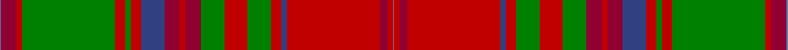

In pattern [BRRGRGRBRRRGRGRBRRRB](/stripes/brrgrgrbrrrgrgrbrrrb/).

This was sourced from weddslist.  It is a [20 stripe tartan](/stripes/stripes20/).

Original link http://www.weddslist.com/cgi-bin/tartans/pg.pl?source=sts

## Thread count
Ba/2 DR24 R8 G144 R16 G8 R16 B36 DR24 R8 DR24 G36 R36 G36 R16 B8 R144 DR12 R8 Ba/2

## Palette
Each colour and the base-6 reference it is a variant of.

| Colour | Shade | Base |
|---|---|---|
| B | <code style="background-color:#304080;">#304080</code> `oklch(39.4% 0.109 270.2)` <small>#304080</small> | B <code style="background-color:#2A418A;">#2A418A</code> |
| Ba | <code style="background-color:#5480B0;">#5480B0</code> `oklch(58.8% 0.089 251.5)` <small>#5480B0</small> | B <code style="background-color:#2A418A;">#2A418A</code> |
| DR | <code style="background-color:#900030;">#900030</code> `oklch(41.6% 0.166 13.6)` <small>#900030</small> | R <code style="background-color:#CC0000;">#CC0000</code> |
| G | <code style="background-color:#008000;">#008000</code> `oklch(52.0% 0.177 142.5)` <small>#008000</small> | G <code style="background-color:#006100;">#006100</code> |
| R | <code style="background-color:#C00000;">#C00000</code> `oklch(50.7% 0.208 29.2)` <small>#C00000</small> | R <code style="background-color:#CC0000;">#CC0000</code> |

## Nearest tartans

The nearest existing variants by ΔTartan distance.

1. [MacDougall (Logan)](/setts/s20/t1r12r4dg72r8dg4r8db18r12r4r12dg18r18dg18r8db4r72r6r4t1~x2/) — ΔT 0.70
1. [Stewart of Ardshiel Clan Tartan Tartan Number: 73. Earliest known date: 1822 There are minor differences between the warp and weft in the blue not shown in the illustration. This is the earliest record of a Stewart of Ardshiel tartan. It differs from the Stewart of Appin in that the Red is interchanged with the blue. Ardshiel is part of Appin and it may be a variation on a sett common to the area. Stewarts of Ardshiel are regarded as a sept of the Appin branch. See products available Copyright © Blair Urquhart, Comrie, 2015](/setts/s18/g14r6r2dt3r65dt2t2r6dt34r6t2dt2r4g66r12r2dt2t4/) — ΔT 1.01
1. [Unidentified 15](/setts/s17/g4r3t1p1r35p1t1r3p16r3t1p1r2g35r7k1t2~x2/) — ΔT 1.12
1. [MacDougall, of MacDougall](/setts/s24/t2p10r3r4g72r7g4r10db24p6r5r4r5p7g24r24g24r3db3r74p7r5r6t2~x2/) — ΔT 1.14
1. [MacDougall](/setts/s20/b2dr12r4dg72r8dg4r8db18dr12r4dr12dg18r18dg18r8db4r72dr6r4b1~x2/) — ΔT 1.21
1. [MacColl, Ancient](/setts/s17/r7r3r6db26r8dg2r2db2r2g1r2r8g26r8g2r2r2~x2/) — ΔT 1.36
1. [MacDougall 9](/setts/s27/r5g10r2db2r30p3r2w1r2p3r30db2r2g10r10g10p4r2p4db10r4g2r4g30r2p3w1~x2/) — ΔT 1.37
1. [MacDougal](/setts/s26/g10r2db2r30dp3r2w1r2dp3r30db2r2g10r10g10dp4r2dp4db10r4g2r4g30r2dp3w1~x2/) — ΔT 1.37
1. [Drummond](/setts/s17/w1t4db6r16g32ly1db6w1r68w1db6ly1g32r16db6t4w1~x2/) — ΔT 1.38
1. [MacDougall Clan Tartan Tartan Number: 1519. Earliest known date: 1815-16 The earliest reference to the MacDougall tartan is in the collection of the Highland Society of London where a sample exists, signed and sealed by the Clan Chief around 1815. The sett is a complex one and the nearest count to the present day day tartan comes from a sample in Paton's collection housed at the Scottish Tartans Museum, and dating to about 1830. The Highland Society also have a sample certified by the Chief MacDougall of MacDougall dated 1906, in their archives store at the Royal Caledonian School near London. See products available Copyright © Blair Urquhart, Comrie, 2015](/setts/s27/r5g10r2db2r30lr3r2w1r2lr3r30db2r2g10r10g10lr4r2lr4db10r4g2r4g30r2lr3w1~x2/) — ΔT 1.39

## Neighbour map

Every grey dot is one of 14299 variants placed by the first two principal components of the ΔTartan feature space (44% of its variance). Red is this tartan; blue dots are its nearest — click one to open its page.

<svg viewBox="0 0 640 380" role="img" style="max-width:100%;height:auto;border:1px solid #e0e0e0;border-radius:4px;display:block" xmlns="http://www.w3.org/2000/svg"><image href="/nn/cloud.v1.png" width="640" height="380"/><a href="/setts/s20/t1r12r4dg72r8dg4r8db18r12r4r12dg18r18dg18r8db4r72r6r4t1~x2/"><circle cx="303.2" cy="56.8" r="4" fill="#3465a4"><title>MacDougall (Logan)</title></circle></a><a href="/setts/s18/g14r6r2dt3r65dt2t2r6dt34r6t2dt2r4g66r12r2dt2t4/"><circle cx="297.2" cy="67.6" r="4" fill="#3465a4"><title>Stewart of Ardshiel Clan Tartan Tartan Number: 73. Earliest known date: 1822 There are minor differences between the warp and weft in the blue not shown in the illustration. This is the earliest record of a Stewart of Ardshiel tartan. It differs from the Stewart of Appin in that the Red is interchanged with the blue. Ardshiel is part of Appin and it may be a variation on a sett common to the area. Stewarts of Ardshiel are regarded as a sept of the Appin branch. See products available Copyright © Blair Urquhart, Comrie, 2015</title></circle></a><a href="/setts/s17/g4r3t1p1r35p1t1r3p16r3t1p1r2g35r7k1t2~x2/"><circle cx="311.6" cy="57.3" r="4" fill="#3465a4"><title>Unidentified 15</title></circle></a><a href="/setts/s24/t2p10r3r4g72r7g4r10db24p6r5r4r5p7g24r24g24r3db3r74p7r5r6t2~x2/"><circle cx="251.7" cy="38.9" r="4" fill="#3465a4"><title>MacDougall, of MacDougall</title></circle></a><a href="/setts/s20/b2dr12r4dg72r8dg4r8db18dr12r4dr12dg18r18dg18r8db4r72dr6r4b1~x2/"><circle cx="322.3" cy="76.2" r="4" fill="#3465a4"><title>MacDougall</title></circle></a><a href="/setts/s17/r7r3r6db26r8dg2r2db2r2g1r2r8g26r8g2r2r2~x2/"><circle cx="250.4" cy="94.8" r="4" fill="#3465a4"><title>MacColl, Ancient</title></circle></a><a href="/setts/s27/r5g10r2db2r30p3r2w1r2p3r30db2r2g10r10g10p4r2p4db10r4g2r4g30r2p3w1~x2/"><circle cx="306.3" cy="62.2" r="4" fill="#3465a4"><title>MacDougall 9</title></circle></a><a href="/setts/s26/g10r2db2r30dp3r2w1r2dp3r30db2r2g10r10g10dp4r2dp4db10r4g2r4g30r2dp3w1~x2/"><circle cx="301.3" cy="63.5" r="4" fill="#3465a4"><title>MacDougal</title></circle></a><a href="/setts/s17/w1t4db6r16g32ly1db6w1r68w1db6ly1g32r16db6t4w1~x2/"><circle cx="318.1" cy="35.7" r="4" fill="#3465a4"><title>Drummond</title></circle></a><a href="/setts/s27/r5g10r2db2r30lr3r2w1r2lr3r30db2r2g10r10g10lr4r2lr4db10r4g2r4g30r2lr3w1~x2/"><circle cx="306.5" cy="61.5" r="4" fill="#3465a4"><title>MacDougall Clan Tartan Tartan Number: 1519. Earliest known date: 1815-16 The earliest reference to the MacDougall tartan is in the collection of the Highland Society of London where a sample exists, signed and sealed by the Clan Chief around 1815. The sett is a complex one and the nearest count to the present day day tartan comes from a sample in Paton's collection housed at the Scottish Tartans Museum, and dating to about 1830. The Highland Society also have a sample certified by the Chief MacDougall of MacDougall dated 1906, in their archives store at the Royal Caledonian School near London. See products available Copyright © Blair Urquhart, Comrie, 2015</title></circle></a><circle cx="302.4" cy="59.6" r="5" fill="#c00000"/></svg>

ID: /setts/s20/t1r12r4g72r8g4r8db18r12r4r12g18r18g18r8db4r72r6r4t1~x2/
