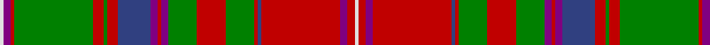

In pattern [WBRGRGRBBRBGRGRBRBRW](/patterns/wbrgrgrbbrbgrgrbrbrw/).

This was sourced from weddslist.  It is a [20 stripes tartan](/stripes/stripes20/).

Original link http://www.weddslist.com/cgi-bin/tartans/pg.pl?source=sts

## Thread count
LN/2 P4 R2 G44 R6 G2 R6 B18 P4 R2 P4 G16 R16 G16 R2 B2 R44 P4 R4 LN/2

## Palette
Each colour and its ΔE from the base-6 reference it is a variant of.

| Colour | Shade | Base | ΔE (OKLab) |
|---|---|---|---|
| B | <code style="background-color:#304080;">#304080</code> `#304080` | B <code style="background-color:#2A418A;">#2A418A</code> | 0.02 |
| G | <code style="background-color:#008000;">#008000</code> `#008000` | G <code style="background-color:#006100;">#006100</code> | 0.10 |
| LN | <code style="background-color:#E0E0E0;">#E0E0E0</code> `#E0E0E0` | W <code style="background-color:#F7F7F7;">#F7F7F7</code> | 0.07 |
| P | <code style="background-color:#800080;">#800080</code> `#800080` | B <code style="background-color:#2A418A;">#2A418A</code> | 0.17 |
| R | <code style="background-color:#C00000;">#C00000</code> `#C00000` | R <code style="background-color:#CC0000;">#CC0000</code> | 0.03 |

## Nearest tartans

The nearest existing variants by ΔTartan distance.

1. [MacDougall Clan Tartan Tartan Number: 1776. Earliest known date: 1977 Matched to a sample by B Urquhart in 2004, from Lochcarron reiver cloth. The purple colour was lightened considerably to a pale mauve, giving an almost equal prominence to the white. See products available Copyright © Blair Urquhart, Comrie, 2015](/setts/s20/w2r2wa2r22b2r2g8r8g8wa2r2wa2b9r3g1r3g22r2wa2w2x2~b2c2c80-g006818-rc80000-we0e0e0-wac49cd8/) — ΔT 0.49
1. [MacDougall (Paton)](/setts/s20/w1b2r1g22r3g1r3ba9b2r1b2g8r8g8r1ba1r22b2r2w1x2~b5a008c-ba2c4084-g005020-rdc0000-we0e0e0/) — ΔT 0.77
1. [MacColl, Ancient](/setts/s17/r7ra3r6b26r8g2r2b2r2ga1ra2r8ga26r8ga2r2ra2x2~b304080-g005020-ga008000-rc00000-ra900030/) — ΔT 0.91
1. [MacDougall](/setts/s20/w1r3ra1g23ra3g1ra3b6r4ra1r4g6ra6g6ra2b1ra24r1ra1w1~b00004c-g004c00-rff4040-rac80000-wd0d0d0/) — ΔT 0.92
1. [Unidentified](/setts/s22/y3g30r7g2r1g8r1g2r7g16k18b8r14g8r1g1r7g1r1g8r27y3x2~b5c8ca8-g006818-k101010-rc80000-yfccc00/) — ΔT 0.96
1. [Stewart of Ardshiel Clan Tartan Tartan Number: 73. Earliest known date: 1822 There are minor differences between the warp and weft in the blue not shown in the illustration. This is the earliest record of a Stewart of Ardshiel tartan. It differs from the Stewart of Appin in that the Red is interchanged with the blue. Ardshiel is part of Appin and it may be a variation on a sett common to the area. Stewarts of Ardshiel are regarded as a sept of the Appin branch. See products available Copyright © Blair Urquhart, Comrie, 2015](/setts/s18/g14r6ra2b3r65b2ba2r6b34r6ba2b2r4g66r12ra2b2ba4~b003c64-ba5c8ca8-g006818-rc80000-rad05054/) — ΔT 1.01
1. [Brown-Wells (Personal)](/setts/s16/r4b1y3b1r20b4g9r3g9b4w3b1g7b2r6y2x2~b1c1c1c-g00643c-rc82828-w98c8e8-yd8b000/) — ΔT 1.06
1. [Wilson, Janet (1780 Original)](/setts/s22/b30w2ba3g3ba3g3ba3g16r3g3r3g3r3g3r3g25r15g4ba4r8w2r15x2~b440044-ba5c8ca8-g285800-rc80000-we0e0e0/) — ΔT 1.06
1. [Sommerville](/setts/s18/w2r3ra6r48b4r2g16ra5r3ra5b20r5g3r5g54r3ra5y2x2~b2c2c80-g006818-rc80000-rae87878-we0e0e0-ye8c000/) — ΔT 1.07
1. [Dundas, (Red)](/setts/s18/g4r4b1k1r19k1ba1r2bb5r2ba1k1r2g24r5b1k1ba3x2~b800070-ba5480b0-bb304080-g008000-k000000-rc00000/) — ΔT 1.07

## Neighbour map

Every grey dot is one of 15726 variants placed by the first two principal components of the ΔTartan feature space (44% of its variance). Red is this tartan; blue dots are its nearest — click one to open its page.

<svg viewBox="0 0 640 380" role="img" style="max-width:100%;height:auto;border:1px solid #e0e0e0;border-radius:4px;display:block" xmlns="http://www.w3.org/2000/svg"><image href="/nn/cloud.v1.png" width="640" height="380"/><a href="/setts/s20/w2r2wa2r22b2r2g8r8g8wa2r2wa2b9r3g1r3g22r2wa2w2x2~b2c2c80-g006818-rc80000-we0e0e0-wac49cd8/"><circle cx="234.6" cy="82.5" r="4" fill="#3465a4"><title>MacDougall Clan Tartan Tartan Number: 1776. Earliest known date: 1977 Matched to a sample by B Urquhart in 2004, from Lochcarron reiver cloth. The purple colour was lightened considerably to a pale mauve, giving an almost equal prominence to the white. See products available Copyright © Blair Urquhart, Comrie, 2015</title></circle></a><a href="/setts/s20/w1b2r1g22r3g1r3ba9b2r1b2g8r8g8r1ba1r22b2r2w1x2~b5a008c-ba2c4084-g005020-rdc0000-we0e0e0/"><circle cx="249.3" cy="79.6" r="4" fill="#3465a4"><title>MacDougall (Paton)</title></circle></a><a href="/setts/s17/r7ra3r6b26r8g2r2b2r2ga1ra2r8ga26r8ga2r2ra2x2~b304080-g005020-ga008000-rc00000-ra900030/"><circle cx="249.0" cy="90.8" r="4" fill="#3465a4"><title>MacColl, Ancient</title></circle></a><a href="/setts/s20/w1r3ra1g23ra3g1ra3b6r4ra1r4g6ra6g6ra2b1ra24r1ra1w1~b00004c-g004c00-rff4040-rac80000-wd0d0d0/"><circle cx="254.3" cy="69.0" r="4" fill="#3465a4"><title>MacDougall</title></circle></a><a href="/setts/s22/y3g30r7g2r1g8r1g2r7g16k18b8r14g8r1g1r7g1r1g8r27y3x2~b5c8ca8-g006818-k101010-rc80000-yfccc00/"><circle cx="252.9" cy="81.0" r="4" fill="#3465a4"><title>Unidentified</title></circle></a><a href="/setts/s18/g14r6ra2b3r65b2ba2r6b34r6ba2b2r4g66r12ra2b2ba4~b003c64-ba5c8ca8-g006818-rc80000-rad05054/"><circle cx="295.8" cy="63.9" r="4" fill="#3465a4"><title>Stewart of Ardshiel Clan Tartan Tartan Number: 73. Earliest known date: 1822 There are minor differences between the warp and weft in the blue not shown in the illustration. This is the earliest record of a Stewart of Ardshiel tartan. It differs from the Stewart of Appin in that the Red is interchanged with the blue. Ardshiel is part of Appin and it may be a variation on a sett common to the area. Stewarts of Ardshiel are regarded as a sept of the Appin branch. See products available Copyright © Blair Urquhart, Comrie, 2015</title></circle></a><a href="/setts/s16/r4b1y3b1r20b4g9r3g9b4w3b1g7b2r6y2x2~b1c1c1c-g00643c-rc82828-w98c8e8-yd8b000/"><circle cx="218.0" cy="111.2" r="4" fill="#3465a4"><title>Brown-Wells (Personal)</title></circle></a><a href="/setts/s22/b30w2ba3g3ba3g3ba3g16r3g3r3g3r3g3r3g25r15g4ba4r8w2r15x2~b440044-ba5c8ca8-g285800-rc80000-we0e0e0/"><circle cx="200.6" cy="100.5" r="4" fill="#3465a4"><title>Wilson, Janet (1780 Original)</title></circle></a><a href="/setts/s18/w2r3ra6r48b4r2g16ra5r3ra5b20r5g3r5g54r3ra5y2x2~b2c2c80-g006818-rc80000-rae87878-we0e0e0-ye8c000/"><circle cx="230.3" cy="52.0" r="4" fill="#3465a4"><title>Sommerville</title></circle></a><a href="/setts/s18/g4r4b1k1r19k1ba1r2bb5r2ba1k1r2g24r5b1k1ba3x2~b800070-ba5480b0-bb304080-g008000-k000000-rc00000/"><circle cx="245.1" cy="54.1" r="4" fill="#3465a4"><title>Dundas, (Red)</title></circle></a><circle cx="251.0" cy="81.4" r="5" fill="#c00000"/></svg>

ID: /setts/s20/w1b2r1g22r3g1r3ba9b2r1b2g8r8g8r1ba1r22b2r2w1x2~b800080-ba304080-g008000-rc00000-we0e0e0/
