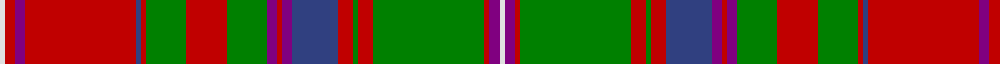

This page is one **sett** — a single exact thread-count. It belongs to the [tartan](/tartans/ln1r2p2r22b1r1g8r8g8p2r1p2b9r3g1r3g22r1p2ln1/)
(the same proportion at any scale), whose colour order is pattern [WBRGRGRBBRBGRGRBRBRW](/stripes/wbrgrgrbbrbgrgrbrbrw/).

Sourced from weddslist.  It is a [20 stripe tartan](/stripes/stripes20/).

Original link http://www.weddslist.com/cgi-bin/tartans/pg.pl?source=sts

## Also known as

This cloth is also recorded under:

- MacDougall 7

## Thread count
LN/2 R4 P4 R44 B2 R2 G16 R16 G16 P4 R2 P4 B18 R6 G2 R6 G44 R2 P4 LN/2

## Palette
Each colour and the base-6 reference it is a variant of.

| Colour | Shade | Base |
|---|---|---|
| B | <code style="background-color:#304080;">#304080</code> `oklch(39.4% 0.109 270.2)` <small>#304080</small> | B <code style="background-color:#2A418A;">#2A418A</code> |
| G | <code style="background-color:#008000;">#008000</code> `oklch(52.0% 0.177 142.5)` <small>#008000</small> | G <code style="background-color:#006100;">#006100</code> |
| LN | <code style="background-color:#E0E0E0;">#E0E0E0</code> `oklch(90.7% 0.000 89.9)` <small>#E0E0E0</small> | W <code style="background-color:#F7F7F7;">#F7F7F7</code> |
| P | <code style="background-color:#800080;">#800080</code> `oklch(42.1% 0.193 328.4)` <small>#800080</small> | B <code style="background-color:#2A418A;">#2A418A</code> |
| R | <code style="background-color:#C00000;">#C00000</code> `oklch(50.7% 0.208 29.2)` <small>#C00000</small> | R <code style="background-color:#CC0000;">#CC0000</code> |

## Nearest tartans

The nearest existing variants by ΔTartan distance, with this tartan at the top so the swatches line up against it.

ΔTartan

Tartan

Sett

—

<a href="/ttd/edit/#slug=w1r2p2r22db1r1g8r8g8p2r1p2db9r3g1r3g22r1p2w1~x2">MacDougall 7</a> <a class="nn-out" href="/setts/s20/w1r2p2r22db1r1g8r8g8p2r1p2db9r3g1r3g22r1p2w1~x2/" title="open its dictionary page">↗</a>

0.49

<a href="/ttd/edit/#slug=w2r2lp2r22db2r2g8r8g8lp2r2lp2db9r3g1r3g22r2lp2w2~x2">MacDougall Clan Tartan Tartan Number: 1776. Earliest known date: 1977 Matched to a sample by B Urquhart in 2004, from Lochcarron reiver cloth. The purple colour was lightened considerably to a pale mauve, giving an almost equal prominence to the white. See products available Copyright © Blair Urquhart, Comrie, 2015</a> <a class="nn-out" href="/setts/s20/w2r2lp2r22db2r2g8r8g8lp2r2lp2db9r3g1r3g22r2lp2w2~x2/" title="open its dictionary page">↗</a>

0.77

<a href="/ttd/edit/#slug=w1dp2r1dg22r3dg1r3db9dp2r1dp2dg8r8dg8r1db1r22dp2r2w1~x2">MacDougall (Paton)</a> <a class="nn-out" href="/setts/s20/w1dp2r1dg22r3dg1r3db9dp2r1dp2dg8r8dg8r1db1r22dp2r2w1~x2/" title="open its dictionary page">↗</a>

0.91

<a href="/ttd/edit/#slug=r7r3r6db26r8dg2r2db2r2g1r2r8g26r8g2r2r2~x2">MacColl, Ancient</a> <a class="nn-out" href="/setts/s17/r7r3r6db26r8dg2r2db2r2g1r2r8g26r8g2r2r2~x2/" title="open its dictionary page">↗</a>

0.92

<a href="/ttd/edit/#slug=lb1r3r1dg23r3dg1r3db6r4r1r4dg6r6dg6r2db1r24r1r1lb1~x2">MacDougall</a> <a class="nn-out" href="/setts/s20/lb1r3r1dg23r3dg1r3db6r4r1r4dg6r6dg6r2db1r24r1r1lb1~x2/" title="open its dictionary page">↗</a>

0.96

<a href="/ttd/edit/#slug=ly3g30r7g2r1g8r1g2r7g16k18t8r14g8r1g1r7g1r1g8r27ly3~x2">Unidentified</a> <a class="nn-out" href="/setts/s22/ly3g30r7g2r1g8r1g2r7g16k18t8r14g8r1g1r7g1r1g8r27ly3~x2/" title="open its dictionary page">↗</a>

1.01

<a href="/ttd/edit/#slug=g14r6r2dt3r65dt2t2r6dt34r6t2dt2r4g66r12r2dt2t4">Stewart of Ardshiel Clan Tartan Tartan Number: 73. Earliest known date: 1822 There are minor differences between the warp and weft in the blue not shown in the illustration. This is the earliest record of a Stewart of Ardshiel tartan. It differs from the Stewart of Appin in that the Red is interchanged with the blue. Ardshiel is part of Appin and it may be a variation on a sett common to the area. Stewarts of Ardshiel are regarded as a sept of the Appin branch. See products available Copyright © Blair Urquhart, Comrie, 2015</a> <a class="nn-out" href="/setts/s18/g14r6r2dt3r65dt2t2r6dt34r6t2dt2r4g66r12r2dt2t4/" title="open its dictionary page">↗</a>

1.06

<a href="/ttd/edit/#slug=r4dt1ly3dt1r20dt4g9r3g9dt4lb3dt1g7dt2r6ly2~x2">Brown-Wells (Personal)</a> <a class="nn-out" href="/setts/s16/r4dt1ly3dt1r20dt4g9r3g9dt4lb3dt1g7dt2r6ly2~x2/" title="open its dictionary page">↗</a>

1.06

<a href="/ttd/edit/#slug=dp30w2t3dg3t3dg3t3dg16r3dg3r3dg3r3dg3r3dg25r15dg4t4r8w2r15~x2">Wilson, Janet (1780 Original)</a> <a class="nn-out" href="/setts/s22/dp30w2t3dg3t3dg3t3dg16r3dg3r3dg3r3dg3r3dg25r15dg4t4r8w2r15~x2/" title="open its dictionary page">↗</a>

1.07

<a href="/ttd/edit/#slug=w2r3r6r48db4r2g16r5r3r5db20r5g3r5g54r3r5ly2~x2">Sommerville</a> <a class="nn-out" href="/setts/s18/w2r3r6r48db4r2g16r5r3r5db20r5g3r5g54r3r5ly2~x2/" title="open its dictionary page">↗</a>

1.07

<a href="/ttd/edit/#slug=g4r4dp1k1r19k1t1r2db5r2t1k1r2g24r5dp1k1t3~x2">Dundas, (Red)</a> <a class="nn-out" href="/setts/s18/g4r4dp1k1r19k1t1r2db5r2t1k1r2g24r5dp1k1t3~x2/" title="open its dictionary page">↗</a>

## Neighbour map

Every grey dot is one of 14299 variants placed by the first two principal components of the ΔTartan feature space (44% of its variance). Red is this tartan; blue dots are its nearest — click one to open its page.

<svg viewBox="0 0 640 380" role="img" style="max-width:100%;height:auto;border:1px solid #e0e0e0;border-radius:4px;display:block" xmlns="http://www.w3.org/2000/svg"><image href="/nn/cloud.v1.png" width="640" height="380"/><a href="/setts/s20/w2r2lp2r22db2r2g8r8g8lp2r2lp2db9r3g1r3g22r2lp2w2~x2/"><circle cx="236.0" cy="83.8" r="4" fill="#3465a4"><title>MacDougall Clan Tartan Tartan Number: 1776. Earliest known date: 1977 Matched to a sample by B Urquhart in 2004, from Lochcarron reiver cloth. The purple colour was lightened considerably to a pale mauve, giving an almost equal prominence to the white. See products available Copyright © Blair Urquhart, Comrie, 2015</title></circle></a><a href="/setts/s20/w1dp2r1dg22r3dg1r3db9dp2r1dp2dg8r8dg8r1db1r22dp2r2w1~x2/"><circle cx="250.7" cy="81.1" r="4" fill="#3465a4"><title>MacDougall (Paton)</title></circle></a><a href="/setts/s17/r7r3r6db26r8dg2r2db2r2g1r2r8g26r8g2r2r2~x2/"><circle cx="250.4" cy="94.8" r="4" fill="#3465a4"><title>MacColl, Ancient</title></circle></a><a href="/setts/s20/lb1r3r1dg23r3dg1r3db6r4r1r4dg6r6dg6r2db1r24r1r1lb1~x2/"><circle cx="255.2" cy="69.5" r="4" fill="#3465a4"><title>MacDougall</title></circle></a><a href="/setts/s22/ly3g30r7g2r1g8r1g2r7g16k18t8r14g8r1g1r7g1r1g8r27ly3~x2/"><circle cx="254.4" cy="82.7" r="4" fill="#3465a4"><title>Unidentified</title></circle></a><a href="/setts/s18/g14r6r2dt3r65dt2t2r6dt34r6t2dt2r4g66r12r2dt2t4/"><circle cx="297.2" cy="67.6" r="4" fill="#3465a4"><title>Stewart of Ardshiel Clan Tartan Tartan Number: 73. Earliest known date: 1822 There are minor differences between the warp and weft in the blue not shown in the illustration. This is the earliest record of a Stewart of Ardshiel tartan. It differs from the Stewart of Appin in that the Red is interchanged with the blue. Ardshiel is part of Appin and it may be a variation on a sett common to the area. Stewarts of Ardshiel are regarded as a sept of the Appin branch. See products available Copyright © Blair Urquhart, Comrie, 2015</title></circle></a><a href="/setts/s16/r4dt1ly3dt1r20dt4g9r3g9dt4lb3dt1g7dt2r6ly2~x2/"><circle cx="219.4" cy="112.7" r="4" fill="#3465a4"><title>Brown-Wells (Personal)</title></circle></a><a href="/setts/s22/dp30w2t3dg3t3dg3t3dg16r3dg3r3dg3r3dg3r3dg25r15dg4t4r8w2r15~x2/"><circle cx="202.2" cy="103.6" r="4" fill="#3465a4"><title>Wilson, Janet (1780 Original)</title></circle></a><a href="/setts/s18/w2r3r6r48db4r2g16r5r3r5db20r5g3r5g54r3r5ly2~x2/"><circle cx="231.8" cy="55.1" r="4" fill="#3465a4"><title>Sommerville</title></circle></a><a href="/setts/s18/g4r4dp1k1r19k1t1r2db5r2t1k1r2g24r5dp1k1t3~x2/"><circle cx="246.6" cy="55.8" r="4" fill="#3465a4"><title>Dundas, (Red)</title></circle></a><circle cx="252.4" cy="83.7" r="5" fill="#c00000"/></svg>

ID: /setts/s20/w1r2p2r22db1r1g8r8g8p2r1p2db9r3g1r3g22r1p2w1~x2/
