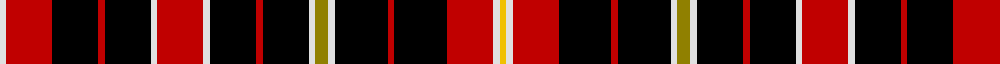

In pattern [WRKRKWRWKRKWGWKRKRWY](/patterns/wrkrkwrwkrkwgwkrkrwy/).

This was sourced from weddslist.  It is a [20 stripes tartan](/stripes/stripes20/).

Original link http://www.weddslist.com/cgi-bin/tartans/pg.pl?source=sts

## Thread count
LN/4 R28 K28 R4 K28 LN4 R28 LN4 K28 R4 K28 LN4 LG8 LN4 K32 R4 K32 R28 LN4 Y/4

## Palette
Each colour and its ΔE from the base-6 reference it is a variant of.

| Colour | Shade | Base | ΔE (OKLab) |
|---|---|---|---|
| K | <code style="background-color:#000000;">#000000</code> `#000000` | K <code style="background-color:#000000;">#000000</code> | 0.00 |
| LG | <code style="background-color:#908000;">#908000</code> `#908000` | G <code style="background-color:#006100;">#006100</code> | 0.20 |
| LN | <code style="background-color:#E0E0E0;">#E0E0E0</code> `#E0E0E0` | W <code style="background-color:#F7F7F7;">#F7F7F7</code> | 0.07 |
| R | <code style="background-color:#C00000;">#C00000</code> `#C00000` | R <code style="background-color:#CC0000;">#CC0000</code> | 0.03 |
| Y | <code style="background-color:#F0C000;">#F0C000</code> `#F0C000` | Y <code style="background-color:#F2BF00;">#F2BF00</code> | 0.00 |

## Nearest tartans

The nearest existing variants by ΔTartan distance.

1. [Order of the Holy Sepulchre (Corp)](/setts/s20/w1r7k7r1k7w1r7w1k7r1k7w1y2w1k8r1k8r7w1ya1x4~k101010-rc80000-we0e0e0-ybc8c00-yae8c000/) — ΔT 1.01
1. [Holy Sepulchre Corporate Tartan Tartan Number: 2161. Earliest known date: pre 2003 Information from Mr Scot Wilson, McCalls of Aberdeen. See products available Copyright © Blair Urquhart, Comrie, 2015](/setts/s20/w2r13k17r2k17w2r13w2k17r2k17w2y4w2k17r2k17r13w2y2x2~k101010-rc80000-we0e0e0-ye8c000/) — ΔT 1.33
1. [MacDonald, Sir John A.](/setts/s11/r12k4g2w2k21b3k22r4g4r15w3x2~b304080-g008000-k000000-rc00000-we0e0e0/) — ΔT 1.50
1. [Order of the Holy Sepulchre](/setts/s38/w1r7k8r1k8w1y2w1k7r1k7w1r7w1k7r1k7r7w1r7k7r1k7w1r7w1k7r1k7w1y2w1k8r1k8r7w1ya1x4~k101010-rc80000-we0e0e0-ybc8c00-yae8c000/) — ΔT 1.65
1. [York Region Pipe Band](/setts/s11/r10k3g2w2k22b4k22r4g4r14w3x2~b00008c-g007800-k000000-r8c0000-wc8c8c8/) — ΔT 1.66
1. [Stevens #6](/setts/s19/k3r3k14y2ya2k3r13k3y2ya2k4y6k3ya2y2k14r3k3ya3x2~k101010-rc80000-yd87c00-yae8c000/) — ΔT 1.69
1. [MacDonald, Sir John A](/setts/s11/r10k3g2w2k22b4k22r4g4r14w3x2~b00008c-g004c00-k000000-r8c0000-wc8c8c8/) — ΔT 1.70
1. [Highland Spring (1985) (Corporate)](/setts/s12/r16k2r9k12k2k10k3k2k3k2k3r10x2~k000000-rc82800/) — ΔT 1.72
1. [Baseggio Name Tartan Tartan Number: 10628. Earliest known date: 23/05/2012 This tartan is for members of the Golden Bones branch of the Baseggio family, one of the oldest houses of the city of Venice, Italy, but it can be worn by anyone who likes the design. Colours: gold and blue are for the Baseggio coat of arms, the thick golden line represents the crown and the three thin golden lines are for the three bones; the green, white and red stripes represent the Italian Tricolore flag. See products available Copyright © Blair Urquhart, Comrie, 2015](/setts/s16/b4k6g1w1r1k6b4k2y1k1y1k1y1k2y3k3x4~b5f749c-g649848-k000000-rca2625-wf9f5ef-ye0a126/) — ΔT 1.72
1. [MacInroy](/setts/s28/r18k3r3k11g9k2g9k11r2k11r3k3r9g2k3g2r9k3r3k11r2k11r3k3r18b2r3b2x2~b304080-g008000-k000000-rc00000/) — ΔT 1.75

## Neighbour map

Every grey dot is one of 15726 variants placed by the first two principal components of the ΔTartan feature space (44% of its variance). Red is this tartan; blue dots are its nearest — click one to open its page.

<svg viewBox="0 0 640 380" role="img" style="max-width:100%;height:auto;border:1px solid #e0e0e0;border-radius:4px;display:block" xmlns="http://www.w3.org/2000/svg"><image href="/nn/cloud.v1.png" width="640" height="380"/><a href="/setts/s20/w1r7k7r1k7w1r7w1k7r1k7w1y2w1k8r1k8r7w1ya1x4~k101010-rc80000-we0e0e0-ybc8c00-yae8c000/"><circle cx="241.8" cy="145.7" r="4" fill="#3465a4"><title>Order of the Holy Sepulchre (Corp)</title></circle></a><a href="/setts/s20/w2r13k17r2k17w2r13w2k17r2k17w2y4w2k17r2k17r13w2y2x2~k101010-rc80000-we0e0e0-ye8c000/"><circle cx="289.5" cy="160.0" r="4" fill="#3465a4"><title>Holy Sepulchre Corporate Tartan Tartan Number: 2161. Earliest known date: pre 2003 Information from Mr Scot Wilson, McCalls of Aberdeen. See products available Copyright © Blair Urquhart, Comrie, 2015</title></circle></a><a href="/setts/s11/r12k4g2w2k21b3k22r4g4r15w3x2~b304080-g008000-k000000-rc00000-we0e0e0/"><circle cx="226.6" cy="152.7" r="4" fill="#3465a4"><title>MacDonald, Sir John A.</title></circle></a><a href="/setts/s38/w1r7k8r1k8w1y2w1k7r1k7w1r7w1k7r1k7r7w1r7k7r1k7w1r7w1k7r1k7w1y2w1k8r1k8r7w1ya1x4~k101010-rc80000-we0e0e0-ybc8c00-yae8c000/"><circle cx="234.5" cy="122.0" r="4" fill="#3465a4"><title>Order of the Holy Sepulchre</title></circle></a><a href="/setts/s11/r10k3g2w2k22b4k22r4g4r14w3x2~b00008c-g007800-k000000-r8c0000-wc8c8c8/"><circle cx="238.3" cy="159.3" r="4" fill="#3465a4"><title>York Region Pipe Band</title></circle></a><a href="/setts/s19/k3r3k14y2ya2k3r13k3y2ya2k4y6k3ya2y2k14r3k3ya3x2~k101010-rc80000-yd87c00-yae8c000/"><circle cx="226.0" cy="156.8" r="4" fill="#3465a4"><title>Stevens #6</title></circle></a><a href="/setts/s11/r10k3g2w2k22b4k22r4g4r14w3x2~b00008c-g004c00-k000000-r8c0000-wc8c8c8/"><circle cx="241.7" cy="160.7" r="4" fill="#3465a4"><title>MacDonald, Sir John A</title></circle></a><a href="/setts/s12/r16k2r9k12k2k10k3k2k3k2k3r10x2~k000000-rc82800/"><circle cx="184.0" cy="167.7" r="4" fill="#3465a4"><title>Highland Spring (1985) (Corporate)</title></circle></a><a href="/setts/s16/b4k6g1w1r1k6b4k2y1k1y1k1y1k2y3k3x4~b5f749c-g649848-k000000-rca2625-wf9f5ef-ye0a126/"><circle cx="164.0" cy="157.4" r="4" fill="#3465a4"><title>Baseggio Name Tartan Tartan Number: 10628. Earliest known date: 23/05/2012 This tartan is for members of the Golden Bones branch of the Baseggio family, one of the oldest houses of the city of Venice, Italy, but it can be worn by anyone who likes the design. Colours: gold and blue are for the Baseggio coat of arms, the thick golden line represents the crown and the three thin golden lines are for the three bones; the green, white and red stripes represent the Italian Tricolore flag. See products available Copyright © Blair Urquhart, Comrie, 2015</title></circle></a><a href="/setts/s28/r18k3r3k11g9k2g9k11r2k11r3k3r9g2k3g2r9k3r3k11r2k11r3k3r18b2r3b2x2~b304080-g008000-k000000-rc00000/"><circle cx="186.8" cy="141.9" r="4" fill="#3465a4"><title>MacInroy</title></circle></a><circle cx="231.7" cy="147.1" r="5" fill="#c00000"/></svg>

ID: /setts/s20/w1r7k7r1k7w1r7w1k7r1k7w1g2w1k8r1k8r7w1y1x4~g908000-k000000-rc00000-we0e0e0-yf0c000/
