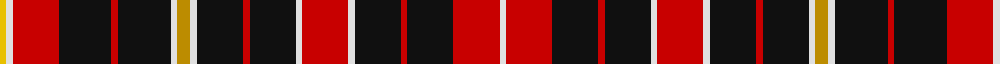

**Bands:** [YWRKRKWYWKRKWRWKRKRW](/stripes/ywrkrkwywkrkwrwkrkrw/) · **Stripes:** [LY W R K R K W LO W K R K W R W K R K R W](/stripes/stripes20/) LY W R K R K W LO W K R K W R W K R K R W

This was sourced from tartans-authority.  It is a [20 band tartan](/bands/bands20/).

Original link http://www.tartansauthority.com/tartan-ferret/display/2161/

## Thread count
Y/4 LN4 R28 K32 R4 K32 LN4 DY8 LN4 K28 R4 K28 LN4 R28 LN4 K28 R4 K28 R28 LN/4

## Palette
Each colour and its ΔE from the base-6 reference it is a variant of.

| Colour | Shade | Base | ΔE (OKLab) |
|---|---|---|---|
| DY | <code style="background-color:#BC8C00;">#BC8C00</code> `#BC8C00` | Y <code style="background-color:#F2BF00;">#F2BF00</code> | 0.16 |
| K | <code style="background-color:#101010;">#101010</code> `#101010` | K <code style="background-color:#000000;">#000000</code> | 0.17 |
| LN | <code style="background-color:#E0E0E0;">#E0E0E0</code> `#E0E0E0` | W <code style="background-color:#F7F7F7;">#F7F7F7</code> | 0.07 |
| R | <code style="background-color:#C80000;">#C80000</code> `#C80000` | R <code style="background-color:#CC0000;">#CC0000</code> | 0.01 |
| Y | <code style="background-color:#E8C000;">#E8C000</code> `#E8C000` | Y <code style="background-color:#F2BF00;">#F2BF00</code> | 0.02 |

## Nearest tartans

The nearest existing variants by ΔTartan distance.

1. [Holy Sepulchre Corporate Tartan Tartan Number: 2161. Earliest known date: pre 2003 Information from Mr Scot Wilson, McCalls of Aberdeen. See products available Copyright © Blair Urquhart, Comrie, 2015](/setts/s20/w2r13k17r2k17w2r13w2k17r2k17w2ly4w2k17r2k17r13w2ly2~x2/) — ΔT 1.00
1. [Order of the Holy Sepulchre of Jerusalem](/setts/s20/w1r7k7r1k7w1r7w1k7r1k7w1y2w1k8r1k8r7w1ly1~x4/) — ΔT 1.02
1. [City of New Bern 300](/setts/s18/o12k2ly2k2o2k2ly2k2o12k1w2db3w2k1o12k2ly2k2~x2/) — ΔT 1.19
1. [Stevens #6](/setts/s19/k3r3k14lo2ly2k3r13k3lo2ly2k4lo6k3ly2lo2k14r3k3ly3~x2/) — ΔT 1.22
1. [Drummond C](/setts/s15/r3k1r1dg6r1dg1r1k2r1lb1r6db1r1db1r3/) — ΔT 1.31
1. [Order of the Holy Sepulchre](/setts/s38/w1r7k7r1k7w1r7w1k7r1k7w1lo2w1k8r1k8r7w1ly1~x4/) — ΔT 1.31
1. [Drummond C](/setts/s15/r3k1r1dg6r1dg1r1k2r1lr1r6db1r1db1r3~x2/) — ΔT 1.33
1. [Drummond C](/setts/s15/r3k1r1dg6r1dg1r1k2r1lr1r6db1r1db1r3/) — ΔT 1.33
1. [City of New Bern 300 (District)](/setts/s18/r12k2ly2k2r2k2ly2k2r12k1k2k3k2k1r12k2ly2k2~x2/) — ΔT 1.37
1. [Malt, The](/setts/s12/k20r2k4r2k19r17k10r10k6r5ly2r2~x2/) — ΔT 1.49

## Neighbour map

Every grey dot is one of 14299 variants placed by the first two principal components of the ΔTartan feature space (44% of its variance). Red is this tartan; blue dots are its nearest — click one to open its page.

<svg viewBox="0 0 640 380" role="img" style="max-width:100%;height:auto;border:1px solid #e0e0e0;border-radius:4px;display:block" xmlns="http://www.w3.org/2000/svg"><image href="/nn/cloud.v1.png" width="640" height="380"/><a href="/setts/s20/w2r13k17r2k17w2r13w2k17r2k17w2ly4w2k17r2k17r13w2ly2~x2/"><circle cx="291.0" cy="155.6" r="4" fill="#3465a4"><title>Holy Sepulchre Corporate Tartan Tartan Number: 2161. Earliest known date: pre 2003 Information from Mr Scot Wilson, McCalls of Aberdeen. See products available Copyright © Blair Urquhart, Comrie, 2015</title></circle></a><a href="/setts/s20/w1r7k7r1k7w1r7w1k7r1k7w1y2w1k8r1k8r7w1ly1~x4/"><circle cx="233.6" cy="143.0" r="4" fill="#3465a4"><title>Order of the Holy Sepulchre of Jerusalem</title></circle></a><a href="/setts/s18/o12k2ly2k2o2k2ly2k2o12k1w2db3w2k1o12k2ly2k2~x2/"><circle cx="269.2" cy="107.3" r="4" fill="#3465a4"><title>City of New Bern 300</title></circle></a><a href="/setts/s19/k3r3k14lo2ly2k3r13k3lo2ly2k4lo6k3ly2lo2k14r3k3ly3~x2/"><circle cx="227.6" cy="153.3" r="4" fill="#3465a4"><title>Stevens #6</title></circle></a><a href="/setts/s15/r3k1r1dg6r1dg1r1k2r1lb1r6db1r1db1r3/"><circle cx="238.0" cy="154.7" r="4" fill="#3465a4"><title>Drummond C</title></circle></a><a href="/setts/s38/w1r7k7r1k7w1r7w1k7r1k7w1lo2w1k8r1k8r7w1ly1~x4/"><circle cx="236.0" cy="119.6" r="4" fill="#3465a4"><title>Order of the Holy Sepulchre</title></circle></a><a href="/setts/s15/r3k1r1dg6r1dg1r1k2r1lr1r6db1r1db1r3~x2/"><circle cx="253.5" cy="166.4" r="4" fill="#3465a4"><title>Drummond C</title></circle></a><a href="/setts/s15/r3k1r1dg6r1dg1r1k2r1lr1r6db1r1db1r3/"><circle cx="253.5" cy="166.4" r="4" fill="#3465a4"><title>Drummond C</title></circle></a><a href="/setts/s18/r12k2ly2k2r2k2ly2k2r12k1k2k3k2k1r12k2ly2k2~x2/"><circle cx="292.3" cy="118.0" r="4" fill="#3465a4"><title>City of New Bern 300 (District)</title></circle></a><a href="/setts/s12/k20r2k4r2k19r17k10r10k6r5ly2r2~x2/"><circle cx="307.2" cy="171.2" r="4" fill="#3465a4"><title>Malt, The</title></circle></a><circle cx="243.3" cy="142.3" r="5" fill="#c00000"/></svg>

ID: /setts/s20/w1r7k7r1k7w1r7w1k7r1k7w1lo2w1k8r1k8r7w1ly1~x4/
