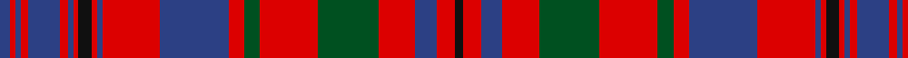

In pattern [BRBRBRBRKRBRBRGRGRBRK](/patterns/brbrbrbrkrbrbrgrgrbrk/).

This was sourced from register-of-tartans.  It is a [21 stripes tartan](/stripes/stripes21/).

Original link https://www.tartanregister.gov.uk/tartanDetails.aspx?ref=3070

## Thread count
B/8 R4 B4 R6 B24 R6 B4 R4 K10 R4 B4 R44 B52 R12 G12 R44 G46 R28 B16 R14 K/6

## Palette
Each colour and its ΔE from the base-6 reference it is a variant of.

| Colour | Shade | Base | ΔE (OKLab) |
|---|---|---|---|
| B | <code style="background-color:#2C4084;">#2C4084</code> `#2C4084` | B <code style="background-color:#2A418A;">#2A418A</code> | 0.01 |
| G | <code style="background-color:#005020;">#005020</code> `#005020` | G <code style="background-color:#006100;">#006100</code> | 0.07 |
| K | <code style="background-color:#101010;">#101010</code> `#101010` | K <code style="background-color:#000000;">#000000</code> | 0.17 |
| R | <code style="background-color:#DC0000;">#DC0000</code> `#DC0000` | R <code style="background-color:#CC0000;">#CC0000</code> | 0.03 |

## Nearest tartans

The nearest existing variants by ΔTartan distance.

1. [MacLeod of Tullibardine](/setts/s21/b4r1b1r2b10r2b1r1k1r1b1r12b6r4g4r12g10r6b4r2k2x4~b2c2c80-g006818-k101010-rc80000/) — ΔT 0.35
1. [Murray of Tullibardine 2](/setts/s21/b4r2b2r3b12r3b2r2k5r2b2r22b26r6g6r22g23r14b8r7k3x2~b304080-g008000-k000000-rc00000/) — ΔT 0.39
1. [Hebrides #2](/setts/s20/b25ba2r25g10r4b25r2g2r25g2r2g2r25g2r2b25r4g10r25ba2x2~b202060-ba2c2c80-g006818-rc80000/) — ΔT 0.64
1. [MacLeod Red](/setts/s21/b4r1b1r2b11r2b1r1y1r1b1r16b8r4g4r16g11r8b4r2y2x2~b2c2c80-g006818-rc80000-ye8c000/) — ΔT 0.67
1. [MacLeod Red Clan Tartan Tartan Number: 496. Earliest known date: 1982 Designed after the tartan worn by Norman MacLeod, 22nd Chief of the clan, painted by Allan Ramsay in 1747, with the costume painted by Van Haecken (see details in entry for MacLeod portrait.) A yellow stripe was added by Ruairidh MacLeod to enhance the family resemblance to other MacLeod tartans, and to differentiate this from Murray of Tullibardine, the name now attached to the sett in the portrait. Approved by the Clan MacLeod Parliament in 1982. See products available Copyright © Blair Urquhart, Comrie, 2015](/setts/s21/b4r1b1r2b11r2b1r1y1r1b1r16b8r4g4r16g11r8b4r2y2x2~b202060-g006818-rc80000-ye8c000/) — ΔT 0.74
1. [Ensemble Pour l'Avenir](/setts/s18/b3g1b2r14g2r1g2b10r10b10w2r2w2r14g6r10b10w2x2~b304080-g808080-rc00000-we0e0e0/) — ΔT 0.84
1. [Hebrides #4](/setts/s20/r25b2ba25r2g2r25g2r2ba25r4ba25r2g2r25g2r2ba25b2r25g10x2~b5c8ca8-ba2c2c80-g006818-rc80000/) — ΔT 0.90
1. [Ensemble Pour L'Avenir](/setts/s18/b3r1b2ra14r2ra1r2b10ra10b10w2ra2w2ra14r6ra10b10w2x2~b2c2c80-r888888-rac80000-we0e0e0/) — ΔT 0.94
1. [Summerville Presbyterian Church (Cor](/setts/s29/b3r15g2r2g12w2b12r2b4r2b12w2r8b2r2b2r2b2r8b2r2b2r2b2r8g10b1g2r2x2~b202060-g006818-rc80000-wfcfcfc/) — ΔT 0.99
1. [Murray of Tullibardine #4](/setts/s25/b6r5b4r3b6r4b4r5b9r5b4r3k8r3b4r36b27r4g4r14g27r9b6r6k3~b080848-g005020-k101010-rdc0000/) — ΔT 1.02

## Neighbour map

Every grey dot is one of 15726 variants placed by the first two principal components of the ΔTartan feature space (44% of its variance). Red is this tartan; blue dots are its nearest — click one to open its page.

<svg viewBox="0 0 640 380" role="img" style="max-width:100%;height:auto;border:1px solid #e0e0e0;border-radius:4px;display:block" xmlns="http://www.w3.org/2000/svg"><image href="/nn/cloud.v1.png" width="640" height="380"/><a href="/setts/s21/b4r1b1r2b10r2b1r1k1r1b1r12b6r4g4r12g10r6b4r2k2x4~b2c2c80-g006818-k101010-rc80000/"><circle cx="267.2" cy="141.7" r="4" fill="#3465a4"><title>MacLeod of Tullibardine</title></circle></a><a href="/setts/s21/b4r2b2r3b12r3b2r2k5r2b2r22b26r6g6r22g23r14b8r7k3x2~b304080-g008000-k000000-rc00000/"><circle cx="253.3" cy="133.1" r="4" fill="#3465a4"><title>Murray of Tullibardine 2</title></circle></a><a href="/setts/s20/b25ba2r25g10r4b25r2g2r25g2r2g2r25g2r2b25r4g10r25ba2x2~b202060-ba2c2c80-g006818-rc80000/"><circle cx="292.4" cy="138.7" r="4" fill="#3465a4"><title>Hebrides #2</title></circle></a><a href="/setts/s21/b4r1b1r2b11r2b1r1y1r1b1r16b8r4g4r16g11r8b4r2y2x2~b2c2c80-g006818-rc80000-ye8c000/"><circle cx="300.0" cy="121.3" r="4" fill="#3465a4"><title>MacLeod Red</title></circle></a><a href="/setts/s21/b4r1b1r2b11r2b1r1y1r1b1r16b8r4g4r16g11r8b4r2y2x2~b202060-g006818-rc80000-ye8c000/"><circle cx="296.2" cy="120.4" r="4" fill="#3465a4"><title>MacLeod Red Clan Tartan Tartan Number: 496. Earliest known date: 1982 Designed after the tartan worn by Norman MacLeod, 22nd Chief of the clan, painted by Allan Ramsay in 1747, with the costume painted by Van Haecken (see details in entry for MacLeod portrait.) A yellow stripe was added by Ruairidh MacLeod to enhance the family resemblance to other MacLeod tartans, and to differentiate this from Murray of Tullibardine, the name now attached to the sett in the portrait. Approved by the Clan MacLeod Parliament in 1982. See products available Copyright © Blair Urquhart, Comrie, 2015</title></circle></a><a href="/setts/s18/b3g1b2r14g2r1g2b10r10b10w2r2w2r14g6r10b10w2x2~b304080-g808080-rc00000-we0e0e0/"><circle cx="275.5" cy="148.5" r="4" fill="#3465a4"><title>Ensemble Pour l'Avenir</title></circle></a><a href="/setts/s20/r25b2ba25r2g2r25g2r2ba25r4ba25r2g2r25g2r2ba25b2r25g10x2~b5c8ca8-ba2c2c80-g006818-rc80000/"><circle cx="290.5" cy="141.7" r="4" fill="#3465a4"><title>Hebrides #4</title></circle></a><a href="/setts/s18/b3r1b2ra14r2ra1r2b10ra10b10w2ra2w2ra14r6ra10b10w2x2~b2c2c80-r888888-rac80000-we0e0e0/"><circle cx="263.2" cy="142.7" r="4" fill="#3465a4"><title>Ensemble Pour L'Avenir</title></circle></a><a href="/setts/s29/b3r15g2r2g12w2b12r2b4r2b12w2r8b2r2b2r2b2r8b2r2b2r2b2r8g10b1g2r2x2~b202060-g006818-rc80000-wfcfcfc/"><circle cx="220.1" cy="113.2" r="4" fill="#3465a4"><title>Summerville Presbyterian Church (Cor</title></circle></a><a href="/setts/s25/b6r5b4r3b6r4b4r5b9r5b4r3k8r3b4r36b27r4g4r14g27r9b6r6k3~b080848-g005020-k101010-rdc0000/"><circle cx="235.2" cy="117.9" r="4" fill="#3465a4"><title>Murray of Tullibardine #4</title></circle></a><circle cx="257.9" cy="132.1" r="5" fill="#c00000"/></svg>

ID: /setts/s21/b4r2b2r3b12r3b2r2k5r2b2r22b26r6g6r22g23r14b8r7k3x2~b2c4084-g005020-k101010-rdc0000/
