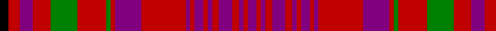

In pattern [BRBRBRBRBRBRBRGRGRBRK](/patterns/brbrbrbrbrbrbrgrgrbrk/).

This was sourced from weddslist.  It is a [21 stripes tartan](/stripes/stripes21/).

Original link http://www.weddslist.com/cgi-bin/tartans/pg.pl?source=sts

## Thread count
K/8 R10 P12 R16 G24 R26 G4 R4 P24 R40 P4 R4 P8 R4 P4 R6 P12 R6 P4 R4 P/8

## Palette
Each colour and its ΔE from the base-6 reference it is a variant of.

| Colour | Shade | Base | ΔE (OKLab) |
|---|---|---|---|
| G | <code style="background-color:#008000;">#008000</code> `#008000` | G <code style="background-color:#006100;">#006100</code> | 0.10 |
| K | <code style="background-color:#000000;">#000000</code> `#000000` | K <code style="background-color:#000000;">#000000</code> | 0.00 |
| P | <code style="background-color:#800080;">#800080</code> `#800080` | B <code style="background-color:#2A418A;">#2A418A</code> | 0.17 |
| R | <code style="background-color:#C00000;">#C00000</code> `#C00000` | R <code style="background-color:#CC0000;">#CC0000</code> | 0.03 |

## Nearest tartans

The nearest existing variants by ΔTartan distance.

1. [Murray of Tullibardine #3](/setts/s21/b4r2b2r3b6r3b2r2b4r2b2r20b12r2g2r13g12r8b6r5k4~b5a008c-g005020-k101010-rdc0000~x2/) — ΔT 0.64
1. [Lumsden of Clova](/setts/s25/b9r2b9r9b1r1b2r1b1r9w1r4b11r2b11r4w1r9g2r4g2r9g9r2g9~b780078-g285800-rc80000-wfcfcfc~x2/) — ΔT 0.84
1. [Lumsden of Clova (Clan?)](/setts/s25/b9r2b9r9b1r1b2r1b1r9w1r4b11r2b11r4w1r9g2r4g2r9g9r2g9~b780078-g285800-rc80000-we0e0e0~x2/) — ΔT 0.87
1. [Hebrides #2](/setts/s20/b25ba2r25g10r4b25r2g2r25g2r2g2r25g2r2b25r4g10r25ba2~b202060-ba2c2c80-g006818-rc80000~x2/) — ΔT 1.19
1. [Ensemble Pour l'Avenir](/setts/s18/b3g1b2r14g2r1g2b10r10b10w2r2w2r14g6r10b10w2~b304080-g808080-rc00000-we0e0e0~x2/) — ΔT 1.23
1. [MacLeod of Tullibardine](/setts/s21/b4r1b1r2b10r2b1r1k1r1b1r12b6r4g4r12g10r6b4r2k2~b2c2c80-g006818-k101010-rc80000~x4/) — ΔT 1.27
1. [Ensemble Pour L'Avenir](/setts/s18/b3r1b2ra14r2ra1r2b10ra10b10w2ra2w2ra14r6ra10b10w2~b2c2c80-r888888-rac80000-we0e0e0~x2/) — ΔT 1.34
1. [MacLeod Red](/setts/s21/b4r1b1r2b11r2b1r1y1r1b1r16b8r4g4r16g11r8b4r2y2~b2c2c80-g006818-rc80000-ye8c000~x2/) — ΔT 1.37
1. [Hebrides #4](/setts/s20/r25b2ba25r2g2r25g2r2ba25r4ba25r2g2r25g2r2ba25b2r25g10~b5c8ca8-ba2c2c80-g006818-rc80000~x2/) — ΔT 1.38
1. [Murray of Tullibardine](/setts/s21/b4r2b2r3b12r3b2r2k5r2b2r22b26r6g6r22g23r14b8r7k3~b2c4084-g005020-k101010-rdc0000~x2/) — ΔT 1.40

## Neighbour map

Every grey dot is one of 15726 variants placed by the first two principal components of the ΔTartan feature space (44% of its variance). Red is this tartan; blue dots are its nearest — click one to open its page.

<svg viewBox="0 0 640 380" role="img" style="max-width:100%;height:auto;border:1px solid #e0e0e0;border-radius:4px;display:block" xmlns="http://www.w3.org/2000/svg"><image href="/nn/cloud.v1.png" width="640" height="380"/><a href="/setts/s21/b4r2b2r3b6r3b2r2b4r2b2r20b12r2g2r13g12r8b6r5k4~b5a008c-g005020-k101010-rdc0000~x2/"><circle cx="277.0" cy="144.0" r="4" fill="#3465a4"><title>Murray of Tullibardine #3</title></circle></a><a href="/setts/s25/b9r2b9r9b1r1b2r1b1r9w1r4b11r2b11r4w1r9g2r4g2r9g9r2g9~b780078-g285800-rc80000-wfcfcfc~x2/"><circle cx="256.4" cy="149.1" r="4" fill="#3465a4"><title>Lumsden of Clova</title></circle></a><a href="/setts/s25/b9r2b9r9b1r1b2r1b1r9w1r4b11r2b11r4w1r9g2r4g2r9g9r2g9~b780078-g285800-rc80000-we0e0e0~x2/"><circle cx="259.7" cy="150.4" r="4" fill="#3465a4"><title>Lumsden of Clova (Clan?)</title></circle></a><a href="/setts/s20/b25ba2r25g10r4b25r2g2r25g2r2g2r25g2r2b25r4g10r25ba2~b202060-ba2c2c80-g006818-rc80000~x2/"><circle cx="292.4" cy="138.7" r="4" fill="#3465a4"><title>Hebrides #2</title></circle></a><a href="/setts/s18/b3g1b2r14g2r1g2b10r10b10w2r2w2r14g6r10b10w2~b304080-g808080-rc00000-we0e0e0~x2/"><circle cx="275.5" cy="148.5" r="4" fill="#3465a4"><title>Ensemble Pour l'Avenir</title></circle></a><a href="/setts/s21/b4r1b1r2b10r2b1r1k1r1b1r12b6r4g4r12g10r6b4r2k2~b2c2c80-g006818-k101010-rc80000~x4/"><circle cx="267.2" cy="141.7" r="4" fill="#3465a4"><title>MacLeod of Tullibardine</title></circle></a><a href="/setts/s18/b3r1b2ra14r2ra1r2b10ra10b10w2ra2w2ra14r6ra10b10w2~b2c2c80-r888888-rac80000-we0e0e0~x2/"><circle cx="263.2" cy="142.7" r="4" fill="#3465a4"><title>Ensemble Pour L'Avenir</title></circle></a><a href="/setts/s21/b4r1b1r2b11r2b1r1y1r1b1r16b8r4g4r16g11r8b4r2y2~b2c2c80-g006818-rc80000-ye8c000~x2/"><circle cx="300.0" cy="121.3" r="4" fill="#3465a4"><title>MacLeod Red</title></circle></a><a href="/setts/s20/r25b2ba25r2g2r25g2r2ba25r4ba25r2g2r25g2r2ba25b2r25g10~b5c8ca8-ba2c2c80-g006818-rc80000~x2/"><circle cx="290.5" cy="141.7" r="4" fill="#3465a4"><title>Hebrides #4</title></circle></a><a href="/setts/s21/b4r2b2r3b12r3b2r2k5r2b2r22b26r6g6r22g23r14b8r7k3~b2c4084-g005020-k101010-rdc0000~x2/"><circle cx="257.9" cy="132.1" r="4" fill="#3465a4"><title>Murray of Tullibardine</title></circle></a><circle cx="291.6" cy="149.4" r="5" fill="#c00000"/></svg>

ID: /setts/s21/b4r2b2r3b6r3b2r2b4r2b2r20b12r2g2r13g12r8b6r5k4~b800080-g008000-k000000-rc00000~x2/
