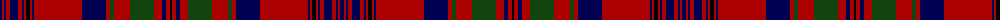

In pattern [BRBRBRBRKRBRBRGRGRBRK](/patterns/brbrbrbrkrbrbrgrgrbrk/).

This was sourced from weddslist.  It is a [21 stripes tartan](/stripes/stripes21/).

Original link http://www.weddslist.com/cgi-bin/tartans/pg.pl?source=tinsel

## Thread count
DB/4 DR2 DB2 DR4 DB8 DR4 DB2 DR2 K4 DR2 DB2 DR48 DB24 DR4 DG4 DR16 DG24 DR8 DB4 DR4 K/2

## Palette
Each colour and its ΔE from the base-6 reference it is a variant of.

| Colour | Shade | Base | ΔE (OKLab) |
|---|---|---|---|
| DB | <code style="background-color:#000052;">#000052</code> `#000052` | B <code style="background-color:#2A418A;">#2A418A</code> | 0.20 |
| DG | <code style="background-color:#11450D;">#11450D</code> `#11450D` | G <code style="background-color:#006100;">#006100</code> | 0.09 |
| DR | <code style="background-color:#AA0000;">#AA0000</code> `#AA0000` | R <code style="background-color:#CC0000;">#CC0000</code> | 0.07 |
| K | <code style="background-color:#000000;">#000000</code> `#000000` | K <code style="background-color:#000000;">#000000</code> | 0.00 |

## Nearest tartans

The nearest existing variants by ΔTartan distance.

1. [Murray of Tullibardine](/setts/s21/b2r1b1r2b4r2b1r1k2r1b1r24b12r2g2r8g12r4b2r2k1-b000052-g11450d-k000000-raa0000/) — ΔT 0.00
1. [Murray of Tullibardine Family Tartan Tartan Number: 441. Earliest known date: 1850 (1679) James Grant, in his book, 'The Tartans of the Clans of Scotland' (1886) says, "That tartan called the Tullibardine is a red tartan, and was adopted and worn by Charles, the first Earl of Dunmore, second son of the first Marquis of Tullibardine ..in 1679 (he) was lieutenant Colonel of the Royal Grey Dragoons..." The same sett is shown in the earlier work of the Smith brothers, 'Authenticated Tartans..' (1850) This is the sett shown in the famous picture of the Chief of the MacLeods, Normand MacLeod, at Dunvegan Castle. See 'Red MacLeod'. See products available Copyright © Blair Urquhart, Comrie, 2015](/setts/s21/b4r2b2r4b8r4b2r2k4r2b2r48b24r4g4r16g24r8b4r4k2-b2c2c80-g006818-k101010-rc80000/) — ΔT 0.92
1. [Murray of Tullibardine 1](/setts/s21/b4r2b2r4b8r4b2r2k4r2b2r48b24r4g4r16g24r8b4r4k2-b304080-g008000-k000000-rc00000/) — ΔT 0.98
1. [Hunter of Bute (Personal)](/setts/s16/r24g12k12g4k2g2k12r48w4r48k12g2k2g4k12g12-g006818-k101010-r901c38-wf8f8f8/) — ΔT 1.01
1. [Murray of Tullibardine - 1820 (Clan)](/setts/s21/b7r2b2r5b24r6b2r2k8r2b2r50b50r10g10r50g50r30b22r24k3-b202060-g006438-k101010-rc80000/) — ΔT 1.02
1. [Murray of Tullibardine](/setts/s21/b2r1b1r2b4r2b1r1b2r1b1r24b12r2g2r8g12r4b2r2b1-b00004c-g004c00-rc80000/) — ΔT 1.04
1. [Murray of Tullibardine #2](/setts/s21/b4r2b2r4b8r4b2r2k4r2b2r48b24r4g4r16g24r8b4r4k2-b2c4084-g005020-k101010-rdc0000/) — ΔT 1.12
1. [Murray (Bed hanging)](/setts/s21/b8r4b4r8b16r8b4r4k8r4b4r96b48r8k8r32k48r16b8r8k4-b2c2c80-k101010-rc80000/) — ΔT 1.18
1. [Royal Bahrain (Royal)](/setts/s18/b32r2b4r6b2r18b2r6b4r2b12g6w6g10r56wa6r6wa6-b003c64-g005430-r880000-w98c8e8-wae0e0e0/) — ΔT 1.24
1. [Matheson Clan Tartan Tartan Number: 860. Earliest known date: 1850 The design usually worn by Mathesons is given by Smith although earlier versions are recorded. McIan's drawing could be taken to represent either of the two red designs of which this is one. The Mathesons were involved with other clans who settled in Lochalsh, and in particular with the MacDonells of Glengarry and the MacKenzies of Kintail. The tartan has a design structure which relates to the Glengarry which dates at least to c.1816 when a sample was certified by the chief. See products available Copyright © Blair Urquhart, Comrie, 2015](/setts/s21/g16r8g2r2g2r48b16g8r2g2r2g8r16g2r2g2r2b16g16r4g8-b2c2c80-g003820-rc80000/) — ΔT 1.25

## Neighbour map

Every grey dot is one of 15726 variants placed by the first two principal components of the ΔTartan feature space (44% of its variance). Red is this tartan; blue dots are its nearest — click one to open its page.

<svg viewBox="0 0 640 380" role="img" style="max-width:100%;height:auto;border:1px solid #e0e0e0;border-radius:4px;display:block" xmlns="http://www.w3.org/2000/svg"><image href="/nn/cloud.v1.png" width="640" height="380"/><a href="/setts/s21/b2r1b1r2b4r2b1r1k2r1b1r24b12r2g2r8g12r4b2r2k1-b000052-g11450d-k000000-raa0000/"><circle cx="336.2" cy="91.6" r="4" fill="#3465a4"><title>Murray of Tullibardine</title></circle></a><a href="/setts/s21/b4r2b2r4b8r4b2r2k4r2b2r48b24r4g4r16g24r8b4r4k2-b2c2c80-g006818-k101010-rc80000/"><circle cx="343.1" cy="87.9" r="4" fill="#3465a4"><title>Murray of Tullibardine Family Tartan Tartan Number: 441. Earliest known date: 1850 (1679) James Grant, in his book, 'The Tartans of the Clans of Scotland' (1886) says, &quot;That tartan called the Tullibardine is a red tartan, and was adopted and worn by Charles, the first Earl of Dunmore, second son of the first Marquis of Tullibardine ..in 1679 (he) was lieutenant Colonel of the Royal Grey Dragoons...&quot; The same sett is shown in the earlier work of the Smith brothers, 'Authenticated Tartans..' (1850) This is the sett shown in the famous picture of the Chief of the MacLeods, Normand MacLeod, at Dunvegan Castle. See 'Red MacLeod'. See products available Copyright © Blair Urquhart, Comrie, 2015</title></circle></a><a href="/setts/s21/b4r2b2r4b8r4b2r2k4r2b2r48b24r4g4r16g24r8b4r4k2-b304080-g008000-k000000-rc00000/"><circle cx="338.8" cy="87.3" r="4" fill="#3465a4"><title>Murray of Tullibardine 1</title></circle></a><a href="/setts/s16/r24g12k12g4k2g2k12r48w4r48k12g2k2g4k12g12-g006818-k101010-r901c38-wf8f8f8/"><circle cx="355.5" cy="123.4" r="4" fill="#3465a4"><title>Hunter of Bute (Personal)</title></circle></a><a href="/setts/s21/b7r2b2r5b24r6b2r2k8r2b2r50b50r10g10r50g50r30b22r24k3-b202060-g006438-k101010-rc80000/"><circle cx="307.5" cy="104.7" r="4" fill="#3465a4"><title>Murray of Tullibardine - 1820 (Clan)</title></circle></a><a href="/setts/s21/b2r1b1r2b4r2b1r1b2r1b1r24b12r2g2r8g12r4b2r2b1-b00004c-g004c00-rc80000/"><circle cx="347.6" cy="98.7" r="4" fill="#3465a4"><title>Murray of Tullibardine</title></circle></a><a href="/setts/s21/b4r2b2r4b8r4b2r2k4r2b2r48b24r4g4r16g24r8b4r4k2-b2c4084-g005020-k101010-rdc0000/"><circle cx="340.5" cy="84.7" r="4" fill="#3465a4"><title>Murray of Tullibardine #2</title></circle></a><a href="/setts/s21/b8r4b4r8b16r8b4r4k8r4b4r96b48r8k8r32k48r16b8r8k4-b2c2c80-k101010-rc80000/"><circle cx="360.5" cy="101.0" r="4" fill="#3465a4"><title>Murray (Bed hanging)</title></circle></a><a href="/setts/s18/b32r2b4r6b2r18b2r6b4r2b12g6w6g10r56wa6r6wa6-b003c64-g005430-r880000-w98c8e8-wae0e0e0/"><circle cx="309.4" cy="81.3" r="4" fill="#3465a4"><title>Royal Bahrain (Royal)</title></circle></a><a href="/setts/s21/g16r8g2r2g2r48b16g8r2g2r2g8r16g2r2g2r2b16g16r4g8-b2c2c80-g003820-rc80000/"><circle cx="326.4" cy="116.3" r="4" fill="#3465a4"><title>Matheson Clan Tartan Tartan Number: 860. Earliest known date: 1850 The design usually worn by Mathesons is given by Smith although earlier versions are recorded. McIan's drawing could be taken to represent either of the two red designs of which this is one. The Mathesons were involved with other clans who settled in Lochalsh, and in particular with the MacDonells of Glengarry and the MacKenzies of Kintail. The tartan has a design structure which relates to the Glengarry which dates at least to c.1816 when a sample was certified by the chief. See products available Copyright © Blair Urquhart, Comrie, 2015</title></circle></a><circle cx="336.2" cy="91.6" r="5" fill="#c00000"/></svg>

ID: /setts/s21/b4r2b2r4b8r4b2r2k4r2b2r48b24r4g4r16g24r8b4r4k2-b000052-g11450d-k000000-raa0000/
