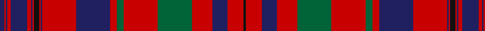

In pattern [BRBRBRBRKRBRBRGRGRBRK](/patterns/brbrbrbrkrbrbrgrgrbrk/).

This was sourced from tartans-authority.  It is a [21 stripes tartan](/stripes/stripes21/).

Original link http://www.tartansauthority.com/tartan-ferret/display/415/

## Thread count
DB/7 R2 DB2 R5 DB24 R6 DB2 R2 K8 R2 DB2 R50 DB50 R10 G10 R50 G50 R30 DB22 R24 K/3

## Palette
Each colour and its ΔE from the base-6 reference it is a variant of.

| Colour | Shade | Base | ΔE (OKLab) |
|---|---|---|---|
| DB | <code style="background-color:#202060;">#202060</code> `#202060` | B <code style="background-color:#2A418A;">#2A418A</code> | 0.11 |
| G | <code style="background-color:#006438;">#006438</code> `#006438` | G <code style="background-color:#006100;">#006100</code> | 0.05 |
| K | <code style="background-color:#101010;">#101010</code> `#101010` | K <code style="background-color:#000000;">#000000</code> | 0.17 |
| R | <code style="background-color:#C80000;">#C80000</code> `#C80000` | R <code style="background-color:#CC0000;">#CC0000</code> | 0.01 |

## Nearest tartans

The nearest existing variants by ΔTartan distance.

1. [MacLeod Red](/setts/s21/b4r1b1r2b11r2b1r1y1r1b1r16b8r4g4r16g11r8b4r2y2~b2c2c80-g006818-rc80000-ye8c000~x2/) — ΔT 0.82
1. [Murray of Tullibardine Family Tartan Tartan Number: 441. Earliest known date: 1850 (1679) James Grant, in his book, 'The Tartans of the Clans of Scotland' (1886) says, "That tartan called the Tullibardine is a red tartan, and was adopted and worn by Charles, the first Earl of Dunmore, second son of the first Marquis of Tullibardine ..in 1679 (he) was lieutenant Colonel of the Royal Grey Dragoons..." The same sett is shown in the earlier work of the Smith brothers, 'Authenticated Tartans..' (1850) This is the sett shown in the famous picture of the Chief of the MacLeods, Normand MacLeod, at Dunvegan Castle. See 'Red MacLeod'. See products available Copyright © Blair Urquhart, Comrie, 2015](/setts/s21/b2r1b1r2b4r2b1r1k2r1b1r24b12r2g2r8g12r4b2r2k1~b2c2c80-g006818-k101010-rc80000~x2/) — ΔT 0.83
1. [MacLeod Red Clan Tartan Tartan Number: 496. Earliest known date: 1982 Designed after the tartan worn by Norman MacLeod, 22nd Chief of the clan, painted by Allan Ramsay in 1747, with the costume painted by Van Haecken (see details in entry for MacLeod portrait.) A yellow stripe was added by Ruairidh MacLeod to enhance the family resemblance to other MacLeod tartans, and to differentiate this from Murray of Tullibardine, the name now attached to the sett in the portrait. Approved by the Clan MacLeod Parliament in 1982. See products available Copyright © Blair Urquhart, Comrie, 2015](/setts/s21/b4r1b1r2b11r2b1r1y1r1b1r16b8r4g4r16g11r8b4r2y2~b202060-g006818-rc80000-ye8c000~x2/) — ΔT 0.83
1. [Murray of Tullibardine 1](/setts/s21/b2r1b1r2b4r2b1r1k2r1b1r24b12r2g2r8g12r4b2r2k1~b304080-g008000-k000000-rc00000~x2/) — ΔT 0.91
1. [Murray of Tullibardine #2](/setts/s21/b2r1b1r2b4r2b1r1k2r1b1r24b12r2g2r8g12r4b2r2k1~b2c4084-g005020-k101010-rdc0000~x2/) — ΔT 0.94
1. [Fiddes](/setts/s18/g12r11b12k1b1k1r32b8g8b8g8r32k1b1k1b12r11g12~b800080-g008000-k000000-rc00000~x2/) — ΔT 0.94
1. [Murray of Tullibardine (plaid)](/setts/s21/b4r1b1r4b12r4b1r1g4r1b1r26b26r4g4r26g21r13b6r5g1~b2c4084-g005020-rdc0000~x2/) — ΔT 0.99
1. [Murray of Tullibardine](/setts/s21/b2r1b1r2b4r2b1r1k2r1b1r24b12r2g2r8g12r4b2r2k1~b000052-g11450d-k000000-raa0000~x2/) — ΔT 1.02
1. [Murray of Tullibardine](/setts/s21/b2r1b1r2b4r2b1r1k2r1b1r24b12r2g2r8g12r4b2r2k1~b000052-g11450d-k000000-raa0000/) — ΔT 1.02
1. [Hunter of Bute (Personal)](/setts/s16/r12g6k6g2k1g1k6r24w2r24k6g1k1g2k6g6~g006818-k101010-r901c38-wf8f8f8~x2/) — ΔT 1.04

## Neighbour map

Every grey dot is one of 15726 variants placed by the first two principal components of the ΔTartan feature space (44% of its variance). Red is this tartan; blue dots are its nearest — click one to open its page.

<svg viewBox="0 0 640 380" role="img" style="max-width:100%;height:auto;border:1px solid #e0e0e0;border-radius:4px;display:block" xmlns="http://www.w3.org/2000/svg"><image href="/nn/cloud.v1.png" width="640" height="380"/><a href="/setts/s21/b4r1b1r2b11r2b1r1y1r1b1r16b8r4g4r16g11r8b4r2y2~b2c2c80-g006818-rc80000-ye8c000~x2/"><circle cx="300.0" cy="121.3" r="4" fill="#3465a4"><title>MacLeod Red</title></circle></a><a href="/setts/s21/b2r1b1r2b4r2b1r1k2r1b1r24b12r2g2r8g12r4b2r2k1~b2c2c80-g006818-k101010-rc80000~x2/"><circle cx="345.3" cy="89.4" r="4" fill="#3465a4"><title>Murray of Tullibardine Family Tartan Tartan Number: 441. Earliest known date: 1850 (1679) James Grant, in his book, 'The Tartans of the Clans of Scotland' (1886) says, &quot;That tartan called the Tullibardine is a red tartan, and was adopted and worn by Charles, the first Earl of Dunmore, second son of the first Marquis of Tullibardine ..in 1679 (he) was lieutenant Colonel of the Royal Grey Dragoons...&quot; The same sett is shown in the earlier work of the Smith brothers, 'Authenticated Tartans..' (1850) This is the sett shown in the famous picture of the Chief of the MacLeods, Normand MacLeod, at Dunvegan Castle. See 'Red MacLeod'. See products available Copyright © Blair Urquhart, Comrie, 2015</title></circle></a><a href="/setts/s21/b4r1b1r2b11r2b1r1y1r1b1r16b8r4g4r16g11r8b4r2y2~b202060-g006818-rc80000-ye8c000~x2/"><circle cx="296.2" cy="120.4" r="4" fill="#3465a4"><title>MacLeod Red Clan Tartan Tartan Number: 496. Earliest known date: 1982 Designed after the tartan worn by Norman MacLeod, 22nd Chief of the clan, painted by Allan Ramsay in 1747, with the costume painted by Van Haecken (see details in entry for MacLeod portrait.) A yellow stripe was added by Ruairidh MacLeod to enhance the family resemblance to other MacLeod tartans, and to differentiate this from Murray of Tullibardine, the name now attached to the sett in the portrait. Approved by the Clan MacLeod Parliament in 1982. See products available Copyright © Blair Urquhart, Comrie, 2015</title></circle></a><a href="/setts/s21/b2r1b1r2b4r2b1r1k2r1b1r24b12r2g2r8g12r4b2r2k1~b304080-g008000-k000000-rc00000~x2/"><circle cx="341.0" cy="88.8" r="4" fill="#3465a4"><title>Murray of Tullibardine 1</title></circle></a><a href="/setts/s21/b2r1b1r2b4r2b1r1k2r1b1r24b12r2g2r8g12r4b2r2k1~b2c4084-g005020-k101010-rdc0000~x2/"><circle cx="342.6" cy="86.3" r="4" fill="#3465a4"><title>Murray of Tullibardine #2</title></circle></a><a href="/setts/s18/g12r11b12k1b1k1r32b8g8b8g8r32k1b1k1b12r11g12~b800080-g008000-k000000-rc00000~x2/"><circle cx="317.1" cy="106.2" r="4" fill="#3465a4"><title>Fiddes</title></circle></a><a href="/setts/s21/b4r1b1r4b12r4b1r1g4r1b1r26b26r4g4r26g21r13b6r5g1~b2c4084-g005020-rdc0000~x2/"><circle cx="343.6" cy="113.6" r="4" fill="#3465a4"><title>Murray of Tullibardine (plaid)</title></circle></a><a href="/setts/s21/b2r1b1r2b4r2b1r1k2r1b1r24b12r2g2r8g12r4b2r2k1~b000052-g11450d-k000000-raa0000~x2/"><circle cx="338.4" cy="93.5" r="4" fill="#3465a4"><title>Murray of Tullibardine</title></circle></a><a href="/setts/s21/b2r1b1r2b4r2b1r1k2r1b1r24b12r2g2r8g12r4b2r2k1~b000052-g11450d-k000000-raa0000/"><circle cx="338.4" cy="93.5" r="4" fill="#3465a4"><title>Murray of Tullibardine</title></circle></a><a href="/setts/s16/r12g6k6g2k1g1k6r24w2r24k6g1k1g2k6g6~g006818-k101010-r901c38-wf8f8f8~x2/"><circle cx="357.1" cy="125.1" r="4" fill="#3465a4"><title>Hunter of Bute (Personal)</title></circle></a><circle cx="309.5" cy="105.8" r="5" fill="#c00000"/></svg>

ID: /setts/s21/b7r2b2r5b24r6b2r2k8r2b2r50b50r10g10r50g50r30b22r24k3~b202060-g006438-k101010-rc80000/
