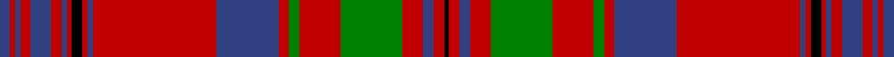

In pattern [BRBRBRBRKRBRBRGRGRBRK](/stripes/brbrbrbrkrbrbrgrgrbrk/).

This was sourced from weddslist.  It is a [21 stripe tartan](/stripes/stripes21/).

Original link http://www.weddslist.com/cgi-bin/tartans/pg.pl?source=sts

## Also known as

This cloth is also recorded under:

- Murray of Tullibardine #2
- Murray of Tullibardine 1

## Attestations

This cloth appears in 2 source records; the oldest owns this page.

- undated — Murray of Tullibardine 1 (weddslist, [record](http://www.weddslist.com/cgi-bin/tartans/pg.pl?source=sts))
- undated — Murray of Tullibardine Family Tartan Tartan Number: 441. Earliest known date: 1850 (1679) James Grant, in his book, 'The Tartans of the Clans of Scotland' (1886) says, "That tartan called the Tullibardine is a red tartan, and was adopted and worn by Charles, the first Earl of Dunmore, second son of the first Marquis of Tullibardine ..in 1679 (he) was lieutenant Colonel of the Royal Grey Dragoons..." The same sett is shown in the earlier work of the Smith brothers, 'Authenticated Tartans..' (1850) This is the sett shown in the famous picture of the Chief of the MacLeods, Normand MacLeod, at Dunvegan Castle. See 'Red MacLeod'. See products available Copyright © Blair Urquhart, Comrie, 2015 (house-of-tartan, [record](http://www.house-of-tartan.scotland.net/house/TartanViewjs.asp?colr=Def&tnam=441))

## Thread count
B/4 R2 B2 R4 B8 R4 B2 R2 K4 R2 B2 R48 B24 R4 G4 R16 G24 R8 B4 R4 K/2

## Palette
Each colour and the base-6 reference it is a variant of.

| Colour | Shade | Base |
|---|---|---|
| B | <code style="background-color:#304080;">#304080</code> `oklch(39.4% 0.109 270.2)` <small>#304080</small> | B <code style="background-color:#2A418A;">#2A418A</code> |
| G | <code style="background-color:#008000;">#008000</code> `oklch(52.0% 0.177 142.5)` <small>#008000</small> | G <code style="background-color:#006100;">#006100</code> |
| K | <code style="background-color:#000000;">#000000</code> `oklch(0.0% 0.000 0.0)` <small>#000000</small> | K <code style="background-color:#000000;">#000000</code> |
| R | <code style="background-color:#C00000;">#C00000</code> `oklch(50.7% 0.208 29.2)` <small>#C00000</small> | R <code style="background-color:#CC0000;">#CC0000</code> |

## Nearest tartans

The nearest existing variants by ΔTartan distance.

1. [Murray of Tullibardine #2](/setts/s21/db2r1db1r2db4r2db1r1k2r1db1r24db12r2dg2r8dg12r4db2r2k1~x2/) — ΔT 0.41
1. [Winthrop University (Corporate)](/setts/s15/r2lb2db6r2db2r2db1r20lo1r2lo2r2lo6lb2lo2~x2/) — ΔT 0.85
1. [Murray of Tullibardine - 1820 (Clan)](/setts/s21/db7r2db2r5db24r6db2r2k8r2db2r50db50r10g10r50g50r30db22r24k3/) — ΔT 0.91
1. [Drummond](/setts/s16/r6db1r2db2r28t2r2db9r2g2r2g24r3db2r6db2~x2/) — ΔT 0.95
1. [Murray of Tullibardine](/setts/s21/db2r1db1r2db4r2db1r1k2r1db1r24db12r2dg2r8dg12r4db2r2k1/) — ΔT 0.98
1. [Grant or Drummond Clan Tartan Tartan Number: 1384. Earliest known date: 1831 The usual design is sometimes called Drummond. It is recorded by Logan (1831), Smibert (1850), and Smith (1850). McIan's drawing of the Grant tartan is too roughly done to make out the pattern details. A certain difficulty arises in establishing a single Grant tartan to represent the clan, illustrated by the existance of ten Grant portraits at Cullen House in which each brother is wearing a different tartan, and where a coat or plaid is worn, these also differ. The chief of the Grants is Lord Strathspey. See products available Copyright © Blair Urquhart, Comrie, 2015](/setts/s15/r6db2r2g24r2g2r2db8r2t2r32db2r2db1r6~x2/) — ΔT 1.02
1. [Dalzell](/setts/s17/r24lb1db2r4dg32r4db2lb1r4db6r4lb1db2r32dg2r3dg6~x2/) — ΔT 1.04
1. [Murray of Tullibardine (plaid)](/setts/s21/db4r1db1r4db12r4db1r1dg4r1db1r26db26r4dg4r26dg21r13db6r5dg1~x2/) — ΔT 1.08
1. [MacLeod Red](/setts/s21/db4r1db1r2db11r2db1r1ly1r1db1r16db8r4g4r16g11r8db4r2ly2~x2/) — ΔT 1.08
1. [Grant](/setts/s15/r6db2r2dg24r2db2r2db8r2lb1r32db2r2db1r6~x2/) — ΔT 1.09

## Neighbour map

Every grey dot is one of 14299 variants placed by the first two principal components of the ΔTartan feature space (44% of its variance). Red is this tartan; blue dots are its nearest — click one to open its page.

<svg viewBox="0 0 640 380" role="img" style="max-width:100%;height:auto;border:1px solid #e0e0e0;border-radius:4px;display:block" xmlns="http://www.w3.org/2000/svg"><image href="/nn/cloud.v1.png" width="640" height="380"/><a href="/setts/s21/db2r1db1r2db4r2db1r1k2r1db1r24db12r2dg2r8dg12r4db2r2k1~x2/"><circle cx="343.0" cy="85.4" r="4" fill="#3465a4"><title>Murray of Tullibardine #2</title></circle></a><a href="/setts/s15/r2lb2db6r2db2r2db1r20lo1r2lo2r2lo6lb2lo2~x2/"><circle cx="337.1" cy="106.1" r="4" fill="#3465a4"><title>Winthrop University (Corporate)</title></circle></a><a href="/setts/s21/db7r2db2r5db24r6db2r2k8r2db2r50db50r10g10r50g50r30db22r24k3/"><circle cx="310.3" cy="106.2" r="4" fill="#3465a4"><title>Murray of Tullibardine - 1820 (Clan)</title></circle></a><a href="/setts/s16/r6db1r2db2r28t2r2db9r2g2r2g24r3db2r6db2~x2/"><circle cx="360.9" cy="99.6" r="4" fill="#3465a4"><title>Drummond</title></circle></a><a href="/setts/s21/db2r1db1r2db4r2db1r1k2r1db1r24db12r2dg2r8dg12r4db2r2k1/"><circle cx="339.6" cy="93.2" r="4" fill="#3465a4"><title>Murray of Tullibardine</title></circle></a><a href="/setts/s15/r6db2r2g24r2g2r2db8r2t2r32db2r2db1r6~x2/"><circle cx="391.0" cy="92.9" r="4" fill="#3465a4"><title>Grant or Drummond Clan Tartan Tartan Number: 1384. Earliest known date: 1831 The usual design is sometimes called Drummond. It is recorded by Logan (1831), Smibert (1850), and Smith (1850). McIan's drawing of the Grant tartan is too roughly done to make out the pattern details. A certain difficulty arises in establishing a single Grant tartan to represent the clan, illustrated by the existance of ten Grant portraits at Cullen House in which each brother is wearing a different tartan, and where a coat or plaid is worn, these also differ. The chief of the Grants is Lord Strathspey. See products available Copyright © Blair Urquhart, Comrie, 2015</title></circle></a><a href="/setts/s17/r24lb1db2r4dg32r4db2lb1r4db6r4lb1db2r32dg2r3dg6~x2/"><circle cx="381.4" cy="84.0" r="4" fill="#3465a4"><title>Dalzell</title></circle></a><a href="/setts/s21/db4r1db1r4db12r4db1r1dg4r1db1r26db26r4dg4r26dg21r13db6r5dg1~x2/"><circle cx="344.0" cy="112.9" r="4" fill="#3465a4"><title>Murray of Tullibardine (plaid)</title></circle></a><a href="/setts/s21/db4r1db1r2db11r2db1r1ly1r1db1r16db8r4g4r16g11r8db4r2ly2~x2/"><circle cx="300.6" cy="120.6" r="4" fill="#3465a4"><title>MacLeod Red</title></circle></a><a href="/setts/s15/r6db2r2dg24r2db2r2db8r2lb1r32db2r2db1r6~x2/"><circle cx="377.4" cy="84.1" r="4" fill="#3465a4"><title>Grant</title></circle></a><circle cx="341.6" cy="88.4" r="5" fill="#c00000"/></svg>

ID: /setts/s21/db2r1db1r2db4r2db1r1k2r1db1r24db12r2g2r8g12r4db2r2k1~x2/
