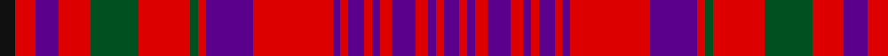

**Bands:** [BRBRBRBRBRBRBRGRGRBRK](/stripes/brbrbrbrbrbrbrgrgrbrk/) · **Stripes:** [DP R DP R DP R DP R DP R DP R DP R DG R DG R DP R K](/stripes/stripes21/) DP R DP R DP R DP R DP R DP R DP R DG R DG R DP R K

This was sourced from register-of-tartans.  It is a [21 band tartan](/bands/bands21/).

Original link https://www.tartanregister.gov.uk/tartanDetails.aspx?ref=3073

## Register references

External register numbers recorded for this tartan.

- Scottish Register of Tartans: [3073](https://www.tartanregister.gov.uk/tartanDetails.aspx?ref=3073)
- Scottish Tartans World Register: 442

## Thread count
K/8 R10 P12 R16 G24 R26 G4 R4 P24 R40 P4 R4 P8 R4 P4 R6 P12 R6 P4 R4 P/8

## Palette
Each colour and its ΔE from the base-6 reference it is a variant of.

| Colour | Shade | Base | ΔE (OKLab) |
|---|---|---|---|
| G | <code style="background-color:#005020;">#005020</code> `#005020` | G <code style="background-color:#006100;">#006100</code> | 0.07 |
| K | <code style="background-color:#101010;">#101010</code> `#101010` | K <code style="background-color:#000000;">#000000</code> | 0.17 |
| P | <code style="background-color:#5A008C;">#5A008C</code> `#5A008C` | B <code style="background-color:#2A418A;">#2A418A</code> | 0.13 |
| R | <code style="background-color:#DC0000;">#DC0000</code> `#DC0000` | R <code style="background-color:#CC0000;">#CC0000</code> | 0.03 |

## Nearest tartans

The nearest existing variants by ΔTartan distance.

1. [Murray of Tullibardine 3](/setts/s21/k4r5p6r8g12r13g2r2p12r20p2r2p4r2p2r3p6r3p2r2p4~x2/) — ΔT 0.64
1. [Ensemble Pour L'Avenir](/setts/s18/db3o1db2r14o2r1o2db10r10db10w2r2w2r14o6r10db10w2~x2/) — ΔT 1.04
1. [Hebrides #2](/setts/s20/db25db2r25g10r4db25r2g2r25g2r2g2r25g2r2db25r4g10r25db2~x2/) — ΔT 1.10
1. [Lumsden of Clova](/setts/s25/dg9r2dg9r9dg2r4dg2r9w1r4dp11r2dp11r4w1r9dp1r1dp2r1dp1r9dp9r2dp9~x2/) — ΔT 1.13
1. [Ensemble Pour l'Avenir](/setts/s18/db3y1db2r14y2r1y2db10r10db10w2r2w2r14y6r10db10w2~x2/) — ΔT 1.19
1. [Hebrides #4](/setts/s20/r25t2db25r2g2r25g2r2db25r4db25r2g2r25g2r2db25t2r25g10~x2/) — ΔT 1.19
1. [MacLeod of Tullibardine](/setts/s21/db4r1db1r2db10r2db1r1k1r1db1r12db6r4g4r12g10r6db4r2k2~x4/) — ΔT 1.22
1. [MacLeod Red](/setts/s21/db4r1db1r2db11r2db1r1ly1r1db1r16db8r4g4r16g11r8db4r2ly2~x2/) — ΔT 1.32
1. [Murray of Tullibardine](/setts/s21/db4r2db2r3db12r3db2r2k5r2db2r22db26r6dg6r22dg23r14db8r7k3~x2/) — ΔT 1.33
1. [Ross #3](/setts/s31/dg23r6dg23r26dg4r9dg4r26w3r8dp31r6dp31r8w3r26dp2r2dp4r2dp2r26dp2r2dp4r2dp2r26dg23r6dg23~x2/) — ΔT 1.37

## Neighbour map

Every grey dot is one of 14313 variants placed by the first two principal components of the ΔTartan feature space (44% of its variance). Red is this tartan; blue dots are its nearest — click one to open its page.

<svg viewBox="0 0 640 380" role="img" style="max-width:100%;height:auto;border:1px solid #e0e0e0;border-radius:4px;display:block" xmlns="http://www.w3.org/2000/svg"><image href="/nn/cloud.v1.png" width="640" height="380"/><a href="/setts/s21/k4r5p6r8g12r13g2r2p12r20p2r2p4r2p2r3p6r3p2r2p4~x2/"><circle cx="291.7" cy="149.3" r="4" fill="#3465a4"><title>Murray of Tullibardine 3</title></circle></a><a href="/setts/s18/db3o1db2r14o2r1o2db10r10db10w2r2w2r14o6r10db10w2~x2/"><circle cx="264.1" cy="141.4" r="4" fill="#3465a4"><title>Ensemble Pour L'Avenir</title></circle></a><a href="/setts/s20/db25db2r25g10r4db25r2g2r25g2r2g2r25g2r2db25r4g10r25db2~x2/"><circle cx="293.4" cy="138.3" r="4" fill="#3465a4"><title>Hebrides #2</title></circle></a><a href="/setts/s25/dg9r2dg9r9dg2r4dg2r9w1r4dp11r2dp11r4w1r9dp1r1dp2r1dp1r9dp9r2dp9~x2/"><circle cx="256.6" cy="150.8" r="4" fill="#3465a4"><title>Lumsden of Clova</title></circle></a><a href="/setts/s18/db3y1db2r14y2r1y2db10r10db10w2r2w2r14y6r10db10w2~x2/"><circle cx="276.3" cy="148.8" r="4" fill="#3465a4"><title>Ensemble Pour l'Avenir</title></circle></a><a href="/setts/s20/r25t2db25r2g2r25g2r2db25r4db25r2g2r25g2r2db25t2r25g10~x2/"><circle cx="291.7" cy="142.0" r="4" fill="#3465a4"><title>Hebrides #4</title></circle></a><a href="/setts/s21/db4r1db1r2db10r2db1r1k1r1db1r12db6r4g4r12g10r6db4r2k2~x4/"><circle cx="268.3" cy="142.1" r="4" fill="#3465a4"><title>MacLeod of Tullibardine</title></circle></a><a href="/setts/s21/db4r1db1r2db11r2db1r1ly1r1db1r16db8r4g4r16g11r8db4r2ly2~x2/"><circle cx="300.9" cy="120.7" r="4" fill="#3465a4"><title>MacLeod Red</title></circle></a><a href="/setts/s21/db4r2db2r3db12r3db2r2k5r2db2r22db26r6dg6r22dg23r14db8r7k3~x2/"><circle cx="259.1" cy="132.5" r="4" fill="#3465a4"><title>Murray of Tullibardine</title></circle></a><a href="/setts/s31/dg23r6dg23r26dg4r9dg4r26w3r8dp31r6dp31r8w3r26dp2r2dp4r2dp2r26dp2r2dp4r2dp2r26dg23r6dg23~x2/"><circle cx="265.9" cy="106.7" r="4" fill="#3465a4"><title>Ross #3</title></circle></a><circle cx="277.4" cy="142.4" r="5" fill="#c00000"/></svg>

ID: /setts/s21/dp4r2dp2r3dp6r3dp2r2dp4r2dp2r20dp12r2dg2r13dg12r8dp6r5k4~x2/
