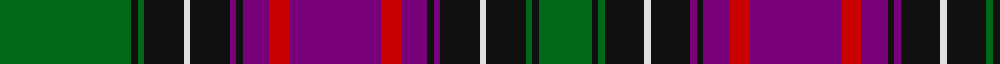

In pattern [GKGKWKBKBRBRBKBKWKGKG](/stripes/gkgkwkbkbrbrbkbkwkgkg/).

This was sourced from house-of-tartan.  It is a [21 stripe tartan](/stripes/stripes21/).

Original link http://www.house-of-tartan.scotland.net/house/TartanViewjs.asp?colr=Def&tnam=1102

## Thread count
G/40 K2 G2 K12 LN2 K12 P2 K2 P8 R6 P28 R6 P8 K2 P2 K12 LN2 K12 G2 K2 G/16

## Palette
Each colour and the base-6 reference it is a variant of.

| Colour | Shade | Base |
|---|---|---|
| G | <code style="background-color:#006818;">#006818</code> `oklch(45.0% 0.142 145.0)` <small>#006818</small> | G <code style="background-color:#006100;">#006100</code> |
| K | <code style="background-color:#101010;">#101010</code> `oklch(17.3% 0.000 89.9)` <small>#101010</small> | K <code style="background-color:#000000;">#000000</code> |
| LN | <code style="background-color:#E0E0E0;">#E0E0E0</code> `oklch(90.7% 0.000 89.9)` <small>#E0E0E0</small> | W <code style="background-color:#F7F7F7;">#F7F7F7</code> |
| P | <code style="background-color:#780078;">#780078</code> `oklch(40.2% 0.185 328.4)` <small>#780078</small> | B <code style="background-color:#2A418A;">#2A418A</code> |
| R | <code style="background-color:#C80000;">#C80000</code> `oklch(52.3% 0.215 29.2)` <small>#C80000</small> | R <code style="background-color:#CC0000;">#CC0000</code> |

## Nearest tartans

The nearest existing variants by ΔTartan distance, with this tartan at the top so the swatches line up against it.

ΔTartan

Tartan

Sett

—

<a href="/ttd/edit/#slug=g20k1g1k6w1k6dp1k1dp4r3dp14r3dp4k1dp1k6w1k6g1k1g8~x2">New Hampshire District Tartan Tartan Number: 1102. Earliest known date: 1994 New Hampshire State Representative Steven Avery, arranged for Governor Stephen Merrill to proclaim the Tartan as the State Tartan of New Hampshire in June 1994. In January 1995, Avery introduced the bill to the NH Legislature for permanent recognition, which was passed in May, 1995. The purple represents the finch and the lilac, green the forests, black the granite mountains, white for the snow, and red for the States heroes. New Hampshire Revised Statutes Annotated (RSA) 3:21. See products available Copyright © Blair Urquhart, Comrie, 2015</a> <a class="nn-out" href="/setts/s21/g20k1g1k6w1k6dp1k1dp4r3dp14r3dp4k1dp1k6w1k6g1k1g8~x2/" title="open its dictionary page">↗</a>

0.83

<a href="/ttd/edit/#slug=r10db6r3db3r3db28k22g28r2k2ly4k2r2g28k22db28r3db3r3db6r5~x2">Logan</a> <a class="nn-out" href="/setts/s21/r10db6r3db3r3db28k22g28r2k2ly4k2r2g28k22db28r3db3r3db6r5~x2/" title="open its dictionary page">↗</a>

0.93

<a href="/ttd/edit/#slug=ly2db8r3db16r1k16g16r3g1r1g8r1g1r3g16k16r1db16r3db8ly1~x4">Cameron</a> <a class="nn-out" href="/setts/s21/ly2db8r3db16r1k16g16r3g1r1g8r1g1r3g16k16r1db16r3db8ly1~x4/" title="open its dictionary page">↗</a>

0.94

<a href="/ttd/edit/#slug=r5k20n1k2n1k2n2k2n5o2n2o2n2o3n2o10w3~x2">Nike Golf Dark (Corporate)</a> <a class="nn-out" href="/setts/s17/r5k20n1k2n1k2n2k2n5o2n2o2n2o3n2o10w3~x2/" title="open its dictionary page">↗</a>

0.96

<a href="/ttd/edit/#slug=g46r6g6r2g8r2g6r2g6dr36r2db47r6db24ly6">Cochrane Hunting</a> <a class="nn-out" href="/setts/s15/g46r6g6r2g8r2g6r2g6dr36r2db47r6db24ly6/" title="open its dictionary page">↗</a>

1.09

<a href="/ttd/edit/#slug=db12k2db3k2db3k16g8r2g8k1k1w2g8r2g8k16r2db8r3db2r2db3w2~x2">Rankin (Dalgleish) #2</a> <a class="nn-out" href="/setts/s23/db12k2db3k2db3k16g8r2g8k1k1w2g8r2g8k16r2db8r3db2r2db3w2~x2/" title="open its dictionary page">↗</a>

1.10

<a href="/ttd/edit/#slug=r4k1db8k1lo3k2db4lo6db4w3k2db20k4r21k1lo3~x2">Westmeath County Crest (Fashion)</a> <a class="nn-out" href="/setts/s16/r4k1db8k1lo3k2db4lo6db4w3k2db20k4r21k1lo3~x2/" title="open its dictionary page">↗</a>

1.10

<a href="/ttd/edit/#slug=dg28r12db1w2r1dg4db20lo2db3lo2db3dg7db3w1lo2w1db20dg4r12~x2">O'Kelly Family (Personal)</a> <a class="nn-out" href="/setts/s19/dg28r12db1w2r1dg4db20lo2db3lo2db3dg7db3w1lo2w1db20dg4r12~x2/" title="open its dictionary page">↗</a>

1.12

<a href="/ttd/edit/#slug=r4k2db16k16g16ly4g16k16db1k1db1k1db1k1db8r2~x2">Farquharson</a> <a class="nn-out" href="/setts/s16/r4k2db16k16g16ly4g16k16db1k1db1k1db1k1db8r2~x2/" title="open its dictionary page">↗</a>

1.13

<a href="/ttd/edit/#slug=r9db3dg12r2db40r2dg20db2r18db2w2db2r18db2dg20r2db40r2dg12db3r9ly2~x2">Kormylo (Personal)</a> <a class="nn-out" href="/setts/s22/r9db3dg12r2db40r2dg20db2r18db2w2db2r18db2dg20r2db40r2dg12db3r9ly2~x2/" title="open its dictionary page">↗</a>

1.15

<a href="/ttd/edit/#slug=r24db6k8g6r1g6r2g3k1ly2k1g1r1g2r1g7k9db11k1w2k1db11k9db8~x2">MacDonald of Prince Edward Island</a> <a class="nn-out" href="/setts/s24/r24db6k8g6r1g6r2g3k1ly2k1g1r1g2r1g7k9db11k1w2k1db11k9db8~x2/" title="open its dictionary page">↗</a>

## Neighbour map

Every grey dot is one of 14299 variants placed by the first two principal components of the ΔTartan feature space (44% of its variance). Red is this tartan; blue dots are its nearest — click one to open its page.

<svg viewBox="0 0 640 380" role="img" style="max-width:100%;height:auto;border:1px solid #e0e0e0;border-radius:4px;display:block" xmlns="http://www.w3.org/2000/svg"><image href="/nn/cloud.v1.png" width="640" height="380"/><a href="/setts/s21/r10db6r3db3r3db28k22g28r2k2ly4k2r2g28k22db28r3db3r3db6r5~x2/"><circle cx="168.8" cy="123.5" r="4" fill="#3465a4"><title>Logan</title></circle></a><a href="/setts/s21/ly2db8r3db16r1k16g16r3g1r1g8r1g1r3g16k16r1db16r3db8ly1~x4/"><circle cx="168.8" cy="127.0" r="4" fill="#3465a4"><title>Cameron</title></circle></a><a href="/setts/s17/r5k20n1k2n1k2n2k2n5o2n2o2n2o3n2o10w3~x2/"><circle cx="196.0" cy="94.2" r="4" fill="#3465a4"><title>Nike Golf Dark (Corporate)</title></circle></a><a href="/setts/s15/g46r6g6r2g8r2g6r2g6dr36r2db47r6db24ly6/"><circle cx="197.7" cy="104.7" r="4" fill="#3465a4"><title>Cochrane Hunting</title></circle></a><a href="/setts/s23/db12k2db3k2db3k16g8r2g8k1k1w2g8r2g8k16r2db8r3db2r2db3w2~x2/"><circle cx="153.7" cy="126.8" r="4" fill="#3465a4"><title>Rankin (Dalgleish) #2</title></circle></a><a href="/setts/s16/r4k1db8k1lo3k2db4lo6db4w3k2db20k4r21k1lo3~x2/"><circle cx="224.0" cy="106.1" r="4" fill="#3465a4"><title>Westmeath County Crest (Fashion)</title></circle></a><a href="/setts/s19/dg28r12db1w2r1dg4db20lo2db3lo2db3dg7db3w1lo2w1db20dg4r12~x2/"><circle cx="224.1" cy="92.6" r="4" fill="#3465a4"><title>O'Kelly Family (Personal)</title></circle></a><a href="/setts/s16/r4k2db16k16g16ly4g16k16db1k1db1k1db1k1db8r2~x2/"><circle cx="182.0" cy="135.8" r="4" fill="#3465a4"><title>Farquharson</title></circle></a><a href="/setts/s22/r9db3dg12r2db40r2dg20db2r18db2w2db2r18db2dg20r2db40r2dg12db3r9ly2~x2/"><circle cx="249.0" cy="103.5" r="4" fill="#3465a4"><title>Kormylo (Personal)</title></circle></a><a href="/setts/s24/r24db6k8g6r1g6r2g3k1ly2k1g1r1g2r1g7k9db11k1w2k1db11k9db8~x2/"><circle cx="132.4" cy="72.8" r="4" fill="#3465a4"><title>MacDonald of Prince Edward Island</title></circle></a><circle cx="187.2" cy="99.3" r="5" fill="#c00000"/></svg>

ID: /setts/s21/g20k1g1k6w1k6dp1k1dp4r3dp14r3dp4k1dp1k6w1k6g1k1g8~x2/
