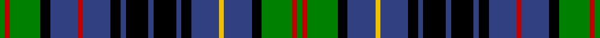

In pattern [GRGKBRBKBKBKBKBYBKGRG](/stripes/grgkbrbkbkbkbkbybkgrg/).

This was sourced from weddslist.  It is a [21 stripe tartan](/stripes/stripes21/).

Original link http://www.weddslist.com/cgi-bin/tartans/pg.pl?source=sts

## Also known as

This cloth is also recorded under:

- Allen, Christopher Holler

## Thread count
G/4 R4 G24 K8 B22 R4 B22 K8 B4 K18 B4 K18 B4 K8 B22 Y4 B22 K8 G24 R4 G/4

## Palette
Each colour and the base-6 reference it is a variant of.

| Colour | Shade | Base |
|---|---|---|
| B | <code style="background-color:#304080;">#304080</code> `oklch(39.4% 0.109 270.2)` <small>#304080</small> | B <code style="background-color:#2A418A;">#2A418A</code> |
| G | <code style="background-color:#008000;">#008000</code> `oklch(52.0% 0.177 142.5)` <small>#008000</small> | G <code style="background-color:#006100;">#006100</code> |
| K | <code style="background-color:#000000;">#000000</code> `oklch(0.0% 0.000 0.0)` <small>#000000</small> | K <code style="background-color:#000000;">#000000</code> |
| R | <code style="background-color:#C00000;">#C00000</code> `oklch(50.7% 0.208 29.2)` <small>#C00000</small> | R <code style="background-color:#CC0000;">#CC0000</code> |
| Y | <code style="background-color:#F0C000;">#F0C000</code> `oklch(82.7% 0.169 90.5)` <small>#F0C000</small> | Y <code style="background-color:#F2BF00;">#F2BF00</code> |

## Nearest tartans

The nearest existing variants by ΔTartan distance, with this tartan at the top so the swatches line up against it.

ΔTartan

Tartan

Sett

—

<a href="/ttd/edit/#slug=g2r2g12k4db11r2db11k4db2k9db2k9db2k4db11ly2db11k4g12r2g2~x2">Allen, Christopher Holler</a> <a class="nn-out" href="/setts/s21/g2r2g12k4db11r2db11k4db2k9db2k9db2k4db11ly2db11k4g12r2g2~x2/" title="open its dictionary page">↗</a>

0.85

<a href="/ttd/edit/#slug=g6k3g18r4db4w4g18k3g6k3db6k3db18w4db4r4db18k3db6k3~x2">Shaw of Carolina (Personal)</a> <a class="nn-out" href="/setts/s20/g6k3g18r4db4w4g18k3g6k3db6k3db18w4db4r4db18k3db6k3~x2/" title="open its dictionary page">↗</a>

1.11

<a href="/ttd/edit/#slug=b12k2b2k2b2k10g5r3w2r3g5k10b11k2b2~x2">Blanton (Dress)</a> <a class="nn-out" href="/setts/s15/b12k2b2k2b2k10g5r3w2r3g5k10b11k2b2~x2/" title="open its dictionary page">↗</a>

1.13

<a href="/ttd/edit/#slug=db16k16g2db2g2db2g16db2g2db2g2db16ly8k2db2k2ly8k16db16k2r5k2~x2">Lamquet (2015)</a> <a class="nn-out" href="/setts/s22/db16k16g2db2g2db2g16db2g2db2g2db16ly8k2db2k2ly8k16db16k2r5k2~x2/" title="open its dictionary page">↗</a>

1.16

<a href="/setts/s28/dt12w2dt2r2dt2k10g12k2g4k2g12k10dt12k2r3~x2/">Scotland's National</a>

1.18

<a href="/ttd/edit/#slug=dt16k16dg2k2dg2k2dg16k2dg2k2dg2k16ly8k2dt2k2ly8k16dt16k2r5k2~x2">Lamquet (2015)</a> <a class="nn-out" href="/setts/s22/dt16k16dg2k2dg2k2dg16k2dg2k2dg2k16ly8k2dt2k2ly8k16dt16k2r5k2~x2/" title="open its dictionary page">↗</a>

1.19

<a href="/ttd/edit/#slug=r5k3db25k25g25k3w3k6w3k3g25k25db25k3g5~x2">Stephenson, hunting</a> <a class="nn-out" href="/setts/s15/r5k3db25k25g25k3w3k6w3k3g25k25db25k3g5~x2/" title="open its dictionary page">↗</a>

1.20

<a href="/setts/s24/b18r5b3r5b3k20g18ly4g18k20b20k6b6/">Keith</a>

1.21

<a href="/ttd/edit/#slug=db6k1db1k1db1k6g6k1w2k1g6k6db6k1r2~x2">MacKenzie MINI Clan Miniature Tartan Tartan Number: 2677. Earliest known date: 1778 Generated for Dupion Silk Stock list for display purpose. See products available Copyright © Blair Urquhart, Comrie, 2015</a> <a class="nn-out" href="/setts/s15/db6k1db1k1db1k6g6k1w2k1g6k6db6k1r2~x2/" title="open its dictionary page">↗</a>

1.21

<a href="/ttd/edit/#slug=db4k1db1k1db1k5g6k1g6k6db3w1r1w1~x4">Gemmell Clan Tartan Tartan Number: 3213. Earliest known date: 2001 Design copyright is owned by Thomas Kempsill Gemmell and Davina Creighton Gemmell. Designed in traditional tartan colours. See products available Copyright © Blair Urquhart, Comrie, 2015</a> <a class="nn-out" href="/setts/s14/db4k1db1k1db1k5g6k1g6k6db3w1r1w1~x4/" title="open its dictionary page">↗</a>

1.21

<a href="/ttd/edit/#slug=g6k3g7r3g6k13db13k3db13k13g3w3g6k3r4~x2">MacRae</a> <a class="nn-out" href="/setts/s15/g6k3g7r3g6k13db13k3db13k13g3w3g6k3r4~x2/" title="open its dictionary page">↗</a>

## Neighbour map

Every grey dot is one of 14299 variants placed by the first two principal components of the ΔTartan feature space (44% of its variance). Red is this tartan; blue dots are its nearest — click one to open its page.

<svg viewBox="0 0 640 380" role="img" style="max-width:100%;height:auto;border:1px solid #e0e0e0;border-radius:4px;display:block" xmlns="http://www.w3.org/2000/svg"><image href="/nn/cloud.v1.png" width="640" height="380"/><a href="/setts/s20/g6k3g18r4db4w4g18k3g6k3db6k3db18w4db4r4db18k3db6k3~x2/"><circle cx="142.8" cy="167.7" r="4" fill="#3465a4"><title>Shaw of Carolina (Personal)</title></circle></a><a href="/setts/s15/b12k2b2k2b2k10g5r3w2r3g5k10b11k2b2~x2/"><circle cx="135.3" cy="180.4" r="4" fill="#3465a4"><title>Blanton (Dress)</title></circle></a><a href="/setts/s22/db16k16g2db2g2db2g16db2g2db2g2db16ly8k2db2k2ly8k16db16k2r5k2~x2/"><circle cx="144.1" cy="137.1" r="4" fill="#3465a4"><title>Lamquet (2015)</title></circle></a><a href="/setts/s28/dt12w2dt2r2dt2k10g12k2g4k2g12k10dt12k2r3~x2/"><circle cx="108.3" cy="164.4" r="4" fill="#3465a4"><title>Scotland's National</title></circle></a><a href="/setts/s22/dt16k16dg2k2dg2k2dg16k2dg2k2dg2k16ly8k2dt2k2ly8k16dt16k2r5k2~x2/"><circle cx="161.6" cy="139.9" r="4" fill="#3465a4"><title>Lamquet (2015)</title></circle></a><a href="/setts/s15/r5k3db25k25g25k3w3k6w3k3g25k25db25k3g5~x2/"><circle cx="127.4" cy="158.8" r="4" fill="#3465a4"><title>Stephenson, hunting</title></circle></a><a href="/setts/s24/b18r5b3r5b3k20g18ly4g18k20b20k6b6/"><circle cx="97.3" cy="170.7" r="4" fill="#3465a4"><title>Keith</title></circle></a><a href="/setts/s15/db6k1db1k1db1k6g6k1w2k1g6k6db6k1r2~x2/"><circle cx="131.7" cy="190.6" r="4" fill="#3465a4"><title>MacKenzie MINI Clan Miniature Tartan Tartan Number: 2677. Earliest known date: 1778 Generated for Dupion Silk Stock list for display purpose. See products available Copyright © Blair Urquhart, Comrie, 2015</title></circle></a><a href="/setts/s14/db4k1db1k1db1k5g6k1g6k6db3w1r1w1~x4/"><circle cx="134.8" cy="189.7" r="4" fill="#3465a4"><title>Gemmell Clan Tartan Tartan Number: 3213. Earliest known date: 2001 Design copyright is owned by Thomas Kempsill Gemmell and Davina Creighton Gemmell. Designed in traditional tartan colours. See products available Copyright © Blair Urquhart, Comrie, 2015</title></circle></a><a href="/setts/s15/g6k3g7r3g6k13db13k3db13k13g3w3g6k3r4~x2/"><circle cx="69.6" cy="200.8" r="4" fill="#3465a4"><title>MacRae</title></circle></a><circle cx="124.0" cy="170.8" r="5" fill="#c00000"/></svg>

ID: /setts/s21/g2r2g12k4db11r2db11k4db2k9db2k9db2k4db11ly2db11k4g12r2g2~x2/
