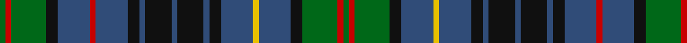

This page is one **sett** — a single exact thread-count. It belongs to the [tartan](/tartans/g2r2g12k4b11r2b11k4b2k9b2k9b2k4b11y2b11k4g12r2g2/)
(the same proportion at any scale), whose colour order is pattern [GRGKBRBKBKBKBKBYBKGRG](/stripes/grgkbrbkbkbkbkbybkgrg/).

Sourced from register-of-tartans.  It is a [21 stripe tartan](/stripes/stripes21/).

Original link https://www.tartanregister.gov.uk/tartanDetails.aspx?ref=56

## Also known as

This cloth is also recorded under:

- Allen, Christopher Holler

2 attestations — the source records this cloth was collapsed from (oldest owns this page)

<ul>
<li>01/01/1997 — Allen (1998) (register-of-tartans, <a href="https://www.tartanregister.gov.uk/tartanDetails.aspx?ref=56">record</a>)</li>
<li>pre 1998 — Allen (1998) (Name) (tartans-authority, <a href="http://www.tartansauthority.com/tartan-ferret/display/2482/">record</a>)</li>
</ul>

## Register references

External register numbers recorded for this tartan.

- Scottish Register of Tartans: [56](https://www.tartanregister.gov.uk/tartanDetails.aspx?ref=56)
- Scottish Tartans Authority (ITI): 2482
- Scottish Tartans World Register: 2482

## Thread count
G/4 R4 G24 K8 B22 R4 B22 K8 B4 K18 B4 K18 B4 K8 B22 Y4 B22 K8 G24 R4 G/4

## Palette
Each colour and the base-6 reference it is a variant of.

| Colour | Shade | Base |
|---|---|---|
| B | <code style="background-color:#304C78;">#304C78</code> `oklch(41.6% 0.081 259.1)` <small>#304C78</small> | B <code style="background-color:#2A418A;">#2A418A</code> |
| G | <code style="background-color:#006818;">#006818</code> `oklch(45.0% 0.142 145.0)` <small>#006818</small> | G <code style="background-color:#006100;">#006100</code> |
| K | <code style="background-color:#101010;">#101010</code> `oklch(17.3% 0.000 89.9)` <small>#101010</small> | K <code style="background-color:#000000;">#000000</code> |
| R | <code style="background-color:#C80000;">#C80000</code> `oklch(52.3% 0.215 29.2)` <small>#C80000</small> | R <code style="background-color:#CC0000;">#CC0000</code> |
| Y | <code style="background-color:#E8C000;">#E8C000</code> `oklch(81.9% 0.168 93.7)` <small>#E8C000</small> | Y <code style="background-color:#F2BF00;">#F2BF00</code> |

## Nearest tartans

The nearest existing variants by ΔTartan distance, with this tartan at the top so the swatches line up against it.

ΔTartan

Tartan

Sett

—

<a href="/ttd/edit/#slug=g2r2g12k4n11r2n11k4n2k9n2k9n2k4n11ly2n11k4g12r2g2~x2">Allen (1998)</a> <a class="nn-out" href="/setts/s21/g2r2g12k4n11r2n11k4n2k9n2k9n2k4n11ly2n11k4g12r2g2~x2/" title="open its dictionary page">↗</a>

0.92

<a href="/ttd/edit/#slug=k1g6k6db1k1db1k1db7k1db1k1db1k6g6k1r1k1g6k6db6k1db1k1db6k6g6k1ly1~x4">MacEwen (Clans Originaux)</a> <a class="nn-out" href="/setts/s28/k1g6k6db1k1db1k1db7k1db1k1db1k6g6k1r1k1g6k6db6k1db1k1db6k6g6k1ly1~x4/" title="open its dictionary page">↗</a>

0.95

<a href="/ttd/edit/#slug=db8dg2db8k2db2k2db2k4dg11r2dg11k4dg2k9dg2k9dg2k4dg11ly2dg11k4db2k2db2k4~x2">Stuart/Stewart Hunting #3</a> <a class="nn-out" href="/setts/s26/db8dg2db8k2db2k2db2k4dg11r2dg11k4dg2k9dg2k9dg2k4dg11ly2dg11k4db2k2db2k4~x2/" title="open its dictionary page">↗</a>

1.05

<a href="/setts/s20/g8k1g8k8r1db8w1db8r1k8r1~x4/">Hunter of Peebleshire</a>

1.10

<a href="/ttd/edit/#slug=db2k1db6k6g6r2g6k6db1k1db1k1db6k1db1k1db1k6g6r2g6k6db6k1db1~x8">Murray</a> <a class="nn-out" href="/setts/s25/db2k1db6k6g6r2g6k6db1k1db1k1db6k1db1k1db1k6g6r2g6k6db6k1db1~x8/" title="open its dictionary page">↗</a>

1.12

<a href="/ttd/edit/#slug=g8k1w2k1dt8k8g1k1g1k1g8k1g1k1g1k8dt8k1r2dt1r2k1dt8g8k1g5~x2">Killen (Name)</a> <a class="nn-out" href="/setts/s26/g8k1w2k1dt8k8g1k1g1k1g8k1g1k1g1k8dt8k1r2dt1r2k1dt8g8k1g5~x2/" title="open its dictionary page">↗</a>

1.15

<a href="/setts/s20/k8w2g11t2k2t2g11db6k7db6g8~x2/">Wilson's No.149</a>

1.16

<a href="/ttd/edit/#slug=r1k1g6k6db6k1db1k1db6k6g6k1ly1~x4">MacEwen/MacEwan</a> <a class="nn-out" href="/setts/s13/r1k1g6k6db6k1db1k1db6k6g6k1ly1~x4/" title="open its dictionary page">↗</a>

1.19

<a href="/setts/s20/k16g2t2db4g16ly2k15db6t2k3t4~x2/">Wilson's No.030</a>

1.20

<a href="/ttd/edit/#slug=k8g8k1ly2k1g8k8db8k1db1k1db8k8g8k1w2k1g8k8db1k1db1k1db8k1db1k1db1~x2">Campbell of Argyll Clan Tartan Tartan Number: 1961. Earliest known date: 1810-15 This sett appears in the Cockburn Collection, (1815). Logan (1831). Vestiarium Scoticum (1842). Smibert (1850). Smith (1850). Grant (1886). The Setts No: 19 (1950). W &amp; A K Johnston (1906). Like many of the earliest clan setts, the Campbell of Argyll, owes its origin to the post rebellion output of Wilson's of Bannockburn, whose monopoly on military supply dictated design. See products available Copyright © Blair Urquhart, Comrie, 2015</a> <a class="nn-out" href="/setts/s28/k8g8k1ly2k1g8k8db8k1db1k1db8k8g8k1w2k1g8k8db1k1db1k1db8k1db1k1db1~x2/" title="open its dictionary page">↗</a>

1.22

<a href="/ttd/edit/#slug=db4k1db1k1db1k8g8k1w2k1g8k8db8k1db1k1db8k8g8k1ly2k1g8k8db1k1db1k1db4~x8">Campbell</a> <a class="nn-out" href="/setts/s29/db4k1db1k1db1k8g8k1w2k1g8k8db8k1db1k1db8k8g8k1ly2k1g8k8db1k1db1k1db4~x8/" title="open its dictionary page">↗</a>

## Neighbour map

Every grey dot is one of 14299 variants placed by the first two principal components of the ΔTartan feature space (44% of its variance). Red is this tartan; blue dots are its nearest — click one to open its page.

<svg viewBox="0 0 640 380" role="img" style="max-width:100%;height:auto;border:1px solid #e0e0e0;border-radius:4px;display:block" xmlns="http://www.w3.org/2000/svg"><image href="/nn/cloud.v1.png" width="640" height="380"/><a href="/setts/s28/k1g6k6db1k1db1k1db7k1db1k1db1k6g6k1r1k1g6k6db6k1db1k1db6k6g6k1ly1~x4/"><circle cx="182.8" cy="168.6" r="4" fill="#3465a4"><title>MacEwen (Clans Originaux)</title></circle></a><a href="/setts/s26/db8dg2db8k2db2k2db2k4dg11r2dg11k4dg2k9dg2k9dg2k4dg11ly2dg11k4db2k2db2k4~x2/"><circle cx="193.8" cy="200.3" r="4" fill="#3465a4"><title>Stuart/Stewart Hunting #3</title></circle></a><a href="/setts/s20/g8k1g8k8r1db8w1db8r1k8r1~x4/"><circle cx="140.0" cy="176.1" r="4" fill="#3465a4"><title>Hunter of Peebleshire</title></circle></a><a href="/setts/s25/db2k1db6k6g6r2g6k6db1k1db1k1db6k1db1k1db1k6g6r2g6k6db6k1db1~x8/"><circle cx="165.3" cy="201.2" r="4" fill="#3465a4"><title>Murray</title></circle></a><a href="/setts/s26/g8k1w2k1dt8k8g1k1g1k1g8k1g1k1g1k8dt8k1r2dt1r2k1dt8g8k1g5~x2/"><circle cx="176.7" cy="161.7" r="4" fill="#3465a4"><title>Killen (Name)</title></circle></a><a href="/setts/s20/k8w2g11t2k2t2g11db6k7db6g8~x2/"><circle cx="146.2" cy="201.5" r="4" fill="#3465a4"><title>Wilson's No.149</title></circle></a><a href="/setts/s13/r1k1g6k6db6k1db1k1db6k6g6k1ly1~x4/"><circle cx="161.8" cy="207.3" r="4" fill="#3465a4"><title>MacEwen/MacEwan</title></circle></a><a href="/setts/s20/k16g2t2db4g16ly2k15db6t2k3t4~x2/"><circle cx="171.4" cy="160.4" r="4" fill="#3465a4"><title>Wilson's No.030</title></circle></a><a href="/setts/s28/k8g8k1ly2k1g8k8db8k1db1k1db8k8g8k1w2k1g8k8db1k1db1k1db8k1db1k1db1~x2/"><circle cx="167.8" cy="151.0" r="4" fill="#3465a4"><title>Campbell of Argyll Clan Tartan Tartan Number: 1961. Earliest known date: 1810-15 This sett appears in the Cockburn Collection, (1815). Logan (1831). Vestiarium Scoticum (1842). Smibert (1850). Smith (1850). Grant (1886). The Setts No: 19 (1950). W &amp; A K Johnston (1906). Like many of the earliest clan setts, the Campbell of Argyll, owes its origin to the post rebellion output of Wilson's of Bannockburn, whose monopoly on military supply dictated design. See products available Copyright © Blair Urquhart, Comrie, 2015</title></circle></a><a href="/setts/s29/db4k1db1k1db1k8g8k1w2k1g8k8db8k1db1k1db8k8g8k1ly2k1g8k8db1k1db1k1db4~x8/"><circle cx="166.3" cy="150.4" r="4" fill="#3465a4"><title>Campbell</title></circle></a><circle cx="170.7" cy="193.5" r="5" fill="#c00000"/></svg>

ID: /setts/s21/g2r2g12k4n11r2n11k4n2k9n2k9n2k4n11ly2n11k4g12r2g2~x2/
