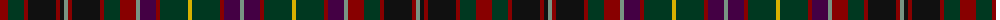

In pattern [GBRGYGRBGRGRKRGKRKRGR](/patterns/gbrgygrbgrgrkrgkrkrgr/).

This was sourced from register-of-tartans.  It is a [21 stripes tartan](/stripes/stripes21/).

Original link https://www.tartanregister.gov.uk/tartanDetails.aspx?ref=1469

## Thread count
DR/16 DG16 DR4 K28 DR4 K4 LG4 DR4 K28 DR4 DG16 DR16 LG4 DP16 DR4 DG28 Y4 DG28 DR4 DP16 LG/4

## Palette
Each colour and its ΔE from the base-6 reference it is a variant of.

| Colour | Shade | Base | ΔE (OKLab) |
|---|---|---|---|
| DG | <code style="background-color:#003820;">#003820</code> `#003820` | G <code style="background-color:#006400;">#006400</code> | 0.16 |
| DP | <code style="background-color:#440044;">#440044</code> `#440044` | B <code style="background-color:#2C4084;">#2C4084</code> | 0.17 |
| DR | <code style="background-color:#880000;">#880000</code> `#880000` | R <code style="background-color:#C80000;">#C80000</code> | 0.14 |
| K | <code style="background-color:#101010;">#101010</code> `#101010` | K <code style="background-color:#000000;">#000000</code> | 0.17 |
| LG | <code style="background-color:#789484;">#789484</code> `#789484` | G <code style="background-color:#006400;">#006400</code> | 0.23 |
| Y | <code style="background-color:#D8B000;">#D8B000</code> `#D8B000` | Y <code style="background-color:#E8C000;">#E8C000</code> | 0.05 |

ID: /setts/s21/g4b16r4ga28y4ga28r4b16g4r16ga16r4k28r4g4k4r4k28r4ga16r16-b440044-g789484-ga003820-k101010-r880000-yd8b000/
