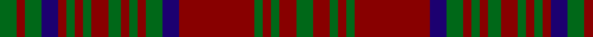

In pattern [GRGBRGRGRGRGRGBRGRGRG](/patterns/grgbrgrgrgrgrgbrgrgrg/).

This was sourced from register-of-tartans.  It is a [21 stripes tartan](/stripes/stripes21/).

Original link https://www.tartanregister.gov.uk/tartanDetails.aspx?ref=5026

## Thread count
G/8 DR4 G8 DB8 DR4 G4 DR4 G4 DR8 G6 DR4 G4 DR4 G8 DB8 DR36 G4 DR4 G4 DR8 G/8

## Palette
Each colour and its ΔE from the base-6 reference it is a variant of.

| Colour | Shade | Base | ΔE (OKLab) |
|---|---|---|---|
| DB | <code style="background-color:#1C0070;">#1C0070</code> `#1C0070` | B <code style="background-color:#2A418A;">#2A418A</code> | 0.14 |
| DR | <code style="background-color:#880000;">#880000</code> `#880000` | R <code style="background-color:#CC0000;">#CC0000</code> | 0.15 |
| G | <code style="background-color:#006818;">#006818</code> `#006818` | G <code style="background-color:#006100;">#006100</code> | 0.02 |

## Nearest tartans

The nearest existing variants by ΔTartan distance.

1. [MacDonald of Aird & Valley (Clan?)](/setts/s14/r12b1r1g8r2b1r1b3r1b1r12g1r1g8x4~b1c0070-g006818-r880000/) — ΔT 1.18
1. [Matheson (Clan)](/setts/s21/g8r4g1r1g1r14b8g4r1g1r1g4r8g1r1g1r1b8g8r2g4x4~b1c1c50-g005010-rac2418/) — ΔT 1.20
1. [Glenfarclas Distillery](/setts/s15/r8b3r3g20r3g3r3b6r3ba3r20b3r3b2r6x2~b003478-ba788ccc-g146400-r640000/) — ΔT 1.32
1. [Matheson (Lochcarron)](/setts/s21/g7r2g2r2g2r27b9g2r2g2r2g2r6g2r2g2r2b10g6r2b5x2~b1c0070-g006818-r880000/) — ΔT 1.36
1. [MacRae of Inverinate (Clan)](/setts/s21/b5r5g2r3g2r3g2r23g23r5g15r5g23r23g2r3g2r3g2r5g5x2~b440044-g003820-rc80000/) — ΔT 1.43
1. [Inverness Fencibles](/setts/s22/b1r1b10g10r13g2r13g10r1b1r1b10r1b1r1g10r13g2r13g10b10r1x2~b2c2c80-g006818-rc80000/) — ΔT 1.50
1. [Bruce, Old](/setts/s14/r45b4r4g48r4b4r4b15r4b4r40g4r4g30~b304080-g008000-rc00000/) — ΔT 1.54
1. [Stewart of Killiecrankie](/setts/s26/g6r2g2r18b9r3g3r3b9r3g24r2g2r4g2r2g24r3b9r3g3r3b9r18g2r2x2~b440044-g006818-rc80000/) — ΔT 1.54
1. [Robertson 3](/setts/s13/r1g1r9b1r1g9r1b9r1g1r9g1r1x4~b304080-g008000-rc00000/) — ΔT 1.54
1. [Ulster (Red)](/setts/s22/k1y1k1r10k1g1k1g1r1g10k1g10k1g10r1g1k1g1k1r10k1y1x4~g006818-k101010-r880000-yd09800/) — ΔT 1.54

## Neighbour map

Every grey dot is one of 15726 variants placed by the first two principal components of the ΔTartan feature space (44% of its variance). Red is this tartan; blue dots are its nearest — click one to open its page.

<svg viewBox="0 0 640 380" role="img" style="max-width:100%;height:auto;border:1px solid #e0e0e0;border-radius:4px;display:block" xmlns="http://www.w3.org/2000/svg"><image href="/nn/cloud.v1.png" width="640" height="380"/><a href="/setts/s14/r12b1r1g8r2b1r1b3r1b1r12g1r1g8x4~b1c0070-g006818-r880000/"><circle cx="380.1" cy="180.9" r="4" fill="#3465a4"><title>MacDonald of Aird &amp; Valley (Clan?)</title></circle></a><a href="/setts/s21/g8r4g1r1g1r14b8g4r1g1r1g4r8g1r1g1r1b8g8r2g4x4~b1c1c50-g005010-rac2418/"><circle cx="280.6" cy="167.0" r="4" fill="#3465a4"><title>Matheson (Clan)</title></circle></a><a href="/setts/s15/r8b3r3g20r3g3r3b6r3ba3r20b3r3b2r6x2~b003478-ba788ccc-g146400-r640000/"><circle cx="332.5" cy="182.1" r="4" fill="#3465a4"><title>Glenfarclas Distillery</title></circle></a><a href="/setts/s21/g7r2g2r2g2r27b9g2r2g2r2g2r6g2r2g2r2b10g6r2b5x2~b1c0070-g006818-r880000/"><circle cx="314.9" cy="146.5" r="4" fill="#3465a4"><title>Matheson (Lochcarron)</title></circle></a><a href="/setts/s21/b5r5g2r3g2r3g2r23g23r5g15r5g23r23g2r3g2r3g2r5g5x2~b440044-g003820-rc80000/"><circle cx="307.7" cy="141.5" r="4" fill="#3465a4"><title>MacRae of Inverinate (Clan)</title></circle></a><a href="/setts/s22/b1r1b10g10r13g2r13g10r1b1r1b10r1b1r1g10r13g2r13g10b10r1x2~b2c2c80-g006818-rc80000/"><circle cx="252.4" cy="160.6" r="4" fill="#3465a4"><title>Inverness Fencibles</title></circle></a><a href="/setts/s14/r45b4r4g48r4b4r4b15r4b4r40g4r4g30~b304080-g008000-rc00000/"><circle cx="320.7" cy="165.1" r="4" fill="#3465a4"><title>Bruce, Old</title></circle></a><a href="/setts/s26/g6r2g2r18b9r3g3r3b9r3g24r2g2r4g2r2g24r3b9r3g3r3b9r18g2r2x2~b440044-g006818-rc80000/"><circle cx="254.9" cy="141.1" r="4" fill="#3465a4"><title>Stewart of Killiecrankie</title></circle></a><a href="/setts/s13/r1g1r9b1r1g9r1b9r1g1r9g1r1x4~b304080-g008000-rc00000/"><circle cx="310.9" cy="178.7" r="4" fill="#3465a4"><title>Robertson 3</title></circle></a><a href="/setts/s22/k1y1k1r10k1g1k1g1r1g10k1g10k1g10r1g1k1g1k1r10k1y1x4~g006818-k101010-r880000-yd09800/"><circle cx="302.4" cy="142.3" r="4" fill="#3465a4"><title>Ulster (Red)</title></circle></a><circle cx="321.4" cy="183.3" r="5" fill="#c00000"/></svg>

ID: /setts/s21/g4r4g2r2g2r18b4g4r2g2r2g3r4g2r2g2r2b4g4r2g4x2~b1c0070-g006818-r880000/
