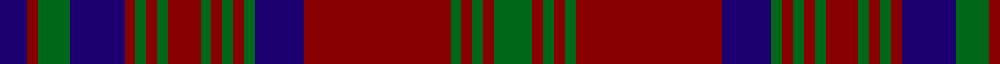

In pattern [BRGBRGRGRGRGRGBRGRGRG](/patterns/brgbrgrgrgrgrgbrgrgrg/).

This was sourced from tartans-authority.  It is a [21 stripes tartan](/stripes/stripes21/).

Original link http://www.tartansauthority.com/tartan-ferret/display/3461/

## Attestations

This cloth appears in 2 source records; the oldest owns this page.

- pre 2002 — Matheson (Lochcarron) (tartans-authority, [record](http://www.tartansauthority.com/tartan-ferret/display/3461/))
- undated — Matheson (Lochcarron) (register-of-tartans, [record](https://www.tartanregister.gov.uk/tartanDetails.aspx?ref=5025))

## Register references

External register numbers recorded for this tartan.

- Scottish Register of Tartans: [5025](https://www.tartanregister.gov.uk/tartanDetails.aspx?ref=5025)
- Scottish Tartans Authority (ITI): 3461

## Thread count
DB/10 DR4 G12 DB20 DR4 G4 DR4 G4 DR12 G4 DR4 G4 DR4 G4 DB18 DR54 G4 DR4 G4 DR4 G/14

## Palette
Each colour and its ΔE from the base-6 reference it is a variant of.

| Colour | Shade | Base | ΔE (OKLab) |
|---|---|---|---|
| DB | <code style="background-color:#1C0070;">#1C0070</code> `#1C0070` | B <code style="background-color:#2A418A;">#2A418A</code> | 0.14 |
| DR | <code style="background-color:#880000;">#880000</code> `#880000` | R <code style="background-color:#CC0000;">#CC0000</code> | 0.15 |
| G | <code style="background-color:#006818;">#006818</code> `#006818` | G <code style="background-color:#006100;">#006100</code> | 0.02 |

## Nearest tartans

The nearest existing variants by ΔTartan distance.

1. [Matheson](/setts/s21/g8r4g1r1g1r24b8g4r1g1r1g4r8g1r1g1r1b8g8r2g4~b000052-g11450d-raa0000~x2/) — ΔT 1.01
1. [Ross](/setts/s27/g18r2g18r18g2r4g2r18b18r2b18r18b1r1b2r1b1r18b1r1b2r1b1r18g18r2g18~b000052-g11450d-raa0000~x2/) — ΔT 1.01
1. [Matheson Clan Tartan Tartan Number: 860. Earliest known date: 1850 The design usually worn by Mathesons is given by Smith although earlier versions are recorded. McIan's drawing could be taken to represent either of the two red designs of which this is one. The Mathesons were involved with other clans who settled in Lochalsh, and in particular with the MacDonells of Glengarry and the MacKenzies of Kintail. The tartan has a design structure which relates to the Glengarry which dates at least to c.1816 when a sample was certified by the chief. See products available Copyright © Blair Urquhart, Comrie, 2015](/setts/s21/g8r4g1r1g1r24b8g4r1g1r1g4r8g1r1g1r1b8g8r2g4~b2c2c80-g003820-rc80000~x2/) — ΔT 1.19
1. [Matheson (Clan)](/setts/s21/g8r4g1r1g1r14b8g4r1g1r1g4r8g1r1g1r1b8g8r2g4~b1c1c50-g005010-rac2418~x4/) — ΔT 1.20
1. [MacTier of Durris](/setts/s18/r18b1r1b2r1b1r18b18r2b18r18g2r4g2r18g18r2g9~b00008c-g007800-r8c0000~x2/) — ΔT 1.24
1. [Matheson Hunting (STS incomplete sett)](/setts/s21/r8g3r1g1r1g22b8g3r1g1r1g3r6g1r1g1r2b6g5r3g4~b2c4084-g005020-rdc0000~x2/) — ΔT 1.32
1. [Matheson (WCWM)](/setts/s21/g4r4g2r2g2r18b4g4r2g2r2g3r4g2r2g2r2b4g4r2g4~b1c0070-g006818-r880000~x2/) — ΔT 1.36
1. [Robertson D](/setts/s13/r5g2r30b3r3b30r3g30r3b3r30g2r5~b000052-g11450d-raa0000~x2/) — ΔT 1.36
1. [Robertson D](/setts/s13/r5g2r30b3r3b30r3g30r3b3r30g2r5~b000052-g11450d-raa0000/) — ΔT 1.36
1. [Ross Clan Tartan Tartan Number: 864. Earliest known date: 1810-15 D.C.Stewart says, "The version here given may be taken to be correct." Later versions, including Logans, are known to have omissions. The Clan Ross is descended from Fearcher MacinTagart, Earl of Ross in the 13th century. The chiefship has passed to the Rosses of Shandwick. The tartan is also worn by the MacTiers. Also worn by the Metro Toronto Police pipe band. (Strathallan 1994) See products available Copyright © Blair Urquhart, Comrie, 2015](/setts/s27/g18r2g18r18g2r4g2r18b18r2b18r18b1r1b2r1b1r18b1r1b2r1b1r18g18r2g18~b2c2c80-g006818-rc80000~x2/) — ΔT 1.37

## Neighbour map

Every grey dot is one of 15726 variants placed by the first two principal components of the ΔTartan feature space (44% of its variance). Red is this tartan; blue dots are its nearest — click one to open its page.

<svg viewBox="0 0 640 380" role="img" style="max-width:100%;height:auto;border:1px solid #e0e0e0;border-radius:4px;display:block" xmlns="http://www.w3.org/2000/svg"><image href="/nn/cloud.v1.png" width="640" height="380"/><a href="/setts/s21/g8r4g1r1g1r24b8g4r1g1r1g4r8g1r1g1r1b8g8r2g4~b000052-g11450d-raa0000~x2/"><circle cx="332.6" cy="124.0" r="4" fill="#3465a4"><title>Matheson</title></circle></a><a href="/setts/s27/g18r2g18r18g2r4g2r18b18r2b18r18b1r1b2r1b1r18b1r1b2r1b1r18g18r2g18~b000052-g11450d-raa0000~x2/"><circle cx="296.8" cy="136.5" r="4" fill="#3465a4"><title>Ross</title></circle></a><a href="/setts/s21/g8r4g1r1g1r24b8g4r1g1r1g4r8g1r1g1r1b8g8r2g4~b2c2c80-g003820-rc80000~x2/"><circle cx="328.3" cy="117.7" r="4" fill="#3465a4"><title>Matheson Clan Tartan Tartan Number: 860. Earliest known date: 1850 The design usually worn by Mathesons is given by Smith although earlier versions are recorded. McIan's drawing could be taken to represent either of the two red designs of which this is one. The Mathesons were involved with other clans who settled in Lochalsh, and in particular with the MacDonells of Glengarry and the MacKenzies of Kintail. The tartan has a design structure which relates to the Glengarry which dates at least to c.1816 when a sample was certified by the chief. See products available Copyright © Blair Urquhart, Comrie, 2015</title></circle></a><a href="/setts/s21/g8r4g1r1g1r14b8g4r1g1r1g4r8g1r1g1r1b8g8r2g4~b1c1c50-g005010-rac2418~x4/"><circle cx="280.6" cy="167.0" r="4" fill="#3465a4"><title>Matheson (Clan)</title></circle></a><a href="/setts/s18/r18b1r1b2r1b1r18b18r2b18r18g2r4g2r18g18r2g9~b00008c-g007800-r8c0000~x2/"><circle cx="323.6" cy="155.9" r="4" fill="#3465a4"><title>MacTier of Durris</title></circle></a><a href="/setts/s21/r8g3r1g1r1g22b8g3r1g1r1g3r6g1r1g1r2b6g5r3g4~b2c4084-g005020-rdc0000~x2/"><circle cx="354.4" cy="129.2" r="4" fill="#3465a4"><title>Matheson Hunting (STS incomplete sett)</title></circle></a><a href="/setts/s21/g4r4g2r2g2r18b4g4r2g2r2g3r4g2r2g2r2b4g4r2g4~b1c0070-g006818-r880000~x2/"><circle cx="321.4" cy="183.3" r="4" fill="#3465a4"><title>Matheson (WCWM)</title></circle></a><a href="/setts/s13/r5g2r30b3r3b30r3g30r3b3r30g2r5~b000052-g11450d-raa0000~x2/"><circle cx="338.7" cy="164.0" r="4" fill="#3465a4"><title>Robertson D</title></circle></a><a href="/setts/s13/r5g2r30b3r3b30r3g30r3b3r30g2r5~b000052-g11450d-raa0000/"><circle cx="338.7" cy="164.0" r="4" fill="#3465a4"><title>Robertson D</title></circle></a><a href="/setts/s27/g18r2g18r18g2r4g2r18b18r2b18r18b1r1b2r1b1r18b1r1b2r1b1r18g18r2g18~b2c2c80-g006818-rc80000~x2/"><circle cx="291.8" cy="129.3" r="4" fill="#3465a4"><title>Ross Clan Tartan Tartan Number: 864. Earliest known date: 1810-15 D.C.Stewart says, &quot;The version here given may be taken to be correct.&quot; Later versions, including Logans, are known to have omissions. The Clan Ross is descended from Fearcher MacinTagart, Earl of Ross in the 13th century. The chiefship has passed to the Rosses of Shandwick. The tartan is also worn by the MacTiers. Also worn by the Metro Toronto Police pipe band. (Strathallan 1994) See products available Copyright © Blair Urquhart, Comrie, 2015</title></circle></a><circle cx="314.9" cy="146.5" r="5" fill="#c00000"/></svg>

ID: /setts/s21/g7r2g2r2g2r27b9g2r2g2r2g2r6g2r2g2r2b10g6r2b5~b1c0070-g006818-r880000~x2/
