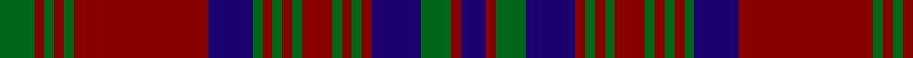

**Bands:** [GRGRGRBGRGRGRGRGRBGRB](/stripes/grgrgrbgrgrgrgrgrbgrb/) · **Stripes:** [G R G R G R DB G R G R G R G R G R DB G R DB](/stripes/stripes21/) G R G R G R DB G R G R G R G R G R DB G R DB

This was sourced from tartans-authority.  It is a [21 band tartan](/bands/bands21/).

Original link http://www.tartansauthority.com/tartan-ferret/display/3461/

## Attestations

This cloth appears in 2 source records; the oldest owns this page.

- pre 2002 — Matheson (Lochcarron) (tartans-authority, [record](http://www.tartansauthority.com/tartan-ferret/display/3461/))
- undated — Matheson (Lochcarron) (register-of-tartans, [record](https://www.tartanregister.gov.uk/tartanDetails.aspx?ref=5025))

## Register references

External register numbers recorded for this tartan.

- Scottish Register of Tartans: [5025](https://www.tartanregister.gov.uk/tartanDetails.aspx?ref=5025)
- Scottish Tartans Authority (ITI): 3461

## Thread count
G/14 DR4 G4 DR4 G4 DR54 DB18 G4 DR4 G4 DR4 G4 DR12 G4 DR4 G4 DR4 DB20 G12 DR4 DB/10

## Palette
Each colour and its ΔE from the base-6 reference it is a variant of.

| Colour | Shade | Base | ΔE (OKLab) |
|---|---|---|---|
| DB | <code style="background-color:#1C0070;">#1C0070</code> `#1C0070` | B <code style="background-color:#2A418A;">#2A418A</code> | 0.14 |
| DR | <code style="background-color:#880000;">#880000</code> `#880000` | R <code style="background-color:#CC0000;">#CC0000</code> | 0.15 |
| G | <code style="background-color:#006818;">#006818</code> `#006818` | G <code style="background-color:#006100;">#006100</code> | 0.02 |

## Nearest tartans

The nearest existing variants by ΔTartan distance.

1. [Matheson](/setts/s21/dg8r4dg1r1dg1r24db8dg4r1dg1r1dg4r8dg1r1dg1r1db8dg8r2dg4~x2/) — ΔT 1.01
1. [Ross](/setts/s27/dg18r2dg18r18dg2r4dg2r18db18r2db18r18db1r1db2r1db1r18db1r1db2r1db1r18dg18r2dg18/) — ΔT 1.01
1. [Matheson (Clan)](/setts/s21/dg8r4dg1r1dg1r14db8dg4r1dg1r1dg4r8dg1r1dg1r1db8dg8r2dg4~x4/) — ΔT 1.20
1. [MacTier of Durris](/setts/s18/r18db1r1db2r1db1r18db18r2db18r18g2r4g2r18g18r2g9~x2/) — ΔT 1.24
1. [Matheson Hunting (STS incomplete sett)](/setts/s21/r8dg3r1dg1r1dg22db8dg3r1dg1r1dg3r6dg1r1dg1r2db6dg5r3dg4~x2/) — ΔT 1.32
1. [Matheson (WCWM)](/setts/s21/g4r4g2r2g2r18db4g4r2g2r2g3r4g2r2g2r2db4g4r2g4~x2/) — ΔT 1.36
1. [Robertson D](/setts/s13/r5dg2r30db3r3dg30r3db30r3db3r30dg2r5~x2/) — ΔT 1.36
1. [Robertson D](/setts/s13/r5dg2r30db3r3dg30r3db30r3db3r30dg2r5/) — ΔT 1.36
1. [Ross Clan Tartan Tartan Number: 864. Earliest known date: 1810-15 D.C.Stewart says, "The version here given may be taken to be correct." Later versions, including Logans, are known to have omissions. The Clan Ross is descended from Fearcher MacinTagart, Earl of Ross in the 13th century. The chiefship has passed to the Rosses of Shandwick. The tartan is also worn by the MacTiers. Also worn by the Metro Toronto Police pipe band. (Strathallan 1994) See products available Copyright © Blair Urquhart, Comrie, 2015](/setts/s27/g18r2g18r18g2r4g2r18db18r2db18r18db1r1db2r1db1r18db1r1db2r1db1r18g18r2g18~x2/) — ΔT 1.37
1. [Robertson](/setts/s13/r1dg1r9dg1r1db9r1dg9r1db1r9dg1r1~x2/) — ΔT 1.38

## Neighbour map

Every grey dot is one of 14299 variants placed by the first two principal components of the ΔTartan feature space (44% of its variance). Red is this tartan; blue dots are its nearest — click one to open its page.

<svg viewBox="0 0 640 380" role="img" style="max-width:100%;height:auto;border:1px solid #e0e0e0;border-radius:4px;display:block" xmlns="http://www.w3.org/2000/svg"><image href="/nn/cloud.v1.png" width="640" height="380"/><a href="/setts/s21/dg8r4dg1r1dg1r24db8dg4r1dg1r1dg4r8dg1r1dg1r1db8dg8r2dg4~x2/"><circle cx="333.9" cy="125.9" r="4" fill="#3465a4"><title>Matheson</title></circle></a><a href="/setts/s27/dg18r2dg18r18dg2r4dg2r18db18r2db18r18db1r1db2r1db1r18db1r1db2r1db1r18dg18r2dg18/"><circle cx="298.2" cy="138.6" r="4" fill="#3465a4"><title>Ross</title></circle></a><a href="/setts/s21/dg8r4dg1r1dg1r14db8dg4r1dg1r1dg4r8dg1r1dg1r1db8dg8r2dg4~x4/"><circle cx="282.2" cy="171.6" r="4" fill="#3465a4"><title>Matheson (Clan)</title></circle></a><a href="/setts/s18/r18db1r1db2r1db1r18db18r2db18r18g2r4g2r18g18r2g9~x2/"><circle cx="325.0" cy="156.0" r="4" fill="#3465a4"><title>MacTier of Durris</title></circle></a><a href="/setts/s21/r8dg3r1dg1r1dg22db8dg3r1dg1r1dg3r6dg1r1dg1r2db6dg5r3dg4~x2/"><circle cx="356.0" cy="131.1" r="4" fill="#3465a4"><title>Matheson Hunting (STS incomplete sett)</title></circle></a><a href="/setts/s21/g4r4g2r2g2r18db4g4r2g2r2g3r4g2r2g2r2db4g4r2g4~x2/"><circle cx="322.5" cy="186.3" r="4" fill="#3465a4"><title>Matheson (WCWM)</title></circle></a><a href="/setts/s13/r5dg2r30db3r3dg30r3db30r3db3r30dg2r5~x2/"><circle cx="339.8" cy="163.4" r="4" fill="#3465a4"><title>Robertson D</title></circle></a><a href="/setts/s13/r5dg2r30db3r3dg30r3db30r3db3r30dg2r5/"><circle cx="339.8" cy="163.4" r="4" fill="#3465a4"><title>Robertson D</title></circle></a><a href="/setts/s27/g18r2g18r18g2r4g2r18db18r2db18r18db1r1db2r1db1r18db1r1db2r1db1r18g18r2g18~x2/"><circle cx="292.8" cy="130.4" r="4" fill="#3465a4"><title>Ross Clan Tartan Tartan Number: 864. Earliest known date: 1810-15 D.C.Stewart says, &quot;The version here given may be taken to be correct.&quot; Later versions, including Logans, are known to have omissions. The Clan Ross is descended from Fearcher MacinTagart, Earl of Ross in the 13th century. The chiefship has passed to the Rosses of Shandwick. The tartan is also worn by the MacTiers. Also worn by the Metro Toronto Police pipe band. (Strathallan 1994) See products available Copyright © Blair Urquhart, Comrie, 2015</title></circle></a><a href="/setts/s13/r1dg1r9dg1r1db9r1dg9r1db1r9dg1r1~x2/"><circle cx="311.6" cy="183.5" r="4" fill="#3465a4"><title>Robertson</title></circle></a><circle cx="316.5" cy="149.3" r="5" fill="#c00000"/></svg>

ID: /setts/s21/g7r2g2r2g2r27db9g2r2g2r2g2r6g2r2g2r2db10g6r2db5~x2/
