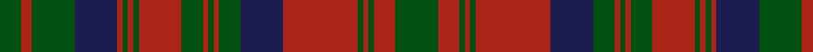

In pattern [GRGBRGRGRGRGRGBRGRGRG](/patterns/grgbrgrgrgrgrgbrgrgrg/).

This was sourced from tartans-authority.  It is a [21 stripes tartan](/stripes/stripes21/).

Original link http://www.tartansauthority.com/tartan-ferret/display/860/

## Thread count
G/16 R8 G32 DB32 R4 G4 R4 G4 R32 G16 R4 G4 R4 G16 DB32 R56 G4 R4 G4 R16 G/32

## Palette
Each colour and its ΔE from the base-6 reference it is a variant of.

| Colour | Shade | Base | ΔE (OKLab) |
|---|---|---|---|
| DB | <code style="background-color:#1C1C50;">#1C1C50</code> `#1C1C50` | B <code style="background-color:#2A418A;">#2A418A</code> | 0.14 |
| G | <code style="background-color:#005010;">#005010</code> `#005010` | G <code style="background-color:#006100;">#006100</code> | 0.06 |
| R | <code style="background-color:#AC2418;">#AC2418</code> `#AC2418` | R <code style="background-color:#CC0000;">#CC0000</code> | 0.06 |

## Nearest tartans

The nearest existing variants by ΔTartan distance.

1. [Inverness Fencibles](/setts/s22/b1r1b10g10r13g2r13g10r1b1r1b10r1b1r1g10r13g2r13g10b10r1~b2c2c80-g006818-rc80000~x2/) — ΔT 1.12
1. [Ross](/setts/s27/g18r2g18r18g2r4g2r18b18r2b18r18b1r1b2r1b1r18b1r1b2r1b1r18g18r2g18~b000052-g11450d-raa0000~x2/) — ΔT 1.18
1. [Matheson (Lochcarron)](/setts/s21/g7r2g2r2g2r27b9g2r2g2r2g2r6g2r2g2r2b10g6r2b5~b1c0070-g006818-r880000~x2/) — ΔT 1.20
1. [Matheson (WCWM)](/setts/s21/g4r4g2r2g2r18b4g4r2g2r2g3r4g2r2g2r2b4g4r2g4~b1c0070-g006818-r880000~x2/) — ΔT 1.20
1. [Stewart of Killiecrankie](/setts/s26/g6r2g2r18b9r3g3r3b9r3g24r2g2r4g2r2g24r3b9r3g3r3b9r18g2r2~b440044-g006818-rc80000~x2/) — ΔT 1.21
1. [Ross 3](/setts/s20/b18r2b18r18g2r4g2r18g18r2g18r2g18r18b1r1b2r1b1r18~b304080-g008000-rc00000~x2/) — ΔT 1.24
1. [Stewart of Urrard Clan Tartan Tartan Number: 898. Earliest known date: pre 1930 A kilt in this material was brought into the Scottish Tartans Museum in Comrie which could be dated to before 1930. It belonged to a member of the Stewart Society at that time. The threadcount and the name were documented by Mackinlay, who studied and collected tartans between 1930 and 1950. See products available Copyright © Blair Urquhart, Comrie, 2015](/setts/s14/g6r2g2r18b9r3g3r3b9r3g24r2g2r4~b2c2c80-g006818-rc80000~x2/) — ΔT 1.25
1. [Stuart/Stewart of Urrard](/setts/s14/g6r2g2r18b9r3g3r3b9r3g24r2g2r4~b2c4084-g005020-rdc0000~x2/) — ΔT 1.30
1. [Ross (Clan)](/setts/s27/g18r2g18r18g2r4g2r18b18r2b18r18b1r1b2r1b1r18b1r1g2r1b1r18g18r2g18~b2c2c80-g006818-rc80000~x2/) — ΔT 1.35
1. [Ross Clan Tartan Tartan Number: 864. Earliest known date: 1810-15 D.C.Stewart says, "The version here given may be taken to be correct." Later versions, including Logans, are known to have omissions. The Clan Ross is descended from Fearcher MacinTagart, Earl of Ross in the 13th century. The chiefship has passed to the Rosses of Shandwick. The tartan is also worn by the MacTiers. Also worn by the Metro Toronto Police pipe band. (Strathallan 1994) See products available Copyright © Blair Urquhart, Comrie, 2015](/setts/s27/g18r2g18r18g2r4g2r18b18r2b18r18b1r1b2r1b1r18b1r1b2r1b1r18g18r2g18~b2c2c80-g006818-rc80000~x2/) — ΔT 1.36

## Neighbour map

Every grey dot is one of 15726 variants placed by the first two principal components of the ΔTartan feature space (44% of its variance). Red is this tartan; blue dots are its nearest — click one to open its page.

<svg viewBox="0 0 640 380" role="img" style="max-width:100%;height:auto;border:1px solid #e0e0e0;border-radius:4px;display:block" xmlns="http://www.w3.org/2000/svg"><image href="/nn/cloud.v1.png" width="640" height="380"/><a href="/setts/s22/b1r1b10g10r13g2r13g10r1b1r1b10r1b1r1g10r13g2r13g10b10r1~b2c2c80-g006818-rc80000~x2/"><circle cx="252.4" cy="160.6" r="4" fill="#3465a4"><title>Inverness Fencibles</title></circle></a><a href="/setts/s27/g18r2g18r18g2r4g2r18b18r2b18r18b1r1b2r1b1r18b1r1b2r1b1r18g18r2g18~b000052-g11450d-raa0000~x2/"><circle cx="296.8" cy="136.5" r="4" fill="#3465a4"><title>Ross</title></circle></a><a href="/setts/s21/g7r2g2r2g2r27b9g2r2g2r2g2r6g2r2g2r2b10g6r2b5~b1c0070-g006818-r880000~x2/"><circle cx="314.9" cy="146.5" r="4" fill="#3465a4"><title>Matheson (Lochcarron)</title></circle></a><a href="/setts/s21/g4r4g2r2g2r18b4g4r2g2r2g3r4g2r2g2r2b4g4r2g4~b1c0070-g006818-r880000~x2/"><circle cx="321.4" cy="183.3" r="4" fill="#3465a4"><title>Matheson (WCWM)</title></circle></a><a href="/setts/s26/g6r2g2r18b9r3g3r3b9r3g24r2g2r4g2r2g24r3b9r3g3r3b9r18g2r2~b440044-g006818-rc80000~x2/"><circle cx="254.9" cy="141.1" r="4" fill="#3465a4"><title>Stewart of Killiecrankie</title></circle></a><a href="/setts/s20/b18r2b18r18g2r4g2r18g18r2g18r2g18r18b1r1b2r1b1r18~b304080-g008000-rc00000~x2/"><circle cx="288.1" cy="148.8" r="4" fill="#3465a4"><title>Ross 3</title></circle></a><a href="/setts/s14/g6r2g2r18b9r3g3r3b9r3g24r2g2r4~b2c2c80-g006818-rc80000~x2/"><circle cx="269.7" cy="171.5" r="4" fill="#3465a4"><title>Stewart of Urrard Clan Tartan Tartan Number: 898. Earliest known date: pre 1930 A kilt in this material was brought into the Scottish Tartans Museum in Comrie which could be dated to before 1930. It belonged to a member of the Stewart Society at that time. The threadcount and the name were documented by Mackinlay, who studied and collected tartans between 1930 and 1950. See products available Copyright © Blair Urquhart, Comrie, 2015</title></circle></a><a href="/setts/s14/g6r2g2r18b9r3g3r3b9r3g24r2g2r4~b2c4084-g005020-rdc0000~x2/"><circle cx="269.8" cy="170.2" r="4" fill="#3465a4"><title>Stuart/Stewart of Urrard</title></circle></a><a href="/setts/s27/g18r2g18r18g2r4g2r18b18r2b18r18b1r1b2r1b1r18b1r1g2r1b1r18g18r2g18~b2c2c80-g006818-rc80000~x2/"><circle cx="293.0" cy="129.5" r="4" fill="#3465a4"><title>Ross (Clan)</title></circle></a><a href="/setts/s27/g18r2g18r18g2r4g2r18b18r2b18r18b1r1b2r1b1r18b1r1b2r1b1r18g18r2g18~b2c2c80-g006818-rc80000~x2/"><circle cx="291.8" cy="129.3" r="4" fill="#3465a4"><title>Ross Clan Tartan Tartan Number: 864. Earliest known date: 1810-15 D.C.Stewart says, &quot;The version here given may be taken to be correct.&quot; Later versions, including Logans, are known to have omissions. The Clan Ross is descended from Fearcher MacinTagart, Earl of Ross in the 13th century. The chiefship has passed to the Rosses of Shandwick. The tartan is also worn by the MacTiers. Also worn by the Metro Toronto Police pipe band. (Strathallan 1994) See products available Copyright © Blair Urquhart, Comrie, 2015</title></circle></a><circle cx="280.6" cy="167.0" r="5" fill="#c00000"/></svg>

ID: /setts/s21/g8r4g1r1g1r14b8g4r1g1r1g4r8g1r1g1r1b8g8r2g4~b1c1c50-g005010-rac2418~x4/
