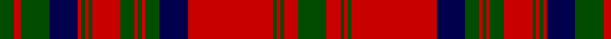

In pattern [GRGBRGRGRGRGRGBRGRGRG](/patterns/grgbrgrgrgrgrgbrgrgrg/).

This was sourced from weddslist.  It is a [21 stripes tartan](/stripes/stripes21/).

Original link http://www.weddslist.com/cgi-bin/tartans/pg.pl?source=rb

## Thread count
G/8 R4 G16 DB16 R2 G2 R2 G2 R16 G8 R2 G2 R2 G8 DB16 R48 G2 R2 G2 R8 G/16

## Palette
Each colour and its ΔE from the base-6 reference it is a variant of.

| Colour | Shade | Base | ΔE (OKLab) |
|---|---|---|---|
| DB | <code style="background-color:#00004C;">#00004C</code> `#00004C` | B <code style="background-color:#2A418A;">#2A418A</code> | 0.21 |
| G | <code style="background-color:#004C00;">#004C00</code> `#004C00` | G <code style="background-color:#006100;">#006100</code> | 0.07 |
| R | <code style="background-color:#C80000;">#C80000</code> `#C80000` | R <code style="background-color:#CC0000;">#CC0000</code> | 0.01 |

## Nearest tartans

The nearest existing variants by ΔTartan distance.

1. [Stewart/Stuart of Atholl](/setts/s16/r3k1r20k8g3k1g2k1g22k1g2k1g3k8r20k1~g005028-k101010-rc80000~x4/) — ΔT 0.73
1. [Matheson Clan Tartan Tartan Number: 860. Earliest known date: 1850 The design usually worn by Mathesons is given by Smith although earlier versions are recorded. McIan's drawing could be taken to represent either of the two red designs of which this is one. The Mathesons were involved with other clans who settled in Lochalsh, and in particular with the MacDonells of Glengarry and the MacKenzies of Kintail. The tartan has a design structure which relates to the Glengarry which dates at least to c.1816 when a sample was certified by the chief. See products available Copyright © Blair Urquhart, Comrie, 2015](/setts/s21/g8r4g1r1g1r24b8g4r1g1r1g4r8g1r1g1r1b8g8r2g4~b2c2c80-g003820-rc80000~x2/) — ΔT 0.74
1. [Matheson Dress](/setts/s21/g8r4g1r1g1r24b8g4r1g1r1g4r8g1r1g1r1b8g8r2g4~b440044-g006818-rc80000~x2/) — ΔT 0.79
1. [Matheson](/setts/s21/g8r4g1r1g1r24b8g4r1g1r1g4r8g1r1g1r1b8g8r2g4~b000052-g11450d-raa0000~x2/) — ΔT 0.79
1. [Matheson](/setts/s21/g8r4g1r1g1r24b8g4r1g1r1g4r8g1r1g1r1b8g8r2g4~b304080-g008000-rc00000~x2/) — ΔT 1.05
1. [Stewart of Appin](/setts/s16/r3b2w1r2g24r4g2r2b8r2g2r24b2w1r2g2~b000064-g004c00-rc80000-wd0d0d0/) — ΔT 1.13
1. [Murray of Tullibardine 4](/setts/s21/b4r1b1r4b12r4b1r1g4r1b1r26b26r4g4r26g21r13b6r5g1~b304080-g008000-rc00000~x2/) — ΔT 1.14
1. [Murray of Tullibardine](/setts/s21/b2r1b1r2b4r2b1r1b2r1b1r24b12r2g2r8g12r4b2r2b1~b00004c-g004c00-rc80000/) — ΔT 1.14
1. [Ross #4](/setts/s27/g18r2g18r18g2r4g2r18b18r2b18r18b1r1b2r1b1r18b1r1b2r1b1r18g18r2g18~b2c4084-g005020-rdc0000~x2/) — ΔT 1.15
1. [Ross Clan Tartan Tartan Number: 864. Earliest known date: 1810-15 D.C.Stewart says, "The version here given may be taken to be correct." Later versions, including Logans, are known to have omissions. The Clan Ross is descended from Fearcher MacinTagart, Earl of Ross in the 13th century. The chiefship has passed to the Rosses of Shandwick. The tartan is also worn by the MacTiers. Also worn by the Metro Toronto Police pipe band. (Strathallan 1994) See products available Copyright © Blair Urquhart, Comrie, 2015](/setts/s27/g18r2g18r18g2r4g2r18b18r2b18r18b1r1b2r1b1r18b1r1b2r1b1r18g18r2g18~b2c2c80-g006818-rc80000~x2/) — ΔT 1.15

## Neighbour map

Every grey dot is one of 15726 variants placed by the first two principal components of the ΔTartan feature space (44% of its variance). Red is this tartan; blue dots are its nearest — click one to open its page.

<svg viewBox="0 0 640 380" role="img" style="max-width:100%;height:auto;border:1px solid #e0e0e0;border-radius:4px;display:block" xmlns="http://www.w3.org/2000/svg"><image href="/nn/cloud.v1.png" width="640" height="380"/><a href="/setts/s16/r3k1r20k8g3k1g2k1g22k1g2k1g3k8r20k1~g005028-k101010-rc80000~x4/"><circle cx="309.7" cy="129.0" r="4" fill="#3465a4"><title>Stewart/Stuart of Atholl</title></circle></a><a href="/setts/s21/g8r4g1r1g1r24b8g4r1g1r1g4r8g1r1g1r1b8g8r2g4~b2c2c80-g003820-rc80000~x2/"><circle cx="328.3" cy="117.7" r="4" fill="#3465a4"><title>Matheson Clan Tartan Tartan Number: 860. Earliest known date: 1850 The design usually worn by Mathesons is given by Smith although earlier versions are recorded. McIan's drawing could be taken to represent either of the two red designs of which this is one. The Mathesons were involved with other clans who settled in Lochalsh, and in particular with the MacDonells of Glengarry and the MacKenzies of Kintail. The tartan has a design structure which relates to the Glengarry which dates at least to c.1816 when a sample was certified by the chief. See products available Copyright © Blair Urquhart, Comrie, 2015</title></circle></a><a href="/setts/s21/g8r4g1r1g1r24b8g4r1g1r1g4r8g1r1g1r1b8g8r2g4~b440044-g006818-rc80000~x2/"><circle cx="328.8" cy="115.1" r="4" fill="#3465a4"><title>Matheson Dress</title></circle></a><a href="/setts/s21/g8r4g1r1g1r24b8g4r1g1r1g4r8g1r1g1r1b8g8r2g4~b000052-g11450d-raa0000~x2/"><circle cx="332.6" cy="124.0" r="4" fill="#3465a4"><title>Matheson</title></circle></a><a href="/setts/s21/g8r4g1r1g1r24b8g4r1g1r1g4r8g1r1g1r1b8g8r2g4~b304080-g008000-rc00000~x2/"><circle cx="325.0" cy="116.6" r="4" fill="#3465a4"><title>Matheson</title></circle></a><a href="/setts/s16/r3b2w1r2g24r4g2r2b8r2g2r24b2w1r2g2~b000064-g004c00-rc80000-wd0d0d0/"><circle cx="308.0" cy="95.4" r="4" fill="#3465a4"><title>Stewart of Appin</title></circle></a><a href="/setts/s21/b4r1b1r4b12r4b1r1g4r1b1r26b26r4g4r26g21r13b6r5g1~b304080-g008000-rc00000~x2/"><circle cx="350.2" cy="118.9" r="4" fill="#3465a4"><title>Murray of Tullibardine 4</title></circle></a><a href="/setts/s21/b2r1b1r2b4r2b1r1b2r1b1r24b12r2g2r8g12r4b2r2b1~b00004c-g004c00-rc80000/"><circle cx="349.1" cy="101.6" r="4" fill="#3465a4"><title>Murray of Tullibardine</title></circle></a><a href="/setts/s27/g18r2g18r18g2r4g2r18b18r2b18r18b1r1b2r1b1r18b1r1b2r1b1r18g18r2g18~b2c4084-g005020-rdc0000~x2/"><circle cx="290.1" cy="126.9" r="4" fill="#3465a4"><title>Ross #4</title></circle></a><a href="/setts/s27/g18r2g18r18g2r4g2r18b18r2b18r18b1r1b2r1b1r18b1r1b2r1b1r18g18r2g18~b2c2c80-g006818-rc80000~x2/"><circle cx="291.8" cy="129.3" r="4" fill="#3465a4"><title>Ross Clan Tartan Tartan Number: 864. Earliest known date: 1810-15 D.C.Stewart says, &quot;The version here given may be taken to be correct.&quot; Later versions, including Logans, are known to have omissions. The Clan Ross is descended from Fearcher MacinTagart, Earl of Ross in the 13th century. The chiefship has passed to the Rosses of Shandwick. The tartan is also worn by the MacTiers. Also worn by the Metro Toronto Police pipe band. (Strathallan 1994) See products available Copyright © Blair Urquhart, Comrie, 2015</title></circle></a><circle cx="312.0" cy="113.3" r="5" fill="#c00000"/></svg>

ID: /setts/s21/g8r4g1r1g1r24b8g4r1g1r1g4r8g1r1g1r1b8g8r2g4~b00004c-g004c00-rc80000~x2/
