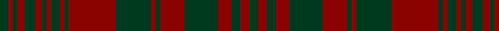

In pattern [GRGRGRGRGRGRGRGRGRGRG](/patterns/grgrgrgrgrgrgrgrgrgrg/).

This was sourced from tartans-authority.  It is a [21 stripes tartan](/stripes/stripes21/).

Original link http://www.tartansauthority.com/tartan-ferret/display/8856/

## Thread count
DG/8 DR4 DG4 DR6 DG10 DR6 DG4 DR4 DG8 DR4 DG4 DR42 DG32 DR4 DG4 DR22 DG30 DR12 DG8 DR8 DG/8

## Palette
Each colour and its ΔE from the base-6 reference it is a variant of.

| Colour | Shade | Base | ΔE (OKLab) |
|---|---|---|---|
| DG | <code style="background-color:#003820;">#003820</code> `#003820` | G <code style="background-color:#006400;">#006400</code> | 0.16 |
| DR | <code style="background-color:#880000;">#880000</code> `#880000` | R <code style="background-color:#C80000;">#C80000</code> | 0.14 |

## Nearest tartans

The nearest existing variants by ΔTartan distance.

1. [Donachie of Brockloch (Clan)](/setts/s10/r48g4r4g40r50g4r4g4r4g40-g005834-r940000/) — ΔT 1.70
1. [Rae (Wilsons) (Clan)](/setts/s27/b27g12b54g56b10g14b10g56b62g12b62g56b4g4b8g4b4g56b4g4b8g4b4g56b54g12b27-b440044-g285800/) — ΔT 1.75
1. [Matheson (WCWM)](/setts/s21/g8r8g4r4g4r36b8g8r4g4r4g6r8g4r4g4r4b8g8r4g8-b1c0070-g006818-r880000/) — ΔT 1.89
1. [Frame (Ferniegair) (Personal)](/setts/s12/g16b56r4b4g4b4r4b56r56b4r4g4-b3d1903-g00480d-rad0000/) — ΔT 1.96
1. [MacDonald of Aird & Valley (Clan?)](/setts/s14/r48b4r4g32r8b4r4b12r4b4r48g4r4g32-b1c0070-g006818-r880000/) — ΔT 2.04
1. [Sarna (Town)](/setts/s30/g14ga4r2ga4g4ga4r2ga22r10ga4r2ga4r4ga4r2ga26r2ga4r4ga4r2ga4r10ga22r2ga4g4ga4r2ga4-g006818-ga604000-rc80000/) — ΔT 2.05
1. [MacDonell of Keppoch #3](/setts/s15/r48g8r4g4r4g4r24g48r4k4r48k4r4k4r12-g006818-k101010-r880000/) — ΔT 2.05
1. [Sarna (District)](/setts/s16/g26r2g4r4g4r2g4r10g22r2g4ga4g4r2g4ga14-g604000-ga006818-rc80000/) — ΔT 2.06
1. [Donachie of Brockloch](/setts/s10/r48g4r4g40r50g4r4g4r4g40-g003c24-r6c0000/) — ΔT 2.07
1. [Frame - Ferniegair (Personal)](/setts/s12/g16ga56r4ga4g4ga4r4ga56r56ga4r4g4-g003820-ga604000-rc8002c/) — ΔT 2.11

## Neighbour map

Every grey dot is one of 15726 variants placed by the first two principal components of the ΔTartan feature space (44% of its variance). Red is this tartan; blue dots are its nearest — click one to open its page.

<svg viewBox="0 0 640 380" role="img" style="max-width:100%;height:auto;border:1px solid #e0e0e0;border-radius:4px;display:block" xmlns="http://www.w3.org/2000/svg"><image href="/nn/cloud.v1.png" width="640" height="380"/><a href="/setts/s10/r48g4r4g40r50g4r4g4r4g40-g005834-r940000/"><circle cx="449.8" cy="229.8" r="4" fill="#3465a4"><title>Donachie of Brockloch (Clan)</title></circle></a><a href="/setts/s27/b27g12b54g56b10g14b10g56b62g12b62g56b4g4b8g4b4g56b4g4b8g4b4g56b54g12b27-b440044-g285800/"><circle cx="387.3" cy="183.7" r="4" fill="#3465a4"><title>Rae (Wilsons) (Clan)</title></circle></a><a href="/setts/s21/g8r8g4r4g4r36b8g8r4g4r4g6r8g4r4g4r4b8g8r4g8-b1c0070-g006818-r880000/"><circle cx="320.6" cy="182.8" r="4" fill="#3465a4"><title>Matheson (WCWM)</title></circle></a><a href="/setts/s12/g16b56r4b4g4b4r4b56r56b4r4g4-b3d1903-g00480d-rad0000/"><circle cx="439.5" cy="187.4" r="4" fill="#3465a4"><title>Frame (Ferniegair) (Personal)</title></circle></a><a href="/setts/s14/r48b4r4g32r8b4r4b12r4b4r48g4r4g32-b1c0070-g006818-r880000/"><circle cx="379.4" cy="179.4" r="4" fill="#3465a4"><title>MacDonald of Aird &amp; Valley (Clan?)</title></circle></a><a href="/setts/s30/g14ga4r2ga4g4ga4r2ga22r10ga4r2ga4r4ga4r2ga26r2ga4r4ga4r2ga4r10ga22r2ga4g4ga4r2ga4-g006818-ga604000-rc80000/"><circle cx="464.7" cy="175.3" r="4" fill="#3465a4"><title>Sarna (Town)</title></circle></a><a href="/setts/s15/r48g8r4g4r4g4r24g48r4k4r48k4r4k4r12-g006818-k101010-r880000/"><circle cx="465.8" cy="180.2" r="4" fill="#3465a4"><title>MacDonell of Keppoch #3</title></circle></a><a href="/setts/s16/g26r2g4r4g4r2g4r10g22r2g4ga4g4r2g4ga14-g604000-ga006818-rc80000/"><circle cx="478.2" cy="206.0" r="4" fill="#3465a4"><title>Sarna (District)</title></circle></a><a href="/setts/s10/r48g4r4g40r50g4r4g4r4g40-g003c24-r6c0000/"><circle cx="496.5" cy="257.3" r="4" fill="#3465a4"><title>Donachie of Brockloch</title></circle></a><a href="/setts/s12/g16ga56r4ga4g4ga4r4ga56r56ga4r4g4-g003820-ga604000-rc8002c/"><circle cx="445.3" cy="186.8" r="4" fill="#3465a4"><title>Frame - Ferniegair (Personal)</title></circle></a><circle cx="424.6" cy="215.5" r="5" fill="#c00000"/></svg>

ID: /setts/s21/g8r8g8r12g30r22g4r4g32r42g4r4g8r4g4r6g10r6g4r4g8-g003820-r880000/
