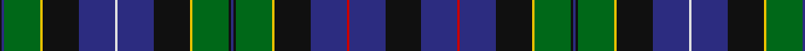

In pattern [KBGYKBWBKYGKBKGYKBRBK](/patterns/kbgykbwbkygkbkgykbrbk/).

This was sourced from tartans-authority.  It is a [21 stripes tartan](/stripes/stripes21/).

Original link http://www.tartansauthority.com/tartan-ferret/display/6372/

## Thread count
K/2 DB2 G30 Y2 K30 DB30 LN2 DB30 K30 Y2 G30 K2 DB2 K2 G30 Y2 K30 DB30 R2 DB30 K/30

## Palette
Each colour and its ΔE from the base-6 reference it is a variant of.

| Colour | Shade | Base | ΔE (OKLab) |
|---|---|---|---|
| DB | <code style="background-color:#2C2C80;">#2C2C80</code> `#2C2C80` | B <code style="background-color:#2A418A;">#2A418A</code> | 0.06 |
| G | <code style="background-color:#006818;">#006818</code> `#006818` | G <code style="background-color:#006100;">#006100</code> | 0.02 |
| K | <code style="background-color:#101010;">#101010</code> `#101010` | K <code style="background-color:#000000;">#000000</code> | 0.17 |
| LN | <code style="background-color:#E0E0E0;">#E0E0E0</code> `#E0E0E0` | W <code style="background-color:#F7F7F7;">#F7F7F7</code> | 0.07 |
| R | <code style="background-color:#C80000;">#C80000</code> `#C80000` | R <code style="background-color:#CC0000;">#CC0000</code> | 0.01 |
| Y | <code style="background-color:#E8C000;">#E8C000</code> `#E8C000` | Y <code style="background-color:#F2BF00;">#F2BF00</code> | 0.02 |

## Nearest tartans

The nearest existing variants by ΔTartan distance.

1. [Paterson Clan/Family Weavers Tartan Tartan Number: 3886. Earliest known date: pre 2002 Dalgliesh variation. See products available Copyright © Blair Urquhart, Comrie, 2015](/setts/s22/g12k12b15k2b15k12g5r2g5k1y3k1g5r2g5k12b15k2b15k12g12r2x2~b2c2c80-g006818-k101010-rc80000-ye8c000/) — ΔT 1.00
1. [Sacramento City Fire Department](/setts/s24/b2w1b15k5g11k1r3k1g11k5b17w1b17k5g11k1r3k1g11k5b15w1b2y2x2~b2c2c80-g006818-k101010-rc80000-wfcfcfc-ye8c000/) — ΔT 1.10
1. [Paget Family Tartan Tartan Number: 2072. Earliest known date: 1992 Designed as a 'Family' tartan and woven by Peter MacDonald in Crieff. See products available Copyright © Blair Urquhart, Comrie, 2015](/setts/s14/r3g4ga2g10k18g2b18g3b18g2k18g16w1r3x2~b202060-g006818-ga289c18-k101010-rc80000-we0e0e0/) — ΔT 1.11
1. [Sey](/setts/s14/r2y1b13g13k8ya1k8r2k8ya1k8g13b13y1x2~b2c2c80-g006818-k101010-rc80000-yd87c00-yae8c000/) — ΔT 1.14
1. [Gow Hunting Family Tartan Tartan Number: 1893. Earliest known date: pre 2003 MacDonells of Keppoch are an independant branch of Clan Donald. See products available Copyright © Blair Urquhart, Comrie, 2015](/setts/s14/b12ba3b12k12g12k1y3k1g12k1r1k1g12k12x4~b2c2c80-ba202060-g006818-k101010-rc80000-ye8c000/) — ΔT 1.15
1. [Ochiltree (Name)](/setts/s19/b12k1g2k1g2k1b12r2k12y1k12r2g12k1b2k1b2k1g12x4~b1c0070-g006818-k101010-r880000-yfccc00/) — ΔT 1.15
1. [Renton (Personal)](/setts/s18/r8k2r8ka4ra3ka4k8ka2k8ka4b21ba8ka2k3ka2ba8b24ka3x2~b244458-ba405c74-k000000-ka101010-r886044-raa00028/) — ΔT 1.16
1. [Stephenson](/setts/s20/b5r3g26b20y3k20ba2r5ba2g20k6g20ba2r5ba2k20y3b20g26r3x2~b1c0070-ba2474e8-g408060-k101010-r880000-yd09800/) — ΔT 1.17
1. [Rankine](/setts/s23/b15k1b1k1b1k12g9r1g9k1w1k1g9r1g9k12r1b9r2b1r1b6w1x2~b2c2c80-g006818-k101010-rc80000-we0e0e0/) — ΔT 1.17
1. [Ochiltree Family Tartan Tartan Number: 321. Earliest known date: 1988 O'Sullivan McCragh was designed by Chris Aitken for Geoffrey (Tailor) Highland Crafts Ltd. in June 1994. See products available Copyright © Blair Urquhart, Comrie, 2015](/setts/s19/b12k1g2k1g2k1b12r2k12y1k12r2g12k1b2k1b2k1g12x2~b2c2c80-g006818-k101010-rc80000-ye8c000/) — ΔT 1.17

## Neighbour map

Every grey dot is one of 15726 variants placed by the first two principal components of the ΔTartan feature space (44% of its variance). Red is this tartan; blue dots are its nearest — click one to open its page.

<svg viewBox="0 0 640 380" role="img" style="max-width:100%;height:auto;border:1px solid #e0e0e0;border-radius:4px;display:block" xmlns="http://www.w3.org/2000/svg"><image href="/nn/cloud.v1.png" width="640" height="380"/><a href="/setts/s22/g12k12b15k2b15k12g5r2g5k1y3k1g5r2g5k12b15k2b15k12g12r2x2~b2c2c80-g006818-k101010-rc80000-ye8c000/"><circle cx="171.4" cy="150.4" r="4" fill="#3465a4"><title>Paterson Clan/Family Weavers Tartan Tartan Number: 3886. Earliest known date: pre 2002 Dalgliesh variation. See products available Copyright © Blair Urquhart, Comrie, 2015</title></circle></a><a href="/setts/s24/b2w1b15k5g11k1r3k1g11k5b17w1b17k5g11k1r3k1g11k5b15w1b2y2x2~b2c2c80-g006818-k101010-rc80000-wfcfcfc-ye8c000/"><circle cx="206.6" cy="104.3" r="4" fill="#3465a4"><title>Sacramento City Fire Department</title></circle></a><a href="/setts/s14/r3g4ga2g10k18g2b18g3b18g2k18g16w1r3x2~b202060-g006818-ga289c18-k101010-rc80000-we0e0e0/"><circle cx="163.7" cy="135.4" r="4" fill="#3465a4"><title>Paget Family Tartan Tartan Number: 2072. Earliest known date: 1992 Designed as a 'Family' tartan and woven by Peter MacDonald in Crieff. See products available Copyright © Blair Urquhart, Comrie, 2015</title></circle></a><a href="/setts/s14/r2y1b13g13k8ya1k8r2k8ya1k8g13b13y1x2~b2c2c80-g006818-k101010-rc80000-yd87c00-yae8c000/"><circle cx="141.9" cy="149.1" r="4" fill="#3465a4"><title>Sey</title></circle></a><a href="/setts/s14/b12ba3b12k12g12k1y3k1g12k1r1k1g12k12x4~b2c2c80-ba202060-g006818-k101010-rc80000-ye8c000/"><circle cx="158.3" cy="154.0" r="4" fill="#3465a4"><title>Gow Hunting Family Tartan Tartan Number: 1893. Earliest known date: pre 2003 MacDonells of Keppoch are an independant branch of Clan Donald. See products available Copyright © Blair Urquhart, Comrie, 2015</title></circle></a><a href="/setts/s19/b12k1g2k1g2k1b12r2k12y1k12r2g12k1b2k1b2k1g12x4~b1c0070-g006818-k101010-r880000-yfccc00/"><circle cx="181.0" cy="140.1" r="4" fill="#3465a4"><title>Ochiltree (Name)</title></circle></a><a href="/setts/s18/r8k2r8ka4ra3ka4k8ka2k8ka4b21ba8ka2k3ka2ba8b24ka3x2~b244458-ba405c74-k000000-ka101010-r886044-raa00028/"><circle cx="145.9" cy="131.8" r="4" fill="#3465a4"><title>Renton (Personal)</title></circle></a><a href="/setts/s20/b5r3g26b20y3k20ba2r5ba2g20k6g20ba2r5ba2k20y3b20g26r3x2~b1c0070-ba2474e8-g408060-k101010-r880000-yd09800/"><circle cx="159.5" cy="118.8" r="4" fill="#3465a4"><title>Stephenson</title></circle></a><a href="/setts/s23/b15k1b1k1b1k12g9r1g9k1w1k1g9r1g9k12r1b9r2b1r1b6w1x2~b2c2c80-g006818-k101010-rc80000-we0e0e0/"><circle cx="177.0" cy="118.6" r="4" fill="#3465a4"><title>Rankine</title></circle></a><a href="/setts/s19/b12k1g2k1g2k1b12r2k12y1k12r2g12k1b2k1b2k1g12x2~b2c2c80-g006818-k101010-rc80000-ye8c000/"><circle cx="181.0" cy="138.1" r="4" fill="#3465a4"><title>Ochiltree Family Tartan Tartan Number: 321. Earliest known date: 1988 O'Sullivan McCragh was designed by Chris Aitken for Geoffrey (Tailor) Highland Crafts Ltd. in June 1994. See products available Copyright © Blair Urquhart, Comrie, 2015</title></circle></a><circle cx="175.0" cy="127.0" r="5" fill="#c00000"/></svg>

ID: /setts/s21/k15b15r1b15k15y1g15k1b1k1g15y1k15b15w1b15k15y1g15b1k1x2~b2c2c80-g006818-k101010-rc80000-we0e0e0-ye8c000/
