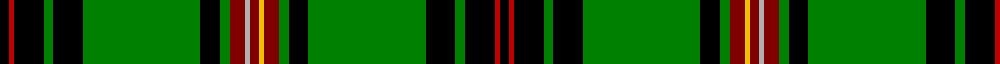

In pattern [KRKGKGKGRYRYRGKGKGKRK](/patterns/krkgkgkgryryrgkgkgkrk/).

This was sourced from weddslist.  It is a [21 stripes tartan](/stripes/stripes21/).

Original link http://www.weddslist.com/cgi-bin/tartans/pg.pl?source=sts

## Thread count
K/4 R2 K12 G4 K12 G48 K8 G4 DR6 N2 DR4 Y2 DR6 G4 K8 G48 K12 G4 K12 R2 K/4

## Palette
Each colour and its ΔE from the base-6 reference it is a variant of.

| Colour | Shade | Base | ΔE (OKLab) |
|---|---|---|---|
| DR | <code style="background-color:#800000;">#800000</code> `#800000` | R <code style="background-color:#CC0000;">#CC0000</code> | 0.17 |
| G | <code style="background-color:#008000;">#008000</code> `#008000` | G <code style="background-color:#006100;">#006100</code> | 0.10 |
| K | <code style="background-color:#000000;">#000000</code> `#000000` | K <code style="background-color:#000000;">#000000</code> | 0.00 |
| N | <code style="background-color:#B0B0B0;">#B0B0B0</code> `#B0B0B0` | Y <code style="background-color:#F2BF00;">#F2BF00</code> | 0.18 |
| R | <code style="background-color:#C00000;">#C00000</code> `#C00000` | R <code style="background-color:#CC0000;">#CC0000</code> | 0.03 |
| Y | <code style="background-color:#F0C000;">#F0C000</code> `#F0C000` | Y <code style="background-color:#F2BF00;">#F2BF00</code> | 0.00 |

## Nearest tartans

The nearest existing variants by ΔTartan distance.

1. [Unidentified, Phyllis Gordon](/setts/s20/k40g8r1g57y5g9w5g57r1g8k40b7k4g4k2w4k2g4k4b7x2~b800070-g008000-k000000-rc00000-we0e0e0-yf0c000/) — ΔT 1.16
1. [Kennedy](/setts/s17/k2g2y1g3r1g2r1g12b4k3b3k3b3k3b4g24ra2x2~b304080-g008000-k000000-r900030-rac00020-yf0c000/) — ΔT 1.17
1. [Campbell, Marquis of Lorne](/setts/s18/b6k6g4k22g3k3g32y3g3w3g3r3g32k3g3k22g4k6~b800080-g008000-k000000-rc00000-we0e0e0-yf0c000/) — ΔT 1.36
1. [King George VI (Green Stewart)](/setts/s22/g42b3k8y2k2w3k2g12r5k2r2w2r2k2r5g12k2w3k2y2k8b3x2~b1474b4-g006818-k101010-rc8002c-we0e0e0-ye8c000/) — ΔT 1.50
1. [Lorne, Marquis of](/setts/s18/b3k3g2k14g2k2g20r2g2w2g2y2g20k2g2k14g2k3x2~b304080-g30a010-k000000-rc00000-we0e0e0-yf0c000/) — ΔT 1.53
1. [Reilly fae the Mearns (Personal)](/setts/s14/g2w5ga1k7w1ga2k6ga6g9r1g30y2g3w2x2~g006818-ga003820-k101010-ra00000-wfcfcfc-ydc943c/) — ΔT 1.54
1. [Lorne, Marquis of #2](/setts/s18/b10g10ga8g46ga3g3ga55y4ga5w4ga5r4ga55g3ga3g46ga8g10x2~b2c4084-g002814-ga309c18-rdc0000-we0e0e0-ye8c000/) — ΔT 1.59
1. [King Edward VII](/setts/s17/y8g84b21k10b10k10b10k10b21g62r3g6r3g10y3g5r6x2~b304080-g008000-k000000-rc00000-yf0c000/) — ΔT 1.65
1. [Blairlogie, or Blair Athol](/setts/s17/k20r3b10g3b5g25k1g1w3g1k1g25b5g3b10r1b2x2~b304080-g008000-k000000-rc00000-we0e0e0/) — ΔT 1.65
1. [Kinnear Barony of.. Family Tartan Tartan Number: 2136. Earliest known date: 13/10/92 Michael Jean George Pilette (Vlug) of Kinnear, Baron of Kinnear, commissioned the design of this new tartan. Based on the 'Duke of Fife' or Fife district tartan with an overcheck in the colours of the Kinnear Arms. The tartan was designed by Blair Urquhart for the Scottish Tartans Society and is intended for association with the bearer of the Kinnear Arms. See products available Copyright © Blair Urquhart, Comrie, 2015](/setts/s21/k2r1k6g2k6g24k4g2ra3y1ra2ya1ra3g2k4g24k6g2k6r1k2x2~g006818-k101010-rc80000-ra880000-yb8b8b8-yae8c000/) — ΔT 1.69

## Neighbour map

Every grey dot is one of 15726 variants placed by the first two principal components of the ΔTartan feature space (44% of its variance). Red is this tartan; blue dots are its nearest — click one to open its page.

<svg viewBox="0 0 640 380" role="img" style="max-width:100%;height:auto;border:1px solid #e0e0e0;border-radius:4px;display:block" xmlns="http://www.w3.org/2000/svg"><image href="/nn/cloud.v1.png" width="640" height="380"/><a href="/setts/s20/k40g8r1g57y5g9w5g57r1g8k40b7k4g4k2w4k2g4k4b7x2~b800070-g008000-k000000-rc00000-we0e0e0-yf0c000/"><circle cx="290.3" cy="38.1" r="4" fill="#3465a4"><title>Unidentified, Phyllis Gordon</title></circle></a><a href="/setts/s17/k2g2y1g3r1g2r1g12b4k3b3k3b3k3b4g24ra2x2~b304080-g008000-k000000-r900030-rac00020-yf0c000/"><circle cx="289.1" cy="78.9" r="4" fill="#3465a4"><title>Kennedy</title></circle></a><a href="/setts/s18/b6k6g4k22g3k3g32y3g3w3g3r3g32k3g3k22g4k6~b800080-g008000-k000000-rc00000-we0e0e0-yf0c000/"><circle cx="217.8" cy="110.9" r="4" fill="#3465a4"><title>Campbell, Marquis of Lorne</title></circle></a><a href="/setts/s22/g42b3k8y2k2w3k2g12r5k2r2w2r2k2r5g12k2w3k2y2k8b3x2~b1474b4-g006818-k101010-rc8002c-we0e0e0-ye8c000/"><circle cx="250.5" cy="55.7" r="4" fill="#3465a4"><title>King George VI (Green Stewart)</title></circle></a><a href="/setts/s18/b3k3g2k14g2k2g20r2g2w2g2y2g20k2g2k14g2k3x2~b304080-g30a010-k000000-rc00000-we0e0e0-yf0c000/"><circle cx="209.5" cy="106.8" r="4" fill="#3465a4"><title>Lorne, Marquis of</title></circle></a><a href="/setts/s14/g2w5ga1k7w1ga2k6ga6g9r1g30y2g3w2x2~g006818-ga003820-k101010-ra00000-wfcfcfc-ydc943c/"><circle cx="286.2" cy="74.3" r="4" fill="#3465a4"><title>Reilly fae the Mearns (Personal)</title></circle></a><a href="/setts/s18/b10g10ga8g46ga3g3ga55y4ga5w4ga5r4ga55g3ga3g46ga8g10x2~b2c4084-g002814-ga309c18-rdc0000-we0e0e0-ye8c000/"><circle cx="259.0" cy="92.6" r="4" fill="#3465a4"><title>Lorne, Marquis of #2</title></circle></a><a href="/setts/s17/y8g84b21k10b10k10b10k10b21g62r3g6r3g10y3g5r6x2~b304080-g008000-k000000-rc00000-yf0c000/"><circle cx="318.4" cy="88.4" r="4" fill="#3465a4"><title>King Edward VII</title></circle></a><a href="/setts/s17/k20r3b10g3b5g25k1g1w3g1k1g25b5g3b10r1b2x2~b304080-g008000-k000000-rc00000-we0e0e0/"><circle cx="239.7" cy="95.2" r="4" fill="#3465a4"><title>Blairlogie, or Blair Athol</title></circle></a><a href="/setts/s21/k2r1k6g2k6g24k4g2ra3y1ra2ya1ra3g2k4g24k6g2k6r1k2x2~g006818-k101010-rc80000-ra880000-yb8b8b8-yae8c000/"><circle cx="310.3" cy="82.3" r="4" fill="#3465a4"><title>Kinnear Barony of.. Family Tartan Tartan Number: 2136. Earliest known date: 13/10/92 Michael Jean George Pilette (Vlug) of Kinnear, Baron of Kinnear, commissioned the design of this new tartan. Based on the 'Duke of Fife' or Fife district tartan with an overcheck in the colours of the Kinnear Arms. The tartan was designed by Blair Urquhart for the Scottish Tartans Society and is intended for association with the bearer of the Kinnear Arms. See products available Copyright © Blair Urquhart, Comrie, 2015</title></circle></a><circle cx="262.2" cy="66.2" r="5" fill="#c00000"/></svg>

ID: /setts/s21/k2r1k6g2k6g24k4g2ra3y1ra2ya1ra3g2k4g24k6g2k6r1k2x2~g008000-k000000-rc00000-ra800000-yb0b0b0-yaf0c000/
