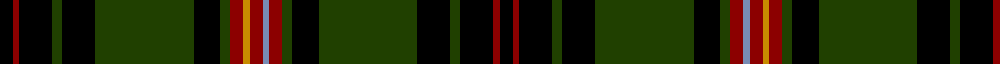

In pattern [KRKGKGKGRBRYRGKGKGKRK](/stripes/krkgkgkgrbryrgkgkgkrk/).

This was sourced from register-of-tartans.  It is a [21 stripe tartan](/stripes/stripes21/).

Original link https://www.tartanregister.gov.uk/tartanDetails.aspx?ref=3338

## Register references

External register numbers recorded for this tartan.

- Scottish Register of Tartans: [3338](https://www.tartanregister.gov.uk/tartanDetails.aspx?ref=3338)
- Scottish Tartans Authority (ITI): 5504

## Thread count
K/8 DR4 K20 G6 K20 G60 K16 G6 DR8 DY4 DR8 B4 DR8 G6 K16 G60 K20 G6 K20 DR4 K/8

## Palette
Each colour and its ΔE from the base-6 reference it is a variant of.

| Colour | Shade | Base | ΔE (OKLab) |
|---|---|---|---|
| B | <code style="background-color:#788CB4;">#788CB4</code> `#788CB4` | B <code style="background-color:#2A418A;">#2A418A</code> | 0.25 |
| DR | <code style="background-color:#8C0000;">#8C0000</code> `#8C0000` | R <code style="background-color:#CC0000;">#CC0000</code> | 0.14 |
| DY | <code style="background-color:#C88C00;">#C88C00</code> `#C88C00` | Y <code style="background-color:#F2BF00;">#F2BF00</code> | 0.15 |
| G | <code style="background-color:#204000;">#204000</code> `#204000` | G <code style="background-color:#006100;">#006100</code> | 0.11 |
| K | <code style="background-color:#000000;">#000000</code> `#000000` | K <code style="background-color:#000000;">#000000</code> | 0.00 |

## Nearest tartans

The nearest existing variants by ΔTartan distance.

1. [Stewart Hunting D](/setts/s27/dg2db3k1db1k1db1k4dg12r4dg12k3dg2k6dg4k6dg2k3dg12ly4dg12k4db1k1db1k1db3dg2/) — ΔT 1.26
1. [Pilette of Kinnear (Personal)](/setts/s21/k4r2k10g3k10g30k8g3r4lo2r4lb2r4g3k8g30k10g3k10r2k4~x2/) — ΔT 1.28
1. [Stewart Hunting](/setts/s27/dg2db8k1db1k1db1k2dg11r2dg11k3dg2k6dg2k6dg2k3dg11ly2dg11k2db1k1db1k1db8dg2/) — ΔT 1.31
1. [Stewart Hunting](/setts/s27/dg2db7k1db1k1db1k3dg11r2dg11k3dg2k6dg2k6dg2k3dg11ly2dg11k3db1k1db1k1db7dg2~x2/) — ΔT 1.32
1. [Stewart Hunting D](/setts/s27/dg2db3k1db1k1db1k4dg12r2dg12k3dg2k6dg2k6dg2k3dg12ly2dg12k4db1k1db1k1db3dg2~x2/) — ΔT 1.34
1. [Stewart Hunting](/setts/s27/dg2db7k1db1k1db1k3dg11r4dg11k3dg2k6dg4k6dg2k3dg11ly4dg11k3db1k1db1k1db7dg2/) — ΔT 1.34
1. [Cork, County](/setts/s16/dg28r12dg4k20lo2k3lo2k3dg7~x2/) — ΔT 1.40
1. [Stewart Hunting D](/setts/s27/dg2db3k1db1k1db1k4dg12r2dg12k3dg2k6dg2k6dg2k3dg12ly2dg12k4db1k1db1k1db3dg2/) — ΔT 1.42
1. [MacKean Hunting Family Tartan Tartan Number: 985. Earliest known date: 1987 1987 See products available Copyright © Blair Urquhart, Comrie, 2015](/setts/s15/g2r4g2k16g4k16g4k2g2k2g4k4db8k1w2~x2/) — ΔT 1.46
1. [Lochcarron Hunting Corporate Tartan Tartan Number: 5464. Earliest known date: 01/01/2002 Woven sample. See products available Copyright © Blair Urquhart, Comrie, 2015](/setts/s14/dg3db10k3db2k2db2dg3k5dg2k5dg22r2dg3r2~x2/) — ΔT 1.57

## Neighbour map

Every grey dot is one of 14299 variants placed by the first two principal components of the ΔTartan feature space (44% of its variance). Red is this tartan; blue dots are its nearest — click one to open its page.

<svg viewBox="0 0 640 380" role="img" style="max-width:100%;height:auto;border:1px solid #e0e0e0;border-radius:4px;display:block" xmlns="http://www.w3.org/2000/svg"><image href="/nn/cloud.v1.png" width="640" height="380"/><a href="/setts/s27/dg2db3k1db1k1db1k4dg12r4dg12k3dg2k6dg4k6dg2k3dg12ly4dg12k4db1k1db1k1db3dg2/"><circle cx="260.8" cy="138.4" r="4" fill="#3465a4"><title>Stewart Hunting D</title></circle></a><a href="/setts/s21/k4r2k10g3k10g30k8g3r4lo2r4lb2r4g3k8g30k10g3k10r2k4~x2/"><circle cx="255.9" cy="124.8" r="4" fill="#3465a4"><title>Pilette of Kinnear (Personal)</title></circle></a><a href="/setts/s27/dg2db8k1db1k1db1k2dg11r2dg11k3dg2k6dg2k6dg2k3dg11ly2dg11k2db1k1db1k1db8dg2/"><circle cx="234.1" cy="139.7" r="4" fill="#3465a4"><title>Stewart Hunting</title></circle></a><a href="/setts/s27/dg2db7k1db1k1db1k3dg11r2dg11k3dg2k6dg2k6dg2k3dg11ly2dg11k3db1k1db1k1db7dg2~x2/"><circle cx="245.1" cy="147.4" r="4" fill="#3465a4"><title>Stewart Hunting</title></circle></a><a href="/setts/s27/dg2db3k1db1k1db1k4dg12r2dg12k3dg2k6dg2k6dg2k3dg12ly2dg12k4db1k1db1k1db3dg2~x2/"><circle cx="285.3" cy="138.9" r="4" fill="#3465a4"><title>Stewart Hunting D</title></circle></a><a href="/setts/s27/dg2db7k1db1k1db1k3dg11r4dg11k3dg2k6dg4k6dg2k3dg11ly4dg11k3db1k1db1k1db7dg2/"><circle cx="222.3" cy="146.9" r="4" fill="#3465a4"><title>Stewart Hunting</title></circle></a><a href="/setts/s16/dg28r12dg4k20lo2k3lo2k3dg7~x2/"><circle cx="224.7" cy="153.3" r="4" fill="#3465a4"><title>Cork, County</title></circle></a><a href="/setts/s27/dg2db3k1db1k1db1k4dg12r2dg12k3dg2k6dg2k6dg2k3dg12ly2dg12k4db1k1db1k1db3dg2/"><circle cx="274.1" cy="134.1" r="4" fill="#3465a4"><title>Stewart Hunting D</title></circle></a><a href="/setts/s15/g2r4g2k16g4k16g4k2g2k2g4k4db8k1w2~x2/"><circle cx="292.2" cy="146.0" r="4" fill="#3465a4"><title>MacKean Hunting Family Tartan Tartan Number: 985. Earliest known date: 1987 1987 See products available Copyright © Blair Urquhart, Comrie, 2015</title></circle></a><a href="/setts/s14/dg3db10k3db2k2db2dg3k5dg2k5dg22r2dg3r2~x2/"><circle cx="249.6" cy="158.6" r="4" fill="#3465a4"><title>Lochcarron Hunting Corporate Tartan Tartan Number: 5464. Earliest known date: 01/01/2002 Woven sample. See products available Copyright © Blair Urquhart, Comrie, 2015</title></circle></a><circle cx="258.0" cy="128.8" r="5" fill="#c00000"/></svg>

ID: /setts/s21/k4r2k10dg3k10dg30k8dg3r4t2r4lo2r4dg3k8dg30k10dg3k10r2k4~x2/
