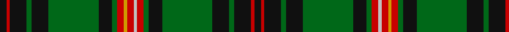

In pattern [KRKGKGKGRWRYRGKGKGKRK](/patterns/krkgkgkgrwryrgkgkgkrk/).

This was sourced from tartans-authority.  It is a [21 stripes tartan](/stripes/stripes21/).

Original link http://www.tartansauthority.com/tartan-ferret/display/2139/

## Thread count
K/8 R4 K20 G6 K20 G60 K16 G6 R8 DY4 R8 N4 R8 G6 K16 G60 K20 G6 K20 R4 K/8

## Palette
Each colour and its ΔE from the base-6 reference it is a variant of.

| Colour | Shade | Base | ΔE (OKLab) |
|---|---|---|---|
| DY | <code style="background-color:#D09800;">#D09800</code> `#D09800` | Y <code style="background-color:#F2BF00;">#F2BF00</code> | 0.12 |
| G | <code style="background-color:#006818;">#006818</code> `#006818` | G <code style="background-color:#006100;">#006100</code> | 0.02 |
| K | <code style="background-color:#101010;">#101010</code> `#101010` | K <code style="background-color:#000000;">#000000</code> | 0.17 |
| N | <code style="background-color:#C0C0C0;">#C0C0C0</code> `#C0C0C0` | W <code style="background-color:#F7F7F7;">#F7F7F7</code> | 0.17 |
| R | <code style="background-color:#C80000;">#C80000</code> `#C80000` | R <code style="background-color:#CC0000;">#CC0000</code> | 0.01 |

## Nearest tartans

The nearest existing variants by ΔTartan distance.

1. [Kinnear, Barony of (Personal)](/setts/s20/k4r2k8g3k8g36k8g3r4w2r3y2r4g3k8g36k8g3k8r2~g006818-k101010-rc80000-wc0c0c0-yd09800~x2/) — ΔT 0.93
1. [Cochrane](/setts/s15/g34r4g3r2g4r2g3r4g17k17r2b17r4b4y3~b202060-g006818-k101010-rc80000-yd8b000~x2/) — ΔT 1.12
1. [Cochrane (1984) Clan Tartan Tartan Number: 978. Earliest known date: 1984 Lord Dundonald originally registered a version missing a red and a green stripe in 1974. There is a story that a fragment of this design was discovered in the foundations of a Perthshire house in 1934. Around that time, a count was recorded from the sample books of Messrs William Anderson. The red and green have been restored in this version, which is now the 'approved' tartan, and appears in the 'Appendix' of the Lyon Court Books dated 12th November 1984. See products available Copyright © Blair Urquhart, Comrie, 2015](/setts/s15/g34r4g4r2g4r2g3r4g17k17r2b17r4b4y3~b2c2c80-g006818-k101010-rc80000-ye8c000~x2/) — ΔT 1.16
1. [Kerby (Personal)](/setts/s22/b4w2b10k10g3k3g3k2g24y2g2r4g2y2g24k2g3k3g3k10b10w2~b440044-g006818-k101010-r880000-we0e0e0-ye8c000~x2/) — ΔT 1.18
1. [Buchan Cumming MacIntyre District Tartan Tartan Number: 1991. Earliest known date: 1790 Also MacIntyre and Glenorchy. Adopted by the Buchan family around 1965, on account of their long association with the Cummings which began with the marriage of Margaret, daughter of King Edgar, to William Coymen, sheriff of Forfar in 1210. The name, Buchan, though a family name, is territorial in origin. The sett is asymmetrical. There is a sample in the collection of the Highland Society of London, housed in the National Museums of Scotland, Edinburgh. See products available Copyright © Blair Urquhart, Comrie, 2015](/setts/s23/r6g6r2k24r2b2k2r2k24r2g6r6b2k6r2g27r2k2r2g27r2k6b2~b2c2c80-g006818-k101010-rc80000~x2/) — ΔT 1.23
1. [Campbell, Marquis of Lorne](/setts/s18/b6k6g4k22g3k3g32y3g3w3g3r3g32k3g3k22g4k6~b780078-g006818-k101010-rc80000-wfcfcfc-ye8c000/) — ΔT 1.25
1. [Raznotravie](/setts/s18/k10y1g2k1b2k1g2y1k1b2k3b1k17g18y1g2k1ga2~b1e2025-g70714d-ga23321b-k1c1714-yf5d38b~x2/) — ΔT 1.27
1. [Pilette of Kinnear (Personal)](/setts/s21/k4r2k10g3k10g30k8g3r4b2r4y2r4g3k8g30k10g3k10r2k4~b788cb4-g204000-k000000-r8c0000-yc88c00~x2/) — ΔT 1.27
1. [Buchan](/setts/s23/r6g6r2k24r2b2k2r2k24r2g6r6b2k6r2g27r2k2r2g27r2k6b2~b2c2c80-g006818-k101010-ra00000~x2/) — ΔT 1.30
1. [Park Clan/Family Weavers Tartan Tartan Number: 2387. Earliest known date: September 1996 William D. Park wished to have a tartan for himself and family. Can be worn by those of the same name. See products available Copyright © Blair Urquhart, Comrie, 2015](/setts/s22/g3r2g3r4g34k2g2k2g4k16b16r3b16k16g4k2g2k2g34r4g3r2~b2c2c80-g006818-k101010-rc80000~x2/) — ΔT 1.33

## Neighbour map

Every grey dot is one of 15726 variants placed by the first two principal components of the ΔTartan feature space (44% of its variance). Red is this tartan; blue dots are its nearest — click one to open its page.

<svg viewBox="0 0 640 380" role="img" style="max-width:100%;height:auto;border:1px solid #e0e0e0;border-radius:4px;display:block" xmlns="http://www.w3.org/2000/svg"><image href="/nn/cloud.v1.png" width="640" height="380"/><a href="/setts/s20/k4r2k8g3k8g36k8g3r4w2r3y2r4g3k8g36k8g3k8r2~g006818-k101010-rc80000-wc0c0c0-yd09800~x2/"><circle cx="308.3" cy="108.0" r="4" fill="#3465a4"><title>Kinnear, Barony of (Personal)</title></circle></a><a href="/setts/s15/g34r4g3r2g4r2g3r4g17k17r2b17r4b4y3~b202060-g006818-k101010-rc80000-yd8b000~x2/"><circle cx="263.4" cy="124.7" r="4" fill="#3465a4"><title>Cochrane</title></circle></a><a href="/setts/s15/g34r4g4r2g4r2g3r4g17k17r2b17r4b4y3~b2c2c80-g006818-k101010-rc80000-ye8c000~x2/"><circle cx="263.1" cy="124.7" r="4" fill="#3465a4"><title>Cochrane (1984) Clan Tartan Tartan Number: 978. Earliest known date: 1984 Lord Dundonald originally registered a version missing a red and a green stripe in 1974. There is a story that a fragment of this design was discovered in the foundations of a Perthshire house in 1934. Around that time, a count was recorded from the sample books of Messrs William Anderson. The red and green have been restored in this version, which is now the 'approved' tartan, and appears in the 'Appendix' of the Lyon Court Books dated 12th November 1984. See products available Copyright © Blair Urquhart, Comrie, 2015</title></circle></a><a href="/setts/s22/b4w2b10k10g3k3g3k2g24y2g2r4g2y2g24k2g3k3g3k10b10w2~b440044-g006818-k101010-r880000-we0e0e0-ye8c000~x2/"><circle cx="208.3" cy="104.2" r="4" fill="#3465a4"><title>Kerby (Personal)</title></circle></a><a href="/setts/s23/r6g6r2k24r2b2k2r2k24r2g6r6b2k6r2g27r2k2r2g27r2k6b2~b2c2c80-g006818-k101010-rc80000~x2/"><circle cx="239.8" cy="123.9" r="4" fill="#3465a4"><title>Buchan Cumming MacIntyre District Tartan Tartan Number: 1991. Earliest known date: 1790 Also MacIntyre and Glenorchy. Adopted by the Buchan family around 1965, on account of their long association with the Cummings which began with the marriage of Margaret, daughter of King Edgar, to William Coymen, sheriff of Forfar in 1210. The name, Buchan, though a family name, is territorial in origin. The sett is asymmetrical. There is a sample in the collection of the Highland Society of London, housed in the National Museums of Scotland, Edinburgh. See products available Copyright © Blair Urquhart, Comrie, 2015</title></circle></a><a href="/setts/s18/b6k6g4k22g3k3g32y3g3w3g3r3g32k3g3k22g4k6~b780078-g006818-k101010-rc80000-wfcfcfc-ye8c000/"><circle cx="253.8" cy="122.0" r="4" fill="#3465a4"><title>Campbell, Marquis of Lorne</title></circle></a><a href="/setts/s18/k10y1g2k1b2k1g2y1k1b2k3b1k17g18y1g2k1ga2~b1e2025-g70714d-ga23321b-k1c1714-yf5d38b~x2/"><circle cx="295.6" cy="101.1" r="4" fill="#3465a4"><title>Raznotravie</title></circle></a><a href="/setts/s21/k4r2k10g3k10g30k8g3r4b2r4y2r4g3k8g30k10g3k10r2k4~b788cb4-g204000-k000000-r8c0000-yc88c00~x2/"><circle cx="254.9" cy="125.7" r="4" fill="#3465a4"><title>Pilette of Kinnear (Personal)</title></circle></a><a href="/setts/s23/r6g6r2k24r2b2k2r2k24r2g6r6b2k6r2g27r2k2r2g27r2k6b2~b2c2c80-g006818-k101010-ra00000~x2/"><circle cx="251.7" cy="130.1" r="4" fill="#3465a4"><title>Buchan</title></circle></a><a href="/setts/s22/g3r2g3r4g34k2g2k2g4k16b16r3b16k16g4k2g2k2g34r4g3r2~b2c2c80-g006818-k101010-rc80000~x2/"><circle cx="291.0" cy="125.3" r="4" fill="#3465a4"><title>Park Clan/Family Weavers Tartan Tartan Number: 2387. Earliest known date: September 1996 William D. Park wished to have a tartan for himself and family. Can be worn by those of the same name. See products available Copyright © Blair Urquhart, Comrie, 2015</title></circle></a><circle cx="253.1" cy="121.5" r="5" fill="#c00000"/></svg>

ID: /setts/s21/k4r2k10g3k10g30k8g3r4w2r4y2r4g3k8g30k10g3k10r2k4~g006818-k101010-rc80000-wc0c0c0-yd09800~x2/
