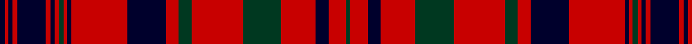

In pattern [GRKRGRGRKRKRGRKRKRKRK](/patterns/grkrgrgrkrkrgrkrkrkrk/).

This was sourced from register-of-tartans.  It is a [21 stripes tartan](/stripes/stripes21/).

Original link https://www.tartanregister.gov.uk/tartanDetails.aspx?ref=3071

## Thread count
DB/8 R6 DB6 R8 DB44 R8 DB6 R6 DG8 R6 DB6 R88 DB60 R20 DG20 R80 DG60 R54 DB20 R28 DG/6

## Palette
Each colour and its ΔE from the base-6 reference it is a variant of.

| Colour | Shade | Base | ΔE (OKLab) |
|---|---|---|---|
| DB | <code style="background-color:#00002C;">#00002C</code> `#00002C` | K <code style="background-color:#000000;">#000000</code> | 0.16 |
| DG | <code style="background-color:#003820;">#003820</code> `#003820` | G <code style="background-color:#006100;">#006100</code> | 0.15 |
| R | <code style="background-color:#C80000;">#C80000</code> `#C80000` | R <code style="background-color:#CC0000;">#CC0000</code> | 0.01 |

## Nearest tartans

The nearest existing variants by ΔTartan distance.

1. [Hebrides #12](/setts/s20/k2r2k12r2k2r18k2r2k12r2w1r2k12r2k2r18k2r2k12r2~k101010-rc80000-we0e0e0~x2/) — ΔT 0.95
1. [Walkers Shortbread (Corporate)](/setts/s15/r5k1r2k2r16b2r2k9r2k2r2k13r2k2r4~b5c8ca8-k101010-rc80000~x2/) — ΔT 1.02
1. [Robertson D](/setts/s13/r3g1r15b2r2b15r2g15r2b2r15g1r3~b00004c-g004c00-rc80000~x2/) — ΔT 1.08
1. [MacLeod Red](/setts/s21/b4r1b1r2b11r2b1r1y1r1b1r16b8r4g4r16g11r8b4r2y2~b000050-g008000-rc00000-yf0c000~x2/) — ΔT 1.10
1. [Murray of Tullibardine](/setts/s21/b2r1b1r2b4r2b1r1b2r1b1r24b12r2g2r8g12r4b2r2b1~b00004c-g004c00-rc80000/) — ΔT 1.14
1. [Amstartan](/setts/s25/k6r5k5r5k5r5k12w2k2w2k12r5k38r21k6r21w2k12w2k12r3w2r3w2k6~k18161b-rab1a22-wffffff/) — ΔT 1.16
1. [Hallingdal](/setts/s22/g2y1r2k12r2k2r2k2r13k2y1r2y1k2r13k2r2k2r2k12r2y1~g006818-k101010-rc80000-ye8c000~x2/) — ΔT 1.19
1. [MacLeod Red Clan Tartan Tartan Number: 496. Earliest known date: 1982 Designed after the tartan worn by Norman MacLeod, 22nd Chief of the clan, painted by Allan Ramsay in 1747, with the costume painted by Van Haecken (see details in entry for MacLeod portrait.) A yellow stripe was added by Ruairidh MacLeod to enhance the family resemblance to other MacLeod tartans, and to differentiate this from Murray of Tullibardine, the name now attached to the sett in the portrait. Approved by the Clan MacLeod Parliament in 1982. See products available Copyright © Blair Urquhart, Comrie, 2015](/setts/s21/b4r1b1r2b11r2b1r1y1r1b1r16b8r4g4r16g11r8b4r2y2~b202060-g006818-rc80000-ye8c000~x2/) — ΔT 1.22
1. [Hebrides South Uist #3](/setts/s18/g8r1k1r8g1r8k1r1k8r1k8r1k1r8g1r8k1r1~g006818-k101010-rc80000~x6/) — ΔT 1.27
1. [Hebrides #2](/setts/s20/b25ba2r25g10r4b25r2g2r25g2r2g2r25g2r2b25r4g10r25ba2~b202060-ba2c2c80-g006818-rc80000~x2/) — ΔT 1.29

## Neighbour map

Every grey dot is one of 15726 variants placed by the first two principal components of the ΔTartan feature space (44% of its variance). Red is this tartan; blue dots are its nearest — click one to open its page.

<svg viewBox="0 0 640 380" role="img" style="max-width:100%;height:auto;border:1px solid #e0e0e0;border-radius:4px;display:block" xmlns="http://www.w3.org/2000/svg"><image href="/nn/cloud.v1.png" width="640" height="380"/><a href="/setts/s20/k2r2k12r2k2r18k2r2k12r2w1r2k12r2k2r18k2r2k12r2~k101010-rc80000-we0e0e0~x2/"><circle cx="354.0" cy="137.4" r="4" fill="#3465a4"><title>Hebrides #12</title></circle></a><a href="/setts/s15/r5k1r2k2r16b2r2k9r2k2r2k13r2k2r4~b5c8ca8-k101010-rc80000~x2/"><circle cx="351.6" cy="153.0" r="4" fill="#3465a4"><title>Walkers Shortbread (Corporate)</title></circle></a><a href="/setts/s13/r3g1r15b2r2b15r2g15r2b2r15g1r3~b00004c-g004c00-rc80000~x2/"><circle cx="320.3" cy="158.8" r="4" fill="#3465a4"><title>Robertson D</title></circle></a><a href="/setts/s21/b4r1b1r2b11r2b1r1y1r1b1r16b8r4g4r16g11r8b4r2y2~b000050-g008000-rc00000-yf0c000~x2/"><circle cx="276.1" cy="116.1" r="4" fill="#3465a4"><title>MacLeod Red</title></circle></a><a href="/setts/s21/b2r1b1r2b4r2b1r1b2r1b1r24b12r2g2r8g12r4b2r2b1~b00004c-g004c00-rc80000/"><circle cx="349.1" cy="101.6" r="4" fill="#3465a4"><title>Murray of Tullibardine</title></circle></a><a href="/setts/s25/k6r5k5r5k5r5k12w2k2w2k12r5k38r21k6r21w2k12w2k12r3w2r3w2k6~k18161b-rab1a22-wffffff/"><circle cx="356.3" cy="126.5" r="4" fill="#3465a4"><title>Amstartan</title></circle></a><a href="/setts/s22/g2y1r2k12r2k2r2k2r13k2y1r2y1k2r13k2r2k2r2k12r2y1~g006818-k101010-rc80000-ye8c000~x2/"><circle cx="287.9" cy="116.0" r="4" fill="#3465a4"><title>Hallingdal</title></circle></a><a href="/setts/s21/b4r1b1r2b11r2b1r1y1r1b1r16b8r4g4r16g11r8b4r2y2~b202060-g006818-rc80000-ye8c000~x2/"><circle cx="296.2" cy="120.4" r="4" fill="#3465a4"><title>MacLeod Red Clan Tartan Tartan Number: 496. Earliest known date: 1982 Designed after the tartan worn by Norman MacLeod, 22nd Chief of the clan, painted by Allan Ramsay in 1747, with the costume painted by Van Haecken (see details in entry for MacLeod portrait.) A yellow stripe was added by Ruairidh MacLeod to enhance the family resemblance to other MacLeod tartans, and to differentiate this from Murray of Tullibardine, the name now attached to the sett in the portrait. Approved by the Clan MacLeod Parliament in 1982. See products available Copyright © Blair Urquhart, Comrie, 2015</title></circle></a><a href="/setts/s18/g8r1k1r8g1r8k1r1k8r1k8r1k1r8g1r8k1r1~g006818-k101010-rc80000~x6/"><circle cx="303.2" cy="174.1" r="4" fill="#3465a4"><title>Hebrides South Uist #3</title></circle></a><a href="/setts/s20/b25ba2r25g10r4b25r2g2r25g2r2g2r25g2r2b25r4g10r25ba2~b202060-ba2c2c80-g006818-rc80000~x2/"><circle cx="292.4" cy="138.7" r="4" fill="#3465a4"><title>Hebrides #2</title></circle></a><circle cx="318.9" cy="138.4" r="5" fill="#c00000"/></svg>

ID: /setts/s21/k4r3k3r4k22r4k3r3g4r3k3r44k30r10g10r40g30r27k10r14g3~g003820-k00002c-rc80000~x2/
