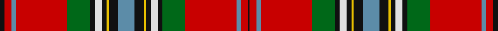

**Bands:** [KRBRGKWKYKBKYKWKGRBRK](/stripes/krbrgkwkykbkykwkgrbrk/) · **Stripes:** [K R T R G K W K LY K T K LY K W K G R T R K](/stripes/stripes21/) K R T R G K W K LY K T K LY K W K G R T R K

This was sourced from logan-1831.  It is a [21 band tartan](/bands/bands21/).

Original link /posts/logans-scottish-gael/

## Provenance

James Logan recorded the **MacLean** sett in 1831, on page 406 of the *Table of Clan Tartans* in *The Scottish Gaël* — the earliest systematic published collection of clan setts. Logan gives the stripe widths in eighths of an inch, measured across the cloth and reflected about each end (a half-sett):

> ¼ black · 1½ red · 1 azure · 11 red · 5 green · 1 black · 1½ white · 1 black · ½ yellow · 2 black · 3½ azure · 2 black · ½ yellow · 1 black · 1½ white · 1 black · 5 green · 11 red · 1 azure · 1½ red · 1 black

In threads (at 8 to the eighth-inch) that is `K/2 R12 A8 R88 G40 K8 W12 K8 Y4 K16 A28 K16 Y4 K8 W12 K8 G40 R88 A8 R12 K/8`. Logan named his colours rather than dyeing to a standard, so the palette here is the Dictionary's modern reading of his names.

See [Logan's Scottish Gaël](/posts/logans-scottish-gael/) for the full table and method.

## Related setts

Later records of the **MacLean** name adjusted Logan's counts: [MacLean](/setts/s11/b8k8y2k3w3k3g24r16b3r4k2~b2c4084-g005020-k101010-rdc0000-we0e0e0-ye8c000~x2/); [MacLean (Black and White)](/setts/s11/w20k6w9k6w6k12w6k48w8k16w16~k101010-wffffff~x2/); [MacLean (rare)](/setts/s12/b9ba5k8y2k4w4k4g28r44ba4r5k3~b443428-ba3c82af-g005020-k101010-rdc0000-we0e0e0-ye8c000~x2/); [MacLean Dress (Lumsden)](/setts/s6/r1w12g6r8wa3y1~g006818-ra40000-wf8ece0-waa8ace8-yd09800~x4/). Compare their thread counts with Logan's above.

## Thread count
K/8 R12 B8 R88 G40 K8 LN12 K8 Y4 K16 B28 K16 Y4 K8 LN12 K8 G40 R88 B8 R12 K/2

## Palette
Each colour and its ΔE from the base-6 reference it is a variant of.

| Colour | Shade | Base | ΔE (OKLab) |
|---|---|---|---|
| B | <code style="background-color:#5C8CA8;">#5C8CA8</code> `#5C8CA8` | B <code style="background-color:#2A418A;">#2A418A</code> | 0.23 |
| G | <code style="background-color:#006818;">#006818</code> `#006818` | G <code style="background-color:#006100;">#006100</code> | 0.02 |
| K | <code style="background-color:#101010;">#101010</code> `#101010` | K <code style="background-color:#000000;">#000000</code> | 0.17 |
| LN | <code style="background-color:#E0E0E0;">#E0E0E0</code> `#E0E0E0` | W <code style="background-color:#F7F7F7;">#F7F7F7</code> | 0.07 |
| R | <code style="background-color:#C80000;">#C80000</code> `#C80000` | R <code style="background-color:#CC0000;">#CC0000</code> | 0.01 |
| Y | <code style="background-color:#E8C000;">#E8C000</code> `#E8C000` | Y <code style="background-color:#F2BF00;">#F2BF00</code> | 0.02 |

## Nearest tartans

The nearest existing variants by ΔTartan distance.

1. [Whitworth](/setts/s20/r5ly1r8w1db20w1b20w1g20ly1r5ly1r5ly1g20ly2r52w1ly5w1~x2/) — ΔT 0.80
1. [Whitworth Artifact Tartan Tartan Number: 1724. Earliest known date: c.1790-1800 A piece of material 11x8 inches supposedly cut from a plaid worn by Prince Charles during the '45 rebellion. The piece was loaned to the Scottish Tartans Society museum in 1978 by Anthony Whitworth. The tartan expert, James Scarlett, noted that the sample was woven with a flying shuttle and appeared to be of commercial manufacture. He suggests that it may be a commercial copy of one of the many 'Princes Plaids' made c.1790. See products available Copyright © Blair Urquhart, Comrie, 2015](/setts/s20/r5ly1r8w1db20w1t20w1g20ly1r5ly1r5ly1g20ly2r52w1ly5w1~x2/) — ΔT 0.83
1. [Stewart/Stuart of Galloway (Wilsons)](/setts/s22/r52y13k16ly2k3w4k3dg23r15dg7ly3dg7r15dg23k3w4k3ly2k16y13r52dg9~x2/) — ΔT 0.93
1. [Unidentified Plaid #8](/setts/s22/w5r99dg12r4dg2r12dg2r4dg12r24b15k29dg24r12dg4r2dg12r2dg4r12dg49ly5~x2/) — ΔT 0.95
1. [Stewart](/setts/s23/w2r3k2r8g16k2w2k2ly1k10t6r32t6k10ly1k2w2k2g16r8k2r3w1~x4/) — ΔT 0.96
1. [Mehrtens (Personal)](/setts/s16/w4dt4r18o4r1o36k1o4k6r2k6r6k2r6k4r2~x2/) — ΔT 1.04
1. [Mehrtens (Personal)](/setts/s16/w4dt4r18o4r1o36k1o4k6r2k6r6k2r6ly4r2~x2/) — ΔT 1.05
1. [Hay](/setts/s23/k12r4ly4k8r66g8r1ly1r8g60w3k60r3dp60r8ly3r3dp8r66k8ly4r4k6~x2/) — ΔT 1.09
1. [Unidentified Plaid 4](/setts/s22/w5r99g12r4g2r12g2r4g12r24b15k29g24r12g4r2g12r2g4r12g49ly5~x2/) — ΔT 1.12
1. [Mehrtens variant (Personal)](/setts/s14/w4dt4r18o4r1o36k1o4k6r2k6r6k4r2~x2/) — ΔT 1.22

## Neighbour map

Every grey dot is one of 14299 variants placed by the first two principal components of the ΔTartan feature space (44% of its variance). Red is this tartan; blue dots are its nearest — click one to open its page.

<svg viewBox="0 0 640 380" role="img" style="max-width:100%;height:auto;border:1px solid #e0e0e0;border-radius:4px;display:block" xmlns="http://www.w3.org/2000/svg"><image href="/nn/cloud.v1.png" width="640" height="380"/><a href="/setts/s20/r5ly1r8w1db20w1b20w1g20ly1r5ly1r5ly1g20ly2r52w1ly5w1~x2/"><circle cx="240.0" cy="14.0" r="4" fill="#3465a4"><title>Whitworth</title></circle></a><a href="/setts/s20/r5ly1r8w1db20w1t20w1g20ly1r5ly1r5ly1g20ly2r52w1ly5w1~x2/"><circle cx="249.2" cy="18.9" r="4" fill="#3465a4"><title>Whitworth Artifact Tartan Tartan Number: 1724. Earliest known date: c.1790-1800 A piece of material 11x8 inches supposedly cut from a plaid worn by Prince Charles during the '45 rebellion. The piece was loaned to the Scottish Tartans Society museum in 1978 by Anthony Whitworth. The tartan expert, James Scarlett, noted that the sample was woven with a flying shuttle and appeared to be of commercial manufacture. He suggests that it may be a commercial copy of one of the many 'Princes Plaids' made c.1790. See products available Copyright © Blair Urquhart, Comrie, 2015</title></circle></a><a href="/setts/s22/r52y13k16ly2k3w4k3dg23r15dg7ly3dg7r15dg23k3w4k3ly2k16y13r52dg9~x2/"><circle cx="225.0" cy="59.6" r="4" fill="#3465a4"><title>Stewart/Stuart of Galloway (Wilsons)</title></circle></a><a href="/setts/s22/w5r99dg12r4dg2r12dg2r4dg12r24b15k29dg24r12dg4r2dg12r2dg4r12dg49ly5~x2/"><circle cx="299.6" cy="21.4" r="4" fill="#3465a4"><title>Unidentified Plaid #8</title></circle></a><a href="/setts/s23/w2r3k2r8g16k2w2k2ly1k10t6r32t6k10ly1k2w2k2g16r8k2r3w1~x4/"><circle cx="187.6" cy="41.7" r="4" fill="#3465a4"><title>Stewart</title></circle></a><a href="/setts/s16/w4dt4r18o4r1o36k1o4k6r2k6r6k2r6k4r2~x2/"><circle cx="230.9" cy="45.1" r="4" fill="#3465a4"><title>Mehrtens (Personal)</title></circle></a><a href="/setts/s16/w4dt4r18o4r1o36k1o4k6r2k6r6k2r6ly4r2~x2/"><circle cx="234.9" cy="45.4" r="4" fill="#3465a4"><title>Mehrtens (Personal)</title></circle></a><a href="/setts/s23/k12r4ly4k8r66g8r1ly1r8g60w3k60r3dp60r8ly3r3dp8r66k8ly4r4k6~x2/"><circle cx="232.7" cy="19.7" r="4" fill="#3465a4"><title>Hay</title></circle></a><a href="/setts/s22/w5r99g12r4g2r12g2r4g12r24b15k29g24r12g4r2g12r2g4r12g49ly5~x2/"><circle cx="289.8" cy="19.9" r="4" fill="#3465a4"><title>Unidentified Plaid 4</title></circle></a><a href="/setts/s14/w4dt4r18o4r1o36k1o4k6r2k6r6k4r2~x2/"><circle cx="245.0" cy="51.0" r="4" fill="#3465a4"><title>Mehrtens variant (Personal)</title></circle></a><circle cx="239.9" cy="31.7" r="5" fill="#c00000"/></svg>

ID: /setts/s21/k4r6t4r44g20k4w6k4ly2k8t14k8ly2k4w6k4g20r44t4r6k1~x2/
