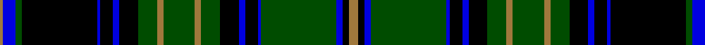

In pattern [RBGKBKBKGRGRGKBKBGBKR](/patterns/rbgkbkbkgrgrgkbkbgbkr/).

This was sourced from register-of-tartans.  It is a [21 stripes tartan](/stripes/stripes21/).

Original link https://www.tartanregister.gov.uk/tartanDetails.aspx?ref=4529

## Thread count
LT/4 B16 G8 K96 B4 K16 B8 K24 G24 LT8 G40 LT8 G24 K24 B8 K16 B4 G96 B8 K8 LT/12

## Palette
Each colour and its ΔE from the base-6 reference it is a variant of.

| Colour | Shade | Base | ΔE (OKLab) |
|---|---|---|---|
| B | <code style="background-color:#0000E0;">#0000E0</code> `#0000E0` | B <code style="background-color:#2A418A;">#2A418A</code> | 0.16 |
| G | <code style="background-color:#004C00;">#004C00</code> `#004C00` | G <code style="background-color:#006100;">#006100</code> | 0.07 |
| K | <code style="background-color:#000000;">#000000</code> `#000000` | K <code style="background-color:#000000;">#000000</code> | 0.00 |
| LT | <code style="background-color:#A0783C;">#A0783C</code> `#A0783C` | R <code style="background-color:#CC0000;">#CC0000</code> | 0.18 |

## Nearest tartans

The nearest existing variants by ΔTartan distance.

1. [Gordon VS](/setts/s17/b28k1b1k1b3k12g24y1g1y2g1y1g24k12b18k1b4~b00004c-g004c00-k000000-yffff00/) — ΔT 0.92
1. [Hope-Vere / Weir](/setts/s17/g18k1b3k1g3k8b18k1y1k5y1k1b18k8g2k1b2x2~b304080-g008000-k000000-yf0c000/) — ΔT 1.13
1. [Gordon, Ancient](/setts/s17/b28k1b1k1b3k12g24y1g1y2g1y1g24k12b18k1b4x2~b304080-g008000-k000000-yf0c000/) — ΔT 1.30
1. [Hope-Vere / Weir](/setts/s14/g19k1g4k1g3k10b20y1k7y1b20k10y3g1x2~b304080-g008000-k000000-yf0c000/) — ΔT 1.43
1. [Campbell of Argyll](/setts/s28/k16g8k1y2k1g8k8b8k1b1k1b8k8g8k1w2k1g8k8b1k1b1k1b8k1b1k1b1x2~b304080-g008000-k000000-we0e0e0-yf0c000/) — ΔT 1.44
1. [Gordon VS](/setts/s17/b28k1b1k1b3k12g24y1g1y2g1y1g24k12b18k1b4x2~b000052-g11450d-k000000-yaaaa00/) — ΔT 1.46
1. [Gordon VS](/setts/s17/b28k1b1k1b3k12g24y1g1y2g1y1g24k12b18k1b4~b000052-g11450d-k000000-yaaaa00/) — ΔT 1.46
1. [Urbino](/setts/s18/g3b2g2b2g2b20k20g22k1r3k1g22k20b20g2b2g2b2x4~b780078-g004c00-k000000-ra0783c/) — ΔT 1.48
1. [Sempill](/setts/s17/b22k3b3k3b3k15r2g19k1ba3k1g19r2k15b19k3b3x2~b304080-ba5480b0-g008000-k000000-rc00000/) — ΔT 1.51
1. [Farquharson](/setts/s25/b21k1b1k1b1k10g22r2g22k10b16k1b2k1b16k10g22y2g22k10b1k1b1k1b7x2~b304080-g008000-k000000-rc00000-yf0c000/) — ΔT 1.54

## Neighbour map

Every grey dot is one of 15726 variants placed by the first two principal components of the ΔTartan feature space (44% of its variance). Red is this tartan; blue dots are its nearest — click one to open its page.

<svg viewBox="0 0 640 380" role="img" style="max-width:100%;height:auto;border:1px solid #e0e0e0;border-radius:4px;display:block" xmlns="http://www.w3.org/2000/svg"><image href="/nn/cloud.v1.png" width="640" height="380"/><a href="/setts/s17/b28k1b1k1b3k12g24y1g1y2g1y1g24k12b18k1b4~b00004c-g004c00-k000000-yffff00/"><circle cx="254.9" cy="119.6" r="4" fill="#3465a4"><title>Gordon VS</title></circle></a><a href="/setts/s17/g18k1b3k1g3k8b18k1y1k5y1k1b18k8g2k1b2x2~b304080-g008000-k000000-yf0c000/"><circle cx="234.4" cy="125.1" r="4" fill="#3465a4"><title>Hope-Vere / Weir</title></circle></a><a href="/setts/s17/b28k1b1k1b3k12g24y1g1y2g1y1g24k12b18k1b4x2~b304080-g008000-k000000-yf0c000/"><circle cx="235.4" cy="106.1" r="4" fill="#3465a4"><title>Gordon, Ancient</title></circle></a><a href="/setts/s14/g19k1g4k1g3k10b20y1k7y1b20k10y3g1x2~b304080-g008000-k000000-yf0c000/"><circle cx="199.8" cy="135.7" r="4" fill="#3465a4"><title>Hope-Vere / Weir</title></circle></a><a href="/setts/s28/k16g8k1y2k1g8k8b8k1b1k1b8k8g8k1w2k1g8k8b1k1b1k1b8k1b1k1b1x2~b304080-g008000-k000000-we0e0e0-yf0c000/"><circle cx="176.2" cy="102.2" r="4" fill="#3465a4"><title>Campbell of Argyll</title></circle></a><a href="/setts/s17/b28k1b1k1b3k12g24y1g1y2g1y1g24k12b18k1b4x2~b000052-g11450d-k000000-yaaaa00/"><circle cx="275.1" cy="127.2" r="4" fill="#3465a4"><title>Gordon VS</title></circle></a><a href="/setts/s17/b28k1b1k1b3k12g24y1g1y2g1y1g24k12b18k1b4~b000052-g11450d-k000000-yaaaa00/"><circle cx="275.1" cy="127.2" r="4" fill="#3465a4"><title>Gordon VS</title></circle></a><a href="/setts/s18/g3b2g2b2g2b20k20g22k1r3k1g22k20b20g2b2g2b2x4~b780078-g004c00-k000000-ra0783c/"><circle cx="225.6" cy="120.4" r="4" fill="#3465a4"><title>Urbino</title></circle></a><a href="/setts/s17/b22k3b3k3b3k15r2g19k1ba3k1g19r2k15b19k3b3x2~b304080-ba5480b0-g008000-k000000-rc00000/"><circle cx="174.3" cy="113.0" r="4" fill="#3465a4"><title>Sempill</title></circle></a><a href="/setts/s25/b21k1b1k1b1k10g22r2g22k10b16k1b2k1b16k10g22y2g22k10b1k1b1k1b7x2~b304080-g008000-k000000-rc00000-yf0c000/"><circle cx="201.0" cy="94.6" r="4" fill="#3465a4"><title>Farquharson</title></circle></a><circle cx="246.3" cy="110.8" r="5" fill="#c00000"/></svg>

ID: /setts/s21/r3k2b2g24b1k4b2k6g6r2g10r2g6k6b2k4b1k24g2b4r1x4~b0000e0-g004c00-k000000-ra0783c/
