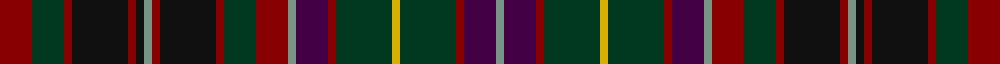

This page is one **sett** — a single exact thread-count. It belongs to the [tartan](/tartans/dr4dg4dr1k7dr1k1lg1dr1k7dr1dg4dr4lg1dp4dr1dg7y1dg7dr1dp4lg1/)
(the same proportion at any scale), whose colour order is pattern [GBRGYGRBGRGRKRGKRKRGR](/stripes/gbrgygrbgrgrkrgkrkrgr/).

Sourced from register-of-tartans.  It is a [21 stripe tartan](/stripes/stripes21/).

Original link https://www.tartanregister.gov.uk/tartanDetails.aspx?ref=1469

## Register references

External register numbers recorded for this tartan.

- Scottish Register of Tartans: [1469](https://www.tartanregister.gov.uk/tartanDetails.aspx?ref=1469)
- Scottish Tartans Authority (ITI): 1904
- Scottish Tartans World Register: 1904

## Thread count
DR/16 DG16 DR4 K28 DR4 K4 LG4 DR4 K28 DR4 DG16 DR16 LG4 DP16 DR4 DG28 Y4 DG28 DR4 DP16 LG/4

## Palette
Each colour and the base-6 reference it is a variant of.

| Colour | Shade | Base |
|---|---|---|
| DG | <code style="background-color:#003820;">#003820</code> `oklch(30.0% 0.070 158.3)` <small>#003820</small> | G <code style="background-color:#006100;">#006100</code> |
| DP | <code style="background-color:#440044;">#440044</code> `oklch(27.1% 0.125 328.4)` <small>#440044</small> | B <code style="background-color:#2A418A;">#2A418A</code> |
| DR | <code style="background-color:#880000;">#880000</code> `oklch(39.4% 0.162 29.2)` <small>#880000</small> | R <code style="background-color:#CC0000;">#CC0000</code> |
| K | <code style="background-color:#101010;">#101010</code> `oklch(17.3% 0.000 89.9)` <small>#101010</small> | K <code style="background-color:#000000;">#000000</code> |
| LG | <code style="background-color:#789484;">#789484</code> `oklch(64.0% 0.040 160.0)` <small>#789484</small> | G <code style="background-color:#006100;">#006100</code> |
| Y | <code style="background-color:#D8B000;">#D8B000</code> `oklch(77.1% 0.158 92.3)` <small>#D8B000</small> | Y <code style="background-color:#F2BF00;">#F2BF00</code> |

## Nearest tartans

The nearest existing variants by ΔTartan distance, with this tartan at the top so the swatches line up against it.

ΔTartan

Tartan

Sett

—

<a href="/ttd/edit/#slug=r4dg4r1k7r1k1y1r1k7r1dg4r4y1dp4r1dg7ly1dg7r1dp4y1~x4">Gordonstoun #3</a> <a class="nn-out" href="/setts/s21/r4dg4r1k7r1k1y1r1k7r1dg4r4y1dp4r1dg7ly1dg7r1dp4y1~x4/" title="open its dictionary page">↗</a>

1.18

<a href="/ttd/edit/#slug=g4r2g3r3g16dt16r16db3r3db2r4ly3r4db2r3db3r16dt16g16r3g3r2g4db3~x2">Cuthill Clan/Family Tartan Tartan Number: 6954. Earliest known date: 2006 July Mr Cuthill based his design on Lindsay tartan which his family have worn since c1800 following the wedding between James Cuthill and Margaret Lindsay. (Unconfirmed and awaiting further research: a daughter of the Earl of Crawford) See products available Copyright © Blair Urquhart, Comrie, 2015</a> <a class="nn-out" href="/setts/s24/g4r2g3r3g16dt16r16db3r3db2r4ly3r4db2r3db3r16dt16g16r3g3r2g4db3~x2/" title="open its dictionary page">↗</a>

1.21

<a href="/ttd/edit/#slug=lo1dg6dg2p2dg2dr6dg1dr6dg2p2dg2dg6lb1~x6">Crosby (Personal)</a> <a class="nn-out" href="/setts/s13/lo1dg6dg2p2dg2dr6dg1dr6dg2p2dg2dg6lb1~x6/" title="open its dictionary page">↗</a>

1.26

<a href="/ttd/edit/#slug=db6y2db2y2db2do6dg8do1w2do1dg8dy2do4db8y2db2~x2">Forbes of Druinnor (Artefact)</a> <a class="nn-out" href="/setts/s16/db6y2db2y2db2do6dg8do1w2do1dg8dy2do4db8y2db2~x2/" title="open its dictionary page">↗</a>

1.26

<a href="/ttd/edit/#slug=r2g4o2g11dt9r12dt2r12dt9g2dt2g2dt2g6r2g6dt2g2dt2g2dt9r12lo2r12dt9g11o2g4r2~x2">Shearer</a> <a class="nn-out" href="/setts/s29/r2g4o2g11dt9r12dt2r12dt9g2dt2g2dt2g6r2g6dt2g2dt2g2dt9r12lo2r12dt9g11o2g4r2~x2/" title="open its dictionary page">↗</a>

1.27

<a href="/ttd/edit/#slug=y4o2y11k9do12o2do12k9y2k2y2k2y6r2y6k2y2k2y2k9do12k2do12k9y11o2y4r2~x2">Shearer (Name)</a> <a class="nn-out" href="/setts/s28/y4o2y11k9do12o2do12k9y2k2y2k2y6r2y6k2y2k2y2k9do12k2do12k9y11o2y4r2~x2/" title="open its dictionary page">↗</a>

1.34

<a href="/ttd/edit/#slug=db6dr2db2dr2db2do6g8do1w2do1g8dr2do4db8dr2db2~x2">Forbes of Druminnor Artifact Tartan Tartan Number: 592. Earliest known date: 1968 Inspired by an old rug belonging to Hon. Peggy Forbes Semphill. A sample was woven by A Stewart while acting as Director of Research at the Scottish Tartans Society in 1968. See products available Copyright © Blair Urquhart, Comrie, 2015</a> <a class="nn-out" href="/setts/s16/db6dr2db2dr2db2do6g8do1w2do1g8dr2do4db8dr2db2~x2/" title="open its dictionary page">↗</a>

1.36

<a href="/setts/s20/db10k2g2r2g2k2do2k2dy4k1y2~x4/">Highfield Hunting</a>

1.37

<a href="/ttd/edit/#slug=dg18r3dg3r15dy13r14dg3r3dg18dy5dg2k5dg3r2dg3db5dg2lg5~x2">Ben Murad (Personal)</a> <a class="nn-out" href="/setts/s18/dg18r3dg3r15dy13r14dg3r3dg18dy5dg2k5dg3r2dg3db5dg2lg5~x2/" title="open its dictionary page">↗</a>

1.38

<a href="/ttd/edit/#slug=db6r2db2r3db3r18db16r2g18r2db3t3db2r6~x2">Minster</a> <a class="nn-out" href="/setts/s14/db6r2db2r3db3r18db16r2g18r2db3t3db2r6~x2/" title="open its dictionary page">↗</a>

1.41

<a href="/setts/s24/db18r5db3r5db3k20dg18lo4dg18k20db20k6db6/">Keith District District Tartan Tartan Number: 5782. Earliest known date: 2003 Designed by Councillor Linda Gorn of Keith who was instrumental in having a tartan museum established in Keith circa 1998 under the auspices of the Scottish Tartans Society. Keith is also home to Macnaughton Group's weaving mill (Isla Mill). The House of Edgar who formalised this design is also part of the same group. See products available Copyright © Blair Urquhart, Comrie, 2015</a>

## Neighbour map

Every grey dot is one of 14299 variants placed by the first two principal components of the ΔTartan feature space (44% of its variance). Red is this tartan; blue dots are its nearest — click one to open its page.

<svg viewBox="0 0 640 380" role="img" style="max-width:100%;height:auto;border:1px solid #e0e0e0;border-radius:4px;display:block" xmlns="http://www.w3.org/2000/svg"><image href="/nn/cloud.v1.png" width="640" height="380"/><a href="/setts/s24/g4r2g3r3g16dt16r16db3r3db2r4ly3r4db2r3db3r16dt16g16r3g3r2g4db3~x2/"><circle cx="129.5" cy="139.2" r="4" fill="#3465a4"><title>Cuthill Clan/Family Tartan Tartan Number: 6954. Earliest known date: 2006 July Mr Cuthill based his design on Lindsay tartan which his family have worn since c1800 following the wedding between James Cuthill and Margaret Lindsay. (Unconfirmed and awaiting further research: a daughter of the Earl of Crawford) See products available Copyright © Blair Urquhart, Comrie, 2015</title></circle></a><a href="/setts/s13/lo1dg6dg2p2dg2dr6dg1dr6dg2p2dg2dg6lb1~x6/"><circle cx="123.9" cy="205.8" r="4" fill="#3465a4"><title>Crosby (Personal)</title></circle></a><a href="/setts/s16/db6y2db2y2db2do6dg8do1w2do1dg8dy2do4db8y2db2~x2/"><circle cx="138.6" cy="186.5" r="4" fill="#3465a4"><title>Forbes of Druinnor (Artefact)</title></circle></a><a href="/setts/s29/r2g4o2g11dt9r12dt2r12dt9g2dt2g2dt2g6r2g6dt2g2dt2g2dt9r12lo2r12dt9g11o2g4r2~x2/"><circle cx="125.9" cy="159.2" r="4" fill="#3465a4"><title>Shearer</title></circle></a><a href="/setts/s28/y4o2y11k9do12o2do12k9y2k2y2k2y6r2y6k2y2k2y2k9do12k2do12k9y11o2y4r2~x2/"><circle cx="114.3" cy="159.4" r="4" fill="#3465a4"><title>Shearer (Name)</title></circle></a><a href="/setts/s16/db6dr2db2dr2db2do6g8do1w2do1g8dr2do4db8dr2db2~x2/"><circle cx="135.9" cy="182.6" r="4" fill="#3465a4"><title>Forbes of Druminnor Artifact Tartan Tartan Number: 592. Earliest known date: 1968 Inspired by an old rug belonging to Hon. Peggy Forbes Semphill. A sample was woven by A Stewart while acting as Director of Research at the Scottish Tartans Society in 1968. See products available Copyright © Blair Urquhart, Comrie, 2015</title></circle></a><a href="/setts/s20/db10k2g2r2g2k2do2k2dy4k1y2~x4/"><circle cx="87.2" cy="147.1" r="4" fill="#3465a4"><title>Highfield Hunting</title></circle></a><a href="/setts/s18/dg18r3dg3r15dy13r14dg3r3dg18dy5dg2k5dg3r2dg3db5dg2lg5~x2/"><circle cx="228.8" cy="175.3" r="4" fill="#3465a4"><title>Ben Murad (Personal)</title></circle></a><a href="/setts/s14/db6r2db2r3db3r18db16r2g18r2db3t3db2r6~x2/"><circle cx="186.2" cy="155.4" r="4" fill="#3465a4"><title>Minster</title></circle></a><a href="/setts/s24/db18r5db3r5db3k20dg18lo4dg18k20db20k6db6/"><circle cx="164.0" cy="207.1" r="4" fill="#3465a4"><title>Keith District District Tartan Tartan Number: 5782. Earliest known date: 2003 Designed by Councillor Linda Gorn of Keith who was instrumental in having a tartan museum established in Keith circa 1998 under the auspices of the Scottish Tartans Society. Keith is also home to Macnaughton Group's weaving mill (Isla Mill). The House of Edgar who formalised this design is also part of the same group. See products available Copyright © Blair Urquhart, Comrie, 2015</title></circle></a><circle cx="144.7" cy="171.7" r="5" fill="#c00000"/></svg>

ID: /setts/s21/r4dg4r1k7r1k1y1r1k7r1dg4r4y1dp4r1dg7ly1dg7r1dp4y1~x4/
