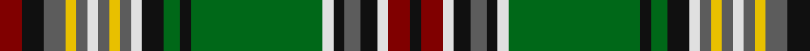

In pattern [KRWKBKWGKGKWBYBWBYBKR](/patterns/krwkbkwgkgkwbybwbybkr/).

This was sourced from house-of-tartan.  It is a [21 stripes tartan](/stripes/stripes21/).

Original link http://www.house-of-tartan.scotland.net/house/TartanViewjs.asp?colr=Def&tnam=5818

## Thread count
DR/8 K8 N8 Y4 N4 LN4 N4 Y4 N4 LN4 K8 G6 K4 G48 LN4 K4 N6 K6 LN4 DR8 K/4

## Palette
Each colour and its ΔE from the base-6 reference it is a variant of.

| Colour | Shade | Base | ΔE (OKLab) |
|---|---|---|---|
| DR | <code style="background-color:#800000;">#800000</code> `#800000` | R <code style="background-color:#CC0000;">#CC0000</code> | 0.17 |
| G | <code style="background-color:#006818;">#006818</code> `#006818` | G <code style="background-color:#006100;">#006100</code> | 0.02 |
| K | <code style="background-color:#101010;">#101010</code> `#101010` | K <code style="background-color:#000000;">#000000</code> | 0.17 |
| LN | <code style="background-color:#E0E0E0;">#E0E0E0</code> `#E0E0E0` | W <code style="background-color:#F7F7F7;">#F7F7F7</code> | 0.07 |
| N | <code style="background-color:#5C5C5C;">#5C5C5C</code> `#5C5C5C` | B <code style="background-color:#2A418A;">#2A418A</code> | 0.15 |
| Y | <code style="background-color:#E8C000;">#E8C000</code> `#E8C000` | Y <code style="background-color:#F2BF00;">#F2BF00</code> | 0.02 |

## Nearest tartans

The nearest existing variants by ΔTartan distance.

1. [Murtaugh Hunting](/setts/s21/r4k4ra4y2ra2w2ra2y2ra2w2k4g3k2g24w2k2ra3k3w2r4k2x2~g006818-k101010-rc80000-ra888888-we0e0e0-ye8c000/) — ΔT 0.44
1. [Total](/setts/s17/b48y4b28k5w4k6y4k7g8k7y4k6w4k5r24y4g48~b102040-g30a010-k000000-rd00000-we0e0e0-yff8500/) — ΔT 1.09
1. [Barkway (Name)](/setts/s18/g3ga2g2ga16g2ga2g2ga2g4b4k2b2k2b2k24r2k2w3x2~b5c5c5c-g408060-ga006818-k101010-rc8002c-we0e0e0/) — ΔT 1.11
1. [U.S. Ancient Order of Hibernians (Co](/setts/s13/r3g2w2g3b3g20k20b2k2b2y15b3y3x2~b2c2c80-g006818-k101010-rc80000-we0e0e0-ybc8c00/) — ΔT 1.17
1. [Baxter Clan/Family Tartan Tartan Number: 3664. Earliest known date: 1856 This Baxter tartan is recorded by Logan (c.1832) as "Buchanan". Logans complied his tartan list from the limited information available at the time. It appears in a description as Baxter in D. Macgregor Peter's Baronage of Angus & Mearns, 1856. The principal branch of the clan is the Baxters of Earlshall who live at Leuchars in north Fife. See products available Copyright © Blair Urquhart, Comrie, 2015](/setts/s24/g16k1b2k1y4k1y4k1b2k1r16w2r16k1b2k1y4k1y4k1b2k1g16b2x4~b4468a4-g006818-k101010-r880000-wfcfcfc-yd09800/) — ΔT 1.18
1. [Int. College of Dentists (Canada)](/setts/s22/g6y6g1k15g2k2ya2g2ya2k2ya2g2ya2k2ya2g2ya2k2g2w15g1k2x2~g006818-k101010-we0e0e0-ybc8c00-yaa08858/) — ΔT 1.22
1. [Spice of Life (Fashion)](/setts/s20/g10k1r1k3r1k1g1r1g3r1g1y1b3y1b1w1y3w1y1w10x4~b5c5c5c-g006818-k101010-ra00000-we4dcd0-yc4c094/) — ΔT 1.23
1. [Kennedy Dress, (Pendleton)](/setts/s17/b2w9ba3k2ba2k2ba2k2ba3g10b1g2b1g2y1g2k2x2~b840068-ba3c3c60-g006818-k101010-wf0e8d0-yd09800/) — ΔT 1.34
1. [Estes](/setts/s15/r4g1r1g5k1y1k1y1k6b1k1b15w1b1w1x4~b64889c-g248034-k101010-rc80000-wfcfcfc-yd09800/) — ΔT 1.36
1. [Baxter](/setts/s13/b2g16k1b2k1y4k1y4k1b2k1r16w2x4~b2474e8-g006818-k101010-r880000-wfcfcfc-yd09800/) — ΔT 1.38

## Neighbour map

Every grey dot is one of 15726 variants placed by the first two principal components of the ΔTartan feature space (44% of its variance). Red is this tartan; blue dots are its nearest — click one to open its page.

<svg viewBox="0 0 640 380" role="img" style="max-width:100%;height:auto;border:1px solid #e0e0e0;border-radius:4px;display:block" xmlns="http://www.w3.org/2000/svg"><image href="/nn/cloud.v1.png" width="640" height="380"/><a href="/setts/s21/r4k4ra4y2ra2w2ra2y2ra2w2k4g3k2g24w2k2ra3k3w2r4k2x2~g006818-k101010-rc80000-ra888888-we0e0e0-ye8c000/"><circle cx="111.5" cy="73.9" r="4" fill="#3465a4"><title>Murtaugh Hunting</title></circle></a><a href="/setts/s17/b48y4b28k5w4k6y4k7g8k7y4k6w4k5r24y4g48~b102040-g30a010-k000000-rd00000-we0e0e0-yff8500/"><circle cx="105.2" cy="89.8" r="4" fill="#3465a4"><title>Total</title></circle></a><a href="/setts/s18/g3ga2g2ga16g2ga2g2ga2g4b4k2b2k2b2k24r2k2w3x2~b5c5c5c-g408060-ga006818-k101010-rc8002c-we0e0e0/"><circle cx="169.6" cy="98.0" r="4" fill="#3465a4"><title>Barkway (Name)</title></circle></a><a href="/setts/s13/r3g2w2g3b3g20k20b2k2b2y15b3y3x2~b2c2c80-g006818-k101010-rc80000-we0e0e0-ybc8c00/"><circle cx="110.8" cy="118.8" r="4" fill="#3465a4"><title>U.S. Ancient Order of Hibernians (Co</title></circle></a><a href="/setts/s24/g16k1b2k1y4k1y4k1b2k1r16w2r16k1b2k1y4k1y4k1b2k1g16b2x4~b4468a4-g006818-k101010-r880000-wfcfcfc-yd09800/"><circle cx="141.7" cy="65.5" r="4" fill="#3465a4"><title>Baxter Clan/Family Tartan Tartan Number: 3664. Earliest known date: 1856 This Baxter tartan is recorded by Logan (c.1832) as &quot;Buchanan&quot;. Logans complied his tartan list from the limited information available at the time. It appears in a description as Baxter in D. Macgregor Peter's Baronage of Angus &amp; Mearns, 1856. The principal branch of the clan is the Baxters of Earlshall who live at Leuchars in north Fife. See products available Copyright © Blair Urquhart, Comrie, 2015</title></circle></a><a href="/setts/s22/g6y6g1k15g2k2ya2g2ya2k2ya2g2ya2k2ya2g2ya2k2g2w15g1k2x2~g006818-k101010-we0e0e0-ybc8c00-yaa08858/"><circle cx="112.4" cy="85.0" r="4" fill="#3465a4"><title>Int. College of Dentists (Canada)</title></circle></a><a href="/setts/s20/g10k1r1k3r1k1g1r1g3r1g1y1b3y1b1w1y3w1y1w10x4~b5c5c5c-g006818-k101010-ra00000-we4dcd0-yc4c094/"><circle cx="82.6" cy="80.9" r="4" fill="#3465a4"><title>Spice of Life (Fashion)</title></circle></a><a href="/setts/s17/b2w9ba3k2ba2k2ba2k2ba3g10b1g2b1g2y1g2k2x2~b840068-ba3c3c60-g006818-k101010-wf0e8d0-yd09800/"><circle cx="74.3" cy="113.7" r="4" fill="#3465a4"><title>Kennedy Dress, (Pendleton)</title></circle></a><a href="/setts/s15/r4g1r1g5k1y1k1y1k6b1k1b15w1b1w1x4~b64889c-g248034-k101010-rc80000-wfcfcfc-yd09800/"><circle cx="171.7" cy="78.9" r="4" fill="#3465a4"><title>Estes</title></circle></a><a href="/setts/s13/b2g16k1b2k1y4k1y4k1b2k1r16w2x4~b2474e8-g006818-k101010-r880000-wfcfcfc-yd09800/"><circle cx="132.4" cy="85.3" r="4" fill="#3465a4"><title>Baxter</title></circle></a><circle cx="118.3" cy="79.6" r="5" fill="#c00000"/></svg>

ID: /setts/s21/r4k4b4y2b2w2b2y2b2w2k4g3k2g24w2k2b3k3w2r4k2x2~b5c5c5c-g006818-k101010-r800000-we0e0e0-ye8c000/
