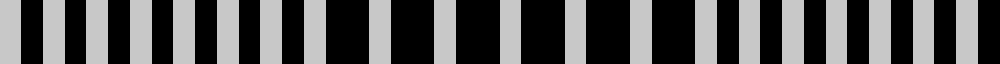

In pattern [WKWKWKWKWKWKWKWKWKWKW](/patterns/wkwkwkwkwkwkwkwkwkwkw/).

This was sourced from register-of-tartans.  It is a [21 stripes tartan](/stripes/stripes21/).

Original link https://www.tartanregister.gov.uk/tartanDetails.aspx?ref=1440

## Thread count
N/4 K4 N4 K4 N4 K4 N4 K4 N4 K4 N4 K4 N4 K4 N4 K8 N4 K8 N4 K8 N/4

## Palette
Each colour and its ΔE from the base-6 reference it is a variant of.

| Colour | Shade | Base | ΔE (OKLab) |
|---|---|---|---|
| K | <code style="background-color:#000000;">#000000</code> `#000000` | K <code style="background-color:#000000;">#000000</code> | 0.00 |
| N | <code style="background-color:#C8C8C8;">#C8C8C8</code> `#C8C8C8` | W <code style="background-color:#F4F4F0;">#F4F4F0</code> | 0.13 |

ID: /setts/s21/w4k8w4k8w4k8w4k4w4k4w4k4w4k4w4k4w4k4w4k4w4-k000000-wc8c8c8/
