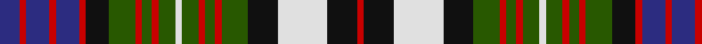

In pattern [BRBRBRKGRGRGWGRGRGKWKR](/patterns/brbrbrkgrgrgwgrgrgkwkr/).

This was sourced from register-of-tartans.  It is a [22 stripes tartan](/stripes/stripes22/).

Original link https://www.tartanregister.gov.uk/tartanDetails.aspx?ref=2384

## Attestations

This cloth appears in 2 source records; the oldest owns this page.

- 01/01/2002 — MacDonell of Glengarry Dress (register-of-tartans, [record](https://www.tartanregister.gov.uk/tartanDetails.aspx?ref=2384))
- pre 2002 — MacDonell of Glengarry Dress (Clan?) (tartans-authority, [record](http://www.tartansauthority.com/tartan-ferret/display/1999/))

## Thread count
DB/12 R4 DB14 R4 DB14 R4 K14 G16 R4 G6 R4 G10 LN4 G10 R4 G6 R4 G16 K18 LN30 K18 R/4

## Palette
Each colour and its ΔE from the base-6 reference it is a variant of.

| Colour | Shade | Base | ΔE (OKLab) |
|---|---|---|---|
| DB | <code style="background-color:#2C2C80;">#2C2C80</code> `#2C2C80` | B <code style="background-color:#2A418A;">#2A418A</code> | 0.06 |
| G | <code style="background-color:#285800;">#285800</code> `#285800` | G <code style="background-color:#006100;">#006100</code> | 0.03 |
| K | <code style="background-color:#101010;">#101010</code> `#101010` | K <code style="background-color:#000000;">#000000</code> | 0.17 |
| LN | <code style="background-color:#E0E0E0;">#E0E0E0</code> `#E0E0E0` | W <code style="background-color:#F7F7F7;">#F7F7F7</code> | 0.07 |
| R | <code style="background-color:#C80000;">#C80000</code> `#C80000` | R <code style="background-color:#CC0000;">#CC0000</code> | 0.01 |

## Nearest tartans

The nearest existing variants by ΔTartan distance.

1. [MacDonell of Glengarry, dress](/setts/s22/b6r2b7r2b7r2k7g8r2g3r2g5w2g5r2g3r2g8k9w15k9r2~b304080-g008000-k000000-rc00000-we0e0e0~x2/) — ΔT 0.67
1. [Soutar/Souter](/setts/s16/k20w3r10g20r3k3b20w3k20w3b20k3r3g20r10w3~b2888c4-g285800-k101010-rc80000-we0e0e0~x2/) — ΔT 0.84
1. [Gullane](/setts/s23/k10b2k3r2w1r3w1r4w1ra2w1ra3w1ra4w1b2w1b3w1b4w1k4w2~b5c5c5c-k101010-r980044-ra888888-we0e0e0~x4/) — ΔT 0.92
1. [Highfield Dress](/setts/s20/b10k2g2r2g2k2w2k2w4k1w2k1w4k2w2k2g2r2g2k2~b1c0070-g006818-k101010-rc80000-we0e0e0~x4/) — ΔT 0.96
1. [MacKinlay Dress](/setts/s29/r2k1b8k6w8k2w2k2w8k6g8k1r2k1g8k6w2k2w2k2w6k2w2k2w2k6b8k1r2~b1c0070-g006818-k101010-r880000-wc0c0c0~x2/) — ΔT 1.10
1. [Campbell of Loch Neil Dress](/setts/s28/k20g14k2y4k2g14k10w6b6w18b3w4b3w18b6w6k10g14k2w4k2g14k12b12k2b6k2b12~b2c4084-g005020-k101010-we0e0e0-ye8c000/) — ΔT 1.11
1. [MacKenzie Dress #4](/setts/s20/b10k10g9k2w2k2g9k10w2b2w14b2w2b2w14b2w2k10b10r2~b2c4084-g005020-k101010-rdc0000-we0e0e0~x2/) — ΔT 1.11
1. [Argyle Dress](/setts/s22/b4k3g17k17b15k3r4k3b15k17w3b4w25b3w6b3w25b4w3k17g17k3~b2c2c80-g006818-k101010-rc80000-we0e0e0~x2/) — ΔT 1.11
1. [MacKenzie Dress Clan Tartan Tartan Number: 1981. Earliest known date: pre 2003 This sample comes from the MacGregor-Hastie collection which forms the basis of the cloth archive of the Scottish Tartans Society. Some of the samples, including this one, were unmarked. One can assume that the sample dates between 1930 and 1950. See products available Copyright © Blair Urquhart, Comrie, 2015](/setts/s20/b10k10g9k2w2k2g9k10w2b2w14b2w2b2w14b2w2k10b10r2~b2c2c80-g006818-k101010-rc80000-we0e0e0~x2/) — ΔT 1.13
1. [Langston (Personal)](/setts/s18/k14g2b14g3b14g2k14g14w2g14k14r2g2r10y4r10g2r2~b2888c4-g006818-k101010-rc80000-we0e0e0-ye8c000~x2/) — ΔT 1.13

## Neighbour map

Every grey dot is one of 15726 variants placed by the first two principal components of the ΔTartan feature space (44% of its variance). Red is this tartan; blue dots are its nearest — click one to open its page.

<svg viewBox="0 0 640 380" role="img" style="max-width:100%;height:auto;border:1px solid #e0e0e0;border-radius:4px;display:block" xmlns="http://www.w3.org/2000/svg"><image href="/nn/cloud.v1.png" width="640" height="380"/><a href="/setts/s22/b6r2b7r2b7r2k7g8r2g3r2g5w2g5r2g3r2g8k9w15k9r2~b304080-g008000-k000000-rc00000-we0e0e0~x2/"><circle cx="29.3" cy="142.7" r="4" fill="#3465a4"><title>MacDonell of Glengarry, dress</title></circle></a><a href="/setts/s16/k20w3r10g20r3k3b20w3k20w3b20k3r3g20r10w3~b2888c4-g285800-k101010-rc80000-we0e0e0~x2/"><circle cx="61.6" cy="159.3" r="4" fill="#3465a4"><title>Soutar/Souter</title></circle></a><a href="/setts/s23/k10b2k3r2w1r3w1r4w1ra2w1ra3w1ra4w1b2w1b3w1b4w1k4w2~b5c5c5c-k101010-r980044-ra888888-we0e0e0~x4/"><circle cx="66.3" cy="118.5" r="4" fill="#3465a4"><title>Gullane</title></circle></a><a href="/setts/s20/b10k2g2r2g2k2w2k2w4k1w2k1w4k2w2k2g2r2g2k2~b1c0070-g006818-k101010-rc80000-we0e0e0~x4/"><circle cx="49.3" cy="128.5" r="4" fill="#3465a4"><title>Highfield Dress</title></circle></a><a href="/setts/s29/r2k1b8k6w8k2w2k2w8k6g8k1r2k1g8k6w2k2w2k2w6k2w2k2w2k6b8k1r2~b1c0070-g006818-k101010-r880000-wc0c0c0~x2/"><circle cx="77.8" cy="132.2" r="4" fill="#3465a4"><title>MacKinlay Dress</title></circle></a><a href="/setts/s28/k20g14k2y4k2g14k10w6b6w18b3w4b3w18b6w6k10g14k2w4k2g14k12b12k2b6k2b12~b2c4084-g005020-k101010-we0e0e0-ye8c000/"><circle cx="46.4" cy="125.4" r="4" fill="#3465a4"><title>Campbell of Loch Neil Dress</title></circle></a><a href="/setts/s20/b10k10g9k2w2k2g9k10w2b2w14b2w2b2w14b2w2k10b10r2~b2c4084-g005020-k101010-rdc0000-we0e0e0~x2/"><circle cx="55.7" cy="142.1" r="4" fill="#3465a4"><title>MacKenzie Dress #4</title></circle></a><a href="/setts/s22/b4k3g17k17b15k3r4k3b15k17w3b4w25b3w6b3w25b4w3k17g17k3~b2c2c80-g006818-k101010-rc80000-we0e0e0~x2/"><circle cx="60.0" cy="128.2" r="4" fill="#3465a4"><title>Argyle Dress</title></circle></a><a href="/setts/s20/b10k10g9k2w2k2g9k10w2b2w14b2w2b2w14b2w2k10b10r2~b2c2c80-g006818-k101010-rc80000-we0e0e0~x2/"><circle cx="54.5" cy="141.5" r="4" fill="#3465a4"><title>MacKenzie Dress Clan Tartan Tartan Number: 1981. Earliest known date: pre 2003 This sample comes from the MacGregor-Hastie collection which forms the basis of the cloth archive of the Scottish Tartans Society. Some of the samples, including this one, were unmarked. One can assume that the sample dates between 1930 and 1950. See products available Copyright © Blair Urquhart, Comrie, 2015</title></circle></a><a href="/setts/s18/k14g2b14g3b14g2k14g14w2g14k14r2g2r10y4r10g2r2~b2888c4-g006818-k101010-rc80000-we0e0e0-ye8c000~x2/"><circle cx="56.8" cy="145.5" r="4" fill="#3465a4"><title>Langston (Personal)</title></circle></a><circle cx="45.6" cy="146.5" r="5" fill="#c00000"/></svg>

ID: /setts/s22/b6r2b7r2b7r2k7g8r2g3r2g5w2g5r2g3r2g8k9w15k9r2~b2c2c80-g285800-k101010-rc80000-we0e0e0~x2/
