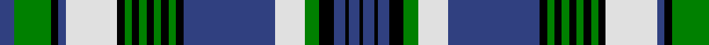

In pattern [BGKBWKGKGKGKGKBWGKBKBK](/patterns/bgkbwkgkgkgkgkbwgkbkbk/).

This was sourced from weddslist.  It is a [22 stripes tartan](/stripes/stripes22/).

Original link http://www.weddslist.com/cgi-bin/tartans/pg.pl?source=sts

## Thread count
B/8 G20 K4 B4 LN28 K4 G4 K4 G4 K4 G4 K4 G4 K4 B50 LN16 G8 K8 B6 K2 B6 K/2

## Palette
Each colour and its ΔE from the base-6 reference it is a variant of.

| Colour | Shade | Base | ΔE (OKLab) |
|---|---|---|---|
| B | <code style="background-color:#304080;">#304080</code> `#304080` | B <code style="background-color:#2A418A;">#2A418A</code> | 0.02 |
| G | <code style="background-color:#008000;">#008000</code> `#008000` | G <code style="background-color:#006100;">#006100</code> | 0.10 |
| K | <code style="background-color:#000000;">#000000</code> `#000000` | K <code style="background-color:#000000;">#000000</code> | 0.00 |
| LN | <code style="background-color:#E0E0E0;">#E0E0E0</code> `#E0E0E0` | W <code style="background-color:#F7F7F7;">#F7F7F7</code> | 0.07 |

## Nearest tartans

The nearest existing variants by ΔTartan distance.

1. [Alberta, Quebec, Nova Scotia.](/setts/s22/b8g20k4b4w28k4g4k4g4k4g4k4g4k4b50w16g8k8b6k2b6k2-b2c4084-g005020-k101010-we0e0e0/) — ΔT 0.57
1. [Fair Trade](/setts/s15/k16b4k4b48k16w4k2w4k8w4k2w4k16g32k8-b0596fa-g289c18-k101010-wffffff/) — ΔT 1.07
1. [Fair Trade](/setts/s15/k16b4k4b48k16w4k2w4k8w4k2w4k16g32k8-b1474b4-g006818-k101010-wfcfcfc/) — ΔT 1.15
1. [Couper / Cooper](/setts/s18/b4w8r4g48b8g4b8k20w8b4w8g16b2k2b44w8b4r4-b304080-g008000-k000000-rc00000-wc0a0e0/) — ΔT 1.17
1. [Graham, dress](/setts/s21/w4b4w60b5w5k30b27k5b30k27g4ba5g66ba5g4k30w5b5w57b4w4-b304080-ba5480b0-g008000-k000000-we0e0e0/) — ΔT 1.23
1. [Beaufort](/setts/s18/b6w16r4w4r4w4r16k4r4k4r4k16w4b48r4k4r2k6-b2474e8-k101010-ra07c58-wf8f4d0/) — ΔT 1.24
1. [Graham Dress](/setts/s21/w4b4w60b5w5k30b27k5b30k27g4ba5g66ba5g4k30w5b5w57b4w4-b2c4084-ba3c82af-g005020-k101010-we0e0e0/) — ΔT 1.24
1. [Nigeria](/setts/s14/w8b48k2g16w16g16k2w8g4w2g4w8g16w8-b2c4084-g003c14-k101010-we0e0e0/) — ΔT 1.26
1. [Scottish Islamic](/setts/s18/g4y4g4y4g4y4g36k2g4k10b4k2b38w4b4w4b4w4-b031567-g064b15-k101010-wffffff-yeeb422/) — ΔT 1.29
1. [Help for Heroes Corporate Tartan Tartan Number: 10561. Earliest known date: 20/01/2012 The use of the tartan is restricted in line with a legal agreement between Help for Heroes and Lochcarron of Scotland. Woven by Lochcarron of Scotland This tartan was inspired by William McGregor and George Neil of G B Tailoring, and has been produced to raise funds for Help for Heroes. The colours represent the UK Army, Navy and Airforce See products available Copyright © Blair Urquhart, Comrie, 2015](/setts/s16/r12w50b20ba2b10ba4b8ba6b6ba6b4ba8b2ba32wa12ba5-b09322e-ba01006c-rb9181d-w76f4c4-wac4c4c4/) — ΔT 1.31

## Neighbour map

Every grey dot is one of 15726 variants placed by the first two principal components of the ΔTartan feature space (44% of its variance). Red is this tartan; blue dots are its nearest — click one to open its page.

<svg viewBox="0 0 640 380" role="img" style="max-width:100%;height:auto;border:1px solid #e0e0e0;border-radius:4px;display:block" xmlns="http://www.w3.org/2000/svg"><image href="/nn/cloud.v1.png" width="640" height="380"/><a href="/setts/s22/b8g20k4b4w28k4g4k4g4k4g4k4g4k4b50w16g8k8b6k2b6k2-b2c4084-g005020-k101010-we0e0e0/"><circle cx="184.1" cy="84.4" r="4" fill="#3465a4"><title>Alberta, Quebec, Nova Scotia.</title></circle></a><a href="/setts/s15/k16b4k4b48k16w4k2w4k8w4k2w4k16g32k8-b0596fa-g289c18-k101010-wffffff/"><circle cx="197.6" cy="107.4" r="4" fill="#3465a4"><title>Fair Trade</title></circle></a><a href="/setts/s15/k16b4k4b48k16w4k2w4k8w4k2w4k16g32k8-b1474b4-g006818-k101010-wfcfcfc/"><circle cx="213.0" cy="114.8" r="4" fill="#3465a4"><title>Fair Trade</title></circle></a><a href="/setts/s18/b4w8r4g48b8g4b8k20w8b4w8g16b2k2b44w8b4r4-b304080-g008000-k000000-rc00000-wc0a0e0/"><circle cx="173.4" cy="86.6" r="4" fill="#3465a4"><title>Couper / Cooper</title></circle></a><a href="/setts/s21/w4b4w60b5w5k30b27k5b30k27g4ba5g66ba5g4k30w5b5w57b4w4-b304080-ba5480b0-g008000-k000000-we0e0e0/"><circle cx="111.3" cy="80.9" r="4" fill="#3465a4"><title>Graham, dress</title></circle></a><a href="/setts/s18/b6w16r4w4r4w4r16k4r4k4r4k16w4b48r4k4r2k6-b2474e8-k101010-ra07c58-wf8f4d0/"><circle cx="171.3" cy="83.2" r="4" fill="#3465a4"><title>Beaufort</title></circle></a><a href="/setts/s21/w4b4w60b5w5k30b27k5b30k27g4ba5g66ba5g4k30w5b5w57b4w4-b2c4084-ba3c82af-g005020-k101010-we0e0e0/"><circle cx="119.6" cy="83.0" r="4" fill="#3465a4"><title>Graham Dress</title></circle></a><a href="/setts/s14/w8b48k2g16w16g16k2w8g4w2g4w8g16w8-b2c4084-g003c14-k101010-we0e0e0/"><circle cx="184.8" cy="113.7" r="4" fill="#3465a4"><title>Nigeria</title></circle></a><a href="/setts/s18/g4y4g4y4g4y4g36k2g4k10b4k2b38w4b4w4b4w4-b031567-g064b15-k101010-wffffff-yeeb422/"><circle cx="175.6" cy="85.5" r="4" fill="#3465a4"><title>Scottish Islamic</title></circle></a><a href="/setts/s16/r12w50b20ba2b10ba4b8ba6b6ba6b4ba8b2ba32wa12ba5-b09322e-ba01006c-rb9181d-w76f4c4-wac4c4c4/"><circle cx="134.9" cy="88.5" r="4" fill="#3465a4"><title>Help for Heroes Corporate Tartan Tartan Number: 10561. Earliest known date: 20/01/2012 The use of the tartan is restricted in line with a legal agreement between Help for Heroes and Lochcarron of Scotland. Woven by Lochcarron of Scotland This tartan was inspired by William McGregor and George Neil of G B Tailoring, and has been produced to raise funds for Help for Heroes. The colours represent the UK Army, Navy and Airforce See products available Copyright © Blair Urquhart, Comrie, 2015</title></circle></a><circle cx="170.9" cy="79.5" r="5" fill="#c00000"/></svg>

ID: /setts/s22/b8g20k4b4w28k4g4k4g4k4g4k4g4k4b50w16g8k8b6k2b6k2-b304080-g008000-k000000-we0e0e0/
