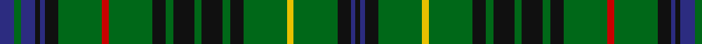

In pattern [BGBKBKGRGKGKGKGKGYGKBK](/patterns/bgbkbkgrgkgkgkgkgygkbk/).

This was sourced from house-of-tartan.  It is a [22 stripes tartan](/stripes/stripes22/).

Original link http://www.house-of-tartan.scotland.net/house/TartanViewjs.asp?colr=Def&tnam=1916

## Thread count
DB/9 G4 DB9 K3 DB3 K8 G27 R4 G27 K8 G5 K13 G4 K13 G5 K8 G27 Y4 G27 K8 DB3 K/3

## Palette
Each colour and its ΔE from the base-6 reference it is a variant of.

| Colour | Shade | Base | ΔE (OKLab) |
|---|---|---|---|
| DB | <code style="background-color:#2C2C80;">#2C2C80</code> `#2C2C80` | B <code style="background-color:#2C4084;">#2C4084</code> | 0.05 |
| G | <code style="background-color:#006818;">#006818</code> `#006818` | G <code style="background-color:#006400;">#006400</code> | 0.02 |
| K | <code style="background-color:#101010;">#101010</code> `#101010` | K <code style="background-color:#000000;">#000000</code> | 0.17 |
| R | <code style="background-color:#C80000;">#C80000</code> `#C80000` | R <code style="background-color:#C80000;">#C80000</code> | 0.00 |
| Y | <code style="background-color:#E8C000;">#E8C000</code> `#E8C000` | Y <code style="background-color:#E8C000;">#E8C000</code> | 0.00 |

## Nearest tartans

The nearest existing variants by ΔTartan distance.

1. [Stewart Hunting](/setts/s26/b9g4b9k3b3k3b3k8g27r4g27k8g5k13g4k13g5k8g27y4g27k8b3k3b3k3-b2c2c80-g285800-k101010-rc80000-ye8c000/) — ΔT 0.85
1. [Stuart/Stewart Hunting #2](/setts/s22/b9g4b9k3b3k8g27r4g27k8g5k13g4k13g5k8g27y4g27k8b3k3-b2c4084-g005020-k101010-rdc0000-ye8c000/) — ΔT 1.14
1. [Smeaton (Wedding) #2](/setts/s18/b24w4b14g30k4g8k4g30b4k14b4g30k4g8k4g30b14w4-b2c2c80-g006818-k101010-we0e0e0/) — ΔT 1.15
1. [Myron](/setts/s17/k4g4r4g4y4g4y4g16b4k4b4k4b4k4b4g28r4-b1c0070-g006818-k101010-r880000-yd09800/) — ΔT 1.19
1. [Stewart Hunting Early](/setts/s23/g8b18k6b6k16g54r8g54k16g10k26g8k26g10k16g54y8g54k16b6k6b18g8-b000052-g11450d-k000000-raa0000-yaaaa00/) — ΔT 1.22
1. [Stewart Hunting Early](/setts/s23/g4b9k3b3k8g27r8g27k8g5k13g8k13g5k8g27y8g27k8b3k3b9g4-b000052-g11450d-k000000-raa0000-yaaaa00/) — ΔT 1.23
1. [Toshach](/setts/s22/g20ga8g20w4g20ga4g4ga40w8ga8w8ga8r8ga40g4ga4g20w4g20ga8g10b8-b8080d0-g003000-ga006030-rc00000-we0e0e0/) — ΔT 1.30
1. [Stewart Hunting Early](/setts/s23/g2b4k1b1k3g12r2g12k3g2k6g2k6g2k3g12y2g12k4b1k1b3g2-b00004c-g004c00-k000000-rc80000-yc8c800/) — ΔT 1.30
1. [College of William & Mary Schools Tartan Tartan Number: 6522. Earliest known date: 2004 Designed by Carol Worthley of South Hiram, Maine for the Alma Mater of Stephen H Snell of Alexandria, Virginia - the College of William & Mary in VA. Stephen Snell has donated the tartan to the Earl Gregg Swem Library in that College to be sold as a fundraiser. See products available Copyright © Blair Urquhart, Comrie, 2015](/setts/s20/b20g50y4g4y6g4y4g50b20w6b20g50y4g4y6g4y4g50b20k6-b2c2c80-g285800-k101010-wf8f8f8-ye8c000/) — ΔT 1.36
1. [O'Conner Irish Family Tartan Tartan Number: 2217. Earliest known date: 1985 Designed by Jerry O'Connor of Keltic Klassics, Hillsdale, New Jersey who names it "Royal na Connaught" .Woven by House of Edgar who said they would call it O'Connor. Ref made to Lawrence & Gerald O'Connor - possibly customers of Macnaughtons of Pitlochry (part of same group as House of Edgar) See products available Copyright © Blair Urquhart, Comrie, 2015](/setts/s16/g5k24g12k16g26w4g24w4g26k16b4k4b4k4ba28g3-b003c64-ba2c2c80-g006818-k101010-we0e0e0/) — ΔT 1.40

## Neighbour map

Every grey dot is one of 15726 variants placed by the first two principal components of the ΔTartan feature space (44% of its variance). Red is this tartan; blue dots are its nearest — click one to open its page.

<svg viewBox="0 0 640 380" role="img" style="max-width:100%;height:auto;border:1px solid #e0e0e0;border-radius:4px;display:block" xmlns="http://www.w3.org/2000/svg"><image href="/nn/cloud.v1.png" width="640" height="380"/><a href="/setts/s26/b9g4b9k3b3k3b3k8g27r4g27k8g5k13g4k13g5k8g27y4g27k8b3k3b3k3-b2c2c80-g285800-k101010-rc80000-ye8c000/"><circle cx="269.8" cy="155.4" r="4" fill="#3465a4"><title>Stewart Hunting</title></circle></a><a href="/setts/s22/b9g4b9k3b3k8g27r4g27k8g5k13g4k13g5k8g27y4g27k8b3k3-b2c4084-g005020-k101010-rdc0000-ye8c000/"><circle cx="299.3" cy="177.5" r="4" fill="#3465a4"><title>Stuart/Stewart Hunting #2</title></circle></a><a href="/setts/s18/b24w4b14g30k4g8k4g30b4k14b4g30k4g8k4g30b14w4-b2c2c80-g006818-k101010-we0e0e0/"><circle cx="281.5" cy="194.3" r="4" fill="#3465a4"><title>Smeaton (Wedding) #2</title></circle></a><a href="/setts/s17/k4g4r4g4y4g4y4g16b4k4b4k4b4k4b4g28r4-b1c0070-g006818-k101010-r880000-yd09800/"><circle cx="231.1" cy="159.8" r="4" fill="#3465a4"><title>Myron</title></circle></a><a href="/setts/s23/g8b18k6b6k16g54r8g54k16g10k26g8k26g10k16g54y8g54k16b6k6b18g8-b000052-g11450d-k000000-raa0000-yaaaa00/"><circle cx="268.9" cy="161.5" r="4" fill="#3465a4"><title>Stewart Hunting Early</title></circle></a><a href="/setts/s23/g4b9k3b3k8g27r8g27k8g5k13g8k13g5k8g27y8g27k8b3k3b9g4-b000052-g11450d-k000000-raa0000-yaaaa00/"><circle cx="245.1" cy="162.7" r="4" fill="#3465a4"><title>Stewart Hunting Early</title></circle></a><a href="/setts/s22/g20ga8g20w4g20ga4g4ga40w8ga8w8ga8r8ga40g4ga4g20w4g20ga8g10b8-b8080d0-g003000-ga006030-rc00000-we0e0e0/"><circle cx="200.8" cy="154.7" r="4" fill="#3465a4"><title>Toshach</title></circle></a><a href="/setts/s23/g2b4k1b1k3g12r2g12k3g2k6g2k6g2k3g12y2g12k4b1k1b3g2-b00004c-g004c00-k000000-rc80000-yc8c800/"><circle cx="279.7" cy="144.1" r="4" fill="#3465a4"><title>Stewart Hunting Early</title></circle></a><a href="/setts/s20/b20g50y4g4y6g4y4g50b20w6b20g50y4g4y6g4y4g50b20k6-b2c2c80-g285800-k101010-wf8f8f8-ye8c000/"><circle cx="332.6" cy="132.9" r="4" fill="#3465a4"><title>College of William &amp; Mary Schools Tartan Tartan Number: 6522. Earliest known date: 2004 Designed by Carol Worthley of South Hiram, Maine for the Alma Mater of Stephen H Snell of Alexandria, Virginia - the College of William &amp; Mary in VA. Stephen Snell has donated the tartan to the Earl Gregg Swem Library in that College to be sold as a fundraiser. See products available Copyright © Blair Urquhart, Comrie, 2015</title></circle></a><a href="/setts/s16/g5k24g12k16g26w4g24w4g26k16b4k4b4k4ba28g3-b003c64-ba2c2c80-g006818-k101010-we0e0e0/"><circle cx="198.3" cy="175.7" r="4" fill="#3465a4"><title>O'Conner Irish Family Tartan Tartan Number: 2217. Earliest known date: 1985 Designed by Jerry O'Connor of Keltic Klassics, Hillsdale, New Jersey who names it &quot;Royal na Connaught&quot; .Woven by House of Edgar who said they would call it O'Connor. Ref made to Lawrence &amp; Gerald O'Connor - possibly customers of Macnaughtons of Pitlochry (part of same group as House of Edgar) See products available Copyright © Blair Urquhart, Comrie, 2015</title></circle></a><circle cx="268.4" cy="163.2" r="5" fill="#c00000"/></svg>

ID: /setts/s22/b9g4b9k3b3k8g27r4g27k8g5k13g4k13g5k8g27y4g27k8b3k3-b2c2c80-g006818-k101010-rc80000-ye8c000/
