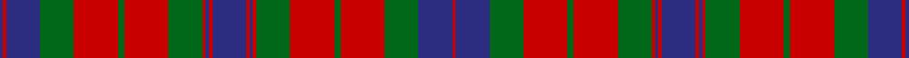

In pattern [BRBGRGRGRBRBRBRGRGRGBR](/stripes/brbgrgrgrbrbrbrgrgrgbr/).

This was sourced from register-of-tartans.  It is a [22 stripe tartan](/stripes/stripes22/).

Original link https://www.tartanregister.gov.uk/tartanDetails.aspx?ref=1846

## Register references

External register numbers recorded for this tartan.

- Scottish Register of Tartans: [1846](https://www.tartanregister.gov.uk/tartanDetails.aspx?ref=1846)
- Scottish Tartans Authority (ITI): 394
- Scottish Tartans World Register: 394

## Thread count
DB/2 R2 DB20 G20 R26 G4 R26 G20 R2 DB2 R2 DB20 R2 DB2 R2 G20 R26 G4 R26 G20 DB20 R/2

## Palette
Each colour and the base-6 reference it is a variant of.

| Colour | Shade | Base |
|---|---|---|
| DB | <code style="background-color:#2C2C80;">#2C2C80</code> `oklch(35.0% 0.138 276.6)` <small>#2C2C80</small> | B <code style="background-color:#2A418A;">#2A418A</code> |
| G | <code style="background-color:#006818;">#006818</code> `oklch(45.0% 0.142 145.0)` <small>#006818</small> | G <code style="background-color:#006100;">#006100</code> |
| R | <code style="background-color:#C80000;">#C80000</code> `oklch(52.3% 0.215 29.2)` <small>#C80000</small> | R <code style="background-color:#CC0000;">#CC0000</code> |

## Nearest tartans

The nearest existing variants by ΔTartan distance.

1. [Fraser](/setts/s23/db10r1db1r1g10r13g2r13g10db10r1db1r1db10g10r13g2r13g10r1db1r1db5~x4/) — ΔT 0.21
1. [Ross](/setts/s20/db18r2db18r18dg2r4dg2r18dg18r2dg18r2dg18r18db1r1db2r1db1r18~x2/) — ΔT 0.74
1. [Ross 3](/setts/s20/db18r2db18r18g2r4g2r18g18r2g18r2g18r18db1r1db2r1db1r18~x2/) — ΔT 0.81
1. [Stewart of Killiecrankie](/setts/s26/g6r2g2r18dp9r3g3r3dp9r3g24r2g2r4~x2/) — ΔT 0.88
1. [Ross Clan Tartan Tartan Number: 864. Earliest known date: 1810-15 D.C.Stewart says, "The version here given may be taken to be correct." Later versions, including Logans, are known to have omissions. The Clan Ross is descended from Fearcher MacinTagart, Earl of Ross in the 13th century. The chiefship has passed to the Rosses of Shandwick. The tartan is also worn by the MacTiers. Also worn by the Metro Toronto Police pipe band. (Strathallan 1994) See products available Copyright © Blair Urquhart, Comrie, 2015](/setts/s27/g18r2g18r18g2r4g2r18db18r2db18r18db1r1db2r1db1r18db1r1db2r1db1r18g18r2g18~x2/) — ΔT 0.90
1. [Ross (Clan)](/setts/s27/g18r2g18r18g2r4g2r18db18r2db18r18db1r1db2r1db1r18db1r1g2r1db1r18g18r2g18~x2/) — ΔT 0.91
1. [Ross #4](/setts/s27/dg18r2dg18r18dg2r4dg2r18db18r2db18r18db1r1db2r1db1r18db1r1db2r1db1r18dg18r2dg18~x2/) — ΔT 0.94
1. [Ross 6](/setts/s18/r18db1r1db2r1db1r18db18r2db18r18g2r4g2r18g18r2g18~x2/) — ΔT 1.04
1. [Ross 2](/setts/s25/r14db1r1db2r1db1r10g10r2g10r2g10r10g2r6g2r10db10r2db10r2db10r10g2r6~x2/) — ΔT 1.05
1. [Murray of Tullibardine 2](/setts/s21/db4r2db2r3db12r3db2r2k5r2db2r22db26r6g6r22g23r14db8r7k3~x2/) — ΔT 1.10

## Neighbour map

Every grey dot is one of 14299 variants placed by the first two principal components of the ΔTartan feature space (44% of its variance). Red is this tartan; blue dots are its nearest — click one to open its page.

<svg viewBox="0 0 640 380" role="img" style="max-width:100%;height:auto;border:1px solid #e0e0e0;border-radius:4px;display:block" xmlns="http://www.w3.org/2000/svg"><image href="/nn/cloud.v1.png" width="640" height="380"/><a href="/setts/s23/db10r1db1r1g10r13g2r13g10db10r1db1r1db10g10r13g2r13g10r1db1r1db5~x4/"><circle cx="243.9" cy="161.1" r="4" fill="#3465a4"><title>Fraser</title></circle></a><a href="/setts/s20/db18r2db18r18dg2r4dg2r18dg18r2dg18r2dg18r18db1r1db2r1db1r18~x2/"><circle cx="287.6" cy="146.2" r="4" fill="#3465a4"><title>Ross</title></circle></a><a href="/setts/s20/db18r2db18r18g2r4g2r18g18r2g18r2g18r18db1r1db2r1db1r18~x2/"><circle cx="289.1" cy="149.9" r="4" fill="#3465a4"><title>Ross 3</title></circle></a><a href="/setts/s26/g6r2g2r18dp9r3g3r3dp9r3g24r2g2r4~x2/"><circle cx="256.1" cy="142.5" r="4" fill="#3465a4"><title>Stewart of Killiecrankie</title></circle></a><a href="/setts/s27/g18r2g18r18g2r4g2r18db18r2db18r18db1r1db2r1db1r18db1r1db2r1db1r18g18r2g18~x2/"><circle cx="292.8" cy="130.4" r="4" fill="#3465a4"><title>Ross Clan Tartan Tartan Number: 864. Earliest known date: 1810-15 D.C.Stewart says, &quot;The version here given may be taken to be correct.&quot; Later versions, including Logans, are known to have omissions. The Clan Ross is descended from Fearcher MacinTagart, Earl of Ross in the 13th century. The chiefship has passed to the Rosses of Shandwick. The tartan is also worn by the MacTiers. Also worn by the Metro Toronto Police pipe band. (Strathallan 1994) See products available Copyright © Blair Urquhart, Comrie, 2015</title></circle></a><a href="/setts/s27/g18r2g18r18g2r4g2r18db18r2db18r18db1r1db2r1db1r18db1r1g2r1db1r18g18r2g18~x2/"><circle cx="294.0" cy="130.7" r="4" fill="#3465a4"><title>Ross (Clan)</title></circle></a><a href="/setts/s27/dg18r2dg18r18dg2r4dg2r18db18r2db18r18db1r1db2r1db1r18db1r1db2r1db1r18dg18r2dg18~x2/"><circle cx="291.0" cy="127.5" r="4" fill="#3465a4"><title>Ross #4</title></circle></a><a href="/setts/s18/r18db1r1db2r1db1r18db18r2db18r18g2r4g2r18g18r2g18~x2/"><circle cx="316.1" cy="153.1" r="4" fill="#3465a4"><title>Ross 6</title></circle></a><a href="/setts/s25/r14db1r1db2r1db1r10g10r2g10r2g10r10g2r6g2r10db10r2db10r2db10r10g2r6~x2/"><circle cx="294.2" cy="162.7" r="4" fill="#3465a4"><title>Ross 2</title></circle></a><a href="/setts/s21/db4r2db2r3db12r3db2r2k5r2db2r22db26r6g6r22g23r14db8r7k3~x2/"><circle cx="254.5" cy="133.5" r="4" fill="#3465a4"><title>Murray of Tullibardine 2</title></circle></a><circle cx="253.7" cy="161.9" r="5" fill="#c00000"/></svg>

ID: /setts/s22/db10r1db1r1g10r13g2r13g10db10r1db1~x2/
